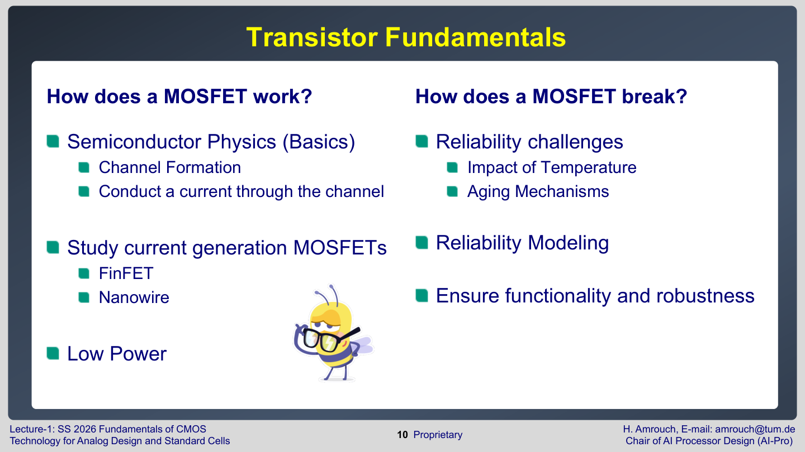
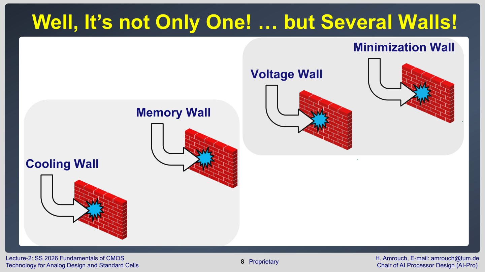
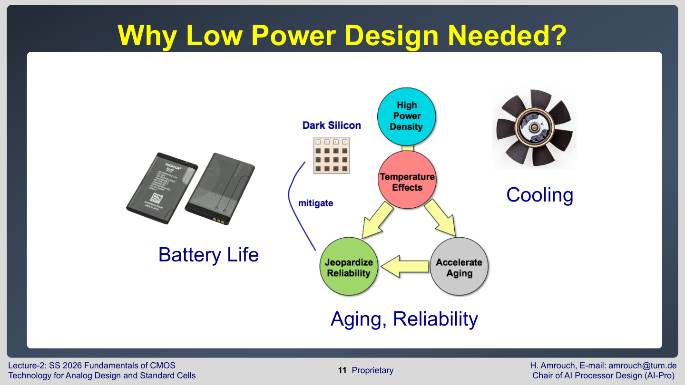
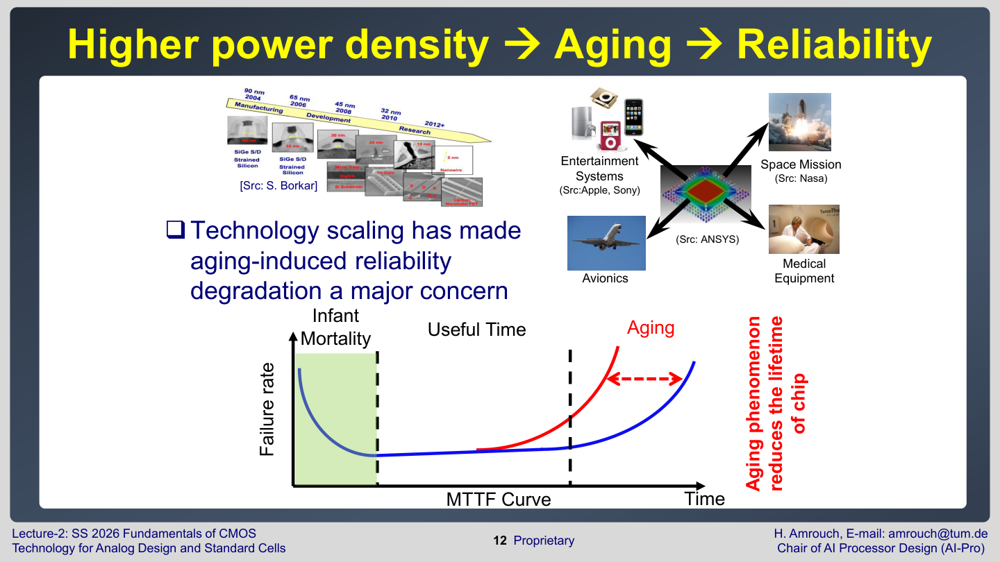
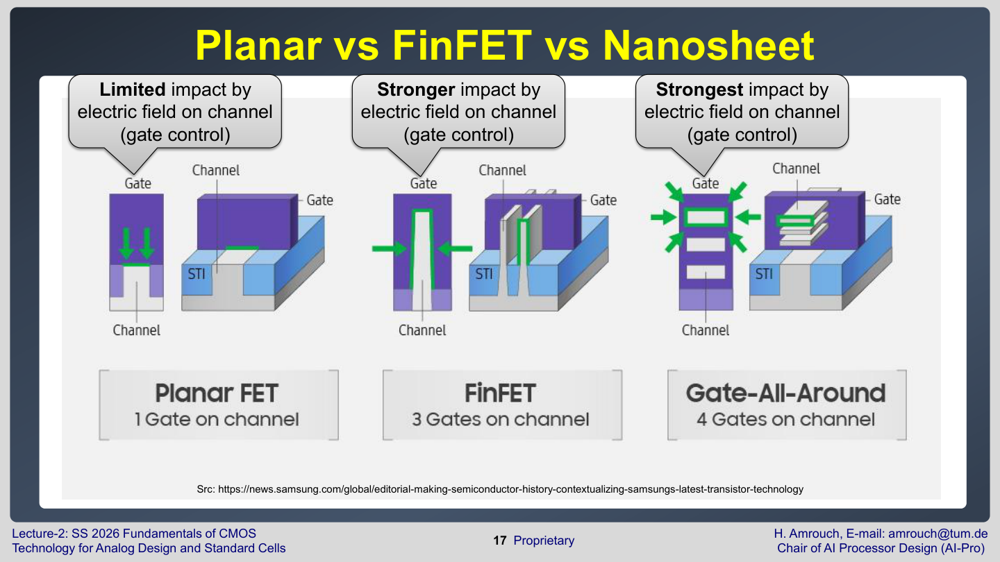
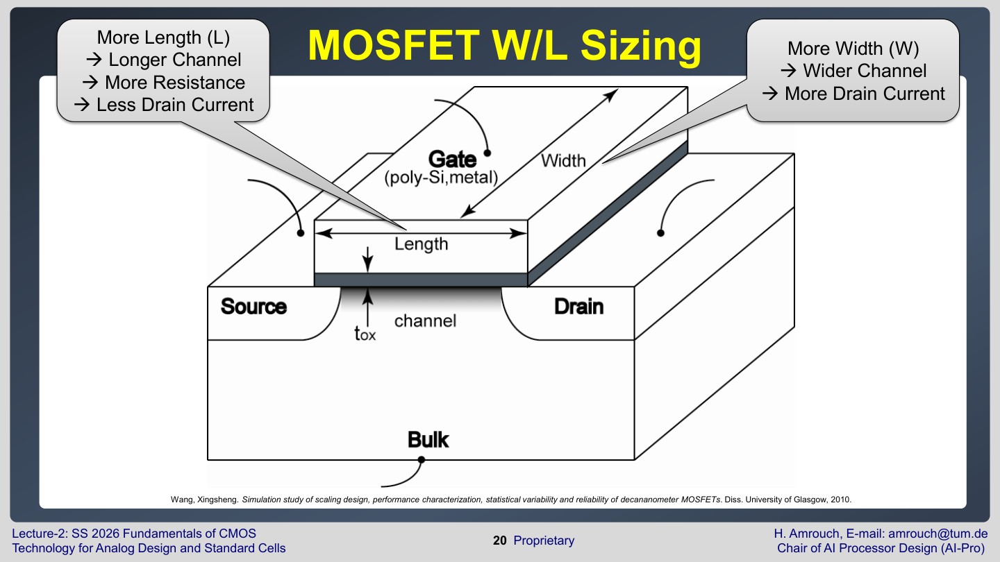
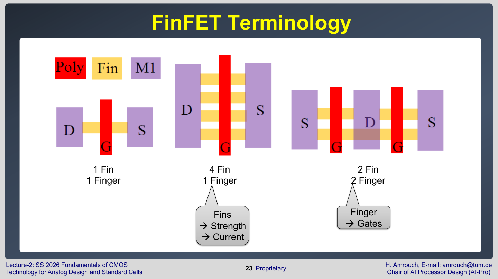
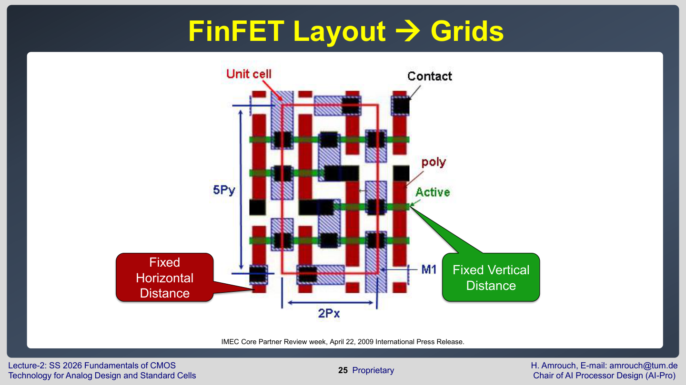

# 01. CMOS 소자와 기술 스케일링

## 이 장의 위치

이 장은 Lecture 1과 Lecture 2의 기술 내용을 정리한다. Lecture 1의 행정 안내는 제외하고, 과목의 큰 지도와 MOSFET 구조 진화만 남겼다.

핵심 질문은 두 가지다.

- 왜 현대 칩 설계에서 CMOS와 MOSFET을 먼저 배워야 하는가?
- 왜 planar MOSFET에서 FinFET, nanosheet로 구조가 바뀌었는가?

## 과목 전체 지도

Lecture 1은 이 과목을 세 축으로 소개한다.



첫 번째 축은 Transistor Fundamentals이다. MOSFET이 어떻게 채널을 만들고 전류를 흘리는지, 그리고 온도와 aging 때문에 어떻게 약해지거나 고장나는지 배운다. 여기에는 planar MOSFET뿐 아니라 FinFET, nanowire, nanosheet 같은 최신 구조도 포함된다.

두 번째 축은 Circuit Design이다. 회로를 어떤 트랜지스터 연결로 만들고, 각 트랜지스터의 크기를 어떻게 정하며, 레이아웃에서 트랜지스터와 interconnect를 어떻게 배치하는지 다룬다. 이때 layout design rule, parasitic capacitance/resistance가 중요해진다.

세 번째 축은 Standard Cells이다. AND, OR, inverter, flip-flop 같은 작은 논리 블록을 표준화된 cell로 만들고, 이 cell을 조합해 큰 디지털 회로를 만든다. 표<font color="#ffc000">준셀은 delay와 power를 미리 characterization한 뒤 synthesis와 physical design에서 사용</font>된다.

Lecture 1은 AI accelerator도 예시로 든다. Analog AI accelerator는 compute-in-memory와 crossbar array처럼 아날로그 물리 현상을 계산에 이용하고, digital AI accelerator는 GPU, tensor/systolic array, RISC-V custom extension처럼 표준셀 기반 디지털 설계를 사용한다. 두 경우 모두 기초는 CMOS 소자와 회로이다.

## 기술이 벽에 부딪힌 이유

Lecture 2는 "computing이 새로운 시대의 문턱에 있다"고 시작한다. 이유는 성능 향상이 예전처럼 단순히 트랜지스터를 작게 만드는 것으로 해결되지 않기 때문이다.



강의에서 제시한 벽은 네 가지다.

| 벽                     | 의미                                                  | 회로 설계에서의 결과                   |
| --------------------- | --------------------------------------------------- | ----------------------------- |
| **Minimization** wall | 트랜지스터를 계속 <font color="#ffc000">작게 만드는 데 물리적 한계가 생김 | 누설 전류와 변동성이 커짐        </font> |
| **Voltage** wall      | <font color="#ffc000">전압을 충분히 낮추기 어려움</font>        | 전력 감소와 성능 유지가 충돌함             |
| **Memory** wall       | 연산기보다 <font color="#ffc000">메모리 접근이 느리고 비쌈</font>   | 데이터 이동 전력과 지연이 커짐             |
| **Cooling** wall      | 발생한 <font color="#ffc000">열을 제거하기 어려움</font>        | 온도 상승, 신뢰성 저하, 냉각 비용 증가       |

**Miniaturization wall**은 "더 작게 만들 수 없다"는 단순한 말이 아니다. <font color="#e84d4d">작게 만들수록 gate가 channel을 제어하기 어려워지고, source에서 drain으로 원하지 않는 전류가 새기 쉬워진다</font>는 뜻이다. 즉, 소자가 작아질수록 꺼져 있을 때도 전류가 흐르는 문제가 커진다.

**Voltage wall**은 <font color="#e84d4d">전압을 낮추면 전력은 줄지만 회로가 느려지는 문제</font>다. CMOS의 동적 전력은 대략 $V_{DD}^{2}$에 비례하므로 전압을 낮추면 전력 이득이 크다. 하지만 MOSFET의 ON current는 대략 $(V_{DD}-V_{th})^{2}$에 의존하므로, 전압을 낮추면 전류가 줄고 delay가 커진다.

**Cooling wall**은 <font color="#ffc000">온도가 reliability 문제로 바로 이어지기 때문에 중요</font>하다. Lecture 2의 failure 원인 슬라이드는 temperature가 큰 비중을 차지한다고 설명한다. <font color="#ffc000">온도는 aging mechanism을 빠르게 만들고, 전기적 parameter를 즉시 바꾼다</font>.

## 저전력 설계가 필요한 이유

Lecture 2는 low power design의 필요성을 battery life, cooling, aging/reliability로 나눈다.



저전력은 모바일 기기의 배터리만을 위한 것이 아니다. <font color="#ffc000">전력은 열로 바뀌고, 열은 MOSFET parameter를 바꾸며, 시간이 지나면 aging을 가속</font>한다. 그래서 고성능 칩에서도 낮은 전력은 cooling cost와 reliability margin을 줄이는 핵심 조건이다.

정리하면 다음 인과관계가 중요하다.

```text
높은 전력 밀도 -> 높은 온도 -> 이동도 저하/누설 증가/aging 가속 -> 성능 저하와 오류 위험 증가
```

Lecture 2의 failure 원인 슬라이드는 electronic failure에서 temperature가 큰 비중을 차지한다고 설명한다. 제시된 비율은<font color="#00b0f0"> temperature 55%</font>, vibration 20%, humidity 19%, dust 6%이다. 숫자 자체를 외우는 것보다 중요한 점은, 온도가 단순한 사용 환경 변수가 아니라 회로 수명과 신뢰성을 좌우하는 주된 stress라는 것이다.

## Bathtub 형태의 MTTF/failure-rate 곡선

Lecture 2 page 12는 power density, aging, reliability의 관계를 bathtub 모양 곡선으로 설명한다.



슬라이드의 그래프는 x축이 time, y축이 failure rate이다. 엄밀히 말하면 이것은 MTTF curve라기보다 시간에 따른 고장률 곡선이다. **MTTF**, mean time to failure는 <font color="#ffc000">평균적으로 고장까지 걸리는 시간</font>을 뜻하고, 이 그래프에서는 고장률이 커지는 시점이 빨라질수록 MTTF가 줄어든다고 해석하면 된다.

Bathtub 모양은 세 구간 때문에 생긴다.

| 구간                   | 고장률 추세         | 이유                                                                                         |         |
| -------------------- | -------------- | ------------------------------------------------------------------------------------------ | ------- |
| **Infant mortality** | 처음에 높다가 빠르게 감소 | 제조 결함, 약한 소자, 조립 불량처럼 <font color="#ffc000">처음부터 문제가 있던 칩이 초기에 걸러짐</font>                  |         |
| **Useful time**      | 낮고 거의 일정       | 정상 제품이 <font color="#ffc000">안정적으로 동작</font>하며, 고장은 주로 우발적 사건에 의해 발생                       |         |
| **Wear-out/Aging**   | 시간이 지나며 급격히 증가 | BTI, HCI, TDDB, EM 같은 <font color="#ffc000">aging mechanism이 누적되어 parameter 열화나 물리적 고장이 증가 | </font> |

처음 구간의 failure rate가 높은 이유는 "시간이 지나서 늙었기 때문"이 아니다. <font color="#00b0f0">제조 직후부터 약했던 부품이 실제 동작을 시작하면 빨리 고장나기 때문</font>이다. 이 구간을 지나면 <font color="#00b0f0">약한 제품은 이미 빠졌고, 남은 제품은 한동안 낮은 고장률로 동작한다. 그래서 중간 구간이 평평</font>하다.

오른쪽에서 고장률이 다시 올라가는 이유가 aging이다. MOSFET은 동작하는 동안 전압, 온도, 전류, duty cycle stress를 계속 받는다. 이 stress가 gate oxide와 interface에 defect를 만들거나 활성화하면 $V_{th}$, $I_{ON}$, $I_{OFF}$, mobility 같은 parameter가 변한다. <font color="#00b0f0">처음에는 회로가 guardband 덕분에 버티지만</font>, <font color="#ffc000">열화가 누적되면 delay가 clock period를 넘거나 leakage가 커지거나 절연막/배선이 손상되어 고장률이 급격히 증가</font>한다.

슬라이드의 파란 곡선과 빨간 곡선은 aging이 lifetime을 어떻게 줄이는지 보여준다. 빨간 aging 곡선은 wear-out 구간이 더 일찍 시작되고 더 가파르게 올라간다. 즉, <font color="#ffc000">같은 제품이라도 높은 power density 때문에 온도가 높아지고 전기적 stress가 커지면, 원래 더 오래 버틸 수 있던 칩이 더 이른 시점에 wear-out 영역으로 들어간다</font>.

이것이 Higher power density -> Aging -> Reliability의 의미다.

```text
높은 전력 밀도 -> 높은 온도와 전계 stress -> defect/aging 증가 -> wear-out 조기 도달 -> MTTF 감소
```

특히 avionics, medical equipment, space mission처럼 <font color="#92d050">고장이 곧 안전 문제로 이어지는 시스템에서는 단순 평균 성능보다 bathtub curve의 오른쪽 상승 구간을 얼마나 늦출 수 있는지가 중요</font>하다. 그래서 설계자는 낮은 전력, 낮은 온도, 충분한 timing/voltage guardband, aging-aware characterization을 함께 고려해야 한다.

또한 Hennessy와 Patterson의 "new golden age" 문맥을 빌려 성능 향상이 점점 어려워지고 있음을 강조한다. <font color="#00b0f0">과거처럼 clock frequency와 transistor density만 올려 해결하던 방식은 voltage, cooling, memory, reliability wall 때문에 더 이상 충분하지 않다</font>.

## 현재 트랜지스터: FinFET과 nanosheet

Lecture 2의 후반부는 planar MOSFET에서 FinFET, nanosheet로 넘어가는 이유를 설명한다.



**Planar MOSFET**에서는 gate가 channel의 한 면 위에 놓인다. <font color="#ffc000">channel이 짧아질수록 drain 전계가 channel에 더 강하게 영향을 주고, gate가 channel을 완전히 끄기 어려워진다</font>. 이 현상을 강의에서는 limited gate control로 설명한다. 결과는 높은 channel leakage와 큰 static power다.

**FinFET**은 channel을 fin 모양의 3차원 구조로 세우고, gate가 fin의 여러 면을 감싼다.<font color="#ffc000"> gate가 channel을 더 강하게 제어하므로 leakage가 줄고</font>, 더 작은 technology node에서도 동작을 유지할 수 있다.

**Nanosheet** 또는 **gate-all-around** 구조는 channel을 sheet나 wire 형태로 만들고 <font color="#ffc000">gate가 거의 모든 방향에서 감싼다</font>. 그래서 FinFET보다 gate control이 더 강하다. 강의에서는 nanowire는 current가 제한되고, <font color="#00b0f0">nanosheet는 sheet 폭 덕분에 더 큰 current를 제공할 수 있다</font>고 설명한다.

| 구조                | Gate control       | 장점                                    | 한계                                                                              |
| ----------------- | ------------------ | ------------------------------------- | ------------------------------------------------------------------------------- |
| **Planar MOSFET** | 한쪽 면 중심            | layout과 sizing이 직관적                   | 짧은 channel에서 <font color="#00b0f0">leakage 증가</font>                            |
| **FinFET**        | 여러 면에서 channel 제어  | leakage 감소, scaling 가능                | fin <font color="#00b0f0">개수 기반<font color="#00b0f0">의 이산적 sizin</font>g</font> |
| **Nanosheet/GAA** | channel을 더 강하게 둘러쌈 | 더 좋은 electrostatics, 더 높은 scaling 가능성 | 제조/레이아웃 <font color="#00b0f0">제약 증가</font>                                      |

## MOSFET W/L sizing과 FinFET sizing

Planar MOSFET의 기본 sizing은 $W/L$이다.



- $W$는 channel width이다. $W$가 커지면 전류가 흐를 수 있는 <font color="#ffc000">통로가 넓어져 drain current가 증가</font>한다.
- $L$은 channel length이다. $L$이 길어지면<font color="#ffc000"> carrier가 이동해야 하는 거리가 길어지고 channel resistance가 증가해 current가 줄어든다</font>.

따라서 planar MOSFET에서는 $W$를 연속적으로 조절해 transistor strength를 조절할 수 있다.

FinFET에서는 사용자가 임의의 $W$를 연속적으로 고르기 어렵다. 대신 fin 개수와 finger 개수로 drive strength를 조절한다.



- **fin 개수**를 늘리면 <font color="#e84d4d">병렬 channel 수가 늘어나 전류가 커진다</font>.
- **finger 개수**를 늘리면 <font color="#e84d4d">같은 transistor를 여러 손가락처럼 나누어 배치하는 효과</font>가 있다.
- strength가 $1.3\,\mathrm{fins}$처럼 연속적으로 변하지 않고 $1\,\mathrm{fin}$, $2\,\mathrm{fins}$, $4\,\mathrm{fins}$처럼 이산적으로 변한다.

### Fin을 늘리는 것과 Finger를 늘리는 것의 차이

Fin과 finger는 둘 다 transistor를 더 강하게 만들 수 있지만, 의미가 다르다.

fin은 **실제 silicon channel의 개수**다. FinFET에서는 channel이 평평한 판이 아니라 위로 솟은 fin 모양이다. Gate가 이 fin의 여러 면을 감싸고, fin 하나하나가 전류가 흐를 수 있는 channel 역할을 한다. 따라서 <font color="#ffc000">fin 개수를 늘린다는 것은 한 gate가 제어하는 병렬 channel 수를 늘린다는 뜻</font>이다.

finger는 같은 transistor를 layout 안에서 **몇 개의 gate stripe로 나누어 병렬 연결**했는지를 뜻한다. <font color="#e84d4d">Gate, source, drain을 서로 연결하면 전기적으로는 하나의 큰 transistor처럼 동작</font>한다. 즉, finger를 늘리는 것은 channel 자체의 기본 단위를 바꾸는 것이 아니라, <font color="#ffc000">같은 종류의 transistor unit을 여러 개 반복 배치해 병렬로 쓰는 것</font>이다.

대략적인 **effective width**는 다음처럼 이해할 수 있다.

$$
W_{eff} \propto N_{fin} \times N_{finger}
$$

- $N_{fin}$: 한 finger 안에 들어 있는 fin 수
- $N_{finger}$: 병렬로 반복 배치한 gate stripe 수
- $W_{eff}$: 전류를 흘릴 수 있는 전체 유효 channel 폭

예를 들어 슬라이드의 $4\,\mathrm{Fin},\ 1\,\mathrm{Finger}$와 $2\,\mathrm{Fin},\ 2\,\mathrm{Finger}$는 둘 다 전체 fin-channel 개수만 보면 $4$개 수준이다. 그래서 이상적으로는 drive current가 비슷해 보일 수 있다. 하지만 <font color="#00b0f0">layout과 parasitic은 같지 않다</font>.

| 조절 방식       | 무엇이 늘어나는가                                                | 주된 효과                                                             | 레이아웃 영향                                                                                 |
| ----------- | -------------------------------------------------------- | ----------------------------------------------------------------- | --------------------------------------------------------------------------------------- |
| Fin 수 증가    | 한 gate stripe 아래의 <font color="#ffc000">병렬 fin/channel 수 | drive current 증가          </font>                                 | cell **높이**, fin grid, <font color="#00b0f0">source/drain diffusion 제약</font>을 받음       |
| Finger 수 증가 | 같은 transistor <font color="#ffc000">unit의 반복 개수</font>   | 전체 drive current 증가 또는 <font color="#00b0f0">큰 transistor를 나누어 배치 | cell **가로폭**, gate routing, source/drain 공유, <font color="#00b0f0">parasitic이 바뀜</font> |

따라서 fin을 늘린다는 말은 <font color="#e84d4d">transistor의 channel 통로 자체를 더 많이 쓰는 것</font>이다. 반면 finger를 늘린다는 말은 <font color="#e84d4d">transistor를 layout상 여러 조각으로 나누어 병렬로 연결</font>하는 것이다.

Finger를 쓰는 이유는 단순히 전류만 키우기 위해서가 아니다.

- 너무 큰 transistor를 **한 덩어리**로 만들면 <font color="#ffc000">gate 저항과 parasitic이 커질 수 있다</font>.
- 여러 finger로 나누면 layout 안에서 source/drain <font color="#ffc000">diffusion을 공유해 면적이나</font><font color="#ffc000"> parasitic을 조절</font>할 수 있다.
- Analog 회로에서는 여러 **finger를 대칭적으로 배치**해 <font color="#ffc000">matching을 좋게</font> 만들기도 한다.
- Standard cell에서는 <font color="#e84d4d">정해진 cell height와 routing track 안에 transistor를 넣기 위해 </font>finger 구조가 필요할 수 있다.

정리하면, 같은 drive strength를 만들더라도 많은 fin을 가진 한 finger와 적은 fin을 가진 여러 finger는 전기적 세기는 비슷할 수 있지만, 면적, 배선, parasitic capacitance/resistance, matching 특성이 달라진다. 그래서 실제 설계에서는 단순히 전류만 보고 고르지 않고, layout rule과 delay/power/parasitic까지 함께 본다.

이 점은 analog design과 standard cell layout 모두에 중요하다.<font color="#00b0f0"> 원하는 gain, delay, drive strength를 정확히 맞추기보다, 공정이 허용하는 fin/finger 조합 중에서 선택</font>해야 한다.

## Grid-based layout rule

FinFET과 nanosheet에서는 layout이 grid를 강하게 따른다.



강의는 **fixed horizontal distance**와 **fixed vertical distance**를 강조한다. 이는 transistor와 interconnect가 자유롭게 놓이는 것이 아니라, <font color="#ffc000">제조 가능한 pitch와 track 위에 맞춰 배치되어야 한다</font>는 뜻이다.

이 제약은 standard cell 설계에서 매우 중요하다.

- **cell 높이**는 <font color="#00b0f0">power rail과 routing track에 맞춰 정해진다</font>.
- **transistor**는 <font color="#00b0f0">fin grid에 맞춰 배치</font>된다.
- interconnect와 via는 metal pitch와 design rule을 따라야 한다.
- SRAM layout처럼 매우 밀도 높은 회로에서는 이 제약이 area와 성능을 직접 결정한다.

## 시험 대비 핵심

- MOSFET scaling의 어려움은 단순한 크기 문제가 아니라 gate control, leakage, voltage, memory, cooling의 동시 문제다.
- FinFET과 nanosheet의 핵심 장점은<font color="#ffc000"> gate가 channel을 더 잘 제어해 leakage를 줄이는 것</font>이다.
- **Planar MOSFET**은 $W/L$로<font color="#ffc000"> 연속적 sizing</font>을 하지만, **FinFET**은<font color="#ffc000"> fin/finger 개수로 이산적 sizing</font>을 한다.
- Grid-based layout rule은 최신 공정에서 회로 설계 자유도를 줄이는 대신 제조 가능성과 밀도를 확보한다.
- Low power는 battery뿐 아니라 cooling, aging, reliability와 직접 연결된다.

## 포함 범위

- Lecture 1: pages 8-13
- Lecture 2: pages 3-26
