# 02. MOSFET 전류, 전력, 온도 효과

## 이 장의 위치

이 장은 Lecture 3과 Lecture 4를 정리한다. Lecture 3은 MOSFET의 ON/OFF current, delay, power를 설명하고, Lecture 4는 temperature가 MOSFET 전류와 회로 전력에 어떤 영향을 주는지 설명한다.

핵심은 다음 한 문장이다.


>MOSFET의 전류가 회로의 속도를 정하고, <font color="#ffc000">전류는 VDD, Vth, 이동도, 크기, 온도, aging에 의해 바뀐다</font>.


## MOSFET의 기본 구조와 채널 형성

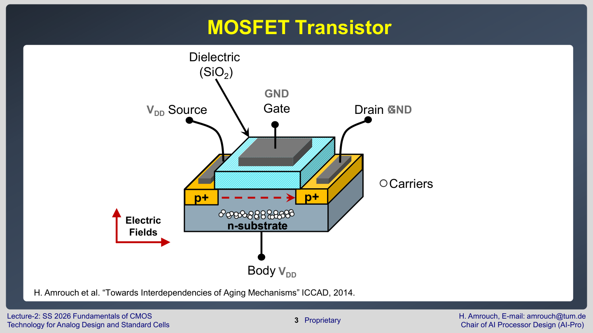

MOSFET은 source, drain, gate, body/substrate로 구성된다. <font color="#00b0f0">Gate에는 절연막이 있어 gate 전압이 직접 전류로 흐르지는 않지만, 전기장을 만들어 substrate 근처의 carrier 분포를 바꾼다</font>.

NMOS를 기준으로 보면 다음 순서가 중요하다.

1. $V_{GS}=0$이면 source와 drain 사이에 전도성 channel이 없다.
2. gate-source voltage $V_{GS}$가 충분히 커지면 gate 아래에 electron channel이 형성된다.
3. drain-source voltage $V_{DS}$가 걸리면 channel을 따라 drain current $I_{D}$가 흐른다.

이때 channel이 생기기 시작하는 gate voltage를 threshold voltage $V_{th}$라고 한다.

## 동작 영역: OFF, linear, saturation

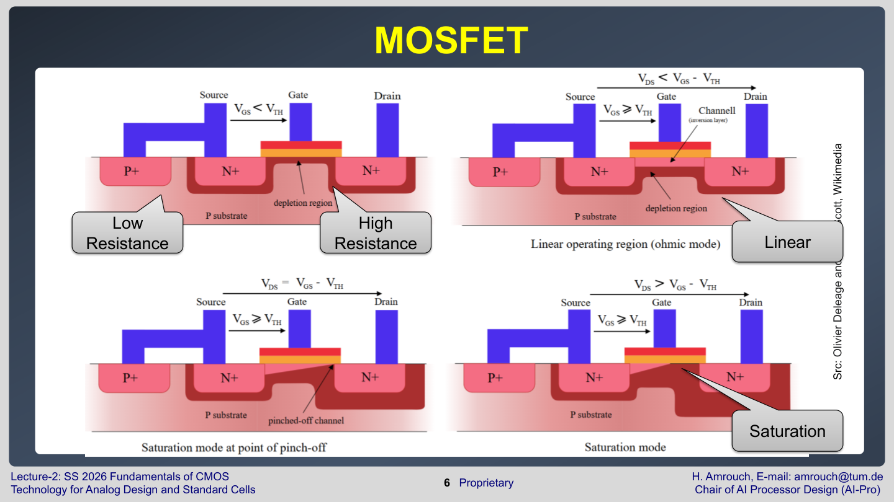

MOSFET은 입력 전압과 출력 전압에 따라 다른 영역에서 동작한다.

| 영역                   | 조건의 의미                                                     | 회로적 의미                                                                                 |
| -------------------- | ---------------------------------------------------------- | -------------------------------------------------------------------------------------- |
| **OFF/subthreshold** | $V_{GS}<V_{th}$                                                | 꺼져 있지만 작은 누설 전류가 흐를 수 있음                                                               |
| **Linear/triode**    | channel이<font color="#ffc000"> source부터 drain까지 연결</font>됨 | <font color="#e84d4d">작은 저항</font>처럼 동작                                                |
| **Saturation**       | drain 쪽 channel이<font color="#ffc000"> pinch-off에 가까움      | <font color="#e84d4d">전류원</font>이거나 <font color="#e84d4d">강한 ON transistor</font>처럼 동작 |

**디지털 회로**에서는 MOSFET이 <font color="#ffc000">완전히 OFF이거나 강하게 ON인 상태를 주로 사용</font>한다. **아날로그 회로**에서는 <font color="#ffc000">saturation 영역의 전류원 특성</font>이 중요하다.

## I-V characteristic 읽기

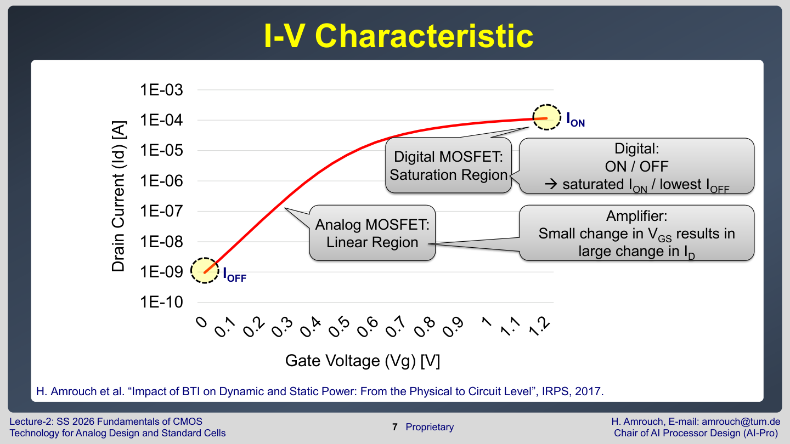

I-V curve는 gate voltage나 drain voltage를 바꿀 때 current가 어떻게 변하는지 보여준다. 로그 스케일에서는 OFF current처럼 매우 작은 전류도 볼 수 있고, 선형 스케일에서는 ON current 차이를 보기 좋다.

시험에서 그래프를 볼 때는 다음 순서로 읽으면 된다.

1. x축이 $V_{GS}$인지 $V_{DS}$인지 확인한다.
2. y축이 linear current인지 log current인지 확인한다.
3. OFF 영역의 누설 전류 $I_{OFF}$와 ON 영역의 구동 전류 $I_{ON}$을 구분한다.
4. 곡선이 오른쪽/위쪽으로 이동한 이유가 $V_{th}$, mobility, temperature, $n_{fin}$ 중 무엇인지 판단한다.

## ION과 회로 속도

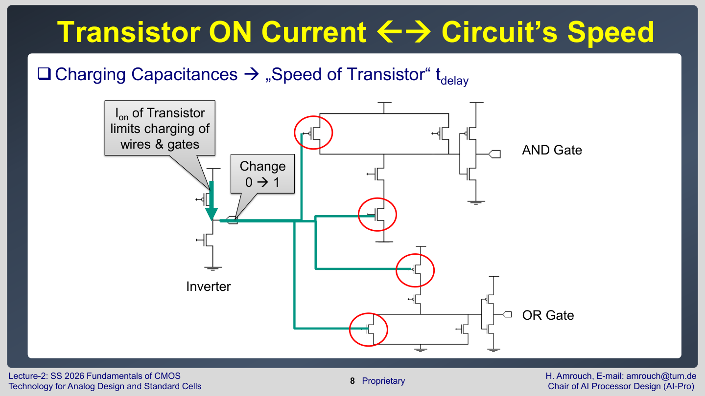

CMOS gate의 출력은 <font color="#ffc000">다음 stage의 gate capacitance와 wire capacitance를 충전하거나 방전</font>한다. 출력이 $0\to1$로 바뀔 때 **PMOS**가 capacitance를<font color="#00b0f0"> VDD까지 충전</font>하고, $1\to0$으로 바뀔 때 **NMOS**가 capacitance를<font color="#00b0f0"> GND로 방전</font>한다.

이때 delay는 대략 다음처럼 이해할 수 있다.

$$
t_{delay} \approx \frac{C_L \cdot V_{DD}}{I_{ON}}
$$

- $t_{delay}$: 출력 전압이 바뀌는 데 걸리는 시간
- $C_{L}$: load capacitance, 즉 다음 gate와 wire가 만드는 부하
- $V_{DD}$: 충전해야 하는 전압 크기
- $I_{ON}$: ON 상태 transistor가 공급할 수 있는 전류

전류 $I_{ON}$이 크면 같은 capacitor를 더 빨리 충전/방전할 수 있으므로 delay가 줄어든다. 그래서 강의는 "transistor ON current가 회로 speed를 제한한다"고 설명한다.

### 그런데 왜 식에 $V_{DD}$가 분자에 있는가?

여기서 헷갈리기 쉬운 점이 있다. $V_{DD}$가 커지면 $I_{ON}$도 커진다. 그러면 회로가 빨라져야 하는데, 위 식만 보면 $V_{DD}$가 분자에 있어서 delay가 커지는 것처럼 보인다.

이 식은 먼저 <font color="#00b0f0">capacitor 관점에서 나온 것</font>이다. Capacitor에 저장되는 전하는 다음과 같다.

$$
Q = C_L \cdot V
$$

출력을 0에서 $V_{DD}$까지 올리려면 대략 $C_L V_{DD}$만큼의 전하를 옮겨야 한다. <font color="#00b0f0">전류는 단위 시간당 옮기는 전하</font>이므로,

$$
t \approx \frac{Q}{I} = \frac{C_L V_{DD}}{I_{ON}}
$$

가 된다. 즉, <font color="#ffc000">분자의 $V_{DD}$는 "더 높은 전압까지 충전하려면 더 많은 전하를 capacitor에 넣어야 한다"는 뜻</font>이다. 여기서 $C_{L}$ 자체가 반드시 커진다는 뜻은 아니다. 1차적으로는 capacitance는 그대로이고, 최종 전압이 높아져 저장해야 할 전하량 $Q$가 커진다.

하지만 실제 CMOS delay에서 $V_{DD}$를 바꿀 때는 $I_{ON}$도 함께 바뀐다. MOSFET이 ON일 때 gate voltage도 보통 $V_{GS}=V_{DD}$가 되므로, $V_{DD}$가 커지면 gate overdrive $V_{DD}-V_{th}$가 커지고 $I_{ON}$이 증가한다.

Lecture 3의 단순식과 합치면 다음처럼 볼 수 있다.

$$
I_{ON} \sim \mu C_{ox}\frac{W}{L}(V_{DD}-V_{th})^2
$$

따라서 delay는 더 실제적으로는 다음 경향을 가진다.

$$
t_{delay} \propto \frac{C_L V_{DD}}{(V_{DD}-V_{th})^2}
$$

이 식은 두 효과가 동시에 있다는 뜻이다.

| $V_{DD}$가 커질 때의 효과         | delay에 미치는 방향   | 이유                                                                    |
| -------------------------- | --------------- | --------------------------------------------------------------------- |
| 충전해야 할 전하량 $C_L V_{DD}$ 증가 | delay **증가 방향** | <font color="#00b0f0">더 높은 전압까지 capacitor를 충전</font>해야 함              |
| $I_{ON}$ 증가                | delay **감소 방향** | $V_{DD}-V_{th}$가 커져 <font color="#ffc000">transistor가 더 강하게 켜짐</font> |

보통 <font color="#e84d4d">정상 동작 전압 영역에서는 $I_{ON}$ 증가 효과가 더 중요</font>하다. 그래서 $V_{DD}$를 올리면 전체적으로 delay는 줄어든다. 반대로 $V_{DD}$를 낮추면 충전해야 할 전하량은 줄지만, $I_{ON}$이 더 크게 줄어들기 때문에 회로가 느려진다. 특히 $V_{DD}$가 $V_{th}$에 가까워질수록 $(V_{DD}-V_{th})$가 작아져 current가 급격히 약해지고 delay가 크게 증가한다.

정리하면 다음과 같다.


>VDD 증가:
><font color="#e84d4d">충전해야 할 전하량은 증가하지만, transistor가 훨씬 강하게 켜져 ION이 증가</font>한다.
>대부분의 경우 ION 증가 효과가 더 커서 delay는 감소한다.


그래서 $t_{delay} \approx C_{L}V_{DD}/I_{ON}$은 "전하량을 전류로 나눈다"는 기본 구조를 보여주는 식이고, $V_{DD}$와 delay의 최종 관계를 보려면 $I_{ON}$도 $V_{DD}$의 함수라는 점을 반드시 함께 봐야 한다.

## ON current와 OFF current의 기본식

Lecture 3의 핵심 수식은 아래 관계식이다.

$$
I_{ON} \sim \mu C_{ox}\frac{W}{L}(V_{DD}-V_{th})^2
$$

각 항의 의미는 다음과 같다.

| 항 | 의미 | 커지면 어떤 일이 생기나 |
| --- | --- | --- |
| $\mu$ | carrier mobility, 전자가 얼마나 쉽게 움직이는지 | $I_{ON}$ 증가 |
| $C_{ox}$ | gate oxide capacitance | gate가 channel을 더 강하게 제어해 $I_{ON}$ 증가 |
| $W$ | channel width | 전류 통로가 넓어져 $I_{ON}$ 증가 |
| $L$ | channel length | 길수록 저항이 커져 $I_{ON}$ 감소 |
| $V_{DD}-V_{th}$ | gate overdrive에 해당하는 여유 전압 | 커질수록 $I_{ON}$ 증가 |

OFF current는 강의에서 다음 형태로 제시된다.

$$
I_{OFF} \sim 10^{(V_{DD}-V_{th})/S}
$$

- $S$는 subthreshold slope이다. <font color="#ffc000">transistor가 OFF에서 ON으로 얼마나 가파르게 바뀌는지 </font>나타낸다.
	- Transistor가 <font color="#00b0f0">전류를 10배로 늘리기 위해 필요한 입력 전압 변화값</font>을 의미함.
- $V_{th}$가 낮아지면 $V_{DD}-V_{th}$가 커지고, $I_{OFF}$가 지수적으로 증가한다.
- 그래서 <font color="#ffc000">threshold voltage를 낮추면 회로는 빨라지지만, leakage power가 지수적으로 커진다</font>.

## Vth trade-off


$V_{th}$는 성능과 전력 사이의 핵심 손잡이다.

- 낮은 $V_{th}$: $I_{ON}$이 커져 빠르지만, $I_{OFF}$가 커져 leakage가 증가한다.
- 높은 $V_{th}$: leakage는 줄지만, $I_{ON}$이 작아져 delay가 커진다.

디지털 회로는 높은 $I_{ON}/I_{OFF}$ 비율이 필요하다. 강의는 <font color="#e84d4d">ON/OFF current ratio가 5-6 orders of magnitude 정도로 커야 한다</font>고 설명한다. 즉, 켜졌을 때는 충분히 큰 전류를 흘리고, 꺼졌을 때는 거의 흐르지 않아야 한다.

## 전력의 세 구성 요소

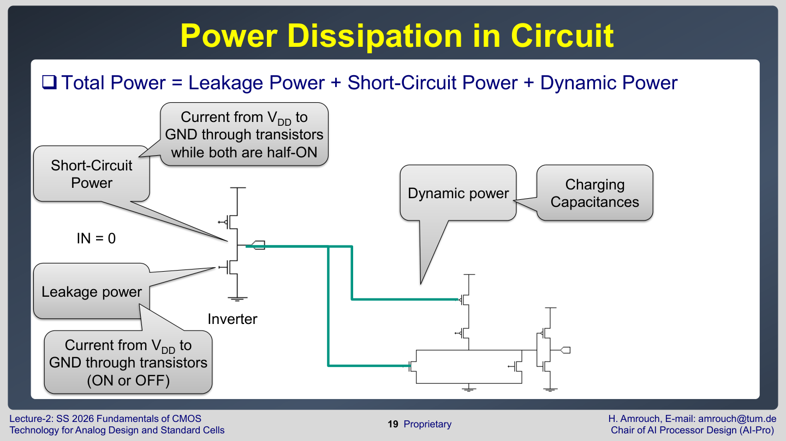

CMOS 회로의 total power는 세 항으로 나눌 수 있다.

$$
P_{total}=P_{leakage}+P_{short-circuit}+P_{dynamic}
$$

$P_{leakage}$는 <font color="#ffc000">입력이 변하지 않아도 흐르는 static power</font>이다. OFF transistor의<font color="#e84d4d"> subthreshold leakage, gate oxide tunneling, junction leakage 등</font>이 원인이다.

$P_{dynamic}$은<font color="#ffc000"> capacitance를 충전/방전할 때 쓰는 전력</font>이다. 표준적인 근사는 다음과 같다.

$$
P_{dynamic} \approx \alpha C_L V_{DD}^2 f
$$

- $\alpha$: switching activity, 한 clock 동안 실제로 전환되는 비율
- $C_{L}$: load capacitance
- $V_{DD}$: supply voltage
- $f$: switching frequency

**전압이 제곱**으로 들어가므로,<font color="#ffc000"> dynamic power를 줄이는 가장 강한 방법은 V_DD를 낮추는 것</font>이다.

$P_{short\text{-}circuit}$은 입력이 천천히 바뀌는 동안 PMOS와 NMOS가 <font color="#ffc000">잠깐 동시에 켜져 VDD에서 GND로 직접 current path가 생길 때 발생</font>한다. 이상적인 급격한 transition에서는 작지만, <font color="#00b0f0">input slew가 느리거나 sizing이 맞지 않으면 무시하기 어렵다</font>.

---


## Energy, delay, PDP

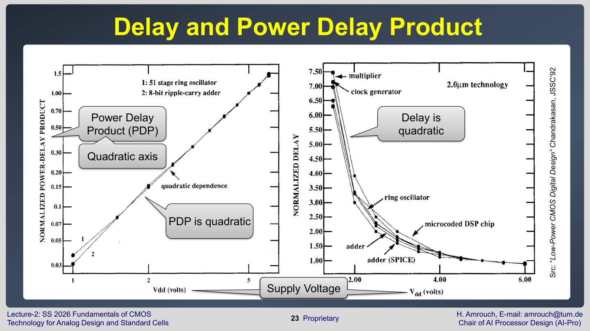

**Energy**는 <font color="#ffc000">power가 특정 시간 동안 사용된 양</font>이다.

$$
E = P \cdot t
$$

강의의 표현으로는 다음과 같다.

$$
E_{switching}=P \times Delay
$$
**Power Delay Product** $PDP$는 <font color="#e84d4d">"한 번 동작하는 데 든 에너지"처럼 해석</font>할 수 있다. <font color="#92d050">Delay만 줄이는 회로가 항상 좋은 것은 아니다</font>. <font color="#ffc000">너무 큰 transistor를 쓰면 delay는 줄지만 capacitance와 power가 늘 수 있다</font>. 그래서 low-power design에서는 speed, power, energy를 함께 본다.

Lecture 3의 circuit efficiency 슬라이드는 여러 회로가 서로 다른 delay-power curve를 가진다는 점을 보여준다. 같은 supply voltage에서도 어떤 회로는 빠르지만 power가 크고, 어떤 회로는 느리지만 power가 작다. 따라서 설계 평가는 단일 transistor만 보지 않고, 회로 구조별 PDP와 target delay를 함께 비교해야 한다.

## 온도가 MOSFET에 미치는 영향

Lecture 4는 temperature effect를 다룬다.

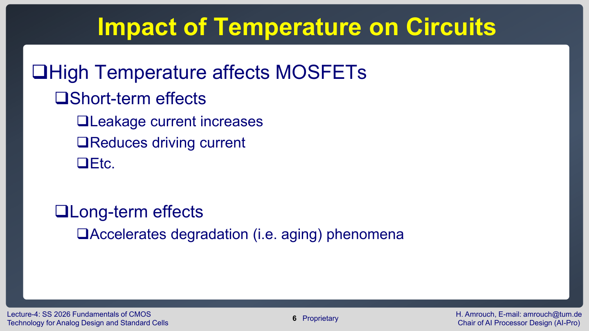

고온은 두 종류의 영향을 준다.

- **Short-term** effect: 전기적 <font color="#ffc000">parameter가 즉시 바뀐다</font>.<font color="#e84d4d"> leakage current 증가, driving current 감소 등이 포함</font>된다.
- **Long-term** effect: <font color="#ffc000">aging phenomenon이 빨라진다</font>. 시간이 지나며<font color="#e84d4d"> threshold voltage, mobility, current가 점점 변한다</font>.

<font color="#ffc000">고온에서 회로가 느려지는 주된 이유는 mobility 감소</font>다.

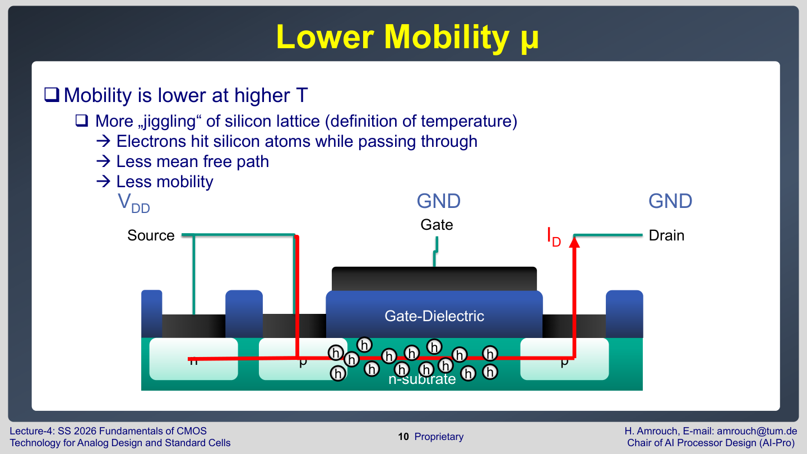

온도가 높다는 것은 <font color="#ffc000">silicon lattice의 열적 진동이 커졌다</font>는 뜻이다. <font color="#e84d4d">carrier가 channel을 지나갈 때 lattice와 더 자주 충돌하므로 mean free path가 줄고, mobility가 낮아진다</font>. 위의 $I_{ON}$ 식에서 $\mu$가 작아지면 ON current가 줄고 delay가 커진다.

반대로 <font color="#e84d4d">threshold voltage V_TH는 온도가 높아지면 낮아지는 경향</font>이 있다.

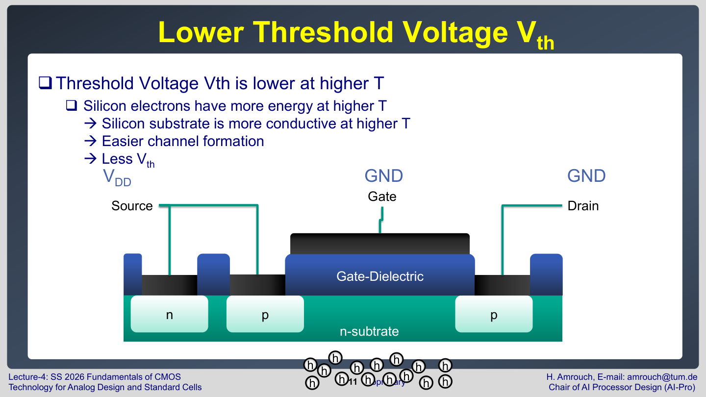

silicon 내부 carrier가 더 많은 에너지를 가지므로 channel 형성이 쉬워지고, 필요한 gate voltage가 낮아진다. 이것만 보면 $I_{ON}$에는 좋아 보이지만, <font color="#ffc000">실제 고온에서는 mobility 감소 효과가 강하게 작용해 driving current가 낮아지는 경우가 많다</font>.

### 온도에 따른 mobility와 Vth 변화 자세히 보기

Lecture 4 page 9는 45 nm PMOS에서 temperature가 올라갈 때 mobility $\mu$와 threshold voltage $V_{th}$가 둘 다 감소하는 추세를 보여준다.

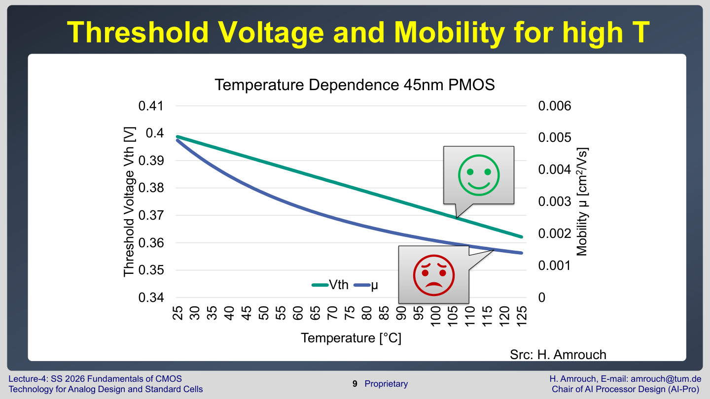

주의할 점은 $V_{th}$의 부호 convention이다. PMOS의 실제 threshold voltage는 보통 음수로 표현되지만, 그래프에서는 크기 또는 양의 값처럼 표시되어 있다. 따라서 이 슬라이드에서 말하는 핵심은 "<font color="#00b0f0">고온에서 PMOS threshold의 크기가 작아지고, channel이 더 쉽게 만들어진다</font>"는 것이다. NMOS에서도 일반적으로 온도가 올라가면 $V_{th}$는 감소하는 방향의 temperature coefficient를 가진다.

#### 1. Mobility가 감소하는 이유

Mobility $\mu$는 carrier가 전기장 아래에서 얼마나 쉽게 움직이는지를 나타낸다. <font color="#00b0f0">같은 electric field를 걸었을 때 carrier가 더 빠르게 drift하면 mobility가 큰 것</font>이다.

온도가 높아지면 silicon lattice의 열진동이 커진다. <font color="#ffc000">전자나 hole이 channel을 지나가다가 lattice vibration과 더 자주 충돌</font>한다. **이 충돌을** <font color="#e84d4d">phonon scattering</font>이라고 한다. 충돌이 많아지면 평균적으로 한 번에 곧게 이동할 수 있는 거리, 즉 mean free path가 짧아지고 mobility가 낮아진다.

간단한 경험식으로는 다음처럼 쓴다.

$$
\mu(T) \approx \mu(T_{0})\left(\frac{T}{T_{0}}\right)^{-m}
$$

- $\mu(T)$: 절대온도 $T$에서의 mobility
- $T_{0}$: 기준 온도
- $m$: 공정과 carrier 종류에 따라 달라지는 양수, 보통 대략 1.5-2.5 정도로 둔다

$m$이 양수이므로 $T$가 커지면 괄호 항의 음의 지수 때문에 $\mu(T)$는 감소한다.

좀 더 일반적으로는 여러 scattering 원인을 합쳐 다음처럼 본다.

$$
\frac{1}{\mu_{total}} =
\frac{1}{\mu_{phonon}} +
\frac{1}{\mu_{coulomb}} +
\frac{1}{\mu_{surface}} + \cdots
$$

이 식은 <font color="#00b0f0">scattering이 많아질수록 전체 mobility가 낮아진다는 뜻</font>이다. 고온에서는 특히 phonon scattering이 강해져 $\mu_{total}$이 낮아진다.

#### 2. Vth가 감소하는 이유

Long-channel NMOS의 threshold voltage는 단순화하면 다음처럼 쓸 수 있다.

$$
V_{th} = V_{FB} + 2\phi_{F} +
\frac{\sqrt{4q\epsilon_{si}N_{A}\phi_{F}}}{C_{ox}}
$$

- $V_{FB}$: flat-band voltage
- $\phi_{F}$: Fermi potential
- $q$: electron charge
- $\epsilon_{si}$: silicon permittivity
- $N_{A}$: substrate doping concentration
- $C_{ox}$: oxide capacitance

여기서 온도와 강하게 연결되는 항은 $\phi_{F}$이다.

$$
\phi_{F} = \frac{kT}{q}\ln\left(\frac{N_{A}}{n_{i}}\right)
$$

- $k$: Boltzmann constant
- $T$: absolute temperature
- $n_{i}$: intrinsic carrier concentration

온도가 올라가면 <font color="#ffc000">intrinsic carrier concentration n_i가 크게 증가</font>한다.

$$
n_{i}(T) \propto T^{3/2}\exp\left(-\frac{E_{g}}{2kT}\right)
$$

$n_{i}$가 증가하면 $\ln(N_{A}/n_{i})$가 작아진다. 실제 동작 온도 범위에서는 이 효과 때문에 $\phi_{F}$가 줄어드는 방향이 되고, 그 결과 $V_{th}$도 낮아진다. 쉽게 말하면, <font color="#e84d4d">고온에서는 silicon 안의 carrier가 더 쉽게 생기고 움직일 수 있어 inversion channel을 만들기 위한 gate voltage가 줄어든다</font>.

실무적으로는 다음과 같은 선형 근사도 자주 쓴다.

$$
V_{th}(T) \approx V_{th}(T_{0}) + \alpha (T - T_{0})
$$

일반적인 MOSFET에서 $\alpha$는 음수인 경우가 많다.

$$
\alpha = \frac{dV_{th}}{dT} < 0
$$

대략적인 크기는 공정에 따라 다르지만 $-0.5\,\mathrm{mV/K}$에서 $-3\,\mathrm{mV/K}$ 정도의 음의 temperature coefficient로 생각하면 된다. PMOS는 부호 표기 때문에 헷갈릴 수 있으나, 회로 관점에서는 <font color="#ffc000">고온에서 threshold barrier의 크기가 낮아져 channel 형성이 쉬워진다</font>고 이해하면 된다.

#### 3. 그런데 왜 고온에서 ID는 감소하는가?

Saturation 영역의 단순 전류식은 다음과 같다.

$$
I_{D} \approx \frac{1}{2}\mu C_{ox}\frac{W}{L}(V_{GS}-V_{th})^{2}
$$

온도가 올라가면 두 효과가 동시에 생긴다.

| 온도 증가 효과    | $I_{D}$에 미치는 방향 | 이유                                          |
| ----------- | --------------- | ------------------------------------------- |
| $\mu$ 감소    | $I_{D}$ 감소      | carrier scattering 증가로 channel을 통과하기 어려워짐   |
| $V_{th}$ 감소 | $I_{D}$ 증가 방향   | 같은 $V_{GS}$에서 overdrive $V_{GS}-V_{th}$가 커짐 |

즉, <font color="#00b0f0">mobility 감소는 전류를 줄이고, threshold voltage 감소는 전류를 늘리는 방향</font>이다. 두 효과는 **서로 반대**다.

<font color="#e84d4d">강한 ON 상태에서는 보통 mobility 감소 효과가 더 커서</font> 전체 driving current $I_{ON}$<font color="#e84d4d">이 감소</font>한다. 그래서 Lecture 4는 고온에서 $I_{D}$가 낮아진다고 말한다.

이를 미분 형태로 보면 방향성이 더 분명하다.

$$
\frac{\Delta I_{D}}{I_{D}}
\approx
\frac{\Delta \mu}{\mu}
-
2\frac{\Delta V_{th}}{V_{GS}-V_{th}}
$$

고온에서 $\Delta \mu < 0$이고 $\Delta V_{th}<0$이다. 두 번째 항은 $-2\Delta V_{th}/(V_{GS}-V_{th})$이므로 전류 증가 방향이다. 하지만 실제 <font color="#ffc000">high-current ON 영역에서는</font> $\Delta \mu / \mu$<font color="#ffc000">의 음의 효과가 더 커서</font> $I_{D}$<font color="#ffc000">가 감소하는 경우가 많다</font>.

반대로 OFF 또는 subthreshold 영역에서는 $V_{th}$ 감소가 매우 중요하다. Subthreshold current는 대략 다음처럼 지수적으로 변한다.

$$
I_{sub} \propto
\exp\left(\frac{V_{GS}-V_{th}}{nV_{T}}\right)
$$

여기서 $V_{T}=kT/q$는 thermal voltage이고, $n$은 subthreshold slope factor이다. 온도가 올라가면 $V_{th}$가 낮아지고 $V_{T}$도 커지며, carrier도 더 쉽게 장벽을 넘는다. 그래서 $I_{OFF}$는 고온에서 크게 증가한다.

정리하면 다음과 같다.


>**고온**:
><font color="#e84d4d">mobility 감소</font> -> <font color="#ffc000">ON current 감소</font> -> 회로 delay 증가
><font color="#e84d4d">Vth 감소</font> -> <font color="#ffc000">channel 형성 쉬워짐</font> -> leakage 증가

>**결과**:
>고온에서는 drive current는 줄고, leakage current는 커지는 나쁜 조합이 자주 나타난다.


## 온도와 누설 전류

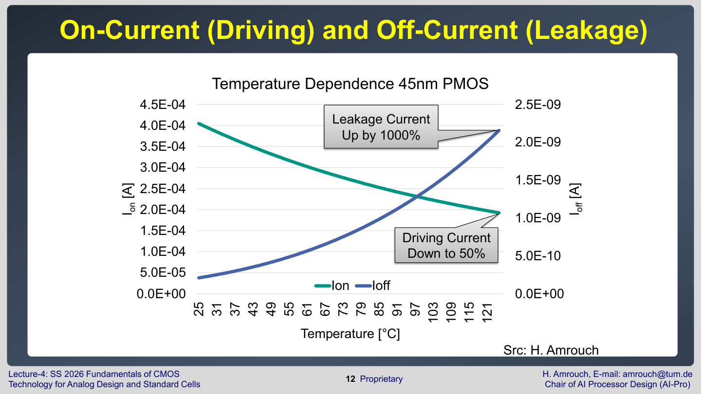

고온에서는 $I_{OFF}$가 증가한다. 이유는<font color="#ffc000"> carrier가 더 쉽게 에너지 장벽을 넘고, threshold voltage도 낮아지기 때문</font>이다. 그래서 hot chip은 static power가 커진다.

Lecture 4의 중요한 loop는 다음이다.

```text
온도 증가 -> leakage 증가 -> static power 증가 -> heat 증가 -> 온도 추가 증가
```

이 loop가 심해지면 thermal runaway처럼 회로가 점점 더 뜨거워지는 방향으로 갈 수 있다. 그래서 cooling과 power management는 reliability 문제와 분리할 수 없다.

## Thermal constraints

Lecture 4는 온도 제한이 단순히 transistor 성능 때문만은 아니라고 설명한다.

- 사용자가 만지는 제품의 skin temperature가 너무 높으면 안전 문제가 된다. 슬라이드에서는 50도 이상이 사용자에게 고통스러울 수 있다고 언급한다.
- 서로 다른 material의 thermal expansion coefficient 차이 때문에 mechanical stress가 생긴다.
- 고온은 누설과 aging을 키워 장기 신뢰성을 낮춘다.

즉, chip temperature constraint는 성능, 전력, packaging, 안전, 신뢰성을 모두 포함한다.

Lecture 4 마지막 슬라이드는 강의의 전류식 설명이 이해를 위한 단순화라고 못박는다. 실제 MOSFET physics 기반 식은 더 복잡하고, 정확한 temperature modeling은 semiconductor physics와 compact model 안에서 다룬다. 시험에서는 단순식의 방향성을 정확히 이해하고, 실무 simulation에서는 BSIM 같은 model이 더 많은 parameter를 포함한다는 구분이 중요하다.

## 시험 대비 핵심

- $I_{ON}$은 회로 speed를 정하고, $I_{OFF}$는 static power를 정한다.
- $I_{ON}$은 $\mu$, $C_{ox}$, $W/L$, $(V_{DD}-V_{th})^{2}$에 의해 커진다.
- $V_{th}$를 낮추면 빠르지만 leakage가 지수적으로 커진다.
- Total power는 leakage, short-circuit, dynamic power로 나뉜다.
- Dynamic power는 $\alpha C_{L} V_{DD}^{2}f$로 이해하면 된다.
- 고온에서는 mobility가 낮아져 driving current가 줄고, leakage current가 커진다.
- 온도 증가는 aging을 가속하고, leakage-power-heat feedback loop를 만든다.

## 포함 범위

- Lecture 3: pages 3-27
- Lecture 4: pages 3-14
