# 03. 신뢰성, 노화, BTI/HCI/TDDB/EM 물리

## 이 장의 위치

이 장은 Lecture 5, 6, 7을 정리한다. 앞 장에서 $I_{ON}$, $I_{OFF}$, $V_{th}$, mobility, temperature가 회로 성능을 바꾼다는 것을 보았다. 이 장에서는 <font color="#00b0f0">시간이 지나며 transistor parameter가 왜 변하는지 설명</font>한다.

핵심 흐름은 다음이다.

```text
전압/온도/동작시간/duty cycle -> defect 생성 또는 활성화 -> Vth/mu/Ion 변화 -> delay 증가 -> timing violation 또는 failure
```

## 전압, 전력, 성능, 신뢰성의 충돌

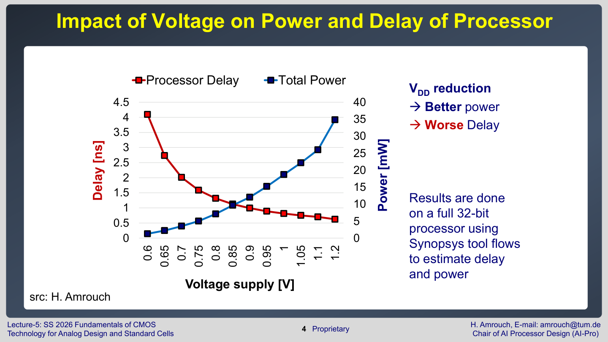

Lecture 5는 VDD reduction의 양면성을 보여준다.

- $V_{DD}$를 <font color="#ffc000">낮추면 dynamic power가 줄고 temperature도 낮아질 수 있다</font>.
- 하지만 $V_{DD}-V_{th}$가 작아져 $I_{ON}$이 줄고 delay가 커진다.
- $V_{DD}$를 <font color="#ffc000">높이면 delay는 좋아지지만 power, temperature, aging stress가 커진다</font>.

따라서 reliability는 단순히 "전압을 높이면 안전하다" 또는 "전압을 낮추면 좋다"로 말할 수 없다. <font color="#e84d4d">전압을 높이면 aging은 빨라질 수 있고, 전압을 낮추면 timing margin이 줄어 오류가 생길 수 있다</font>.

## MOSFET reliability를 위협하는 것

Lecture 5는 MOSFET 동작을 위협하는 요인을 네 가지로 나눈다.

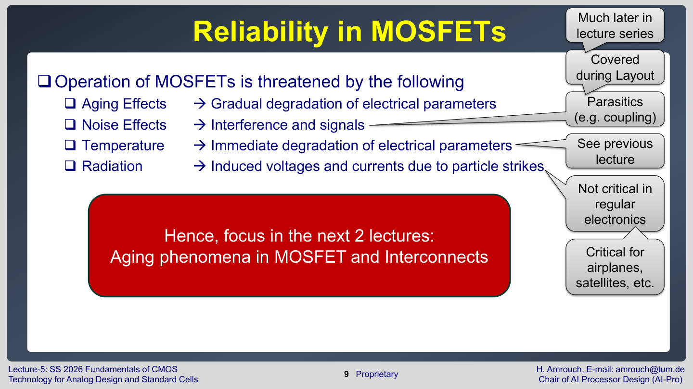

| 요인                | 의미                                                          | 결과                           |
| ----------------- | ----------------------------------------------------------- | ---------------------------- |
| **Aging effects** | 시간이 지나며 <font color="#ffc000">전기적 parameter가 서서히 나빠짐</font> | delay 증가, current 감소         |
| **Noise effects** | <font color="#ffc000">외부/내부 간섭이 signal에 섞임                  | 잘못된 </font>logic value       |
| **Temperature**   | <font color="#ffc000">즉각적으로</font> parameter 변화             | leakage 증가, drive current 감소 |
| **Radiation**     | 입자 충돌로 <font color="#ffc000">전압/전류가 유도</font>됨              | transient error, soft error  |

이 장의 중심은 aging이다.

## Aging의 두 형태

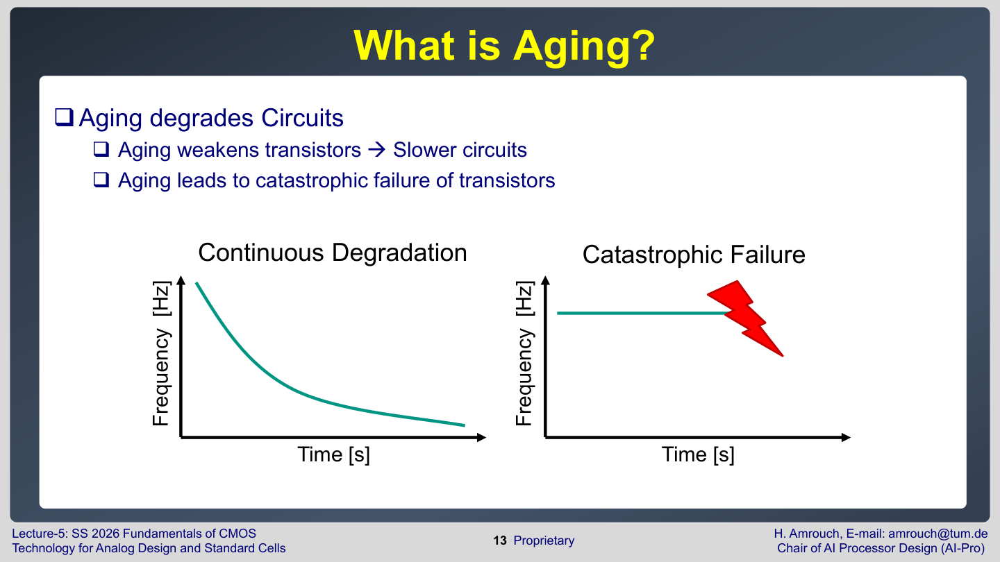

Aging은 크게 두 방향으로 나타난다.

첫째, **continuous degradation**이다. <font color="#ffc000">transistor가 점점 약해지고 회로가 느려진다</font>. 주파수 한계가 낮아지고, 원래 clock period 안에 계산을 끝내지 못하면<font color="#ffc000"> timing violation이 생긴다</font>.

둘째, **catastrophic failure**이다. <font color="#ffc000">절연막이 파괴되거나 금속 배선이 끊어져 갑자기 동작하지 않게 된다</font>.

>Catastrophic Failure는 회로의 '물리적인 파괴'로 인한 동작 불능을 의미


Lecture 5는 상용 processor 사례도 든다. Intel 13/14세대 desktop instability와 Intel C2000 문제는 과도한 전압, clock tree, low-power 동작 실패, 고부하 환경에서 aging이 실제 제품 문제로 나타날 수 있음을 보여준다.

## Aging mechanism 분류

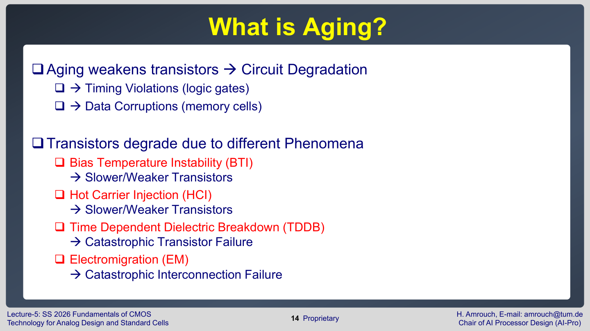

강의의 aging phenomenon은 다음 네 가지다. 중요한 구분은 "<font color="#00b0f0">조금씩 약해지는가</font>"와 "<font color="#00b0f0">물리적으로 망가지는가</font>"이다.

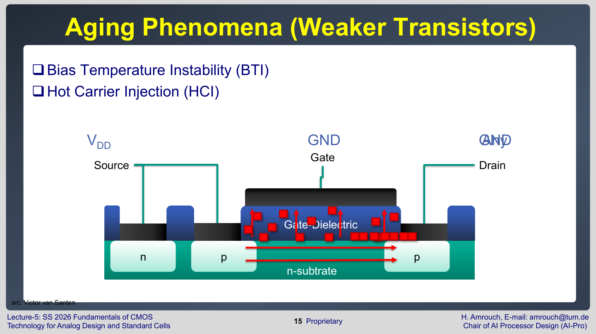

| 현상                                                                           | 주로 망가지는 위치                                                         | 유발 조건                            | 결과                                                     | 유형         |
| ---------------------------------------------------------------------------- | ------------------------------------------------------------------ | -------------------------------- | ------------------------------------------------------ | ---------- |
| **BTI** <br><font color="#646a73">Bias Temperature Instability               | gate dielectric과<font color="#ffc000"> channel interface 주변</font> | gate bias, 온도, stress 시간         | $V_{th}$ shift, $I_{ON}$ 감소, delay 증가                        | **점진적** 열화 |
| **HCI**<br><font color="#646a73">Hot Carrier Injection</font>                | <font color="#ffc000">drain 근처</font> channel/interface/oxide      | 강한 drain 전기장, current, switching | drain 근처 defect, $I_{ON}$/$g_m$ 감소, delay 증가               | **점진적** 열화 |
| **TDDB**<br><font color="#646a73">Time Dependent Dielectric Breakdown</font> | <font color="#ffc000">gate dielectric</font>                       | 얇은 절연막에 걸리는 높은 electric field    | gate oxide breakdown, leakage path, transistor failure | **파국적** 고장 |
| **EM**<br><font color="#646a73">Electromigration</font>                      | <font color="#ffc000">metal interconnect</font>                    | 높은 current density, 높은 온도, 긴 시간  | metal void/hillock, open/short, interconnect failure   | **파국적** 고장 |

**BTI와 HCI**는 transistor를 점점 약하게 만든다. 그래서 <font color="#00b0f0">timing guardband, voltage guardband, aging-aware synthesis로 어느 정도 버틸 수 있다</font>.

**TDDB와 EM**은 다르다. 절연막에 실제 전류 통로가 뚫리거나, 금속 배선이 물리적으로 끊어지는 현상이다. 이런 고장은 <font color="#00b0f0">delay가 조금 증가하는 수준이 아니라 회로 연결 자체가 망가지는 것</font>이므로 guardband만으로 해결하기 어렵고 redundancy, spare resource, error correction 같은 <font color="#ffc000">구조적 대응이 필요</font>하다.

## Defect가 transistor parameter를 바꾸는 방식

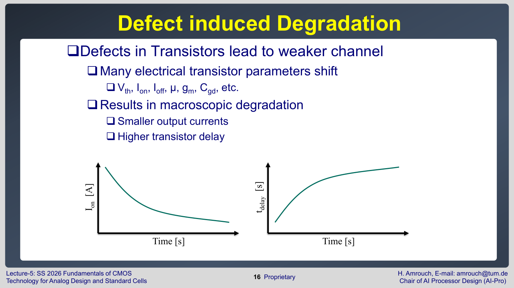

**Defect**는 <font color="#ffc000">원하지 않는 charge나 trap처럼 동작</font>한다. 이 defect가 <font color="#ffc000">channel 주변에 생기면 gate가 channel을 제어하는 방식이 바뀐다</font>.

슬라이드는 defect가 다음 parameter를 shift시킬 수 있다고 말한다.

- $V_{th}$: channel 형성에 필요한 threshold voltage
- $I_{ON}$: ON current
- $I_{OFF}$: OFF leakage current
- $\mu$: mobility
- $g_{m}$: transconductance
- $C_{gd}$: gate-drain capacitance

회로 수준에서는 <font color="#00b0f0">작은 parameter shift가 delay 증가로 보인다</font>. 특히 $V_{th}$가 증가하거나 mobility가 낮아지면 $I_{ON}$이 줄고, 앞 장의 delay 관계식 때문에 $t_{delay}$가 커진다.

단계를 나누면 다음과 같다.

>1. 전압, 온도, current, switching 때문에 <font color="#ffc000">defect가 생기거나 전기적으로 활성화</font>된다.
>2. Defect는 **interface나 oxide 주변**에 <font color="#ffc000">charge처럼 작용</font>한다.
>3. Gate가 <font color="#e84d4d">channel을 제어하는 조건이 바뀐다</font>.
>4. 같은 gate voltage를 줘도 channel이 예전처럼 강하게 열리지 않는다.
>5. $I_{ON}$이 줄고, output capacitance를 충전/방전하는 시간이 길어진다.
>6. Cell delay가 증가하고, critical path에서는 <font color="#e84d4d">timing violation</font>으로 이어질 수 있다.

## Aging을 자극하는 조건

Lecture 5는 aging stimulation을 네 가지로 요약한다.

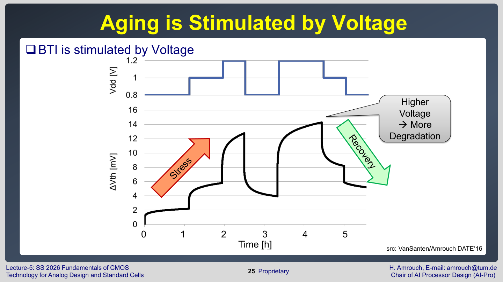

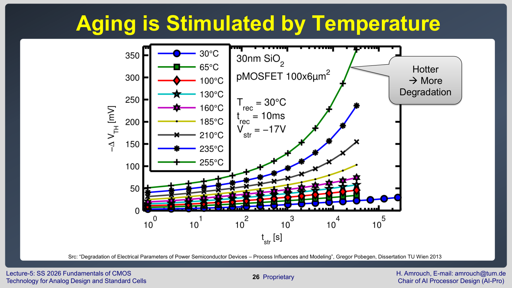

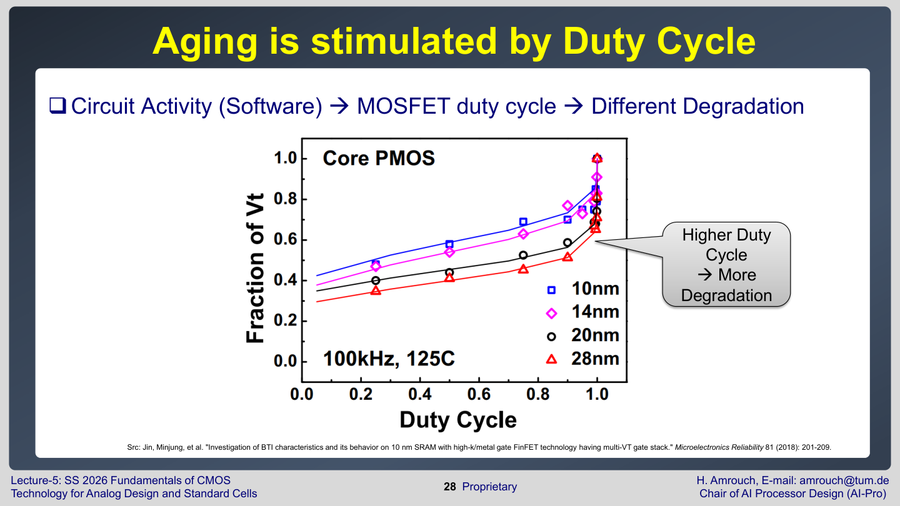

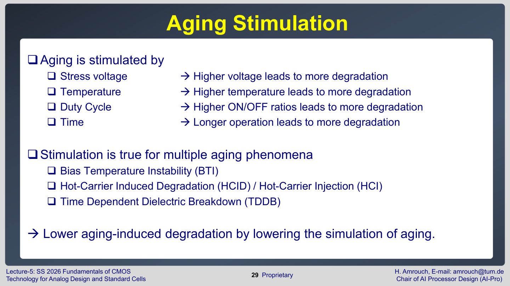

| 자극                 | 의미                                                           | aging 방향                                                          |
| ------------------ | ------------------------------------------------------------ | ----------------------------------------------------------------- |
| **Stress voltage** | gate/channel/oxide에 걸리는 <font color="#ffc000">전기장            | <font color="#ffc000">높을수록 </font>degradation 증가                  |
| **Temperature**    | <font color="#ffc000">열에너지</font>                            | <font color="#ffc000">높을수록</font> reaction과 trapping 증가           |
| **Duty cycle**     | transistor가<font color="#ffc000"> stress 상태에 있는 시간</font> 비율 | <font color="#ffc000">ON/OFF stress 비율이 클수록</font> degradation 증가 |
| **Time**           | <font color="#ffc000">누적 동작</font> 시간                        | <font color="#ffc000">오래 동작할수록 </font>degradation 증가              |

각 자극은 메커니즘마다 조금 다르게 작용한다.

- **BTI**는 **gate oxide**에 걸리는<font color="#ffc000"> vertical electric field와 온도에 민감</font>하다.
- **HCI**는 **drain 근처** <font color="#ffc000">lateral electric field와 current</font>에 민감하다.
- **TDDB**는 **gate dielectric**에 오래 걸리는 <font color="#ffc000">높은 electric field에 민감</font>하다.
- **EM**은 **metal interconnect**를 흐르는 <font color="#ffc000">current density와 온도에 민감</font>하다.

<font color="#00b0f0">Duty cycle은 software와 workload가 reliability에 영향을 줄 수 있음</font>을 뜻한다. 같은 회로라도 어떤 입력 패턴을 오래 받는지에 따라 aging 위치와 크기가 달라진다. 예를 들어 어떤 PMOS가 오랫동안 stress bias를 받는 입력 조합에서는 BTI가 커질 수 있고, 어떤 path가 자주 switching하면 HCI와 dynamic self-heating이 커질 수 있다.

## Aging은 공정에 따라 바뀐다

Lecture 5는 시대별 dominant aging phenomenon도 정리한다.

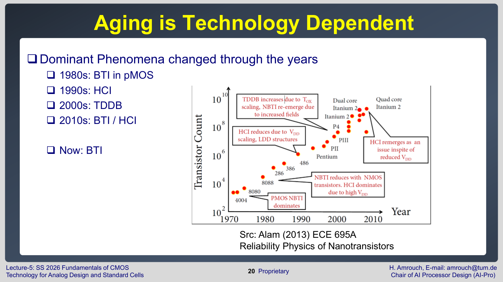

| 시대    | 지배적 현상     |
| ----- | ---------- |
| 1980s | PMOS BTI   |
| 1990s | HCI        |
| 2000s | TDDB       |
| 2010s | BTI/HCI    |
| 현재    | **BTI 중심** |

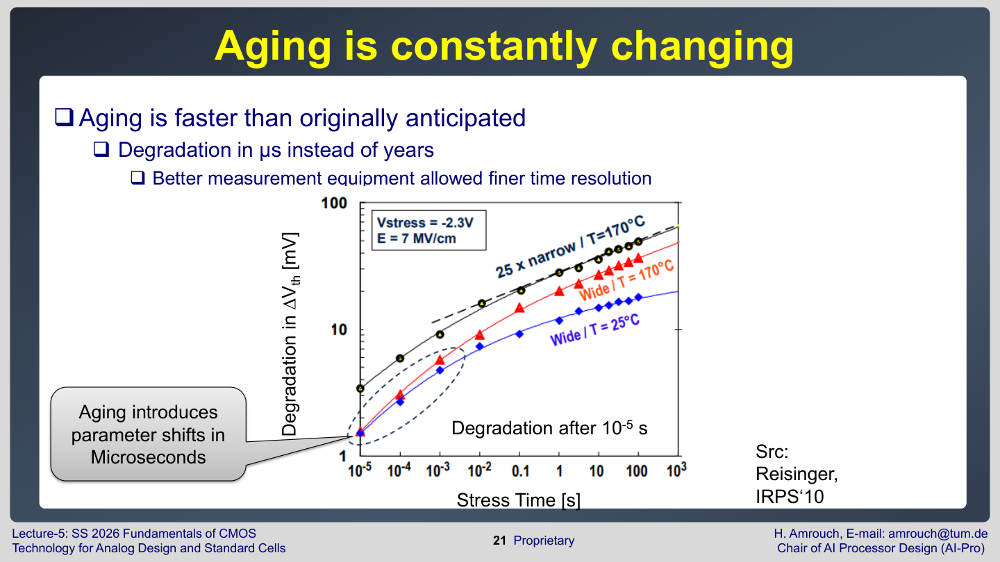

강의는 <font color="#00b0f0">aging이 과거 예상보다 빠르게 나타날 수 있다</font>고 설명한다. 측정 장비가 좋아지면서<font color="#ffc000"> microsecond 영역의 빠른 degradation도 관측</font>되었고, parameter shift가 "수년 뒤에만 보이는 현상"이 아니라 <font color="#ffc000">매우 짧은 stress 후에도 나타날 수 있음</font>을 보여준다.

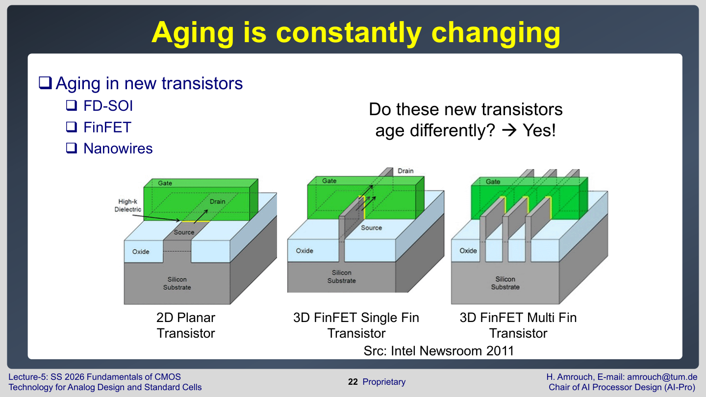

FinFET, FD-SOI, nanowire처럼 <font color="#ffc000">구조가 바뀌면 aging도 다시 평가</font>해야 한다. 구조가 3차원으로 바뀌면 gate control, electric field 분포, channel 주변 interface 면적, self-heating 경로가 모두 달라지기 때문이다.

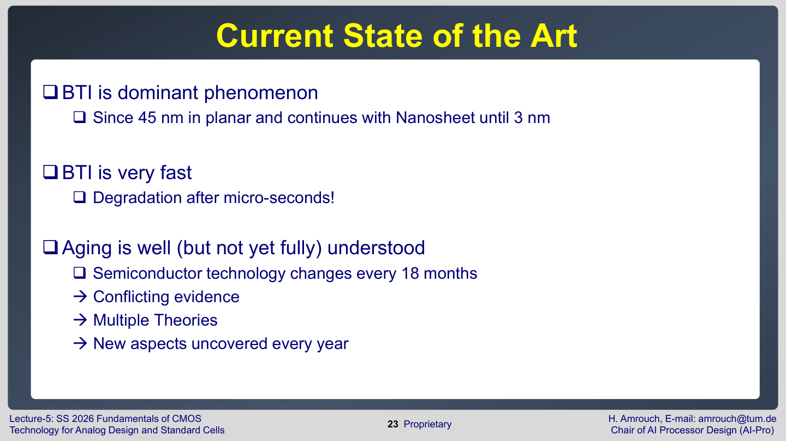

현재 state of the art에서는 45 nm planar 이후 nanosheet 3 nm까지 <font color="#00b0f0">BTI가 dominant phenomenon으로 이어진다</font>고 정리한다. 하지만 강의가 강조하듯 aging은 완전히 끝난 주제가 아니다. 공정이 빠르게 바뀌고, 측정 가능한 시간 해상도도 좋아지기 때문에 여러 이론과 관찰이 계속 보완된다.

## Silicon doping과 defect를 이해하기 위한 기초

Lecture 6은 BTI를 설명하기 전에 silicon, oxygen, dopant의 valence electron을 짚는다.

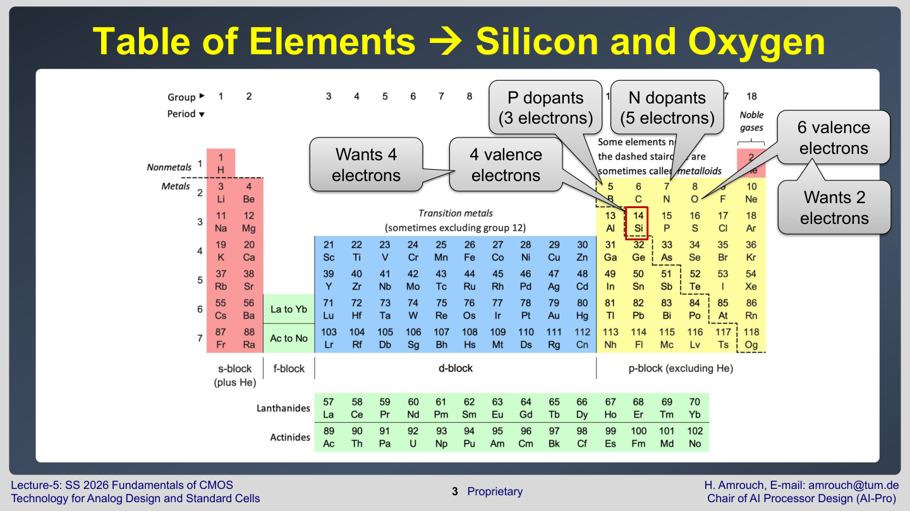

Silicon은 valence electron이 4개라 주변 silicon과 공유결합 network를 만든다. Oxygen은 silicon dioxide $SiO_{2}$에서 gate dielectric을 이루는 핵심 원소다.

Dopant는 silicon의 carrier 농도를 조절한다.

- N-type dopant는 valence electron이 5개인 원소를 넣어 electron을 늘린다.
- P-type dopant는 valence electron이 3개인 원소를 넣어 hole을 늘린다.

MOSFET의 source/drain, body, channel 형성은 이 doping 구조 위에서 이해해야 한다.

Lecture 6의 silicon orientation 슬라이드는 silicon crystal 방향도 interface defect와 관련이 있음을 보여준다. 예를 들어 $(100)$ orientation의 silicon surface에서는 원자 배열과 dangling bond 구조가 달라지고, 이것이 Si-SiO2 interface trap 설명의 배경이 된다. 시험에서는 결정방향의 세부 구조를 깊게 계산하기보다, "<font color="#ffc000">interface는 완전히 매끈한 경계가 아니라 결함이 생길 수 있는 원자 배열의 경계</font>"라는 점을 이해하면 된다.

## BTI의 기본 의미

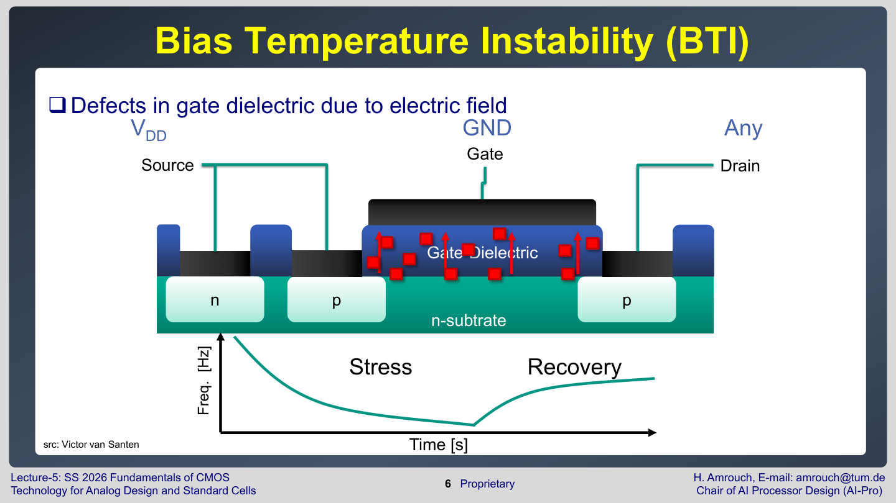

**BTI**는 <font color="#ffc000">gate dielectric과 silicon interface 근처 defect 때문에 transistor 특성이 변하는 현상</font>이다. 이름의 세 부분을 그대로 읽으면 된다.

- **Bias**: <font color="#00b0f0">gate에 특정 전압</font>이 걸린 상태
- **Temperature**: 온도가 <font color="#00b0f0">높을수록</font> 더 강해짐
- **Instability**: 시간이 지나며 $V_{th}$ 같은 <font color="#00b0f0">parameter가 안정적으로 유지되지 않음</font>

**PMOS**에서 <font color="#ffc000">negative BTI</font>, **NMOS**에서 <font color="#ffc000">positive BTI</font>가 자주 언급된다. 핵심은 gate bias와 온도 때문에 defect가 생성되거나 활성화되어 $V_{th}$가 변한다는 점이다.

BTI를 단계별로 보면 다음과 같다.

>1. Transistor가 <font color="#ffc000">특정 gate bias를 오래 받는다</font>.
>2. Gate dielectric과 silicon interface 주변에 **강한 electric field**가 생긴다.
>3. 온도가 높으면 <font color="#ffc000">defect 생성 또는 defect 활성화</font>가 더 쉬워진다.
>4. Interface trap이나 oxide trap이<font color="#ffc000"> charge를 가지거나 새로 생긴다</font>.
>5. <font color="#e84d4d">이 charge가 gate 전압이 channel에 전달되는 방식을 방해</font>한다.
>6. 결과적으로 $V_{th}$가 shift되고 transistor가 약해진다.
>7. Stress가 사라지면 <font color="#e84d4d">일부 defect는 회복되지만, 전부 돌아오지는 않을 수 있다</font>.

여기서 "약해진다"는 말은 같은 입력을 줘도 channel current가 작아진다는 뜻이다. Digital gate에서는 output node를 충전/방전하는 힘이 줄어들어 delay가 증가한다.

## BTI: Reaction-Diffusion 관점

Lecture 6은 BTI를 설명하는 두 이론을 제시한다.

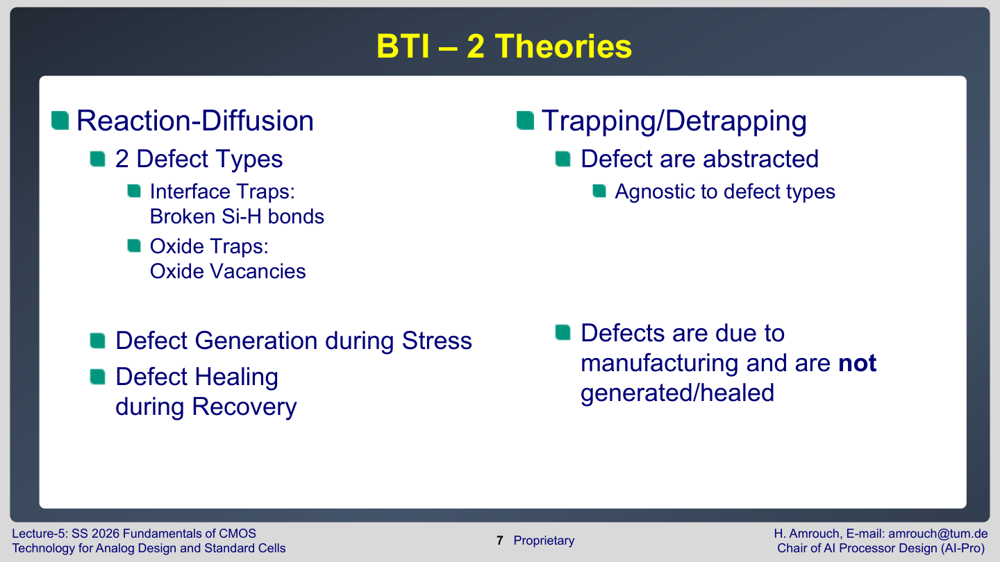

첫 번째는 **reaction-diffusion model**이다. 이 관점에서는 <font color="#ffc000">stress 중에 defect가 생성되고, recovery 중에는 일부 healing이 일어난다</font>.

주요 defect는 두 종류다.

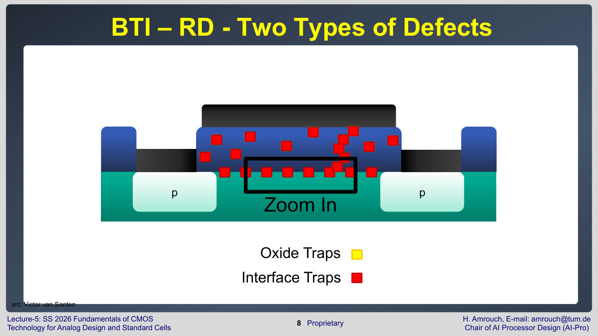

그림에서 빨간 defect는 interface trap, 노란 defect는 oxide trap을 나타낸다. **Interface trap**은 <font color="#ffc000">silicon과 dielectric 경계</font>에 가깝고, **oxide trap**은<font color="#ffc000"> gate dielectric 내부에 더 깊게 존재</font>한다.

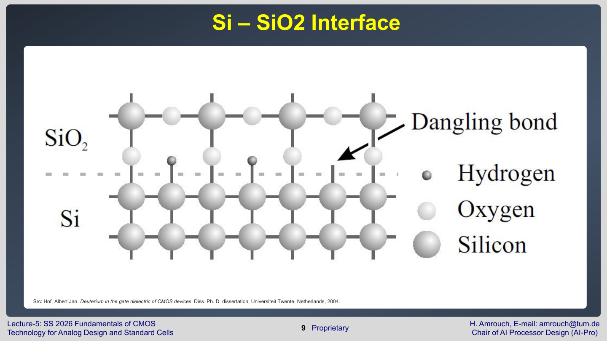

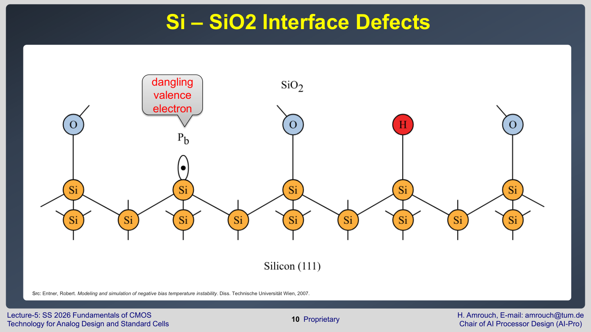

Si-SiO2 interface는 완벽하게 매끄러운 경계가 아니다. Silicon과 oxygen이 만나는 원자 수준의 경계에는 <font color="#00b0f0">결합이 끊기거나 덜 안정적인 위치가 생길 수 있다</font>. 그림의 **dangling bond**는 <font color="#00b0f0">주변 원자와 제대로 결합하지 못한 silicon 결합 자리</font>다. 이 자리는 <font color="#ffc000">charge를 잡거나 전기적으로 활성화되기 쉬워 </font>transistor 특성을 바꿀 수 있다.

### Interface trap

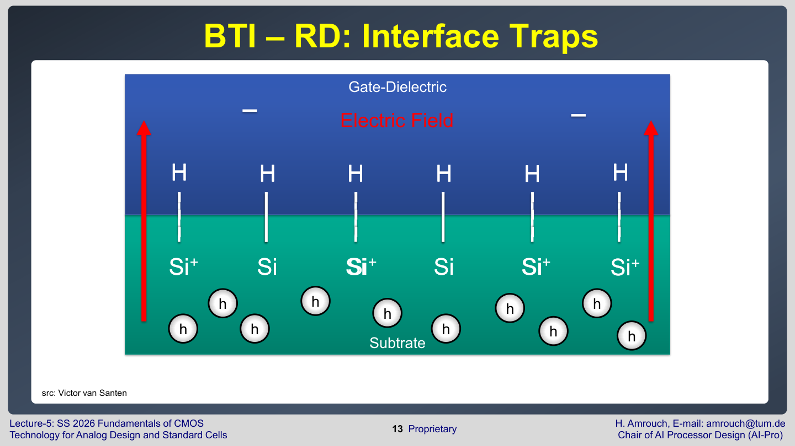

**Interface trap**은 silicon과 gate dielectric의 경계에 있는 <font color="#ffc000">broken Si-H bond로 이해</font>한다. <font color="#00b0f0">원래 hydrogen은 불안정한 silicon dangling bond를 막아주는 역할</font>을 한다. 이것을 **passivation**이라고 한다.

유발 단계는 다음과 같다.

>1. 제조 후 interface 근처의<font color="#00b0f0"> dangling bond는 hydrogen과 결합해 안정화</font>되어 있다.
>2. Gate bias가 걸리면 interface와 dielectric에 electric field가 생긴다.
>3. Channel에 있는 <font color="#ffc000">carrier와 electric field가 Si-H 결합에 에너지를 전달</font>한다.
>4. <font color="#e84d4d">Si-H 결합이 끊어지고 hydrogen이 떨어져 나간다</font>.
>5. 남은 silicon<font color="#e84d4d"> dangling bond가 interface trap</font>이 된다.
>6. <font color="#ffc000">이 trap은 positive charge처럼 작용</font>할 수 있다.
>7. Positive charge는 channel 형성 조건을 바꾸고 $V_{th}$를 shift시킨다.

결과적으로<font color="#ffc000"> interface 근처에 charge 상태가 생기고, gate가 channel을 제어하는 방식이 변한다</font>. 그래서 $I_{ON}$이 줄고 delay가 커질 수 있다. 특히<font color="#00b0f0"> interface trap은 channel 바로 옆에 있으므로 mobility와 transconductance에도 영향을 줄 수 있다</font>.

### Oxide trap

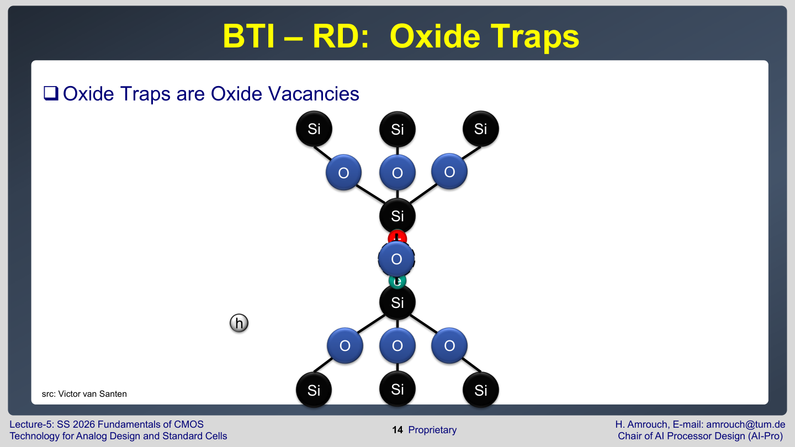

**Oxide trap**은 <font color="#ffc000">gate dielectric 내부의 oxide vacancy</font>처럼 볼 수 있다. Oxide vacancy는 원래 있어야 할 산소 결합이 비어 있거나 결함이 있는 자리다. <font color="#00b0f0">제조 과정에서 이미 존재할 수도 있고, 동작 중 stress로 추가 생성될 수도 있다</font>.

유발 단계는 다음과 같다.

>1. Gate dielectric 내부에 산소 vacancy 또는 결함 자리가 있다
>2. Gate bias와<font color="#ffc000"> electric field가 걸리면 이 defect 주변의 energy 상태가 바뀐다</font>.
>3. Channel에서 온 carrier가 defect에 잡히거나, defect가 charge 상태로 바뀐다.
>4. Charged <font color="#ffc000">oxide trap은 gate dielectric 내부에 고정된 전하처럼 작용한</font>다.
>5. Gate가 channel을 여는 데 필요한 조건이 바뀐다.
>6. $V_{th}$, $I_{OFF}$, $I_{ON}$ 같은 parameter가 변한다.

한줄 요약 : Oxygen Vacancy (Defect)에<font color="#e84d4d"> Carrier가 Trap되어 고정된 전하처럼 동작</font>하는 현상

Lecture 6의 요약은 다음과 같다.

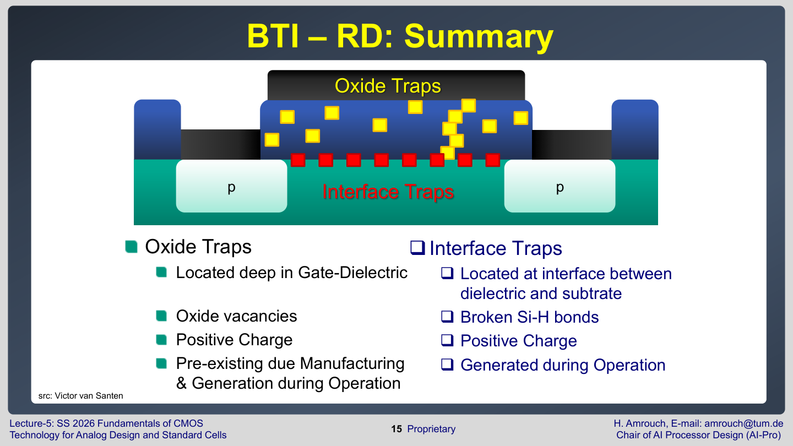

| defect             | 위치                                                                           | 물리적 설명                                     | 특징                                            |
| ------------------ | ---------------------------------------------------------------------------- | ------------------------------------------ | --------------------------------------------- |
| **Interface trap** | substrate와 dielectric<font color="#ffc000"> 경계                               | <font color="#00b0f0">broken Si-H bond     | 동작 중 생성</font>, positive c</font>harge로 작용 가능 |
| **Oxide trap**     | gate dielectric <font color="#ffc000">내부                             </font> | <font color="#00b0f0">oxide vacancy</font> | 제조 중 존재하거나 동작 중 생성, positive charge로 작용 가능    |

<font color="#ffc000">두 trap 모두 결과적으로 gate 제어를 흐리게 만든다</font>. 다만 **interface trap**은 <font color="#e84d4d">channel 바로 옆에서 carrier 이동을 방해</font>하기 쉽고, **oxide trap**은 <font color="#e84d4d">dielectric 내부에서 gate 전기장을 바꾸는 방식</font>으로 영향을 준다.

## BTI: Trapping/Detrapping 관점

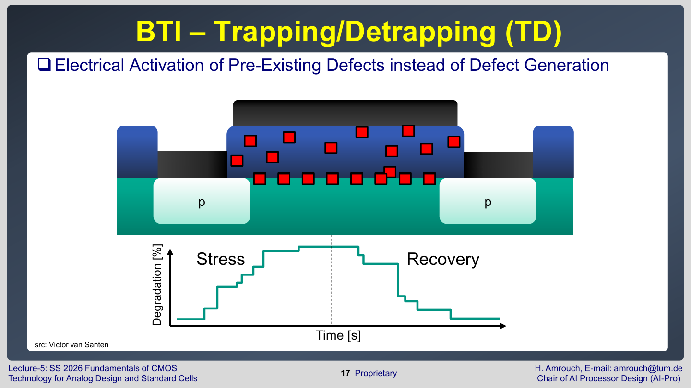

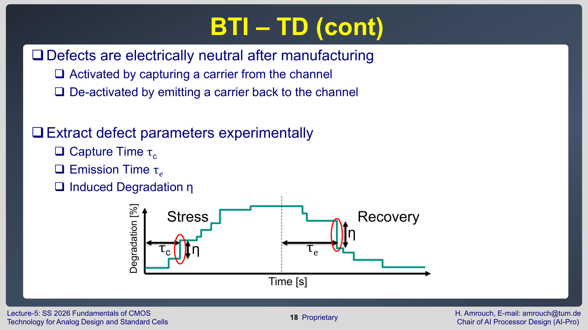

두 번째는 **trapping/detrapping model**이다. 이 모델은 <font color="#ffc000">defect가 새로 생긴다기보다, 제조 후 이미 존재하는 defect가 carrier를 capture하면서 전기적으로 활성화된다고 본다</font>.

핵심 parameter는 세 가지다.

- $\tau_{c}$: **capture time**<font color="#00b0f0">. defect가 carrier를 잡는 데</font> 걸리는 시간 특성
- $\tau_{e}$: **emission time**. <font color="#00b0f0">defect가 carrier를 다시 방출</font>하는 데 걸리는 시간 특성
- $\eta$: **induced degradation**. 해당 defect가 만드는 열화 크기

Trapping/detrapping을 단계별로 보면 다음과 같다.

> 1. 제조 직후 defect가 <font color="#00b0f0">존재하지만 전기적으로 중성일 수 있다</font>.
> 2. **Stress 상태**에서 <font color="#ffc000">channel carrier가 defect에 잡힌다</font>. 이것이 **capture**다.
> 3. Carrier를 잡은 defect는 **전기적으로 활성화되어 degradation**을 만든다.
> 4. <font color="#e84d4d">여러 defect가 서로 다른 시간에 capture되므로 degradation 곡선이 계단처럼 증가</font>할 수 있다.
> 5. **Stress가 제거**되면<font color="#ffc000"> 일부 defect가 carrier를 다시 channel로 방출</font>한다. 이것이 emission이다.
> 6. <font color="#e84d4d">Emission이 일어난 defect는 비활성화되고, degradation이 일부 회복</font>된다.

Stress 중에는 trapping이 많아져 degradation이 커지고, recovery 중에는 detrapping으로 일부 회복될 수 있다. 그래서 BTI는 단순히 누적만 되는 현상이 아니라 <font color="#00b0f0">stress/recovery history에 따라 시간 의존적으로 변한다</font>. 이 점은 Lecture 10의 recovery와 annealing 설명으로 이어진다.

## Defect map

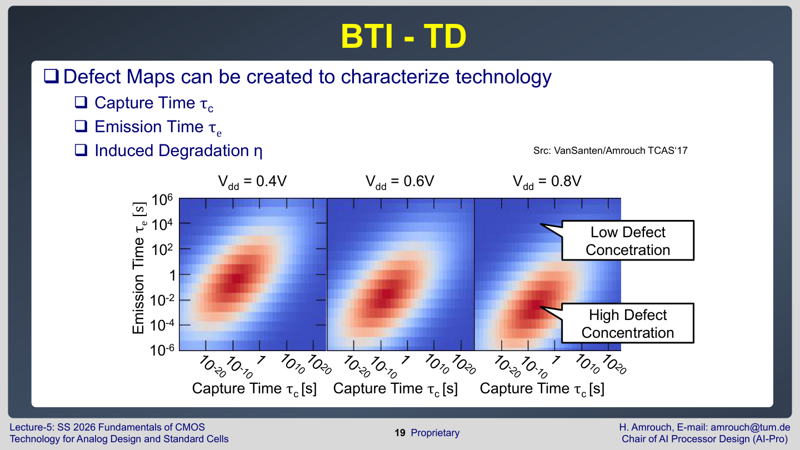

Defect map은 $\tau_{c}$, $\tau_{e}$, $\eta$의 분포를 통해 특정 technology의 defect 특성을 나타낸다.<font color="#ffc000"> 전압이 높아지면 capture/emission behavior와 degradation 분포가 달라질 수 있다</font>.

이 그림은 defect가 한 종류의 평균값으로만 존재하지 않는다는 점을 보여준다.

- 어떤 defect는 빨리 capture되고 빨리 emission된다.
- 어떤 defect는 천천히 capture되지만 한 번 잡으면 오래 유지된다.
- 어떤 defect는 작게 degradation을 만들고, 어떤 defect는 크게 만든다.
- $V_{DD}$<font color="#ffc000">가 바뀌면 어떤 defect들이 활성화되는지도 달라진다</font>.

이 관점은 reliability modeling에서 중요하다. 하나의 평균 $V_{th}$ shift만 보는 대신,<font color="#00b0f0"> defect population과 시간 상수를 통해 회복과 열화를 더 세밀하게 설명</font>할 수 있기 때문이다.

## HCI: Hot Carrier Induced Degradation의 기본 의미

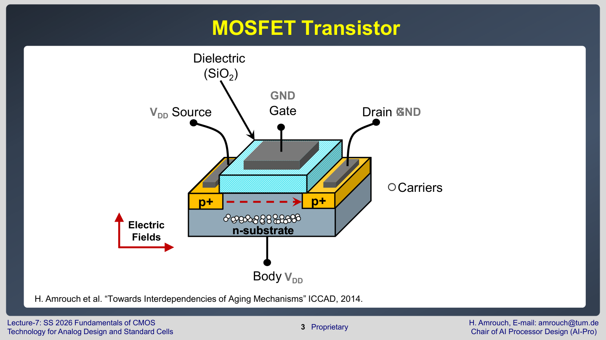

Lecture 7은 HCI를 다룬다.

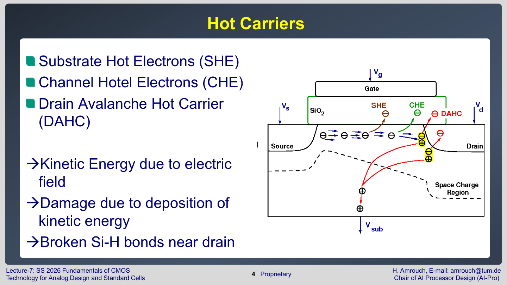

**HCI**는 <font color="#ffc000">carrier가 강한 electric field에서 큰 kinetic energy를 얻고, 그 에너지를 gate oxide/interface 근처에 전달해 defect를 만드는 현상</font>이다. 여기서 **hot**은 온도가 뜨겁다는 뜻이 아니라, carrier가 전기장 때문에 <font color="#00b0f0">높은 운동 에너지</font>를 가진다는 뜻이다.

강의는 hot carrier를 세 경우로 나눈다.

- <font color="#646a73">Substrate hot electrons</font>, **SHE**
- <font color="#646a73">Channel hot electrons</font>, **CHE**
- <font color="#646a73">Drain avalanche hot carrier</font>, **DAHC**

HCI 유발 단계를 정리하면 다음과 같다.

> 1. Transistor가 ON 상태가 되어 source에서 drain으로 carrier가 이동한다.
> 2. Drain 근처에는 전압 변화가 크기 때문에<font color="#ffc000"> lateral electric field가 강하다</font>.
> 3. Carrier는 이 electric field에서 가속되어 **큰 kinetic energy를 얻는다**.
> 4. 에너지가 큰 carrier가 oxide/interface 근처 원자 결합에 에너지를 전달한다.
> 5. <font color="#ffc000">Si-H bond가 끊어지거나 oxide/interface trap이 생긴다</font>.
> 6.<font color="#00b0f0"> 손상은 주로 drain 근처에 쌓인다</font>.
> 6. Drain 쪽 channel이 약해지고 $I_{ON}$, $g_{m}$, switching speed가 감소한다.

<font color="#00b0f0">실제 손상 위치는 주로 drain 근처</font>다. 이유는 <font color="#00b0f0">drain 쪽 electric field가 강해서 carrier가 가장 큰 에너지를 얻기 때문</font>이다. <font color="#e84d4d">BTI가 gate bias와 vertical field에 더 가까운 문제라면, HCI는 current가 흐르는 동안 drain 쪽 lateral field가 carrier를 세게 가속하는 문제</font>다.

FinFET에서도 HCI 위치는 여전히 drain 근처가 중요하다.

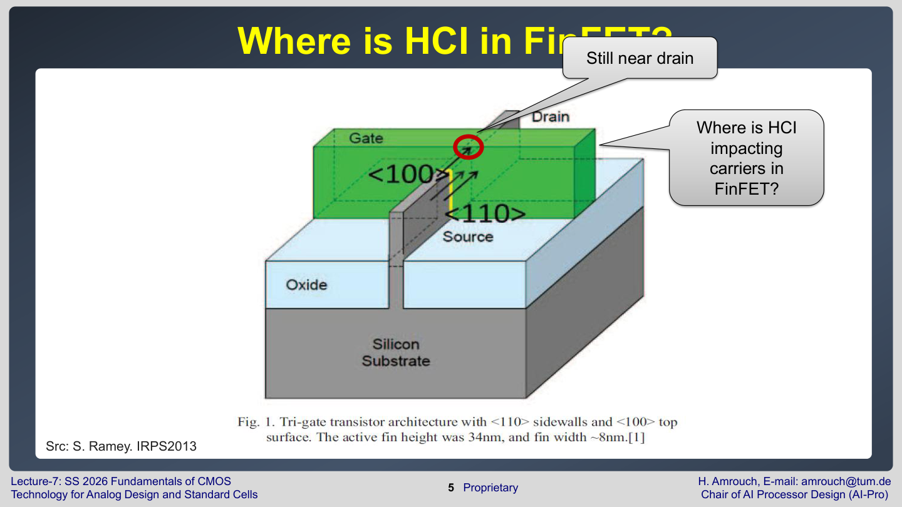

구조가 3차원으로 바뀌어도 carrier가 전기장에 의해 가속되고, drain 근처에서 interface/oxide defect를 만든다는 기본 원리는 유지된다.

HCI의 회로적 결과는 다음과 같다.

- $I_{ON}$<font color="#ffc000"> 감소</font>: ON 상태에서 흐르는 current가 줄어든다.
- $g_{m}$<font color="#ffc000"> 감소</font>: gate 전압 변화에 대한 current 반응이 약해진다.
- delay <font color="#ffc000">증가</font>: output capacitance를 충전/방전하는 시간이 길어진다.
- **path dependence**: drain 쪽 손상이므로 <font color="#00b0f0">어떤 input transition이 어느 transistor를 drain-stressed 상태로 만드는지가 중요</font>하다.
- **asymmetric degradation**: source/drain 방향과 bias 조건에 따라 <font color="#00b0f0">손상이 한쪽에 집중</font>될 수 있다.

## TDDB: gate dielectric이 뚫리는 고장

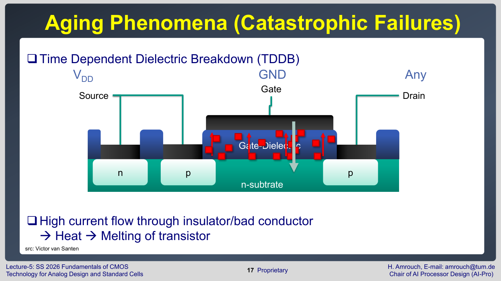

**TDDB**는 **Time Dependent Dielectric Breakdown**이다. 이름 그대로<font color="#ffc000"> gate dielectric이 전압 stress를 오래 받다가 결국 절연 기능을 잃는 현상</font>이다.

유발 단계는 다음과 같다.

>1. Gate와 channel 사이의 gate dielectric은 원래 전류가 거의 흐르지 않아야 하는 절연막이다.
>2. 하지만 **매우 얇은 dielectric**에 높은 <font color="#ffc000">전압이 오래 걸리면 내부에 작은 defect가 누적</font>된다.
>3. Defect들이 많아지면 <font color="#ffc000">dielectric 안에 전류가 흐를 수 있는 약한 경로가 생긴다</font>.
>4. 어느 순간 이 <font color="#e84d4d">경로가 gate에서 channel/substrate까지 연결</font>된다.
>5. 절연막을 통해 큰 leakage current가 흐른다.
>6. 전류가 흐르면서 <font color="#00b0f0">국소적으로 열이 발생</font>한다.
>7. <font color="#e84d4d">열 때문에 gate oxide와 주변 substrate가 손상되거나 녹는 수준의 파괴</font>가 일어난다.

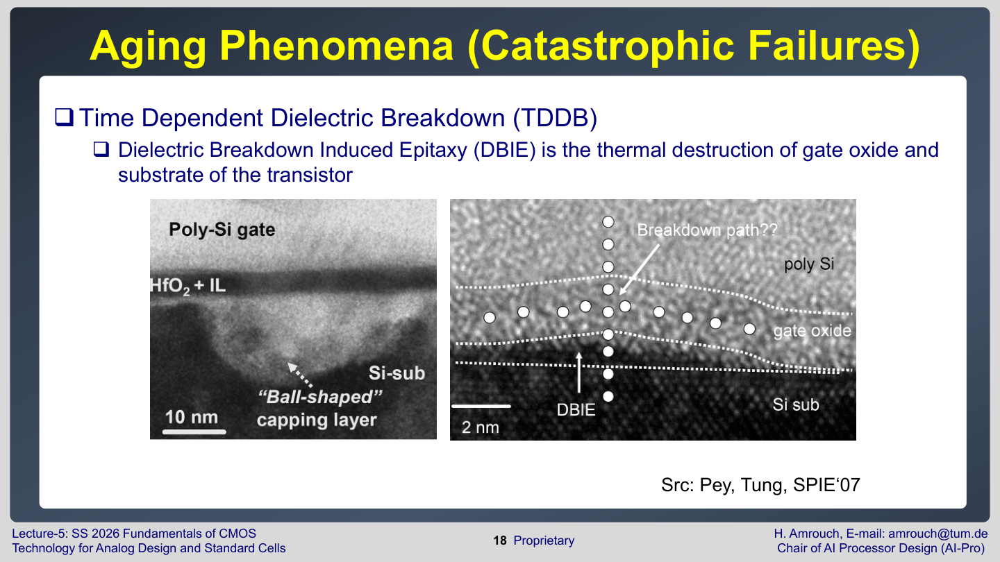

Lecture 5는 **DBIE**, <font color="#646a73">Dielectric Breakdown Induced Epitaxy</font>를 보여준다. 이는 <font color="#ffc000">gate oxide와 transistor substrate가 열적으로 파괴되는 현상</font>이다. TEM 이미지에서 breakdown path가 gate oxide를 관통하는 것처럼 보인다.

> Epitaxy : *Cristalline과 같은 결정 구조체가 성장하는 현상을 지칭*

TDDB의 결과는<font color="#ffc000"> 점진적 delay 증가가 아니라 transistor failure</font>다.

- Gate leakage가 급격히 증가한다.
- Gate가 channel을 정상적으로 제어하지 못한다.
- Transistor가 stuck-on, stuck-off, 과도한 leakage 같은 고장 상태가 될 수 있다.
- Logic gate나 memory cell이 영구적으로 잘못 동작할 수 있다.

따라서 TDDB는 guardband로 "조금 늦게" 만들 수는 있어도, <font color="#e84d4d">한 번 breakdown이 생기면 회로가 정상으로 돌아오지 않는다</font>.

## EM: metal interconnect가 이동하고 끊어지는 고장

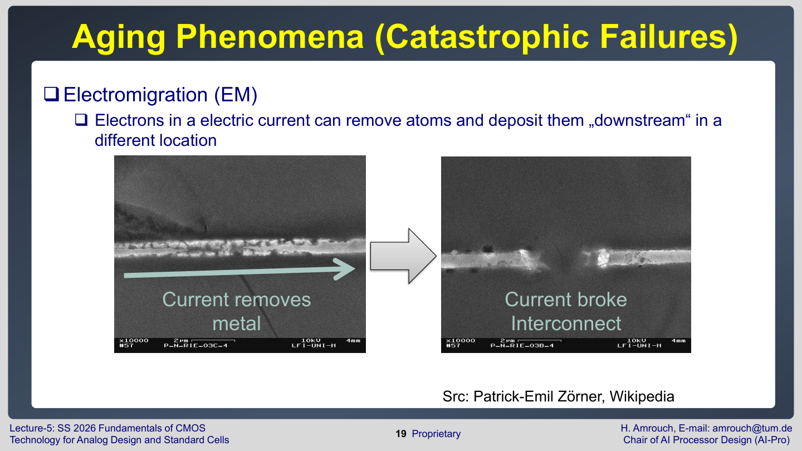

**EM**은 **Electromigration**이다. Transistor 내부 channel 문제가 아니라, <font color="#ffc000">metal interconnect에서 금속 원자가 이동하는 현상</font>이다.

유발 단계는 다음과 같다.

>1. Metal wire에 전류가 오래 흐른다.
>2. <font color="#ffc000">움직이는 electron들이 금속 원자에 운동량을 전달</font>한다.
>3. <font color="#e84d4d">금속 원자가 조금씩 current 방향을 따라 이동</font>한다.
>4. 어떤 위치에서는 <font color="#ffc000">금속 원자가 빠져나가 빈 공간</font>, 즉 **void**가 생긴다.
>5. 다른 위치에는 <font color="#ffc000">금속 원자가 쌓여 hillock 또는 돌출부</font>가 생길 수 있다.
>6. Void가 커지면 wire 저항이 증가한다.
>7. 더 진행되면<font color="#e84d4d"> interconnect가 끊겨 open failure</font>가 된다.
>8. <font color="#00b0f0">H</font><font color="#00b0f0">illock이 주변 선과 닿으면</font> **short failure**가 될 수 있다.

슬라이드의 현미경 이미지는 current가 metal을 제거하고, 결국 interconnect가 끊어진 모습을 보여준다. <font color="#00b0f0">이 고장은 transistor가 느려지는 문제가 아니라 회로 연결이 사라지는 문제</font>다.

EM은 특히 power rail, clock network, 좁고 긴 interconnect, 높은 current density가 흐르는 배선에서 중요하다. <font color="#ffc000">온도가 높으면 금속 원자가 더 쉽게 움직이므로 EM도 악화</font>된다.

## FinFET reliability 데이터의 해석

Lecture 7 후반부는 Intel 22 nm FinFET 관련 논문 데이터를 통해 전기장, TDDB, BTI, HCI, leakage를 비교한다.

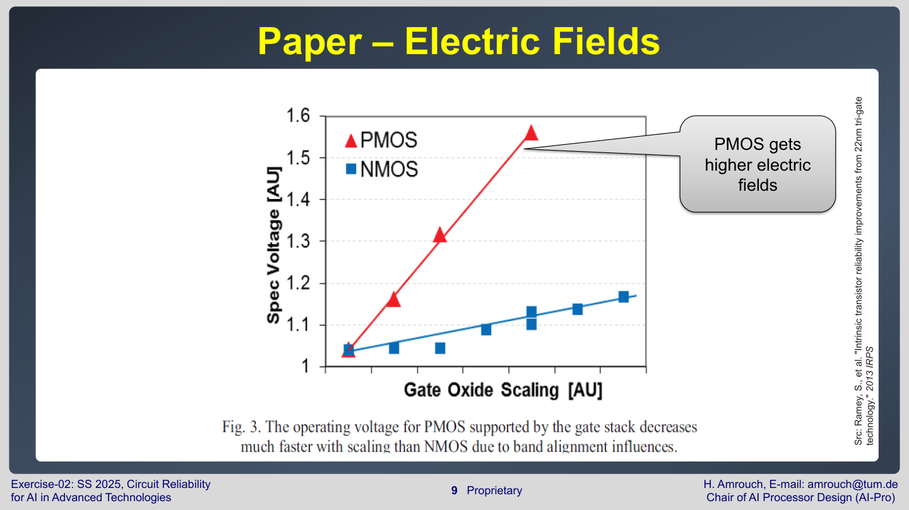

**PMOS**는 <font color="#e84d4d">scaling에 따라 더 높은 electric field를 받을 수 있다</font>. Electric field가 높으면 BTI, TDDB 같은 field-driven mechanism이 더 강해질 수 있다. 따라서<font color="#ffc000"> PMOS와 NMOS가 같은 공정 안에서도 같은 정도로 aging된다고 보면 안 된다</font>.

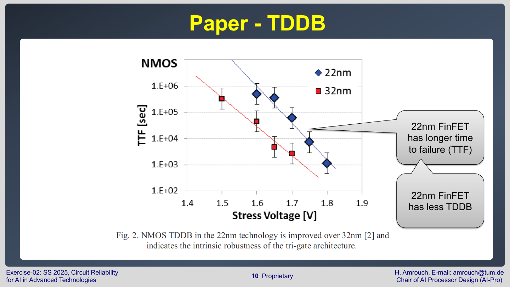

TDDB 데이터에서는 22 nm FinFET이 32 nm planar보다 longer time to failure, TTF를 보인다. 즉 해당 데이터에서는<font color="#00b0f0"> tri-gate 구조가 gate dielectric breakdown 측면에서 더 강한 intrinsic robustness를 보인다</font>고 해석된다.

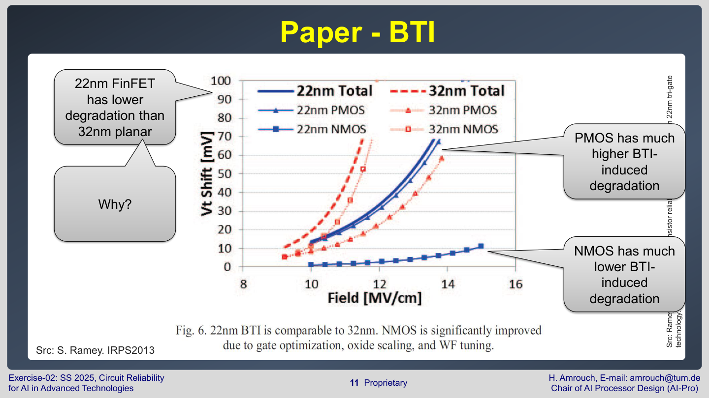

중요한 해석은 "<font color="#92d050">새 구조가 모든 reliability 항목을 항상 좋게 만들지는 않는다</font>"는 것이다.

- FinFET은 gate control이 좋아 leakage를 낮추고 scaling을 가능하게 한다.
- 하지만 fin geometry, local electric field, device type에 따라 PMOS/NMOS의 BTI/HCI sensitivity가 다르게 나타난다.
- <font color="#00b0f0">더 작은 fin은 같은 전압에서도 field와 defect 영향이 커져 degradation이 커질 수 있다</font>.
- <font color="#ffc000">초기 leakage가 낮아도 aging 후 leakage 증가 속도가 문제가 될 수 있다</font>.

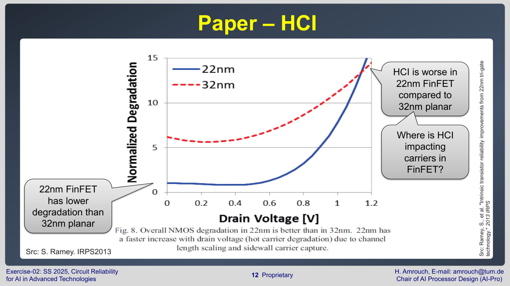

HCI 데이터는 더 미묘하다. 22 nm FinFET은 낮은 drain voltage 구간에서는 32 nm planar보다 degradation이 낮지만, <font color="#00b0f0">drain voltage가 높아지면 degradation이 더 빠르게 증가할 수 있다</font>. 슬라이드는 <font color="#ffc000">channel length scaling과 sidewall carrier capture 때문에 이런 경향이 생긴다</font>고 설명한다.

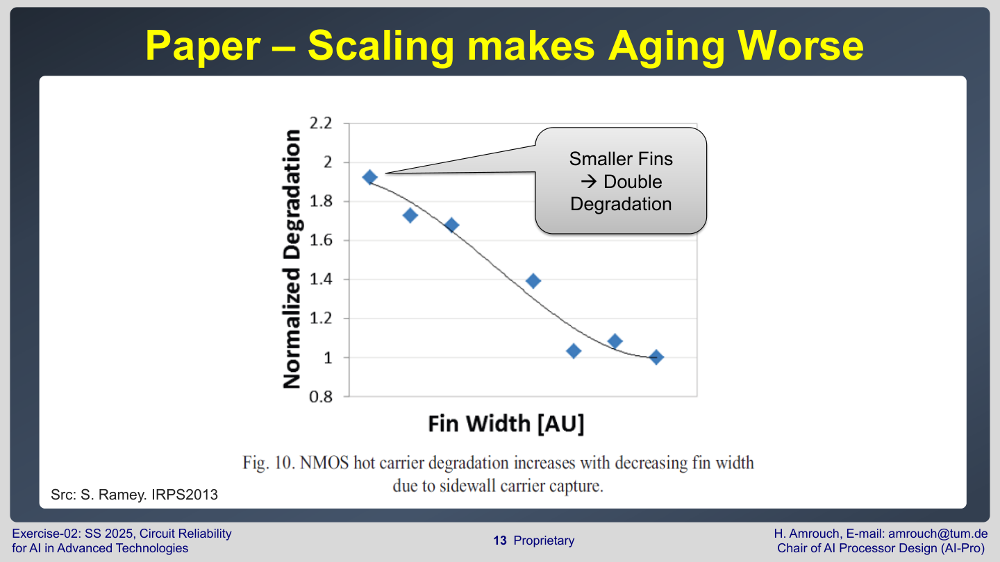

<font color="#ffc000">Fin width가 작아질수록 normalized degradation이 증가</font>한다. 슬라이드는 smaller fins가 degradation을 거의 두 배로 만들 수 있다고 보여준다. <font color="#e84d4d">작은 fin은 geometry가 작아져 surface/interface 영향이 커지고, sidewall 근처 carrier capture가 HCI에 더 민감</font>해질 수 있다.

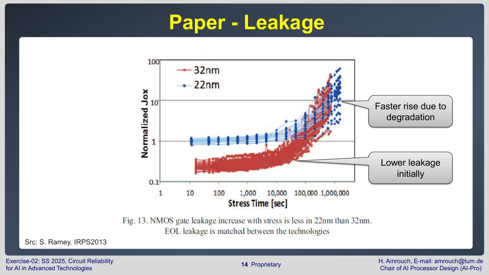

Leakage 데이터는 또 다른 trade-off를 보여준다. <font color="#ffc000">FinFET은 초기 leakage는 낮을 수 있지만, degradation 때문에 leakage가 더 빠르게 증가할 수 있다</font>. 즉 <font color="#00b0f0">"처음 leakage가 낮다"와 "오래 써도 leakage가 안정적이다"는 같은 말이 아니다.</font>

즉, technology scaling은 성능과 면적에는 유리하지만 reliability modeling은 더 어려워진다.

## 네 가지 aging mechanism 비교 정리

| Mechanism | 한 문장 설명                                                                                               | 주된 원인                                        | 주된 결과                                                                              | 설계 관점                                            |
| --------- | ----------------------------------------------------------------------------------------------------- | -------------------------------------------- | ---------------------------------------------------------------------------------- | ------------------------------------------------ |
| **BTI**   | gate bias와 온도 때문에 <font color="#ffc000">interface/oxide defect가 charge 상태</font>를 만들고 $V_{th}$를 shift | gate electric field, temperature, duty cycle | <font color="#e84d4d">weaker transistor</font>, delay 증가, 일부 recovery 가능           | input duty cycle과 cell path별 aging 고려            |
| **HCI**   | drain 근처 강한 <font color="#ffc000">electric field가 carrier를 가속해 defect</font>를 만든다                     | high drain voltage, current, switching       | <font color="#e84d4d">drain-side damage</font>, $I_{ON}$/$g_{m}$ 감소, delay 증가      | high-activity path와 drain-stressed transistor 확인 |
| **TDDB**  | <font color="#ffc000">gate dielectric</font>이 오래 stress를 받다가 <font color="#ffc000">전류 경로가 뚫린다</font>  | high oxide field, long stress, temperature   | gate leakage, <font color="#e84d4d">transistor breakdown</font>                    | guardband보다 lifetime/redundancy 관점 필요            |
| **EM**    | electron flow가 <font color="#ffc000">metal atom을 밀어 interconnect void/open</font>을 만든다                | high current density, temperature, time      | <font color="#e84d4d">interconnect open/short</font>, IR drop, clock/power failure | wire width, current limit, thermal design 필요     |

## 시험 대비 핵심

- Aging은 defect 때문에 $V_{th}$, $\mu$, $I_{ON}$, $I_{OFF}$, $g_{m}$, capacitance가 변하는 현상이다.
- **BTI와 HCI**는 transistor가 점점 약해지는 **점진적 열화**이고, **TDDB와 EM**은 물리 연결이 망가지는 **파국적 고장**이다.
- <font color="#ffc000">Aging은 voltage, temperature, duty cycle, time에 의해 강해진다</font>. 단, BTI는 gate field, HCI는 drain field/current, TDDB는 oxide field, EM은 interconnect current density에 특히 민감하다.
- **BTI의 두 관점**은<font color="#ffc000"> reaction-diffusion</font>과 <font color="#ffc000">trapping/detrapping</font>이다.
- Reaction-diffusion 관점에서 interface trap은 Si-SiO2 interface의 broken Si-H bond와 연결되고, oxide trap은 dielectric 내부 oxygen vacancy와 연결된다.
- Trapping/detrapping 관점에서는 제조 후 존재하던 neutral defect가 carrier를 capture하면 degradation이 생기고, emission하면 일부 recovery가 일어난다.
- HCI는 강한 drain electric field에서 carrier가 kinetic energy를 얻어 drain 근처 Si-H bond와 interface/oxide를 손상시키는 현상이다.
- TDDB는 gate dielectric에 defect가 누적되다가 전류 path가 생겨 절연막이 breakdown되는 현상이다.
- EM은 metal interconnect에서 electron flow가 금속 원자를 이동시켜 void, hillock, open/short failure를 만드는 현상이다.
- FinFET/nanosheet로 scaling해도 reliability 문제가 사라지지 않고, geometry와 field 때문에 새롭게 재평가해야 한다.

## 포함 범위

- Lecture 5: pages 3-29
- Lecture 6: pages 3-20
- Lecture 7: pages 3-14
