# 04. SPICE/HSPICE 실습: 이론을 측정값으로 바꾸기

## 이 장의 위치

이 장은 Exercise 1, Exercise 2, Exercise 3을 정리한다. 실습의 목적은 HSPICE 사용법 자체를 외우는 것이 아니라, MOSFET 이론을 실제 측정값으로 확인하는 것이다.

실습 흐름은 다음과 같다.

```text
netlist 작성 -> transistor/modelcard 연결 -> DC 또는 transient simulation -> .print/.measure로 값 추출 -> 그래프와 표로 해석
```

## SPICE란 무엇인가

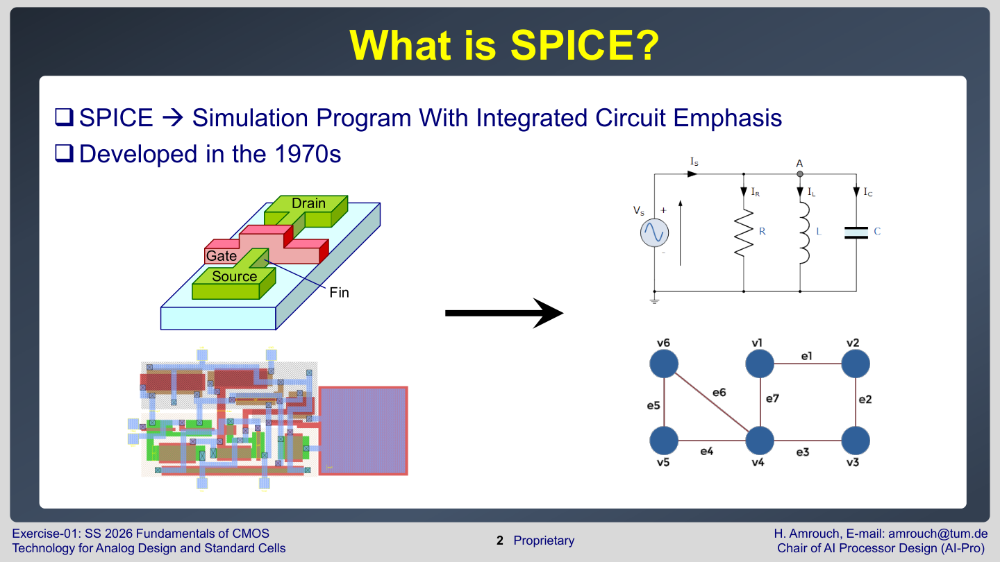

SPICE는 Simulation Program with Integrated Circuit Emphasis의 약자다. 회로를 node와 element의 연결로 보고, Kirchhoff law와 각 소자의 전류-전압 관계를 만족하는 방정식 시스템을 푼다.

가장 기본적인 관점은 다음이다.

- node voltage는 미지수다.
- resistor, capacitor, voltage source, transistor는 node 사이의 관계식을 만든다.
- Kirchhoff current law에 따라 각 node로 들어오고 나가는 current의 합이 맞아야 한다.
- **DC simulation**은 <font color="#ffc000">시간 변화가 없는 operating point 또는 sweep을 푼다</font>.
- **Transient simulation**은 <font color="#ffc000">capacitance와 시간 변화까지 포함</font>해 푼다.

Exercise 1은 회로를 linear equation으로 설명하지만,<font color="#00b0f0"> MOSFET은 실제로 비선형 소자</font>다. 그래서 SPICE는 반복 계산을 통해 nonlinear equation을 푼다.

## BSIM-CMG와 modelcard

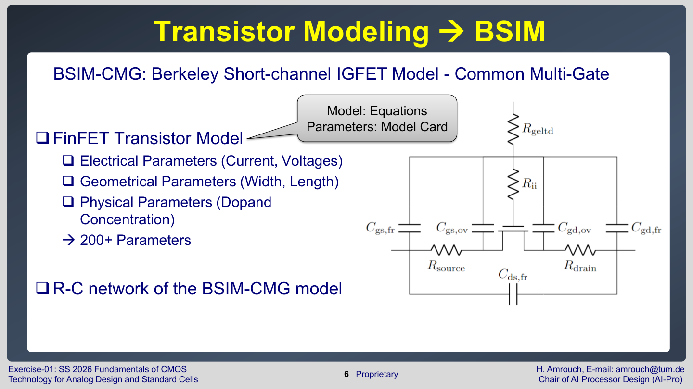

실습은 FinFET transistor model인 BSIM-CMG를 사용한다. **모델카드**는 <font color="#ffc000">transistor의 전기적, 기하학적, 물리적 parameter를 담은 파일</font>이다. 슬라이드에서는 200개 이상의 parameter가 있다고 설명한다.

예시는 다음과 같은 형태다.

```spice
.model nmos_rvt nmos level = 72
+version = 110
+bulkmod = 1
+igcmod = 1
```

- `.model`: 새 transistor model을 정의한다.
- `nmos_rvt`: model 이름이다.
- `nmos`: NMOS model임을 뜻한다.
- `level = 72`: BSIM-CMG 계열의 compact model level을 뜻한다.
- 나머지 parameter는 leakage, geometry, parasitic, reliability model 등을 켜거나 조정한다.

학습할 때 modelcard의 모든 parameter를 외울 필요는 없다. 중요한 것은 "SPICE의 MOSFET은 단순한 교과서 수식 하나가 아니라, 공정과 구조를 반영한 compact model로 계산된다"는 점이다.

## Netlist의 기본 구조

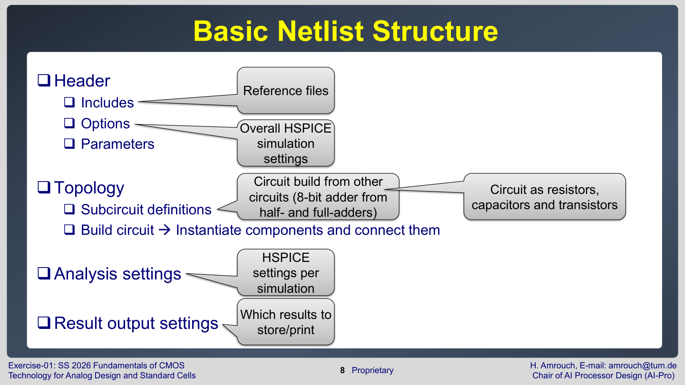

Exercise 1은 netlist를 다음 구조로 나눈다.

1. Header
2. Includes
3. Options
4. Parameters
5. Topology
6. Subcircuit definitions
7. Analysis and result commands

예시는 다음과 같다.

```spice
* The first line is always a comment
.include "7nm_modelcard.pm"

.option post ingold=2 lis_new
.param voltage_supply = 0.7

v_supply VDD 0 dc=voltage_supply
v_gnd    VSS 0 dc=0.0
```

SPICE에서 첫 글자는 element type을 나타낸다.

| 첫 글자 | 소자 | 예 |
| --- | --- | --- |
| $V$ | voltage source | `v_supply VDD 0 dc=0.7` |
| $R$ | resistor | `r_top TOP INTER r=RES` |
| $C$ | capacitor | `c_load DRAIN 0 c=2f` |
| $M$ | MOSFET | `m_nfinfet DRAIN GATE VSS VSS nmos_rvt` |
| $X$ | subcircuit instance | `x_cell A B VDD VSS ZN NAND_X2` |

MOSFET instance의 일반적인 node 순서는 <font color="#ffc000">Drain Gate Source Bulk</font>이다.

```spice
m_nfinfet DRAIN GATE VSS VSS nmos_rvt nfin=n_fin_parameter
```

이 줄은 drain node가 `DRAIN`, gate node가 `GATE`, source와 body가 $V_{SS}$에 연결된 NMOS FinFET을 만든다는 뜻이다. $n_{fin}$은 FinFET의 fin 개수 parameter다.

## Subcircuit 사용

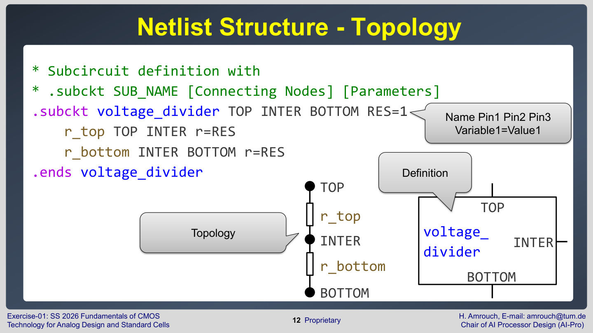

Subcircuit은 작은 회로 블록을 이름 붙여 재사용하는 방법이다.

```spice
.subckt voltage_divider TOP INTER BOTTOM RES=1
r_top TOP INTER r=RES
r_bottom INTER BOTTOM r=RES
.ends voltage_divider
```

사용할 때는 $X$로 시작하는 instance를 만든다.

```spice
x_volt_div VDD intermediate_2 VSS voltage_divider RES=2
```

표준셀 실습에서 NAND cell도 같은 방식으로 정의된다. Subcircuit을 쓰면 transistor 단위 회로를 cell 단위로 구조화할 수 있다.

## DC simulation: ID-VG curve, ION, IOFF

Exercise 2의 Task 1은 FinFET transistor를 DC sweep으로 분석한다.

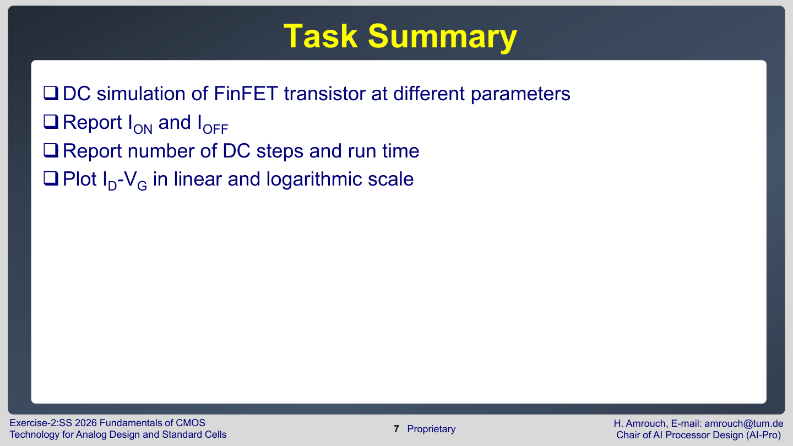

목표는 다음이다.

- gate voltage를 sweep해 $I_{D}-V_{G}$ curve를 얻는다.
- $I_{ON}$과 $I_{OFF}$를 보고한다.
- DC step 수와 runtime을 확인한다.
- linear scale과 logarithmic scale로 plot한다.

대표 netlist 구조는 다음과 같다.

```spice
.include "7nm_modelcard.pm"
.option post ingold=2 lis_new measform=3

.param voltage_supply = 0.9
+ n_fin_parameter = 1

v_gate  GATE  0 dc=voltage_supply
v_drain DRAIN 0 dc=voltage_supply
v_gnd   VSS   0 dc=0.0

m_nfinfet DRAIN GATE VSS VSS nmos_rvt nfin=n_fin_parameter
```

전류를 출력할 때는 voltage source를 통해 흐르는 current를 읽는다.

```spice
.dc v_gate START=0 STOP=voltage_supply STEP=dc_steps SWEEP DATA=sweep_params
.print dc i(v_gnd)
.MEASURE DC IOFF FIND I(v_gnd) WHEN v(GATE)=0
```

왜 `i(v_gnd)`를 읽는가? SPICE에서 <font color="#00b0f0">current는 특정 node의 current가 아니라 element를 통과하는 current로 정의되는 경우가 많다</font>. 그래서 ground에 연결된 voltage source를 하나 두고, <font color="#ffc000">그 source를 통과하는 current를 읽으면 transistor current를 측정</font>할 수 있다.

## Parameter sweep

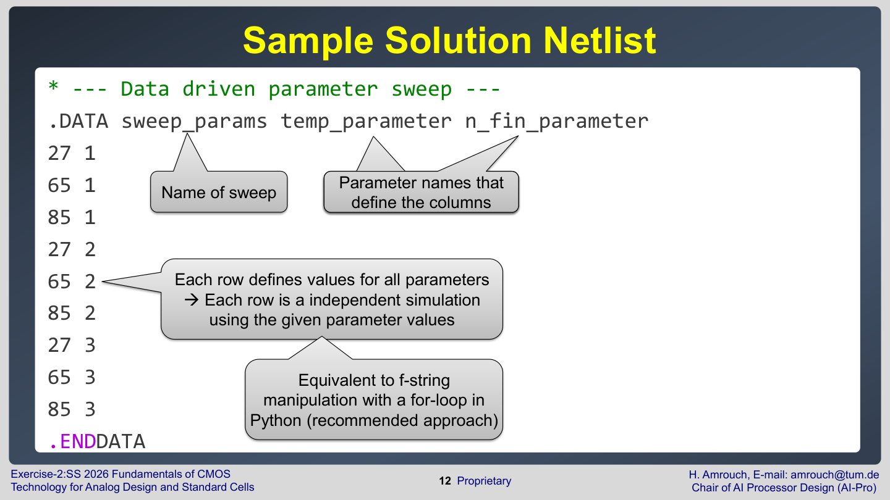

Exercise 2는 `.DATA`를 이용해 temperature와 fin 개수를 함께 sweep한다.

```spice
.DATA sweep_params temp_parameter n_fin_parameter
27 1
65 1
85 1
27 2
65 2
.ENDDATA
```

이 실험은 Lecture 2-4의 이론과 직접 연결된다.

- fin 개수가 늘면 channel이 병렬로 늘어나 $I_{ON}$이 거의 비례해서 증가한다.
- temperature가 올라가면 mobility 감소 때문에 ON current가 줄고, leakage는 증가한다.
- log plot은 작은 $I_{OFF}$ 변화를 보기에 좋고, linear plot은 큰 $I_{ON}$ 차이를 보기에 좋다.

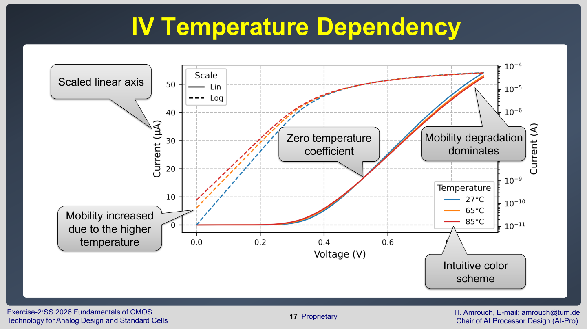

그래프를 해석할 때는 다음을 보면 된다.

1. 같은 $V_{GS}$에서 temperature가 높을 때 current가 어떻게 변하는가?
2. 낮은 $V_{GS}$ 영역의 leakage가 얼마나 커지는가?
3. 높은 $V_{GS}$ 영역의 ON current는 fin 개수에 따라 몇 배 정도 변하는가?

## Simulator metric 확인

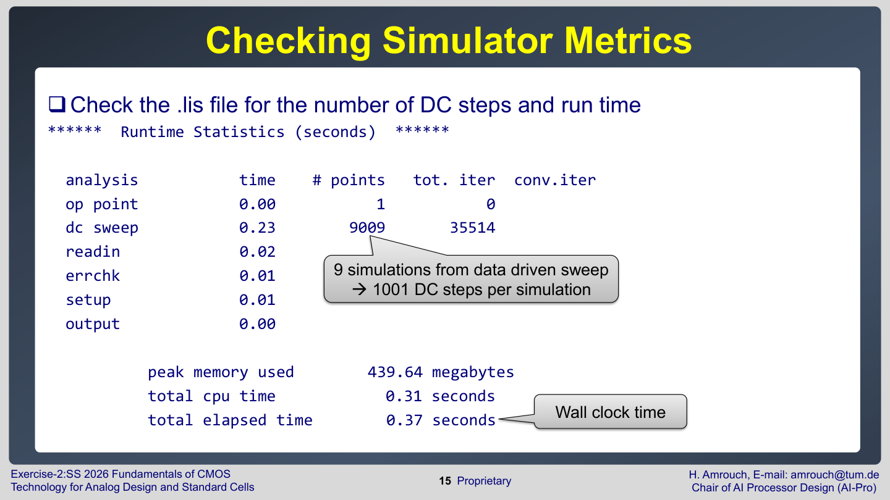

`.lis` 파일에는 runtime statistics가 들어 있다. 여기서 DC sweep point 수, iteration 수, simulation time을 확인할 수 있다. 과제에서 step 수와 runtime을 요구하는 이유는 결과값만 보는 것이 아니라, sweep 설정이 simulation cost에 어떤 영향을 주는지도 이해하라는 뜻이다.

## Transient simulation

Transient simulation은 시간에 따라 voltage/current가 어떻게 변하는지 계산한다.

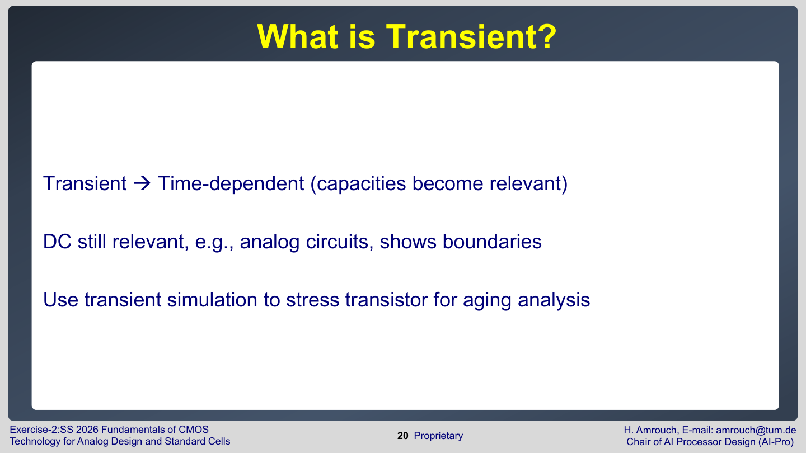

**DC simulation**은 $I_{D}-V_{G}$ curve처럼<font color="#00b0f0"> 정적인 특성</font>을 보기 좋다. **Transient simulation**은 input pulse, load capacitance, delay, switching energy, aging stress처럼 <font color="#00b0f0">시간 의존적인 현상을 보기 위해</font> 필요하다.

대표 구조는 다음과 같다.

```spice
v_gate GATE 0 PULSE (
+ voltage_low voltage_high
+ initial_delay rise_fall_time rise_fall_time
+ on_time period
+)

c_load DRAIN 0 c=300f
m_pfinfet DRAIN GATE VDD VDD pmos_rvt nfin=n_fin_parameter
m_nfinfet DRAIN GATE VSS VSS nmos_rvt nfin=n_fin_parameter

.tran tran_step tran_length
```

Pulse source는 input waveform을 만든다. Load capacitor는 다음 gate나 wire가 만드는 capacitance를 단순화한 것이다.

## MOSRA aging simulation

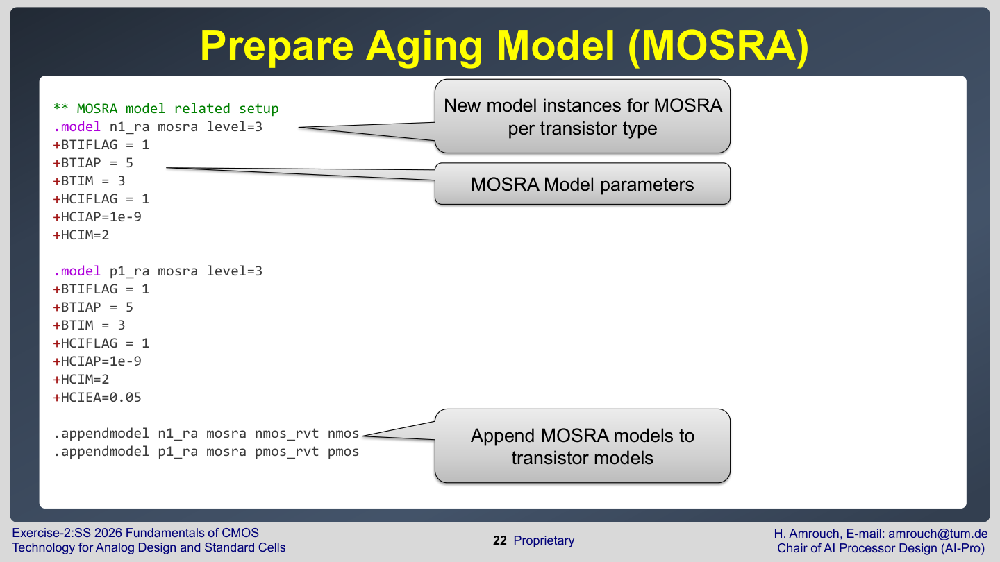

Exercise 2와 3은 MOSRA model을 이용해 aging을 분석한다.

```spice
.model n1_ra mosra level=3
+BTIFLAG = 1
+BTIAP = 5
+BTIM = 3
+HCIFLAG = 1
+HCIAP = 1e-9

.mosra reltotaltime=mosra_expol_t relstep=mosra_rel_step
```

- `BTIFLAG`: BTI aging model을 켠다.
- `HCIFLAG`: HCI aging model을 켠다.
- `reltotaltime`: 실제 transient 길이보다 훨씬 긴 aging time으로 extrapolate하는 설정이다.
- `relstep`: aging 계산을 어떤 시간 간격으로 업데이트할지 정한다.

이 실습은 Lecture 5-7의 aging 이론을 수치화한다. 전압, 온도, duty cycle, 시간이 바뀌면 `.radeg` 파일에 나타나는 $\Delta V_{th}$와 delay가 달라진다.

## Delay 측정

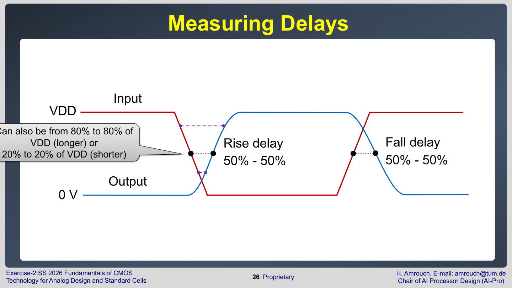

**Propagation delay**는 <font color="#00b0f0">보통 input이 50% 지점을 지나는 순간부터 output이 50% 지점을 지나는 순간까지의 시간</font>으로 정의한다. 실습에서는 rise delay와 fall delay를 구분한다.

HSPICE의 `.measure`는 trigger와 target을 이용한다.

```spice
.measure tran discharge_time
+ trig V(GATE) VAL='voltage_supply/2' RISE=1
+ targ V(DRAIN) VAL='0.1*voltage_supply' FALL=1
```

- `trig`: 측정을 시작하는 조건
- `targ`: 측정을 끝내는 조건
- `RISE=1`: 첫 번째 rising edge
- `FALL=1`: 첫 번째 falling edge

실제 과제에서는 50%-50% propagation delay와 10%/90% transition completion time을 구분해야 한다. 어떤 기준을 쓰는지는 문제 statement와 `.measure` target voltage를 보고 판단한다.

## 출력 파일 해석

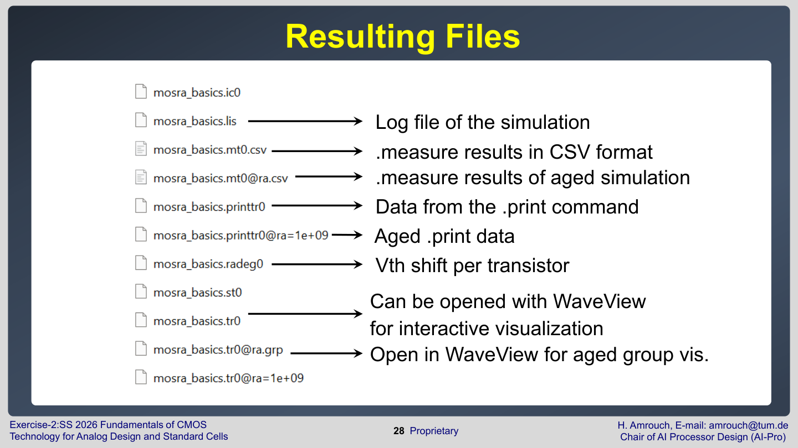

대표 출력 파일은 다음과 같다.

| 파일 | 의미 |
| --- | --- |
| `.lis` | simulation log, runtime, warning, measurement summary |
| `.sw0` | DC sweep waveform data |
| `.tr0` | transient waveform data |
| `.ms0`, `.mt0.csv` | `.measure` 결과 |
| `.radeg0` | aging degradation 결과 |
| `.printsw0`, `.printtr0` | `.print` 명령 출력 |

WaveView는 waveform을 시각적으로 확인하는 데 쓰지만, 과제 제출에서는 screenshot 대신 수치와 직접 만든 plot을 요구한다. 이는 결과가 재현 가능하고 축/단위/legend가 명확해야 하기 때문이다.

## Plotting과 programming 팁

Exercise 1의 plotting 팁은 결과를 어떻게 전달해야 하는지에 대한 기준이다.

- Linear plot과 log plot은 목적이 다르므로, $I_{ON}$과 $I_{OFF}$를 모두 보려면 둘 다 필요할 수 있다.
- 색, marker, line style은 서로 다른 sweep 조건을 구분하기 위해 일관되게 써야 한다.
- 축 label, 단위, legend, font size가 작으면 그래프가 맞아도 보고서 품질이 낮다.
- WaveView screenshot보다 CSV/print output을 이용해 직접 plot하는 것이 좋다.

Programming 팁은 세 단계 pipeline으로 정리된다.

```text
generator -> start simulations -> postprocess/plot
```

Generator는 netlist와 parameter sweep 파일을 만들고, simulation 단계는 HSPICE를 실행하며, postprocess 단계는 `.lis`, `.mt*.csv`, `.print*` 파일을 읽어 표와 그래프를 만든다. 이 구조를 쓰면 temperature, fin count, duty cycle, aging year처럼 조건이 늘어나도 실수를 줄일 수 있다.

## Exercise 3: aging task의 의미

Exercise 3은 inverter aging을 정량화한다.

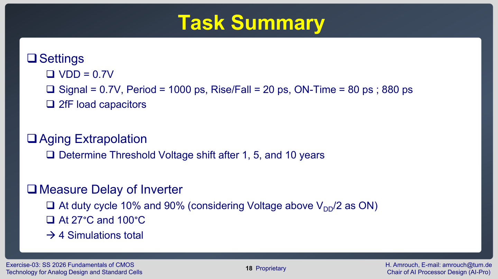

설정의 핵심은 다음이다.

- $V_{DD}=0.7\,\mathrm{V}$
- input signal period와 high time을 바꿔 duty cycle을 만든다.
- load capacitance는 $2\,\mathrm{fF}$이다.
- aging extrapolation time은 1년, 5년, 10년이다.
- threshold voltage shift와 inverter delay를 측정한다.

**Duty cycle**은 <font color="#ffc000">transistor가 stress 상태에 머무는 비율</font>이다. PMOS와 NMOS는 input 상태에 따라 stress를 받는 시간이 다르므로, input high time이 바뀌면 PMOS/NMOS의 aging 정도도 달라진다.

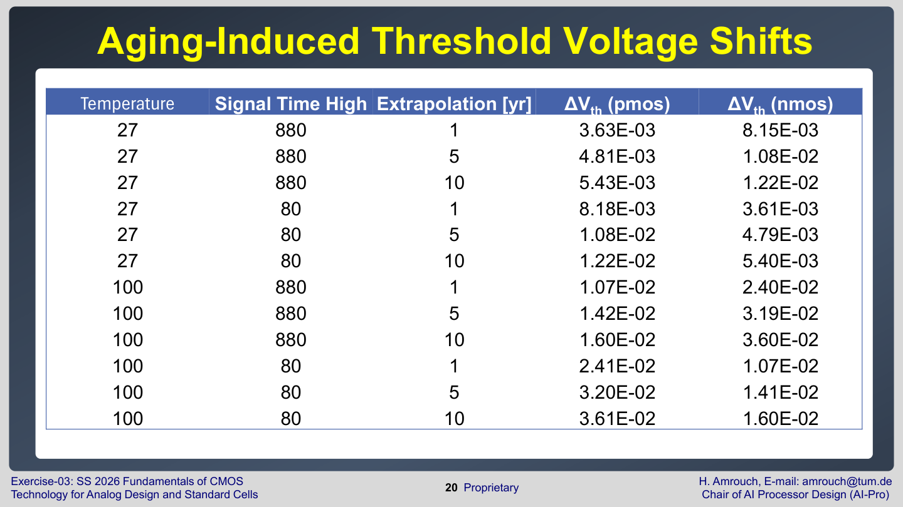

$\Delta V_{th}$가 커지면 transistor가 약해지고 delay가 변한다. 결과 table을 읽을 때는 temperature, duty cycle, extrapolation year가 각각 어떤 방향으로 $\Delta V_{th}$와 delay를 키우는지 보면 된다.

## Aging model: empirical vs physical

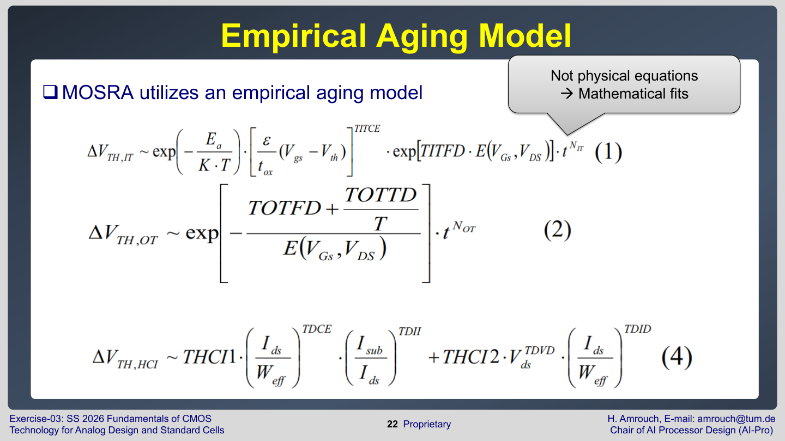

Exercise 3은 **MOSRA**가<font color="#00b0f0"> empirical aging model을 사용</font>한다고 설명한다. <font color="#00b0f0">Empirical model은 물리 법칙에서 모든 항을 직접 유도한 것이 아니라, 측정 데이터에 잘 맞도록 만든 mathematical fit</font>이다.

반대로 **physical aging model**은 interface trap, oxide trap, hole trap처럼<font color="#ffc000"> defect type별 물리 현상을 분리해 differential equation으로 표현</font>하려고 한다.

시험에서 중요한 구분은 다음이다.

- **Empirical model**: 빠르고 실용적이며 circuit simulation에 쓰기 좋지만, <font color="#ffc000">parameter의 물리적 의미가 제한적</font>일 수 있다.
- **Physical model**: 각 parameter가 물리 현상과 더 직접 연결되지만, <font color="#ffc000">복잡하고 계산 비용이 크다</font>.

Exercise 3의 모델 분류는 조금 더 세분화된다.

- Interface trap differential equation은 physical equation으로 제시되며, parameter가 물리량에 대응한다.
- Oxide trap differential equation은 mathematical fit 성격이 강하다고 설명된다.
- Hole trap differential equation은 일부는 물리적이고 일부는 fitting 성격을 가진다.

따라서 "aging model"이라고 해도 모든 항이 같은 수준으로 물리적인 것은 아니다. 어떤 항은 실제 defect generation을 나타내고, 어떤 항은 측정 곡선을 맞추기 위한 compact 표현이다.

## 실습 결과를 이론과 연결하는 법

| 실습 측정 | 연결되는 이론 | 해석 |
| --- | --- | --- |
| $I_{D}-V_{G}$ curve | channel formation, $V_{th}$, subthreshold slope | gate voltage가 current를 어떻게 켜는가 |
| $I_{ON}$ | drive current, delay | 회로가 capacitance를 얼마나 빨리 충전/방전하는가 |
| $I_{OFF}$ | leakage power | 꺼진 상태에서 static power가 얼마나 생기는가 |
| temperature sweep | mobility, $V_{th}$, leakage | 온도가 current와 power를 어떻게 바꾸는가 |
| fin sweep | FinFET discrete sizing | fin 수가 drive strength를 어떻게 키우는가 |
| transient delay | load capacitance, propagation delay | switching 속도를 어떻게 측정하는가 |
| `.radeg`, $\Delta V_{th}$ | BTI/HCI aging | 시간이 지날수록 transistor parameter가 얼마나 변하는가 |

## 시험 대비 핵심

- SPICE는 회로를 node equation으로 풀고, MOSFET은 BSIM-CMG 같은 compact model로 계산한다.
- Netlist는 include, option, parameter, element, subcircuit, analysis, output command로 나뉜다.
- MOSFET instance의 node 순서는 보통 Drain Gate Source Bulk이다.
- DC sweep은 $I_{D}-V_{G}$, $I_{ON}$, $I_{OFF}$, temperature/fin dependency를 확인하는 데 쓴다.
- Transient simulation은 delay, switching waveform, aging stress를 확인하는 데 쓴다.
- `.measure`는 trigger와 target 조건으로 delay나 current integral을 자동 계산한다.
- MOSRA는 BTI/HCI aging을 circuit simulation에 넣기 위한 reliability model이다.
- `.radeg`와 `.mt*.csv` 결과는 aging에 따른 $\Delta V_{th}$와 delay 변화를 읽는 핵심 파일이다.

## 포함 범위

- Exercise 1: pages 2-21
- Exercise 2: pages 7-33
- Exercise 3: pages 3-26
