# 05. 표준셀 설계와 라이브러리

## 이 장의 위치

이 장은 Lecture 8과 Exercise 4의 앞부분을 정리한다. Lecture 8은 표준셀이 무엇인지, 논리 게이트와 latch/flip-flop이 어떻게 회로 블록이 되는지, 그리고 synthesis와 standard cell library가 어떻게 연결되는지 설명한다.

핵심은 다음이다:
> 큰 디지털 칩은 transistor를 매번 직접 그려서 만들지 않고, <font color="#ffc000">미리 검증된 standard cell을 격자 위에 배치</font>해 만든다.

## Standard cell이란 무엇인가

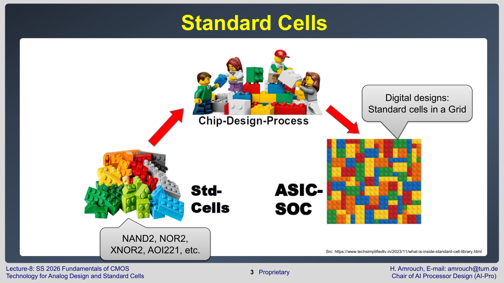

**Standard cell**은 <font color="#ffc000">일정한 높이와 layout rule을 가진 작은 회로 블록</font>이다. NAND2, NOR2, XNOR2, AOI221 같은 논리 기능이 cell로 제공된다. 큰 디지털 회로는 이 cell들을 row와 grid 위에 배치하고 metal interconnect로 연결해 만든다.

표준셀의 장점은 다음과 같다.

- 같은 cell을 <font color="#ffc000">여러 회로에서 재사용</font>할 수 있다.
- 각 cell의 delay, power, area를 <font color="#ffc000">미리 characterization</font>할 수 있다.
- logic synthesis와 place-and-route tool이 자동으로 다룰 수 있다.
- 최신 FinFET/nanosheet 공정의 <font color="#00b0f0">복잡한 layout rule을 cell library 안에 감출 수 있다</font>.

## 물리적 standard cell

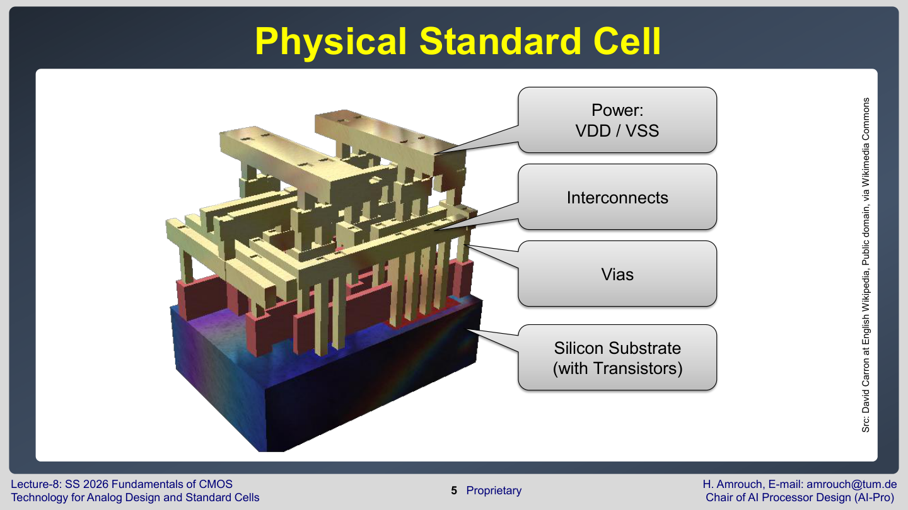

물리적 cell에는 다음 요소가 들어간다.

- VDD/VSS **power rail**
- NMOS/PMOS transistor가 놓이는 **silicon substrate 영역**
- gate/contact/metal **interconnect**
- **via**
- **cell boundary**와 routing track

<font color="#ffc000">Cell 높이는 보통 metal track 수와 power rail 위치에 의해 정해진다</font>. 최신 공정에서는 fin grid, contacted poly pitch, metal pitch가 강하게 제한되므로, standard cell layout은 매우 규칙적이다.

## Boolean logic gate

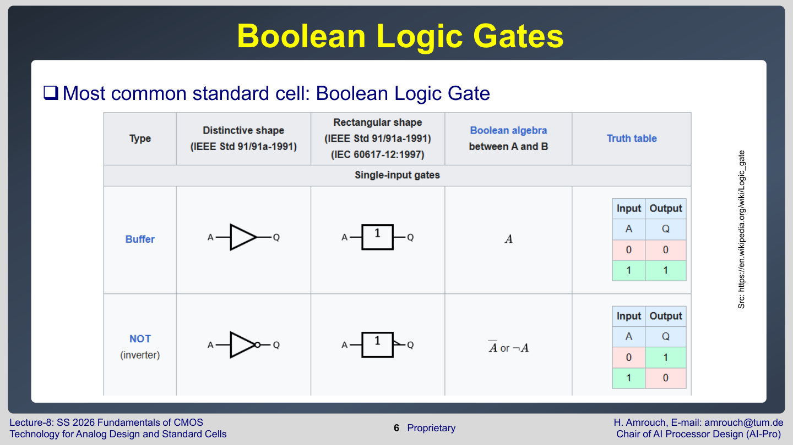

가장 흔한 standard cell은 Boolean logic gate이다. AND, OR, NOT, NAND, NOR, XOR, XNOR 같은 gate가 기본이다.

Lecture 8은 AND/OR, NAND/NOR, universal cell을 순서대로 설명한다.

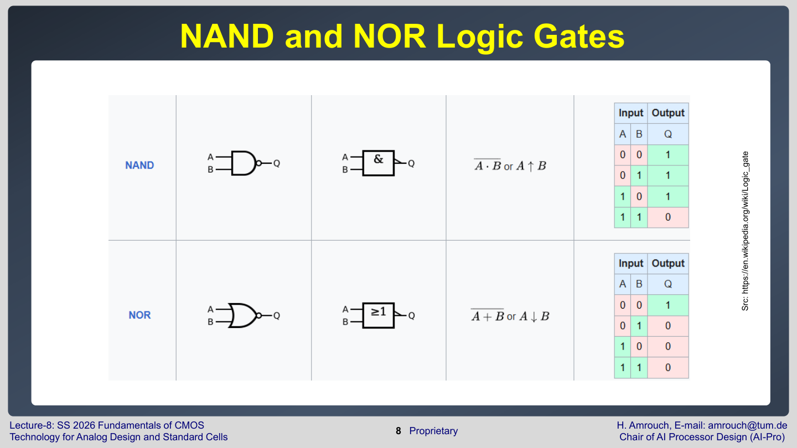

**NAND와 NOR**가 <font color="#ffc000">중요한 이유는 universal gate이기 때문</font>이다. NAND만으로도 모든 Boolean function을 만들 수 있고, NOR만으로도 모든 Boolean function을 만들 수 있다. 실제 CMOS에서는 NAND/NOR가 transistor-level 구현도 비교적 효율적이라 기본 cell로 자주 쓰인다.

## Structural cell

Lecture 8은 logic cell 외의 standard cell도 소개한다.

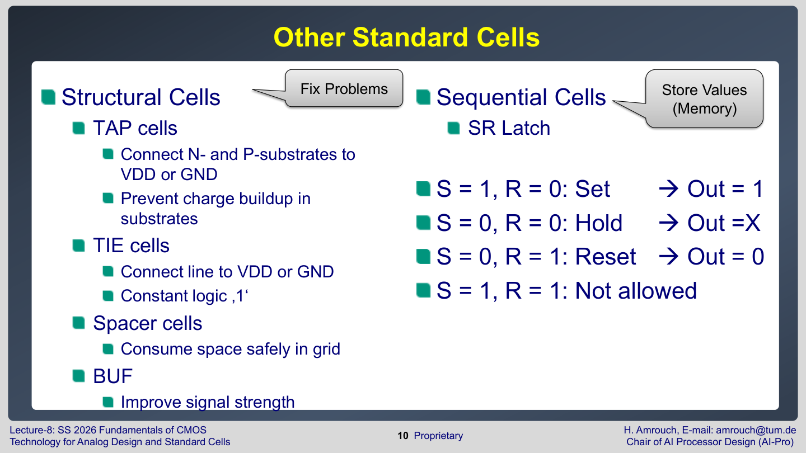

| Cell                   | 역할                                                                                  |
| ---------------------- | ----------------------------------------------------------------------------------- |
| **TAP** cell           | N/P substrate 또는 well을 VDD/GND에 연결해 <font color="#ffc000">body 전위를 안정화</font>       |
| **TIE** cell           | <font color="#ffc000">항</font><font color="#ffc000">상 logic 1 또는 logic 0</font>을 제공 |
| **Spacer/Filler** cell | cell row의 <font color="#ffc000">빈 공간을 design rule에 맞게 </font>채움                     |

TAP cell은 charge buildup을 막고 substrate/well potential을 안정화한다. TIE cell은 gate를 직접 VDD나 GND에 묶는 대신, 공정과 reliability rule을 만족하는 방식으로 상수 신호를 제공한다. Spacer cell은 단순한 빈칸이 아니라 physical design rule을 만족시키는 안전한 채움 cell이다.

## Latch와 flip-flop

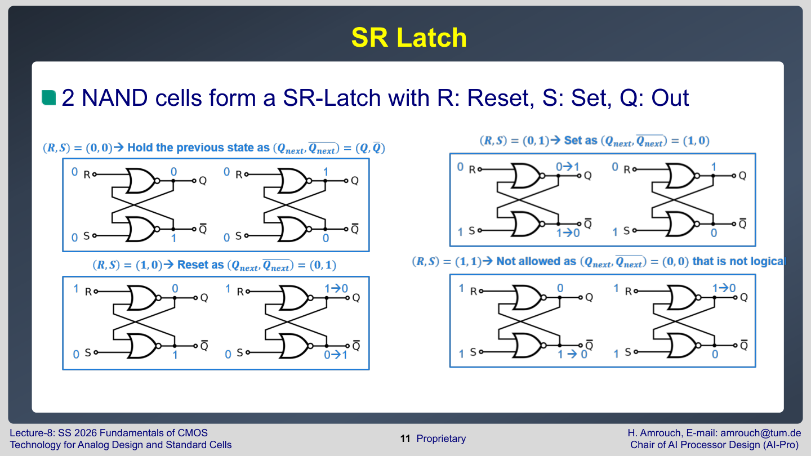

SR latch는 두 NAND cell을 feedback으로 연결해 만든다. $S$는 set, $R$은 reset, $Q$는 저장된 출력이다. Latch는 현재 입력만 계산하는 조합회로와 달리, 이전 상태를 기억한다.

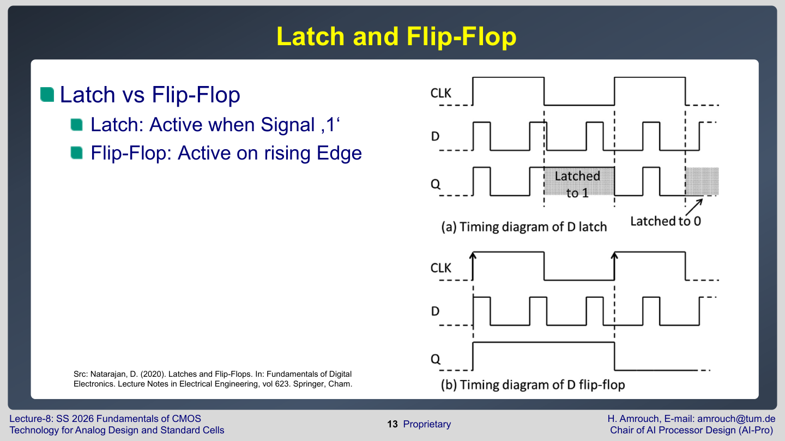

Latch와 flip-flop의 차이는 timing이다.

- **Latch**: <font color="#ffc000">enable signal이 활성 상태인 동안 입력이 출력으로 전달</font>될 수 있다.
- **Flip-flop**: clock edge, 예를 들어 rising <font color="#ffc000">edge에서만 값을 저장</font>한다.

디지털 회로에서 latch와 flip-flop은 temporary data storage, synchronization, power efficiency를 위해 쓰인다. <font color="#00b0f0">중간 결과가 의도치 않게 계속 전파되는 것을 막고, clock 기준으로 상태를 정렬</font>한다.

## Fan-out과 drive strength

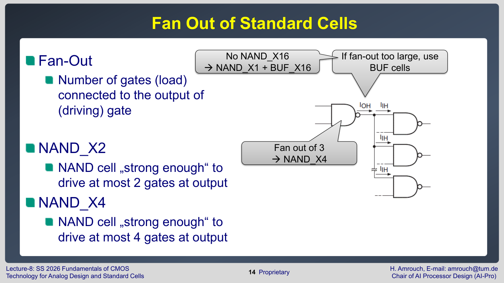

**Fan-out**은 <font color="#00b0f0">한 cell의 output이 몇 개의 다음 gate input을 구동하는지</font>를 뜻한다. <font color="#ffc000">Output에 연결된 gate가 많을수록 load capacitance가 커지고, 같은 I_ON으로 더 큰 capacitance를 충전</font>해야 하므로 <font color="#e84d4d">delay가 증가</font>한다.

Standard cell 이름의 $X2$, $X4$ 같은<font color="#ffc000"> suffix는 drive strength</font>를 나타낸다.

- $\mathrm{NAND}_{X2}$: 최대 fan-out 2 정도를 목표로 한 상대적으로 약한 cell
- $\mathrm{NAND}_{X4}$: 더 큰 transistor 또는 더 많은 fin으로 더 큰 load를 구동하는 cell

Drive strength를 키우면 delay는 줄일 수 있지만, cell area와 input capacitance, dynamic power가 커질 수 있다. 그래서 synthesis는 timing requirement와 power/area cost 사이에서 cell strength를 선택한다.

## Input 수와 complex cell

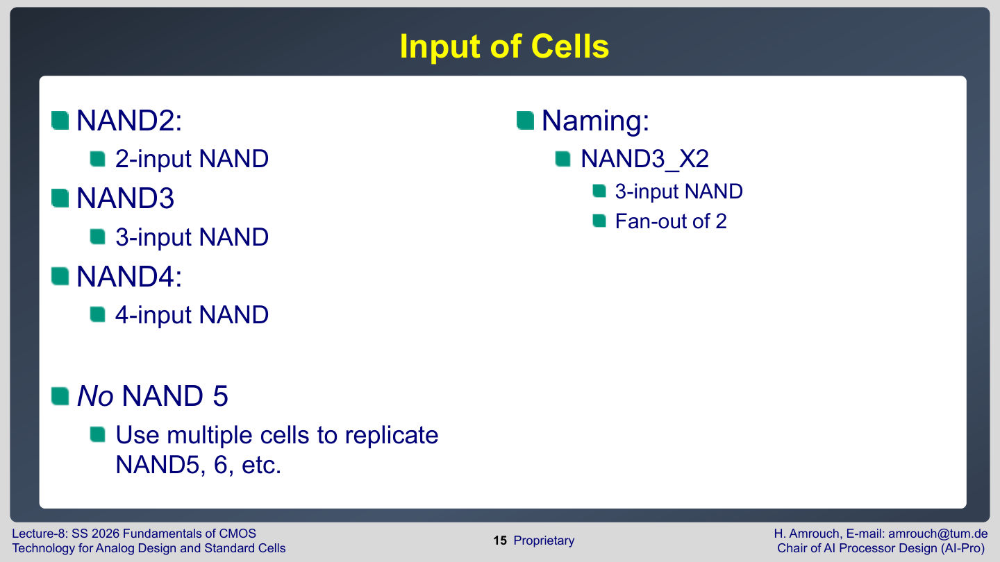

$\mathrm{NAND2}$, $\mathrm{NAND3}$, $\mathrm{NAND4}$는 <font color="#00b0f0">입력 개수가 2, 3, 4개인 NAND cell</font>이다. <font color="#ffc000">입력이 너무 많은 NAND를 하나로 만들면 series transistor가 길어져 delay가 커지고 layout도 어려워진다</font>. 그래서 $\mathrm{NAND5}$ 같은 큰 gate 대신 여러 cell을 조합하는 경우가 많다.

Complex cell은 여러 기본 gate를 transistor-level에서 합친 cell이다.

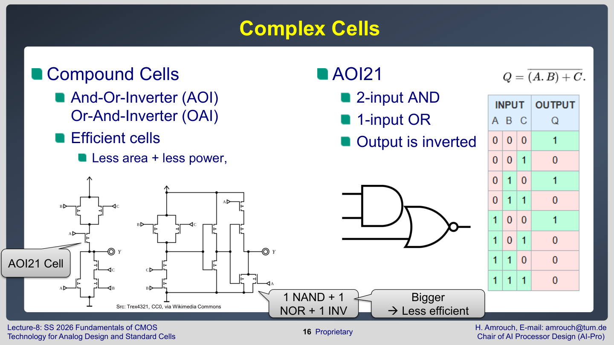

예를 들어 **AOI**는 <font color="#ffc000">AND-OR-Inverter</font>, **OAI**는 <font color="#ffc000">OR-AND-Inverter</font>이다. AOI21은 두 입력을 AND한 결과와 다른 한 입력을 OR한 뒤 inverter를 거친 형태다. 같은 논리를 NAND/INV 여러 개로 만들 수도 있지만, <font color="#00b0f0">complex cell 하나로 만들면 area와 power가 줄고 delay도 줄 수 있다</font>.

## Full adder와 cell 조합

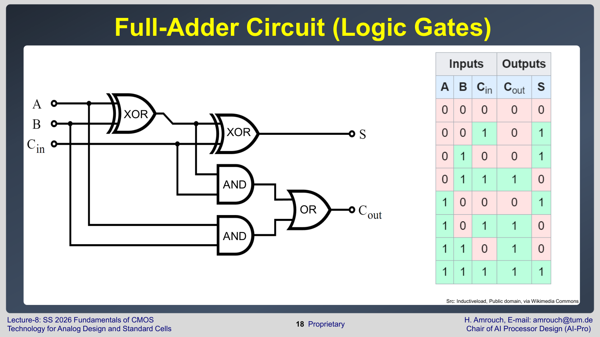

Full adder는 두 입력 $A$, $B$와 carry-in을 받아 sum과 carry-out을 만든다. 논리 게이트 수준에서는 XOR, AND, OR 같은 gate 조합으로 표현할 수 있다.

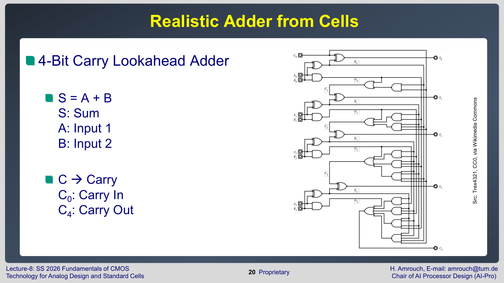

4-bit carry lookahead adder 같은 실제 회로는 여러 gate와 carry path로 구성된다. 이때 중요한 것은 기능만이 아니라 **path delay**다. Carry가 여러 bit를 지나야 하면 critical path가 길어질 수 있다. 그래서 synthesis와 timing analysis가 필요하다.

## Logic synthesis

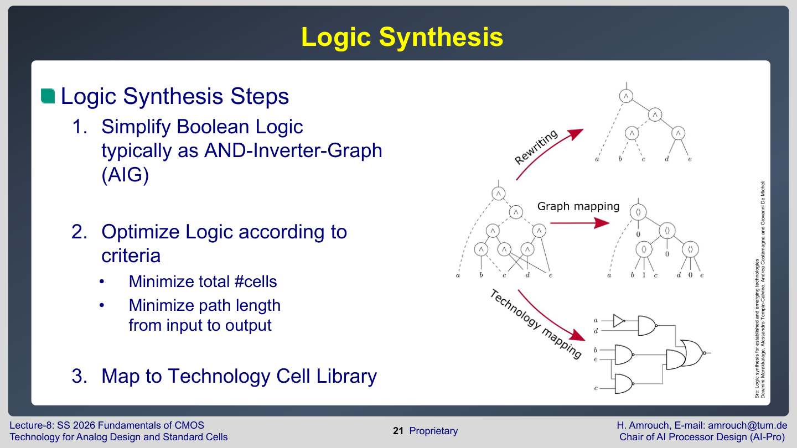

Logic synthesis는 RTL 또는 Boolean description을 standard cell network로 바꾸는 과정이다. Lecture 8의 단계는 다음과 같다.

1. Boolean logic을 단순화한다. 내부적으로 AND-Inverter Graph, AIG 같은 표현을 사용할 수 있다.
2. 기준에 맞게 logic을 최적화한다.
3. Standard cell library의 실제 cell로 mapping한다.

<font color="#ffc000">최적화 기준은 하나가 아니다</font>.

- 총 cell 수 최소화
- critical path 길이 최소화
- power 감소
- area 감소
- timing constraint 만족

같은 logic function도 2-input gate 위주로 만들지, 3-input gate나 complex cell을 쓸지에 따라 power와 delay가 달라진다.

## Static timing과 cell library

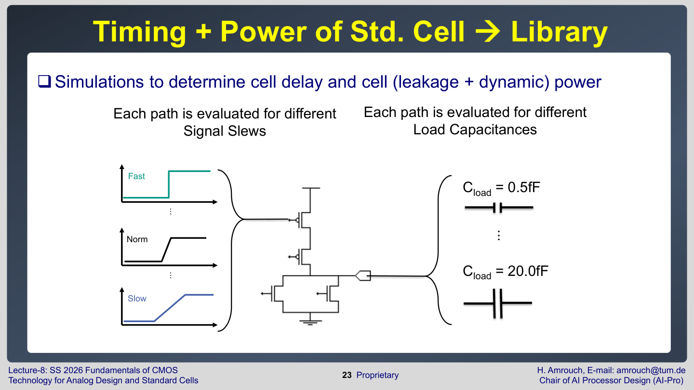

Standard cell은 delay와 power를 미리 simulation으로 측정해 library로 제공한다. <font color="#ffc000">Delay는 고정된 값 하나가 아니다</font>. 다음 조건에 따라 달라진다.

- input transition이 빠른지 느린지, 즉 signal slew
- output load capacitance가 작은지 큰지
- input pin에서 output pin까지의 path
- rising transition인지 falling transition인지
- process, voltage, temperature corner

예를 들어 같은 NAND cell도 $A_{1}\to ZN$, $A_{2}\to ZN$ path의 delay가 다를 수 있다. Output load가 크면 delay가 커지고, input slew가 느리면 short-circuit power와 delay가 커질 수 있다.

## Liberty file

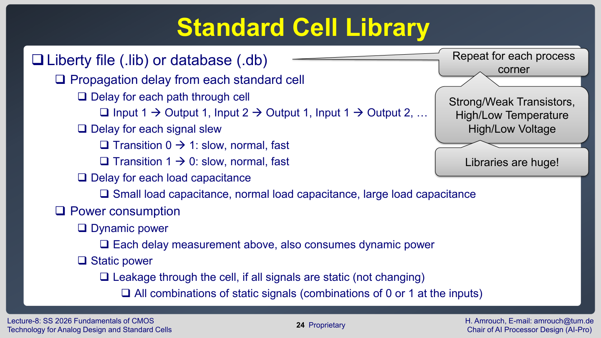

Standard cell library는 `.lib` 또는 `.db` 파일로 제공된다. Liberty file에는 다음 정보가 들어간다.

- 각 standard cell의 기능
- pin capacitance
- 각 input-output path의 propagation delay
- input slew와 output load에 따른 delay table
- rising/falling transition table
- leakage power
- dynamic/internal power

Synthesis와 place-and-route tool은 이 정보를 이용해 timing과 power를 예측한다. 따라서 standard cell characterization이 정확하지 않으면 chip-level timing closure도 틀어진다.

## Exercise 4: NAND cell subcircuit

Exercise 4는 NAND standard cell을 SPICE로 시뮬레이션한다.

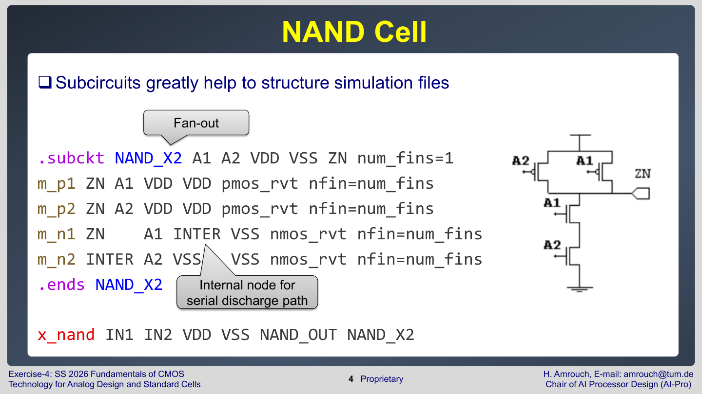

NAND_X2 subcircuit은 다음과 같은 구조다.

```spice
.subckt NAND_X2 A1 A2 VDD VSS ZN num_fins=1
m_p1 ZN    A1 VDD   VDD pmos_rvt nfin=num_fins
m_p2 ZN    A2 VDD   VDD pmos_rvt nfin=num_fins
m_n1 ZN    A1 INTER VSS nmos_rvt nfin=num_fins
m_n2 INTER A2 VSS   VSS nmos_rvt nfin=num_fins
.ends NAND_X2
```

PMOS 두 개는 병렬로 output을 VDD에 연결하고, NMOS 두 개는 직렬로 output을 VSS에 연결한다. 그래서 둘 다 $A_{1}=1$, $A_{2}=1$일 때만 output이 0이 되고, 그 외에는 output이 1이 된다. 이것이 NAND logic이다.

## Propagation delay 조건

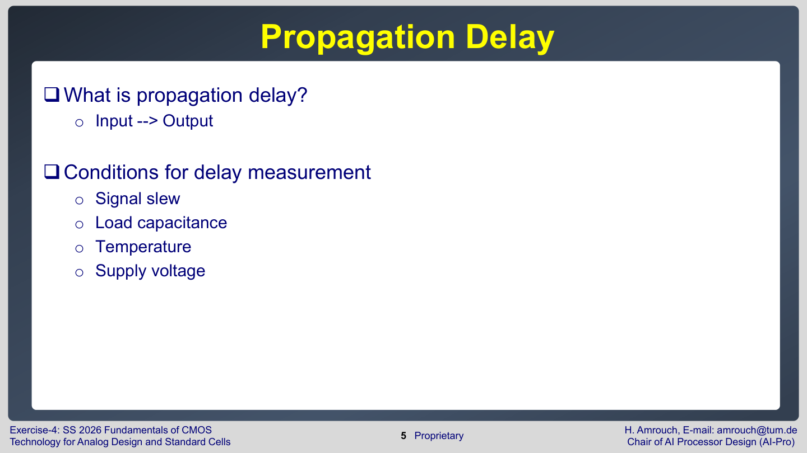

**Propagation delay**는 <font color="#ffc000">input 변화가 output 변화로 나타나는 데 걸리는 시간</font>이다. 하지만 delay는 측정 조건에 따라 달라진다.

- **signal slew**: input edge가 얼마나 빠른가
- **load capacitance**: output이 구동해야 하는 capacitance
- **temperature**: mobility와 leakage가 달라짐
- **supply voltage**: $I_{ON}$, dynamic power, aging stress가 달라짐

그래서 표준셀 library characterization은 <font color="#00b0f0">단일 delay 값을 저장하지 않고, slew/load table을 저장</font>한다.

## 표준셀 설계에서 기억할 것

```text
cell 기능 -> transistor topology -> layout grid -> characterization -> .lib -> synthesis/STA
```

표준셀은 단순한 논리기호가 아니다. 각 cell은 실제 transistor와 layout, parasitic, delay/power table을 가진 물리적 객체다. 이 관점이 Lecture 8의 핵심이다.

## 시험 대비 핵심

- Standard cell은 큰 디지털 회로를 구성하는 미리 설계/검증된 작은 cell이다.
- NAND/NOR는 universal gate라 모든 Boolean function을 만들 수 있다.
- TAP, TIE, spacer cell은 논리 기능보다 physical correctness를 위해 필요하다.
- Latch는 enable 동안 투명하고, flip-flop은 clock edge에서 값을 저장한다.
- Fan-out이 커지면 load capacitance가 커져 delay가 증가한다.
- $X2$, $X4$는 drive strength를 나타내며, 강한 cell은 더 큰 load를 구동하지만 area/power가 증가할 수 있다.
- Logic synthesis는 Boolean logic을 standard cell library에 맞춰 mapping하고, static timing analysis로 delay를 평가한다.
- `.lib`/`.db`에는 slew, load, path, transition별 delay와 power 정보가 들어간다.

## 포함 범위

- Lecture 8: pages 3-24
- Exercise 4: pages 3-5
