# 06. 표준셀 노화와 가드밴드

## 이 장의 위치

이 장은 Lecture 9와 Exercise 4의 power/guardband 부분을 정리한다. 앞 장에서 **standard cell**이 <font color="#00b0f0">delay/power table을 가진 설계 단위</font>임을 보았다. 이 장에서는 aging이 cell delay를 바꾸고, chip 설계가 이를 어떻게 guardband로 견디는지 설명한다.

핵심 질문은 다음이다.

*Transistor aging이 cell delay와 critical path timing에 어떤 영향을 주며, 이를 얼마나 여유 있게 설계해야 하는가?*

## Cell-level aging

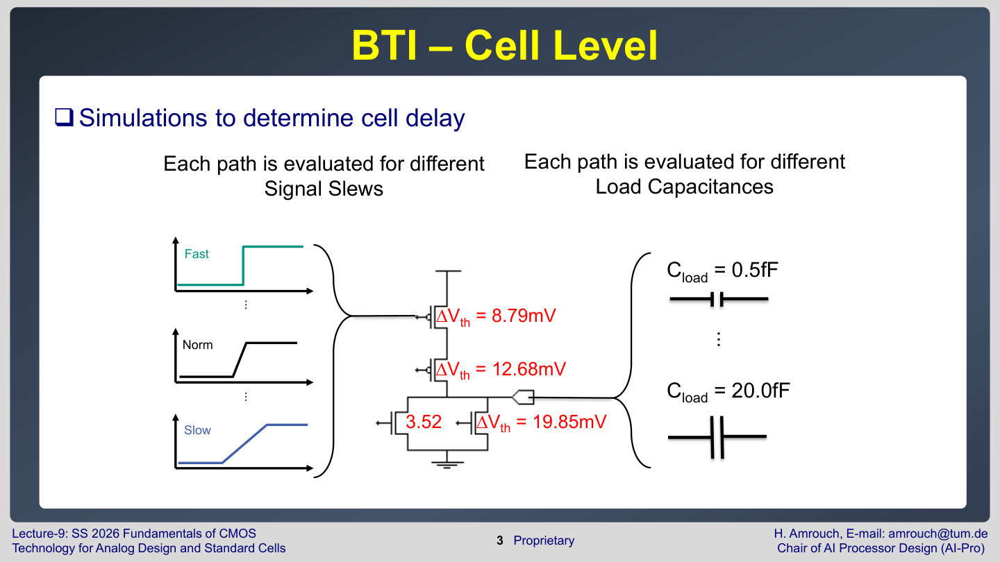

BTI는 transistor의 $\Delta V_{th}$를 만들고, 이것이 cell delay에 영향을 준다. 하지만 $\Delta V_{th}$<font color="#ffc000">가 같다고 모든 cell의 delay가 같은 비율로 느려지는 것은 아니다</font>.

이유는 <font color="#ffc000">cell마다 transistor topology, input pattern, load capacitance, input slew가 다르기 때문</font>이다.

- 같은 PMOS aging도 NAND와 NOR에서 delay 영향이 다르다.
- 같은 cell 안에서도 $A_{1}\to ZN$ path와 $A_{2}\to ZN$ path가 다를 수 있다.
- output load가 크면 작은 $I_{ON}$ 감소도 더 큰 delay 증가로 보일 수 있다.
- input slew가 느리면 short-circuit current와 internal delay가 달라진다.

## 같은 aging, 다른 gate delay

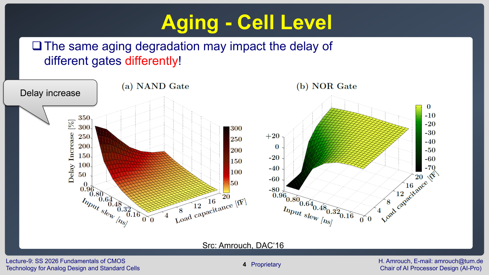

Lecture 9는 같은 **aging degradation**<font color="#ffc000">이 gate마다 다른 delay increase를 만든다</font>고 설명한다. 이는 standard cell library가 aged condition에서도 characterization되어야 하는 이유다.

단순히 "모든 transistor의 delay를 10% 늘린다"는 식으로는 정확하지 않다. <font color="#e84d4d">실제 delay 변화는 cell topology와 path에 따라 다르다</font>.

## Worst-case aging은 단순하지 않다

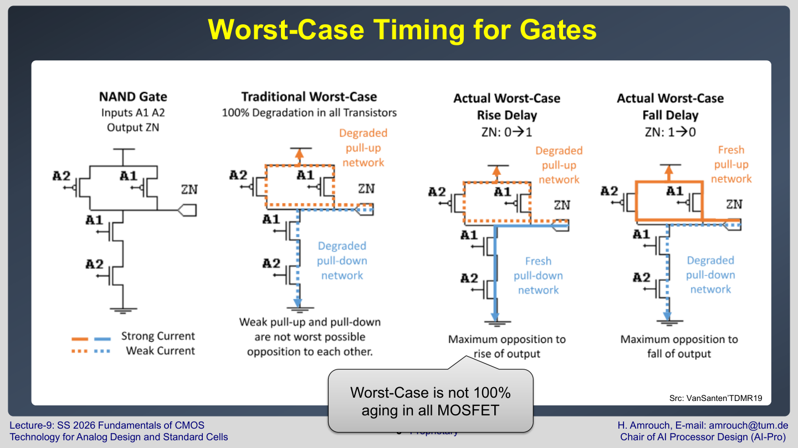

직관적으로는 모든 transistor가 100% aging되면 worst-case라고 생각하기 쉽다. 하지만 Lecture 9는 <font color="#e84d4d">worst-case timing for gates가 항상 "모든 MOSFET이 100% aged"인 것은 아니다</font>라고 말한다.

왜냐하면 어떤 transistor의 aging은 switching을 방해하지만, <font color="#ffc000">어떤 경우에는 반대로 opposing path가 약해져 output transition이 빨라질 수도 있기 때문</font>이다.

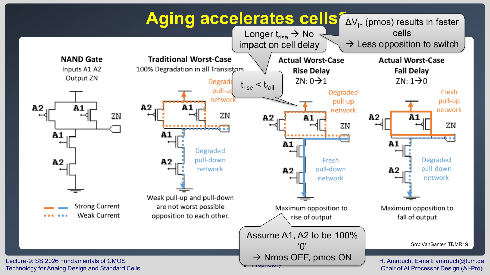

예를 들어 <font color="#00b0f0">특정 input condition에서 PMOS가 output transition에 반대 방향으로 작용하고 있었다면</font>, 그 <font color="#e84d4d">PMOS가 aging으로 약해지는 것이 해당 transition에는 delay를 줄이는 방향이 될 수 있다</font>. 따라서 cell aging 분석은 input vector와 transition direction까지 봐야 한다.

>CMOS에서는 PUN의 PMOS와 PDN의 NMOS의 **상보적 줄다리기로 균형**이 맞춰지는데
>- Aging의 정도 차이로 <font color="#ffc000">힘의 불균형이 더 클 수록 Delay가 더 큰 경우 발생</font>
>	- **Charge**: PUN의 PMOS가 100% 닳고, NMOS가 Fresh하면 충전 속도 제일 느림
>	- **Discharge**: PDN의 NMOS가 100% 닳고, PMOS가 Fresh하면 방전 속도 제일 느림

## Micro-architecture level aging

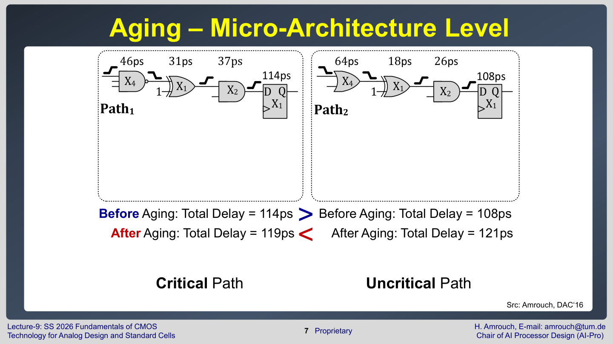

칩 수준에서는 <font color="#ffc000">모든 path가 같은 중요도를 갖지 않는다</font>.

- **Critical path**: clock period를 결정하는 가장 느린 path
- **Uncritical path**: 여유가 큰 path

Aging으로 <font color="#ffc000">모든 cell delay가 조금씩 변해도 critical path에 있는 cell이 느려지는 것이 가장 위험</font>하다. 반대로 uncritical path가 느려져도 timing slack이 충분하면 오류가 나지 않을 수 있다. 추가로 **기존엔 Critical Path가 아니던 경로**가, <font color="#e84d4d">Aging으로 특성이 늘어지면서 새로운 Critical Path가 되기도 함</font>.

그래서 **aging-aware design**은 <font color="#00b0f0">transistor-level defect만 보지 않고, gate-level path와 micro-architecture 구조까지 봐야 한다</font>.

## Adder 예시

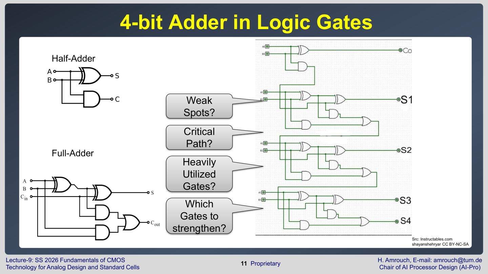

Lecture 9는 4-bit adder를 예로 든다. **Adder**에서는<font color="#00b0f0"> carry path가 critical path가 되기 쉽다</font>.<font color="#ffc000"> LSB 쪽 gate는 switching activity가 높을 수 있고, carry를 전달하는 OR/AND gate는 load와 sensitivity가 클 수 있다</font>.

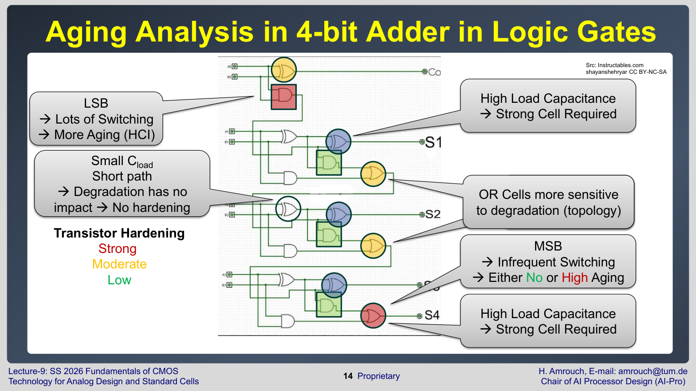

강의가 강조하는 요소는 다음이다.

- Critical path에 있는 gate가 aging되면 timing violation 위험이 커진다.
- **Load capacitance가 큰 output**에는<font color="#ffc000"> 더 강한 cell</font>이 필요하다.
- **Switching이 많은 gate**는<font color="#e84d4d"> HCI와 dynamic stress가 커질 수 있다</font>.
- OR cell처럼 **특정 topology**가<font color="#ffc000"> degradation에 더 민감</font>할 수 있다.

따라서 aging analysis는 "<font color="#00b0f0">어느 gate가 많이 늙는가</font>"와 "<font color="#00b0f0">어느 gate가 늙으면 timing에 치명적인가</font>"를 **동시에 봐야 한다**.

## 왜 자동화가 필요한가

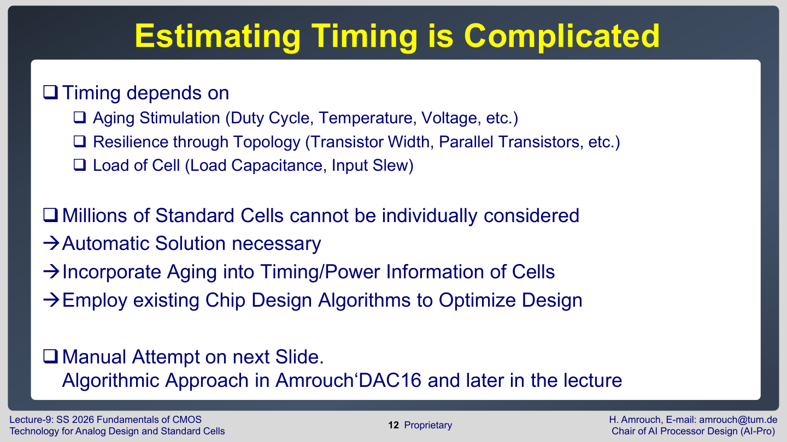

Timing은 다음 요인에 의존한다.

- Aging stimulation: duty cycle, temperature, voltage, time
- Topology resilience: transistor width, parallel transistor, stack 구조
- Cell load: load capacitance
- Input slew
- Standard cell path

현대 칩에는 수백만 개 이상의 standard cell이 있으므로 사람이 모든 cell을 하나씩 분석할 수 없다. 따라서 <font color="#ffc000">aging을 delay/power library에 반영</font>하고, <font color="#ffc000">기존 static timing analysis와 optimization tool이 이를 사용하도록 만들어야 한다</font>.

## Guardband란 무엇인가

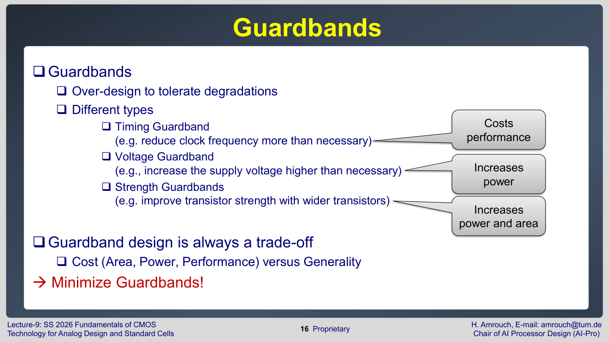

**Guardband**는 <font color="#ffc000">degradation을 견디기 위해 의도적으로 여유를 두는 설계</font>다. 즉, <font color="#00b0f0">처음부터 필요한 것보다 조금 더 안전하게 설계해 시간이 지나도 오류가 나지 않게 한다</font>.

Lecture 9의 guardband 종류는 다음과 같다.

| Guardband              | 방법                                                           | 비용                    |
| ---------------------- | ------------------------------------------------------------ | --------------------- |
| **Timing guardband**   | clock <font color="#ffc000">period를 더 길게 잡음                  | 성능 감소        </font>  |
| **Voltage guardband**  | 필요한 것보다<font color="#ffc000"> 높은 전압 </font>$V_{DD}$로 동작      | 전력/온도/aging stress 증가 |
| **Strength guardband** | transistor를 <font color="#ffc000">더 크게 하거나 강한 cell</font> 사용 | area/power 증가         |

Guardband는 항상 trade-off다. 너무 작으면 aging 후 오류가 나고, 너무 크면 성능이나 전력을 낭비한다.

## Efficient guardband

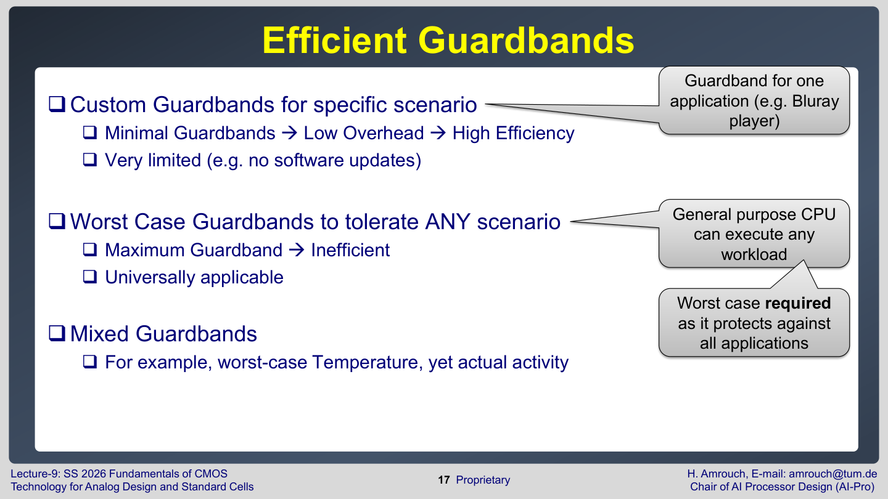

Guardband 전략은 크게 세 가지다.

- **Custom** guardband: <font color="#ffc000">특정 scenario에 맞춘 최소 여유</font>. overhead가 낮지만 범용성이 낮다.
- **Worst-case** guardband: <font color="#ffc000">어떤 scenario도 견디도록 큰 여유</font>. 안전하지만 비효율적이다.
- **Mixed** guardband: 예를 들어 temperature는 worst-case로 두고, activity는 실제 application 기반으로 잡는 방식이다.

시험에서 중요한 점은 "<font color="#00b0f0">최소 guardband가 항상 좋은 것은 아니다</font>"이다. 제품이 어떤 workload와 환경에서 쓰이는지 모르면 너무 작은 guardband는 위험하다.

## Catastrophic failure와 redundancy

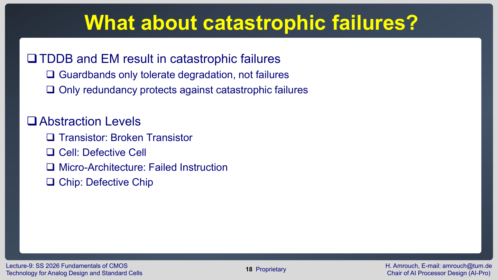

TDDB와 EM은 파국적 고장이다. Guardband는 transistor가 조금 약해져도 timing을 맞추도록 도와주지만, gate oxide가 깨지거나 interconnect가 끊어진 경우에는 회로가 물리적으로 고장난다.

따라서<font color="#ffc000"> catastrophic failure에는 redundancy가 필요</font>하다.

Abstraction level별로 보면 다음과 같다.

- Transistor: broken transistor
- Cell: defective cell
- Micro-architecture: failed instruction
- Chip: defective chip

**Redundancy**는 <font color="#ffc000">예비 회로, error correction, reconfiguration, spare resource 같은 방식으로 고장을 우회하거나 복구하는 전략</font>이다.

## Voltage guardband

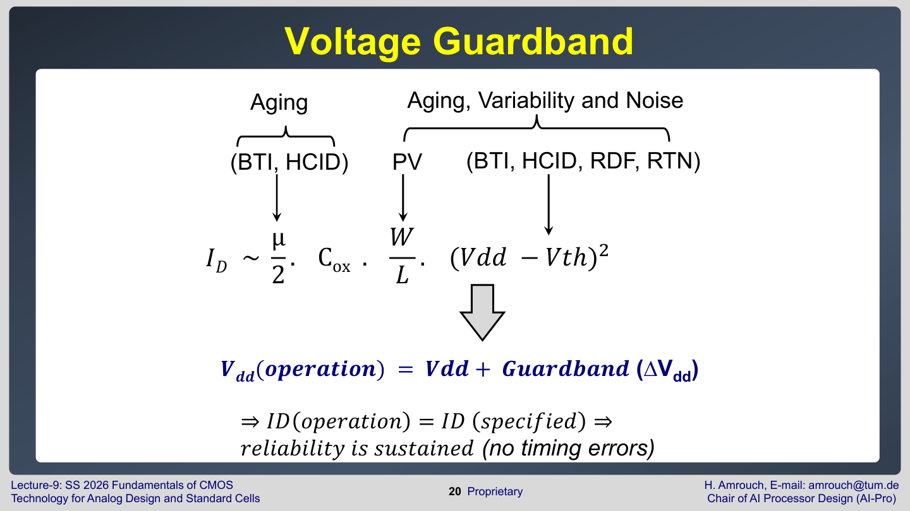

Voltage guardband의 핵심 식은 다음이다.

$$
V_{DD(operation)} = V_{DD} + Guardband(\Delta V_{DD})
$$

의미는 간단하다. <font color="#00b0f0">Aging, variability, noise 때문에 transistor current가 줄어들어도, 동작 전압을 조금 높여 specified current를 유지하려는 것</font>이다.

슬라이드는 다음 관계를 함께 보여준다.

$$
I_{D} \sim \mu C_{ox}\frac{W}{L}(V_{DD}-V_{th})^{2}
$$

$V_{th}$가 aging 때문에 증가하면 $(V_{DD}-V_{th})$가 작아져 current가 줄어든다. 이를 보상하려면 $V_{DD}$를 올려 overdrive를 회복할 수 있다. 하지만 $V_{DD}$<font color="#ffc000">를 올리면 dynamic power가</font> $V_{DD}^{2}$<font color="#ffc000">로 증가하고, temperature와 aging stress도 커질 수 있다</font>. 그래서 <font color="#e84d4d">voltage guardband는 강력하지만 비싼 방법</font>이다.

슬라이드는 aging만의 문제가 아니라 PV, RDF, RTN 같은 variability/noise도 언급한다.

- **PV**: process variation, 제조 편차
- **RDF**: random dopant fluctuation
- **RTN**: random telegraph noise

Guardband는 aging, variability, noise를 함께 견디기 위한 여유로 해석할 수 있다.

## Timing guardband

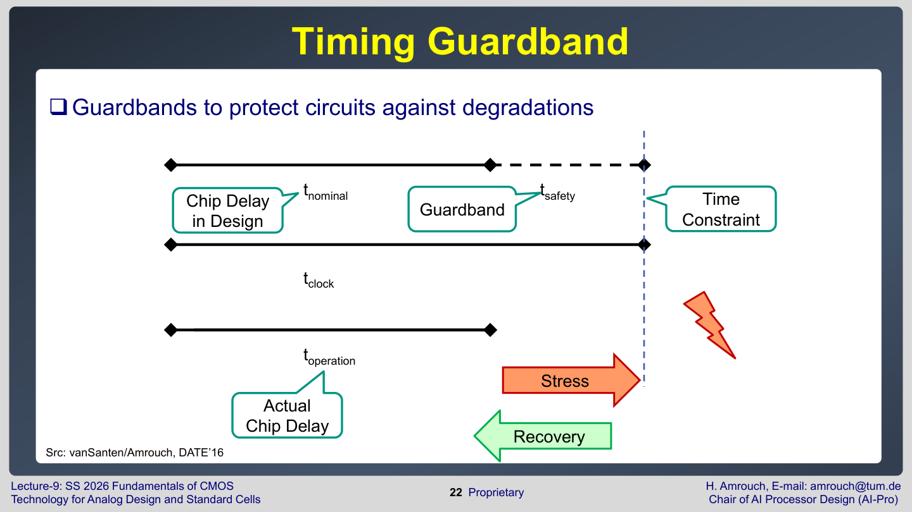

**Timing guardband**는<font color="#ffc000"> clock period를 실제 nominal delay보다 길게 잡는 방법</font>이다.

용어를 정리하면 다음과 같다.

- $t_{nominal}$: fresh 또는 nominal condition에서의 회로 delay
- $t_{operation}$: 실제 동작 중 aging/temperature 등을 포함한 delay
- $t_{clock}$: clock period
- $t_{safety}$: 안전 여유

Timing guardband는 $t_{clock}$ 안에 $t_{operation}$이 들어오도록 여유를 둔다.<font color="#ffc000"> 장점은 전압을 높이지 않아도 된다는 점</font>이고, <font color="#00b0f0">단점은 clock frequency가 낮아져 performance가 줄어든다는 점</font>이다.

## Exercise 4: power와 guardband 측정

Exercise 4는 NAND cell의 delay와 power를 fan-out, temperature, aging 조건에서 측정하게 한다.

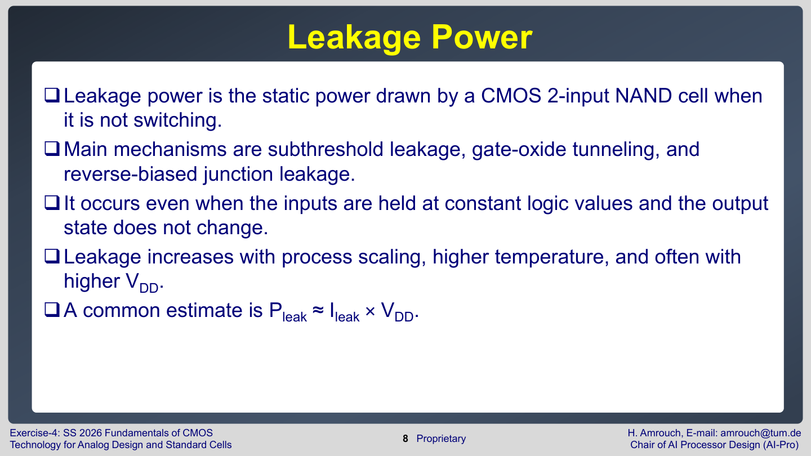

Leakage power는 switching이 없어도 소비되는 static power다. 2-input NAND에서는 입력이 고정되어 output이 변하지 않아도 subthreshold leakage, gate oxide tunneling, reverse-biased junction leakage가 power를 만든다. **Leakage**는<font color="#00b0f0"> process scaling, high temperature, low threshold voltage에서 커진다</font>.

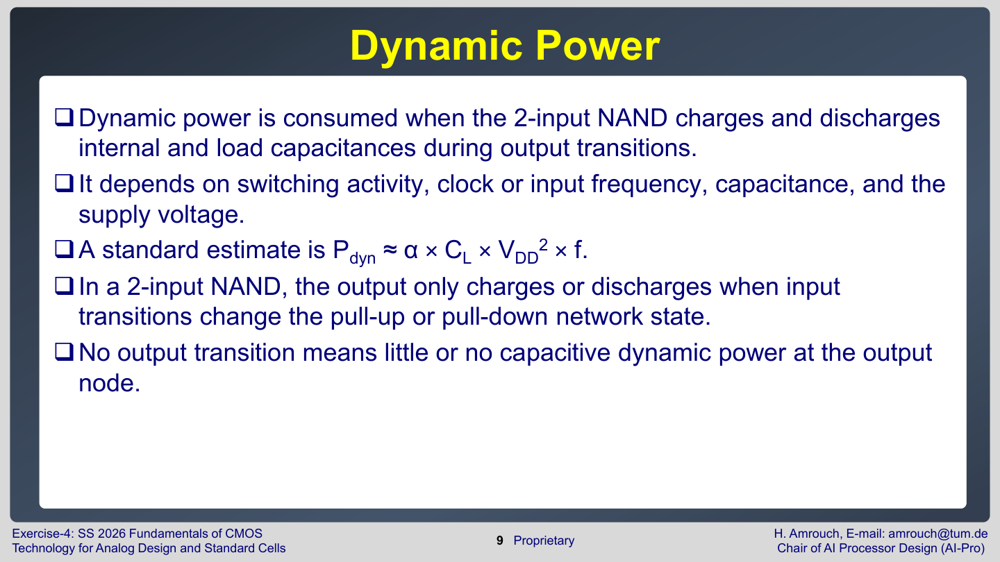

**Dynamic power**는 <font color="#00b0f0">output과 내부 node capacitance를 충전/방전할 때 소비</font>된다.

$$
P_{dyn} \approx \alpha C_{L} V_{DD}^{2} f
$$

2-input NAND에서는 <font color="#ffc000">입력 조합과 switching pattern에 따라 output이 실제로 transition할 때만 큰 dynamic power가 발생</font>한다.

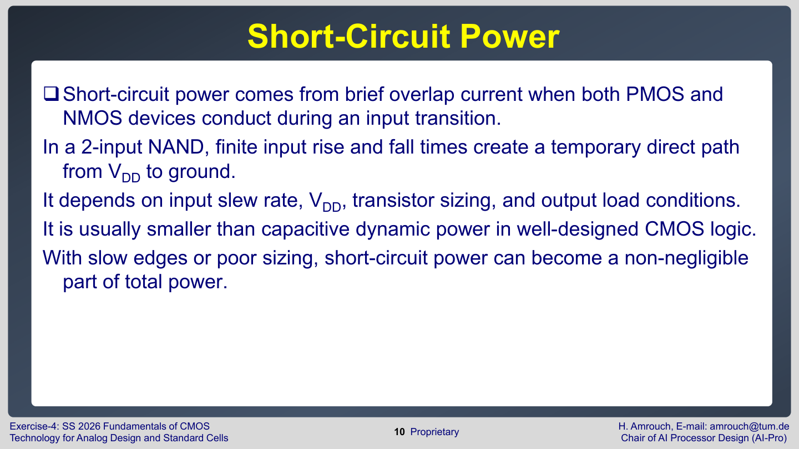

**Short-circuit power**는 <font color="#ffc000">input transition 동안 PMOS와 NMOS가 잠깐 동시에 conduct해서 VDD에서 GND로 직접 path가 생길 때 발생</font>한다. <font color="#00b0f0">Input rise/fall time이 느릴수록 이 overlap 시간이 길어질 수 있다</font>.

## Power measurement in SPICE

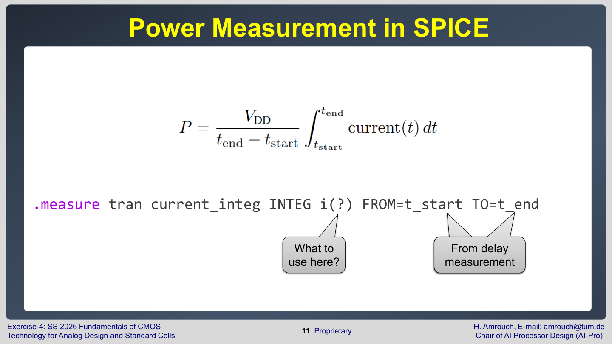

SPICE에서는 supply current를 적분해 energy를 구하고, 시간 구간으로 나누어 average power를 구할 수 있다.

```spice
.measure tran current_integ INTEG i(v_supply) FROM=t_start TO=t_end
```

전력/에너지 관계는 다음처럼 해석한다.

$$
E = \int P(t)dt = \int V_{DD} I_{supply}(t)dt
$$

$V_{DD}$가 일정하면 다음처럼 볼 수 있다.

$$
E \approx V_{DD}\int I_{supply}(t)dt
$$

그리고 평균 전력은 다음이다.

$$
P_{avg} = \frac{E}{t_{end}-t_{start}}
$$

따라서 `.measure INTEG`는 current만 적분하는 것이고, 에너지로 바꾸려면 supply voltage를 곱해야 한다. 부호 convention은 simulator에서 current 방향 정의에 따라 음수로 나올 수 있으므로, 회로에 들어간 에너지 크기를 해석할 때 방향을 확인해야 한다.

## Fan-out, temperature, guardband task

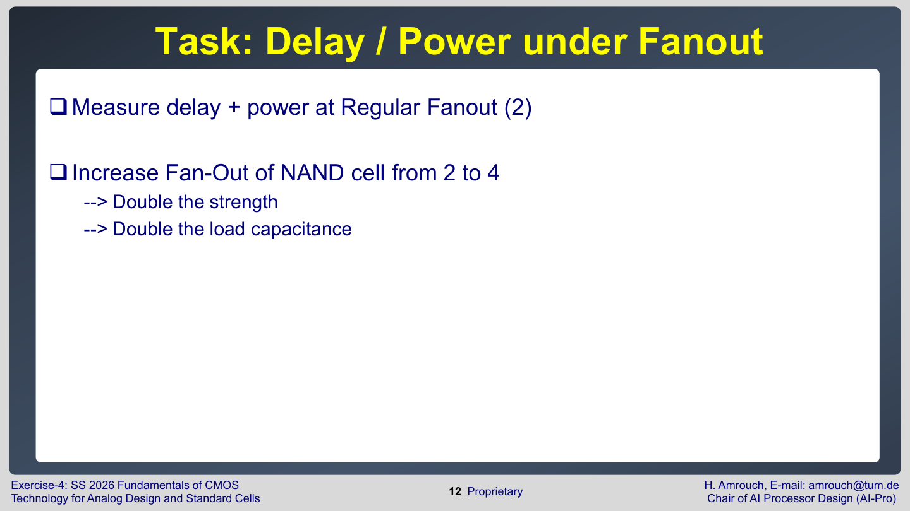

<font color="#ffc000">Fan-out을 2에서 4로 늘리면 output load capacitance가 커진다</font>. 이를 구동하려면 더 강한 NAND_X4 cell을 쓰거나 transistor strength를 키워야 한다. 하지만<font color="#00b0f0"> 강한 cell은 area와 input capacitance가 커질 수 있다</font>.

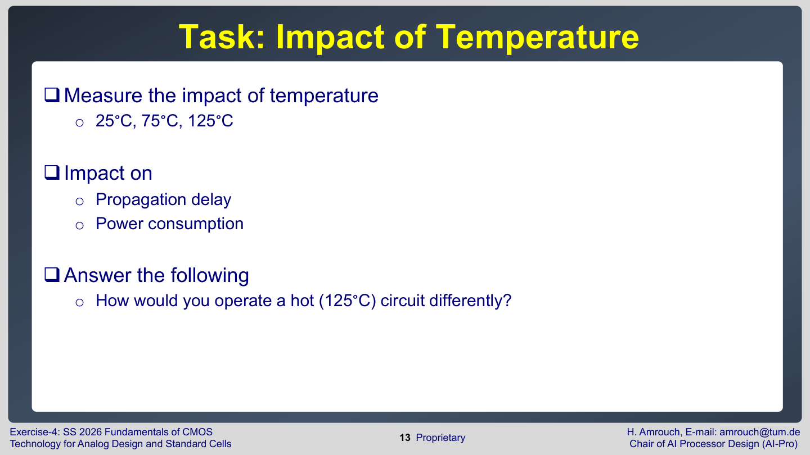

Temperature task는 25도, 75도, 125도에서 propagation delay와 power consumption을 비교한다. 125도 hot circuit은 보통 더 큰 leakage와 다른 delay 특성을 보이므로, 낮은 frequency, 충분한 voltage/timing margin, cooling, workload throttling 같은 운영 전략이 필요하다.

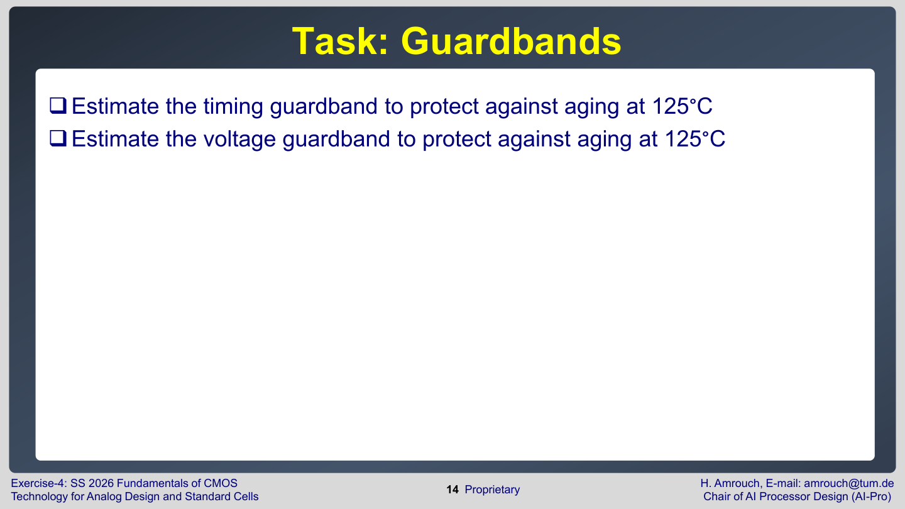

마지막 task는 125도에서 aging을 보호하기 위한 timing guardband와 voltage guardband를 추정하는 것이다. 즉, fresh condition의 delay/power만 보고 끝내지 않고, aged condition에서도 timing requirement를 만족하려면 얼마의 여유가 필요한지 계산한다.

## Guardband 최소화의 핵심

Lecture 9의 마지막 메시지는 guardband minimization이다.

- **Voltage guardband**는 <font color="#e84d4d">aging protection을 제공하지만 energy와 temperature를 증가</font>시킨다.
- **Timing guardband**는 <font color="#e84d4d">aging protection을 제공하지만 performance를 줄인다</font>.
- **Strength guardband**는 <font color="#e84d4d">timing에는 좋지만 area와 capacitance를 늘린다</font>.

따라서 reliability-aware design의 <font color="#ffc000">목표는 "무조건 큰 여유"가 아니라 "필요한 reliability를 만족하는 최소 overhead"</font>이다.

## 시험 대비 핵심

- 같은 $\Delta V_{th}$라도 cell topology와 path에 따라 delay impact가 다르다.
- **Worst-case cell aging**은 <font color="#e84d4d">항상 모든 transistor가 최대로 aged된 상태가 아니다</font>.
- **Critical path**에 있는<font color="#ffc000"> cell의 aging이 chip timing에 가장 치명적</font>이다.
- Aging-aware timing은 duty cycle, temperature, voltage, load, slew, topology를 함께 봐야 한다.
- **Guardband**는 <font color="#ffc000">degradation을 견디기 위한 over-design</font>이다.
- Timing guardband는 performance를 비용으로 쓰고, voltage guardband는 power/temperature를 비용으로 쓴다.
- **TDDB/EM** 같은 **catastrophic failure**는<font color="#ffc000"> guardband가 아니라 redundancy가 필요</font>하다.
- SPICE에서 supply current integral을 이용해 energy와 average power를 계산할 수 있다.

## 포함 범위

- Lecture 9: pages 3-24
- Exercise 4: pages 6-14
