# 07. 가드밴드 최소화, 어닐링, Aging-aware 합성

## 이 장의 위치

이 장은 Lecture 10을 정리한다. 앞 장에서는 aging 때문에 timing/voltage guardband가 필요하다는 점을 보았다. Lecture 10은 그 다음 질문을 다룬다.

```text
aging을 견디기 위한 guardband를 어떻게 줄일 수 있는가?
```

강의의 답은 두 축이다.

- <font color="#ffc000">이미 생긴 aging을 일부 되돌리는</font> **recovery와 annealing**
- <font color="#ffc000">aging 이후의 delay/power까지 알고 최적화</font>하는 **aging-aware logic synthesis**

즉, 이 장은 reliability를 위해 <font color="#00b0f0">그냥 여유를 크게 두는 대신</font>, 물리적 회복과 설계 자동화를 이용해 <font color="#00b0f0">성능/전력 낭비를 줄이는 방법</font>을 설명한다.

## 핵심 질문

- Voltage guardband와 timing guardband는 각각 무엇을 보호하고, 비용은 무엇인가?
- Recovery와 annealing은 둘 다 aging을 줄이는 것처럼 보이는데, 물리적으로 무엇이 다른가?
- Annealing은 구체적으로 어떤 열처리 과정이며, transistor 특성을 어떻게 되돌리는가?
- 왜 self-heating은 transistor 단위에서는 annealing 온도에 가까울 수 있지만, 실제 CPU 전체에서는 충분하지 않을 수 있는가?
- 왜 aging-aware synthesis에는 degradation-aware standard cell library가 필요한가?
- Aging-aware design이 guardband를 줄인다는 것은 정확히 어떤 의미인가?

## Guardband를 왜 줄여야 하는가

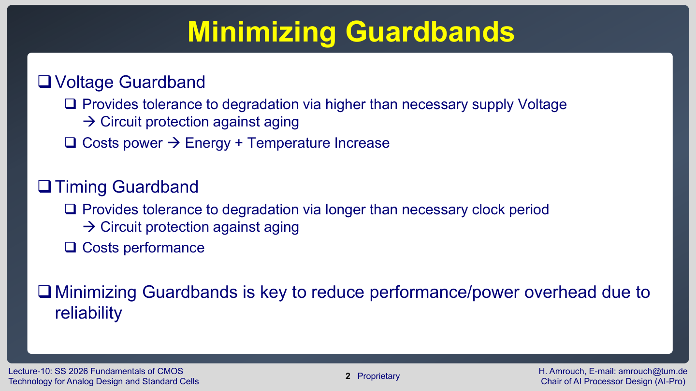

**Guardband**는 <font color="#ffc000">aging, variability, noise 때문에 회로가 느려지거나 약해져도 정상 동작하도록 미리 넣는 여유</font>다. Lecture 10은 두 종류를 다시 강조한다.

| Guardband             | 방법                                                     | 보호 효과                                                                          | 비용                                |
| --------------------- | ------------------------------------------------------ | ------------------------------------------------------------------------------ | --------------------------------- |
| **Voltage** guardband | 필요한 것보다<font color="#ffc000"> 높은 supply voltage 사용     | aging으로 $V_{th}$가 커지고 $I_{ON}$이 줄어도<font color="#e84d4d"> overdrive를 회복</font> | power, energy, temperature 증가     |
| **Timing** guardband  | 필요한 것보다 <font color="#ffc000">긴 clock period</font> 사용 | aging으로 critical path delay가 증가해도 <font color="#e84d4d">setup timing 만족        | performance 감소            </font> |

Voltage guardband는 회로를 더 강하게 밀어붙이는 방식이다. MOSFET 전류는 대략 다음 관계를 따른다.

$$
I_{ON} \sim \mu C_{ox}\frac{W}{L}(V_{DD}-V_{th})^2
$$

$V_{th}$가 aging 때문에 증가하면 $(V_{DD}-V_{th})$가 작아져 $I_{ON}$이 줄어든다. $V_{DD}$를 올리면 이 감소를 보상할 수 있다. 하지만 dynamic power는 다음처럼 $V_{DD}^{2}$에 비례한다.

$$
P_{dyn} \approx \alpha C_L V_{DD}^2 f
$$


그래서 **voltage guardband**는 <font color="#ffc000">delay에는 도움이 되지만 power와 temperature를 키운다</font>. <font color="#00b0f0">Temperature가 올라가면 다시 aging 반응도 빨라질 수 있으므로, 무조건 좋은 해결책은 아니다</font>.

**Timing guardband**는 <font color="#ffc000">clock을 느리게 잡는 방식</font>이다.

$$
T_{clk} \ge t_{critical,aged} + t_{margin}
$$

여기서 $T_{clk}$는 clock period, $t_{critical,aged}$는 aging 이후 critical path delay, $t_{margin}$은 안전 여유다. Clock period가 길어지면 주파수는 낮아진다.

$$
f_{clk} = \frac{1}{T_{clk}}
$$


따라서 **timing guardband**는 <font color="#ffc000">전압을 올리지 않아도 안전하지만, 회로가 낼 수 있는 최대 성능을 포기</font>한다. Lecture 10의 핵심 문장은<font color="#e84d4d"> reliability 때문에 생기는 성능/전력 overhead를 줄이려면 guardband를 최소화해야 한다</font>는 것이다.

## Recovery와 annealing의 차이

Lecture 10의 aging annealing 파트는 Hussam Amrouch et al.의 IRPS 2024 논문 Machine Learning Unleashes Aging and Self-Heating Effects: From Transistors to Full Processor를 기반으로 한다.

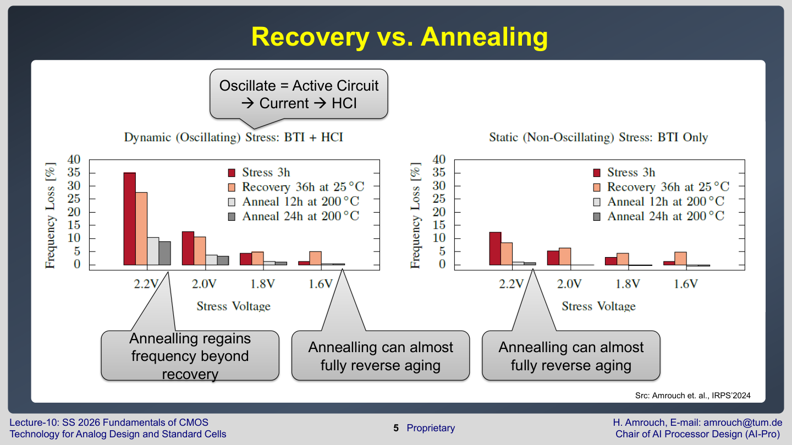

슬라이드의 그래프는 stress 이후 frequency loss가 recovery와 annealing으로 얼마나 줄어드는지 비교한다.

왼쪽 그래프는 dynamic stress, 즉 회로가 oscillation하는 active 상태다.

- Oscillate = Active Circuit
- active 상태에서는 current가 흐른다.
- current가 흐르면 HCI가 함께 생길 수 있다.
- 그래서 dynamic stress는 $BTI+HCI$가 함께 작용한다.

오른쪽 그래프는 static stress, 즉 switching이 없는 상태다.

- **static 상태**에서는 주로 <font color="#ffc000">gate bias에 의한 BTI가 지배적</font>이다.
- <font color="#00b0f0">current 흐름이 작으므로 HCI 성분은 약하다</font>.

그래프의 축과 범례는 다음처럼 읽는다.

| 항목 | 의미 |
| --- | --- |
| x축 | stress voltage, 예: 2.2 V, 2.0 V, 1.8 V, 1.6 V |
| y축 | frequency loss [%] |
| 빨간 막대 | 3시간 stress 직후의 손실 |
| 주황 막대 | 25도에서 36시간 recovery 후 남은 손실 |
| 밝은 회색 막대 | 200도에서 12시간 anneal 후 남은 손실 |
| 진한 회색 막대 | 200도에서 24시간 anneal 후 남은 손실 |

핵심 추세는 세 가지다.

첫째, <font color="#ffc000">stress voltage가 높을수록 frequency loss가 크다</font>. <font color="#00b0f0">전압이 높으면 oxide 전기장, carrier energy, trapping 반응이 커지기 때문</font>이다.

둘째, <font color="#ffc000">자연 recovery만으로도 일부 손실이 줄지만, annealing이 훨씬 더 강하다</font>. 특히 200도 annealing은 recovery보다 frequency를 더 많이 되돌린다.

셋째, <font color="#e84d4d">dynamic stress에서는 static stress보다 손실이 크고 완전 회복이 더 어렵다</font>.<font color="#ffc000"> Dynamic stress에는 BTI뿐 아니라 HCI 성분도 포함되기 때문</font>이다. HCI는 drain 근처 interface defect와 current-driven damage를 만들 수 있어 단순한 low-stress recovery만으로는 덜 회복될 수 있다.

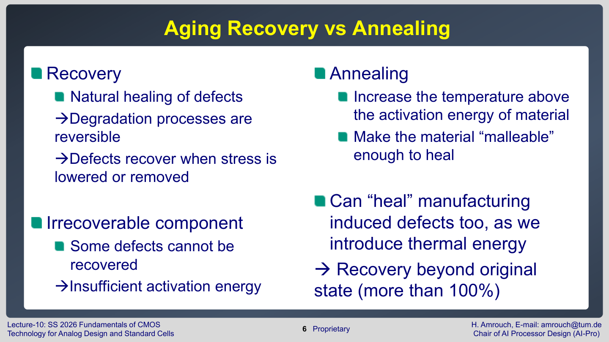

**Recovery와 annealing의 차이**는<font color="#ffc000"> activation energy로 이해</font>하면 된다.

| 구분                          | 물리적 의미                                                                                | 조건                            | 한계                                        |
| --------------------------- | ------------------------------------------------------------------------------------- | ----------------------------- | ----------------------------------------- |
| **Recovery**                | **stress를 줄이거나 제거했을 때**<font color="#ffc000"> defect가 자연적으로 비활성화</font>되거나 원래 상태로 돌아감 | 낮은 전압, 낮은 stress, 충분한 시간      | activation energy가 부족하면 일부 defect는 그대로 남음 |
| **Annealing**               | **온도를 올려** defect가 회복될 만큼 <font color="#ffc000">충분한 thermal energy를 공급</font>         | 높은 온도, 제어된 시간                 | power/thermal stress/공정 안정성 고려 필요         |
| **Irrecoverable component** | <font color="#00b0f0">자연 recovery로는 돌아오지 않는 열화 성분                             </font>                              | 결합 재구성, 깊은 trap, HCI damage 등 | 추가 열에너지 없이는 회복 어려움                        |

**Annealing**은 단순히 회로를 쉬게 하는 것이 아니다. <font color="#00b0f0">재료가 defect를 고칠 수 있을 만큼 높은 열에너지를 주는 과정</font>이다. 슬라이드의 "material을 malleable하게 만든다"는 말은 금속처럼 녹인다는 뜻이 아니라, <font color="#ffc000">원자 결합과 trap 상태가 재배열될 수 있을 만큼 thermal activation을 준다는 뜻</font>이다.

이때 온도 효과는 보통 Arrhenius 형태로 설명한다.

$$
k = A \exp\left(-\frac{E_a}{k_B T}\right)
$$

| 항 | 의미 |
| --- | --- |
| $k$ | defect 생성 또는 회복 반응의 속도 |
| $A$ | 재료와 반응 경로에 따른 상수 |
| $E_{a}$ | activation energy, 반응이 일어나기 위해 넘어야 하는 에너지 장벽 |
| $k_{B}$ | Boltzmann constant |
| $T$ | 절대온도, Kelvin 단위 |

$T$<font color="#e84d4d">가 올라가면 지수항 때문에 반응 속도</font> $k$<font color="#e84d4d">가 크게 증가</font>한다. <font color="#ffc000">이것이 annealing이 recovery보다 강한 이유</font>다. 자연 recovery에서는 일부 defect가 에너지 장벽을 넘지 못하지만, 높은 온도에서는 그 장벽을 넘는 defect가 늘어난다.

슬라이드가 말하는 "more than 100% recovery"는<font color="#ffc000"> aging으로 생긴 손실만 되돌리는 것을 넘어, 제조 과정에서 이미 존재하던 일부 defect까지 완화할 수 있다는 뜻</font>이다. 즉 annealing 후 측정된 frequency가 기준 상태보다 더 좋아지는 경우가 있을 수 있다.

## Annealing은 구체적으로 무엇을 하는 과정인가

**Annealing**은 <font color="#ffc000">semiconductor를 높은 온도에 일정 시간 두어, defect가 더 안정적인 상태로 돌아가도록 만드는 열처리 과정</font>이다. 여기서 중요한 점은 회로를 단순히 "뜨겁게 만든다"가 아니다. 목적은 defect가 움직이거나 charge 상태를 바꾸거나 결합을 다시 만들 수 있을 만큼의 thermal energy를 공급하는 것이다.

실제 과정은 보통 다음 순서로 이해하면 된다.

>1. 회로가 stress를 받아 aging defect가 생긴다.
>2. 회로의 frequency가 낮아지거나 delay가 증가한다.
>3. 동작을 멈추거나 낮은 stress 상태로 둔다.
>4. 외부 장비, <font color="#00b0f0">on-chip heater, 또는 self-heating 보조 효과로 목표 온도까지 올린다</font>.
>5. <font color="#00b0f0">목표 온도에서 일정 시간 유지</font>한다.
>6.<font color="#e84d4d"> Defect 일부가 비활성화되거나, trapped charge가 빠지거나, 끊어진 결합 일부가 다시 안정화</font>된다.
>6. 온도를 다시 낮춘 뒤 transistor 특성을 측정하면 $V_{th}$, $I_{ON}$, delay, frequency가 일부 회복된다.

Annealing 중에는 transistor를 정상 연산시키는 것이 목적이 아니다. 고온에서 회로가 논리 연산을 잘 하게 만드는 것이 아니라, 이미 생긴 defect 상태를 바꾸기 위해 열에너지를 주는 것이다. 따라서 annealing은 보통 제어된 시간과 온도 조건이 필요하다.

## Annealing이 defect를 개선하는 물리적 원리

Annealing이 특성을 개선하는 경로는 defect 종류에 따라 조금 다르다.

| Aging 관련 defect       | Annealing 중 가능한 변화                                                            | transistor 특성 변화                       |
| --------------------- | ----------------------------------------------------------------------------- | -------------------------------------- |
| **Trapped charge**    | <font color="#ffc000">trap에 잡혀 있던 carrier가 빠져나옴</font>                        | $V_{th}$ shift가 줄어듦                    |
| **Oxide trap**        | <font color="#ffc000">charge 상태가 중성</font>에 가까워지거나 전기적 영향이 약해짐                | gate 전기장 왜곡 감소                         |
| **Interface trap**    | 일부 dangling bond가 <font color="#ffc000">다시 passivation되거나 전기적으로 덜 활성화</font>됨 | mobility/$g_{m}$/$I_{ON}$ 회복           |
| **약한 결합 또는 국소 손상**    | 원자 배열이<font color="#ffc000"> 더 안정적인 상태로 재배열</font>됨                           | leakage와 local field 집중 완화 가능          |
| **제조 중 남아 있던 defect** | <font color="#ffc000">열처리로 일부 defect가 비활성화</font>됨                            | aging 전 기준보다 좋아지는 $>100\%$ recovery 가능 |

**가장 직접적인 효과**는 <font color="#ffc000">trapped charge의 감소</font>다. **BTI**에서는 <font color="#00b0f0">gate dielectric 또는 interface 근처 defect가 charge를 잡으면서</font> $V_{th}$<font color="#00b0f0">를 바꾼다</font>. Annealing으로 열에너지가 공급되면, trap에 갇힌 carrier가 빠져나오거나 defect의 charge 상태가 바뀔 수 있다. 그러면 channel을 만들기 위해 필요한 gate voltage가 원래 값에 가까워진다.

**Interface trap**의 경우에는 조금 더 물리적인 결합 문제가 있다.<font color="#00b0f0"> Si-SiO2 경계에서 Si-H 결합이 끊어지면 dangling bond</font>가 생기고, <font color="#00b0f0">이 자리가 charge와 carrier 이동에 영향</font>을 준다. **Annealing**은 <font color="#e84d4d">일부 hydrogen이나 주변 원자가 움직일 수 있는 에너지를 제공해, dangling bond가 다시 passivation되거나 전기적으로 덜 해로운 상태가 되도록 도울 수 있다</font>.

**Oxide trap**의 경우에는 <font color="#ffc000">gate dielectric 내부의 결함이 charge를 잡는 것이 문제</font>다. Annealing은 이 <font color="#e84d4d">defect가 잡고 있던 charge를 방출하게 하거나, defect 주변의 국소적인 원자 배열을 더 안정적인 상태로 바꾸어 전기적 영향을 줄일 수 있다</font>.

단, 모든 defect가 회복되는 것은 아니다. <font color="#92d050">깊은 trap, 심한 HCI 손상, oxide breakdown, metal interconnect 손상은 단순 annealing으로 원래 상태로 돌아오기 어렵다</font>. 특히 TDDB와 EM은 물리적으로 절연막이 뚫리거나 배선이 이동한 고장이므로, Lecture 10의 annealing 회복 대상과는 성격이 다르다.

## Annealing이 회로 특성을 개선하는 경로

Annealing이 회로 성능을 개선하는 과정은 다음 한 줄로 연결된다.

```text
defect 비활성화 -> Vth shift 감소/ION 회복 -> cell delay 감소 -> critical path delay 감소 -> maximum frequency 회복
```

각 단계를 더 풀면 다음과 같다.

| 단계                     | 의미                                                                     |
| ---------------------- | ---------------------------------------------------------------------- |
| **defect 비활성화**        | <font color="#00b0f0">trap charge가 줄거나 interface defect 영향이 작아짐</font> |
| $V_{th}$ **shift 감소**  | transistor가 <font color="#00b0f0">켜지는 조건이 fresh 상태에 가까워짐</font>        |
| $I_{ON}$ 회복            | 같은 $V_{DD}$에서 흐르는 ON current가 증가                                       |
| cell delay 감소          | output capacitance를 더 빨리 충전/방전                                         |
| critical path delay 감소 | 가장 느린 path가 다시 빨라짐                                                     |
| frequency 회복           | <font color="#ffc000">같은 timing constraint에서 더 높은 clock 사용 가능                           </font>     |

그래서 Lecture 10의 그래프에서 y축이 frequency loss로 표현된다. Transistor 하나의 defect가 줄어드는 것이 최종 목적이 아니라, 그 결과로 회로가 다시 더 빠르게 동작하는지가 중요하기 때문이다.

Annealing은 voltage guardband와도 연결된다. Aging 때문에 $V_{th}$가 커지면 원래는 $V_{DD}$를 올려 $I_{ON}$을 보상해야 한다. 하지만 annealing으로 $V_{th}$ shift 자체가 줄어들면, 같은 성능을 위해 필요한 extra $V_{DD}$가 줄어들 수 있다. 즉 annealing은 guardband를 줄이는 물리적 방법이다.

Timing guardband와도 연결된다. Aging 때문에 cell delay가 증가하면 clock period를 길게 잡아야 한다. **Annealing**으로<font color="#ffc000"> delay 증가분이 줄어들면, clock period에 넣어야 하는 여유가 작아진다</font>. 그래서 annealing은 성능 손실을 줄이는 방법이기도 하다.

## Recovery, annealing, 정상 고온 동작은 다르다

혼동하기 쉬운 점은 <font color="#00b0f0">"온도가 높으면 aging이 심해진다"와 "annealing은 온도를 높여 회복한다"가 동시에 맞다는 것</font>이다. 차이는 온도를 올리는 목적과 조건이다.

| 상황            | 온도 상승의 의미                            | 결과                                                                                                 |
| ------------- | ------------------------------------ | -------------------------------------------------------------------------------------------------- |
| 정상 동작 중 고온    | 전압, current, switching stress가 계속 존재 | <font color="#ffc000">aging 생성 반응도 빨라질 수 있음</font>                                                 |
| **Recovery**  | stress를 낮추거나 제거하고 자연 회복을 기다림         | <font color="#ffc000">쉽게 돌아오는 defect만 일부 회복</font>                                                 |
| **Annealing** | stress를 제어한 상태에서 높은 온도를 의도적으로 가함     | 더<font color="#ffc000"> 큰 activation energy가 필요한 defect도 회복 가</font><font color="#ffc000">능</font> |

즉 "뜨거우면 항상 좋다"가 아니다. <font color="#e84d4d">동작 중 고온은 새 defect 생성도 촉진할 수 있다</font>. **Annealing**은 <font color="#ffc000">동</font><font color="#ffc000">작 stress를 줄인 상태에서, 회복 쪽 반응이 일어나도록 시간과 온도를 제어하는 과정으로 이해</font>해야 한다.

>> ***핵심은 Annealing은 chip을 off 상태로 만들어, operating stress가 없는 상태에서, 회복반응이 일어나도록 통제된 환경과 조건에서 진행하는 것으로 이해***

Annealing의 한계도 분명하다.

- 온도를 <font color="#00b0f0">너무 높이면 다른 재료나 interconnect에 damage를 줄 수 있다</font>.
- <font color="#e84d4d">너무 오래 가열하면 회복보다 새로운 열화가 커질 수 있다</font>.
- 모든 chip 영역을 균일하게 원하는 온도로 만들기 어렵다.
- <font color="#e84d4d">회복 가능한 defect와 회복 불가능한 defect가 섞여 있다</font>.
- 실제 제품에서는 <font color="#00b0f0">annealing 시간 동안 정상 연산을 멈추거나 성능을 낮춰야 할 수 있다</font>.

따라서 annealing은 aging을 완전히 없애는 마법 같은 방법이 아니라, 회복 가능한 defect를 줄여 guardband overhead를 낮추는 신뢰성 관리 기법이다.

## Recovery와 annealing의 시간 의존성

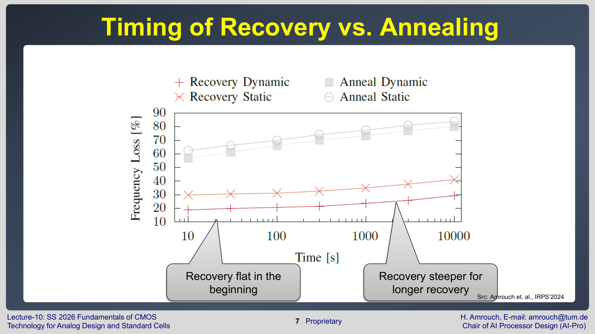

이 그래프는 recovery와 annealing이 시간에 따라 어떻게 진행되는지 비교한다. x축은 time [s]이고 로그 스케일이다. y축 표기는 frequency loss [%]로 되어 있지만, 범례와 슬라이드 설명상 "recovery/anneal로 회복된 손실의 양"을 비교하는 그래프로 읽어야 한다.

범례는 다음과 같다.

| 곡선 | 의미 |
| --- | --- |
| Recovery Dynamic | dynamic stress 이후 자연 recovery |
| Recovery Static | static stress 이후 자연 recovery |
| Anneal Dynamic | dynamic stress 이후 annealing |
| Anneal Static | static stress 이후 annealing |

그래프의 핵심은 다음이다.

- **Recovery**는 <font color="#ffc000">초반에는 거의 평평</font>하다.
- 시간이 길어질수록 recovery가 더 가파르게 증가한다.
- **Annealing**은 <font color="#e84d4d">같은 시간에서 recovery보다 훨씬 큰 회복</font>을 만든다.
- <font color="#e84d4d">Static 조건이 dynamic 조건보다 회복이 큰 편</font>이다.

초반 recovery가 평평한 이유는 <font color="#00b0f0">쉽게 돌아오는 defect만 먼저 빠르게 회복되고, 남은 defect는 더 큰 activation energy나 더 긴 시간이 필요하기 때문</font>이다. <font color="#00b0f0">시간이 길어지면 더 느린 defect 상태도 점차 회복에 참여</font>한다.

**Annealing이 더 큰 이유**는 <font color="#ffc000">온도가 높아 defect가 에너지 장벽을 넘을 확률이 커지기 때문</font>이다. 다만 이것은 controlled annealing일 때 유리하다. <font color="#e84d4d">정상 동작 중 온도가 높아지는 것은 동시에 aging 생성 반응도 빠르게 만들 수 있으므로, 무조건 높은 온도가 좋은 것은 아니다</font>.

## 공정별 recovery와 annealing 차이

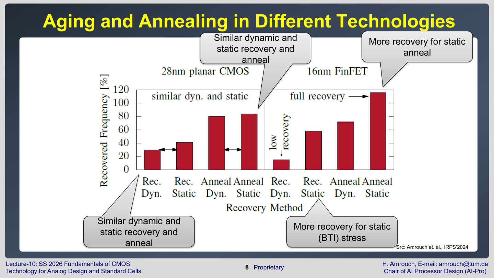

이 슬라이드는 28 nm planar CMOS와 16 nm FinFET에서 recovery/annealing 결과가 다르게 나타남을 보여준다.

28 nm **planar CMOS**에서는 d<font color="#ffc000">ynamic과 static의 recovery/anneal 경향이 비슷</font>하다.

- <font color="#00b0f0">dynamic recovery와 static recovery가 비슷한 수준</font>이다.
- <font color="#00b0f0">dynamic anneal과 static anneal도 비슷한 수준</font>이다.
- anneal은 recovery보다 훨씬 큰 recovered frequency를 만든다.

16 nm **FinFET**에서는 <font color="#ffc000">차이가 더 뚜렷</font>하다.

- <font color="#00b0f0">dynamic recovery는 낮다</font>.
- <font color="#00b0f0">static recovery는 훨씬 크다</font>.
- <font color="#00b0f0">static anneal은 거의 full recovery</font>에 가깝다.
- 슬라이드는 static BTI stress에서 recovery가 더 크다고 강조한다.

이 차이는 <font color="#ffc000">공정 구조와 dominant aging mechanism이 다르기 때문</font>에 생긴다. FinFET은 gate가 fin을 강하게 감싸므로 electrostatics가 좋아지지만, channel과 oxide 주변의 defect 분포, self-heating, trap 회복 특성은 planar와 다르다. **Static stress**는 **주로 BTI 성분**이므로<font color="#e84d4d"> trap capture/detrapping 또는 interface-related recovery가 크게 보일 수 있다</font>. 반대로 **dynamic stress**에는 **HCI 성분이 섞이므로** <font color="#e84d4d">recovery가 작아질 수 있다</font>.

시험에서는 숫자를 외우기보다 다음 문장을 기억하면 된다.


**공정이 바뀌면** 같은 aging mechanism도 <font color="#e84d4d">회복성, 온도 민감도, guardband 필요량이 달라진다</font>.


## On-chip heater로 annealing하기

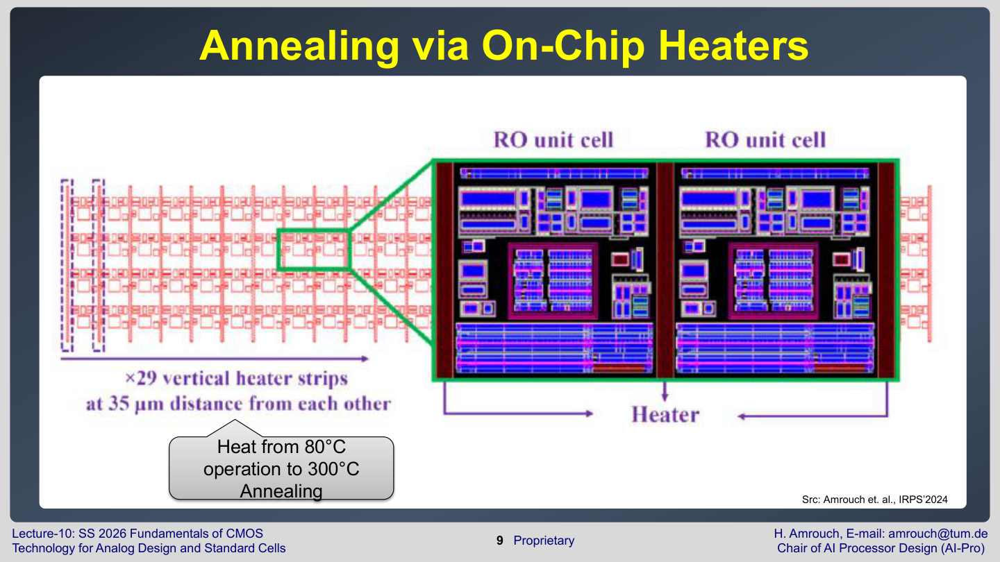

Annealing은 높은 온도가 필요하므로, 한 방법은 <font color="#ffc000">chip 위에 heater를 넣는 것</font>이다. 슬라이드의 예시는 ring oscillator <font color="#ffc000">unit cell 주변에 heater strip을 배치한 구조</font>다.

슬라이드의 핵심 정보는 다음이다.

- 약 29개의 vertical heater strip이 있다.
- heater strip 사이 거리는 약 35 um이다.
- 정상 동작 온도 80도에서<font color="#00b0f0"> annealing 온도 300도까지 가열</font>한다.
- Ring oscillator unit cell 근처에 heater를 두어 <font color="#00b0f0">해당 회로를 직접 가열</font>한다.

이 방식의 장점은 annealing 온도를 의도적으로 만들 수 있다는 점이다. 하지만 비용도 있다.

- <font color="#ffc000">heater 자체가 area를 차지</font>한다.
- heater에 전력을 넣어야 한다.
- 너무 높은 온도는 <font color="#ffc000">주변 회로와 interconnect에 thermal stress를 줄 수 있다</font>.
- 전체 chip을 무작정 가열하면 불필요한 부분까지 영향을 받는다.

따라서 on-chip heater는 "aging을 회복하기 위해 추가 전력을 쓰는 방법"이다. 목표는 <font color="#e84d4d">heater 전력까지 포함해도 전체 reliability guardband 비용을 줄일 수 있느냐</font>를 따지는 것이다.

## Self-heating으로 annealing 온도에 도달할 수 있는가

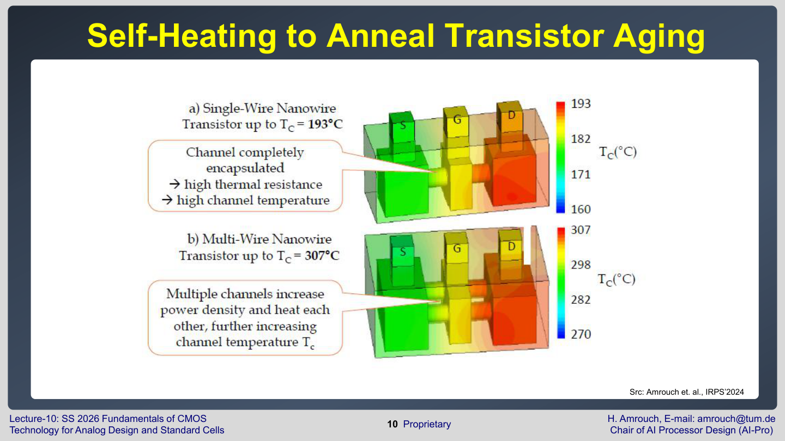

Transistor가 <font color="#ffc000">동작하면 전류가 흐르고, 전력 소모가 열로 바뀐다</font>. 이 현상을 **self-heating**이라고 한다.

가장 단순한 thermal 관계는 다음이다. 
$$
\Delta T = R_{\theta} P_{diss}
$$


| 항            | 의미                                                                   |
| ------------ | -------------------------------------------------------------------- |
| $\Delta T$   | 주변보다 channel이 더 뜨거워진 온도 상승                                           |
| $R_{\theta}$ | **thermal resistance**, <font color="#ffc000">열이 빠져나가기 어려운 정도</font> |
| $P_{diss}$   | transistor <font color="#ffc000">내부에서 소비되어 열이 되는 전력</font>           |

$R_{\theta}$가 클수록 같은 전력에서도 온도가 더 많이 오른다. **Nanosheet/nanowire 계열 구조**에서는 <font color="#00b0f0">channel이 주변 절연체로 둘러싸여 열이 빠져나가기 어려울 수 있다</font>.

슬라이드의 nanowire 예시는 다음을 보여준다.

| 구조                                  | 관찰된 channel 온도                         | 이유                                                |
| ----------------------------------- | -------------------------------------- | ------------------------------------------------- |
| **Single-wire** nanowire transistor | 최대<font color="#00b0f0"> 약 193도</font> | channel이 완전히 encapsulated되어 thermal resistance가 큼 |
| **Multi-wire** nanowire transistor  | 최대 <font color="#00b0f0">약 307도</font> | 여러 channel이 power density를 높이고 서로 열을 더함           |

이 결과만 보면 self-heating이 annealing에 충분해 보인다. 특히 multi-wire 구조에서는 300도 수준에 도달할 수 있다.<font color="#e84d4d"> 그러나 이것은 transistor 단위 또는 매우 국소적인 구조에서의 결과</font>다. <font color="#ffc000">실제 chip 전체에서 같은 온도를 안정적으로 만드는 것은 별개의 문제</font>다.

> Self-Heating으로 필요한 온도는 달성 가능하지만, <font color="#00b0f0">Coverage가 매우 Local</font>해서, 
> 전역적으로 고르게 가열하기에는 부적합함

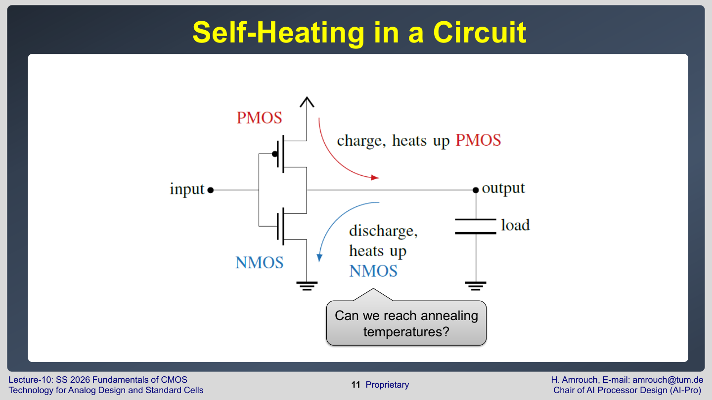

인버터 회로에서 self-heating은 switching 방향에 따라 다른 transistor에서 생긴다.

- **Output을 charge**할 때 PMOS가 전류를 공급하므로 <font color="#00b0f0">PMOS가 뜨거워진다</font>.
- **Output을 discharge**할 때 NMOS가 전류를 빼므로 <font color="#00b0f0">NMOS가 뜨거워진다</font>.
- <font color="#ffc000">Load capacitance가 크고 switching이 잦으면 더 많은 energy가 열로</font> 바뀐다.

따라서 **self-heating**은 <font color="#e84d4d">workload와 input pattern에 의존</font>한다. 어떤 transistor가 얼마나 뜨거워지는지는 단순히 회로도만 보고 정해지지 않고, 실제 switching activity와 load에 따라 달라진다.

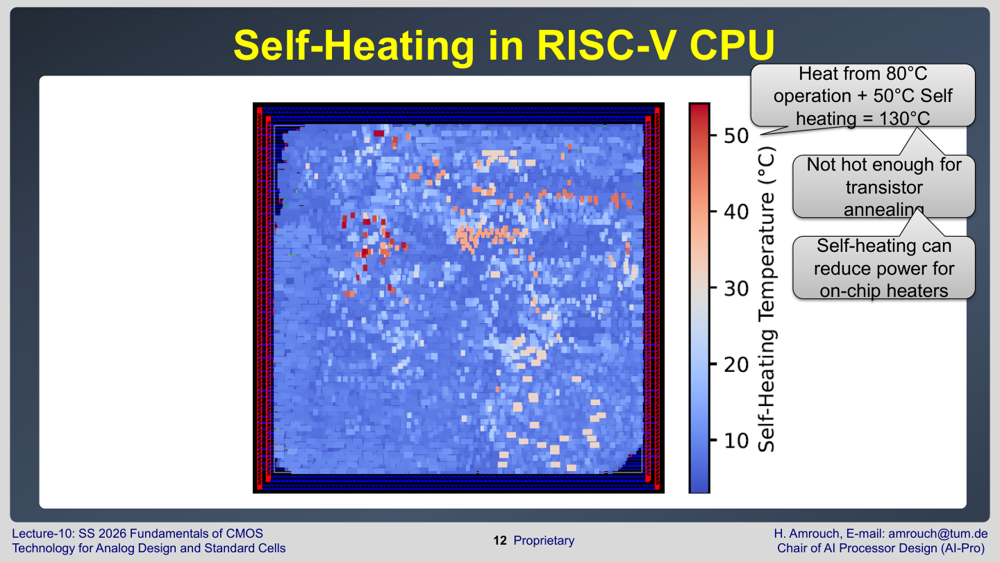

RISC-V CPU 수준의 self-heating 결과는 더 현실적인 한계를 보여준다.

- 정상 동작 온도: 약 80도
- self-heating으로 추가되는 온도: 약 50도
- 총 온도: 약 130도
- 결론: transistor annealing에는 충분히 뜨겁지 않다.

즉 실제<font color="#ffc000"> CPU 전체에서는 self-heating만으로 300도 수준의 annealing 온도에 도달하기 어렵다</font>. 하지만 self-heating이 완전히 쓸모없는 것은 아니다. <font color="#e84d4d">이미 self-heating으로 50도 정도 올라가 있다면, on-chip heater가 추가로 올려야 하는 온도 차이가 줄어든다</font>. 그래서 self-heating은 <font color="#e84d4d">heater 전력을 줄이는 보조 효과</font>를 낼 수 있다.

정리하면 다음과 같다.

```text
transistor-local self-heating은 매우 높을 수 있지만, processor-level self-heating은 보통 annealing 온도에는 부족하다.
```

## Aging-aware synthesis의 목표

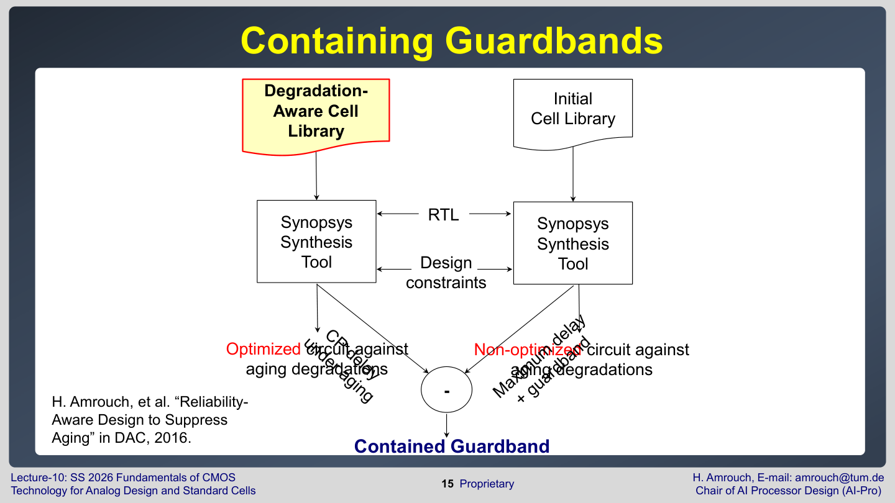

Lecture 10의 두 번째 큰 주제는 aging-aware synthesis다. 핵심은 synthesis tool이 fresh library만 보지 않고, aging 이후의 delay/power까지 반영한 cell library를 사용하게 만드는 것이다.

슬라이드의 흐름은 다음과 같다.

| 입력                 | Traditional flow                    | Aging-aware flow                                            |
| ------------------ | ----------------------------------- | ----------------------------------------------------------- |
| RTL                | 동일한 RTL 사용                          | 동일한 RTL 사용                                                  |
| Design constraints | 동일한 timing/power/area constraint 사용 | 동일한 timing/power/area constraint 사용                         |
| Cell library       | initial cell library                | <font color="#ffc000">degradation-aware cell library</font> |
| Synthesis 결과       | aging degradation에 최적화되지 않은 circuit | aging degradation을 고려해 최적화된 circuit                         |
| 필요한 **guardband**  | 더 큼                                 | <font color="#ffc000">더 작음</font>                           |

여기서 중요한 점은 **RTL을 바꾸는 것이 아니라**, <font color="#00b0f0">synthesis가 보는 cell 정보가 달라진다는 것</font>이다. 같은 논리 기능이라도 어떤 cell을 선택하고 어떤 구조로 mapping하느냐에 따라 aging 이후 critical path delay가 달라진다.

Contained guardband는 aging-aware flow가 guardband 증가를 억제한다는 뜻이다. <font color="#ffc000">전통적인 flow는 fresh delay만 보고 빠른 회로를 만든 뒤, 나중에 aging margin을 크게 붙인다</font>. <font color="#e84d4d">Aging-aware flow는 처음부터 aged delay와 aged power를 알고 cell을 고르므로, 추가 margin을 줄일 수 있다</font>.

## Aging 조건에서 cell delay와 power를 다시 봐야 하는 이유

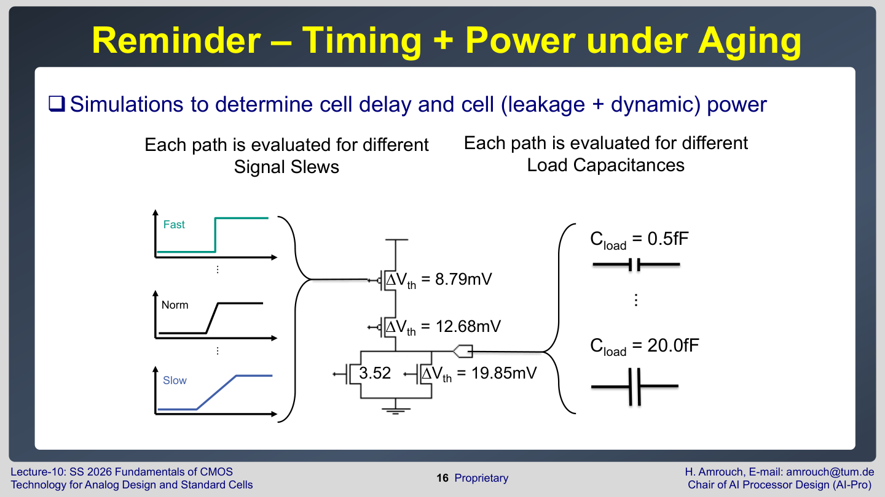

이 슬라이드는 Lecture 8-9의 library characterization을 다시 연결한다. <font color="#ffc000">Cell delay와 cell power는 하나의 숫자가 아니다</font>. 각 input-output path는 여러 조건에서 평가된다.

| 평가 축                 | 의미                                                                                                                                          |
| -------------------- | ------------------------------------------------------------------------------------------------------------------------------------------- |
| **Signal slew**      | input transition이 **fast, normal, slow** 중 어느 정도 속도인지                                                                                       |
| **Load capacitance** | output이 $C_{load}=0.5\,\mathrm{fF}$처럼 <font color="#00b0f0">작은 부하</font>를 보는지, $20.0\,\mathrm{fF}$처럼 <font color="#00b0f0">큰 부하</font>를 보는지 |
| **Cell path**        | 같은 cell 안에서도<font color="#00b0f0"> 어느 input pin에서 output으로 가는 경로</font>인지                                                                   |
| **Aging amount**     | transistor마다 $\Delta V_{th}$가 얼마나 생겼는지                                                                                                      |
| **Power**            | leakage power와 dynamic <font color="#00b0f0">power가 aging 조건에서 어떻게 변하는지                             </font>                                 |

슬라이드 예시에는 $\Delta V_{th}=8.79\,\mathrm{mV}$, $12.68\,\mathrm{mV}$, $19.85\,\mathrm{mV}$처럼 서로 다른 transistor aging 값이 보인다. 예시 회로 안의 $3.52$ 같은 수치 표기는 <font color="#ffc000">characterization이 추상적인 평균값이 아니라 특정 cell/path 조건에 붙은 구체적인 수치라는 점</font>을 보여준다. <font color="#e84d4d">같은 cell 안에서도 모든 transistor가 같은 정도로 aging되는 것이 아니다</font>. Input pattern, duty cycle, switching activity, transistor 위치가 다르기 때문이다.

이 정보가 degradation-aware cell library에 들어가야 synthesis가 올바르게 판단할 수 있다. 예를 들어 fresh 상태에서는 빠른 cell이 aged 상태에서는 더 민감하게 느려질 수 있다. 반대로 fresh 상태에서는 조금 느리지만 aging에 둔감한 cell이 장기 신뢰성 관점에서는 더 나을 수 있다.

## Logic synthesis 단계

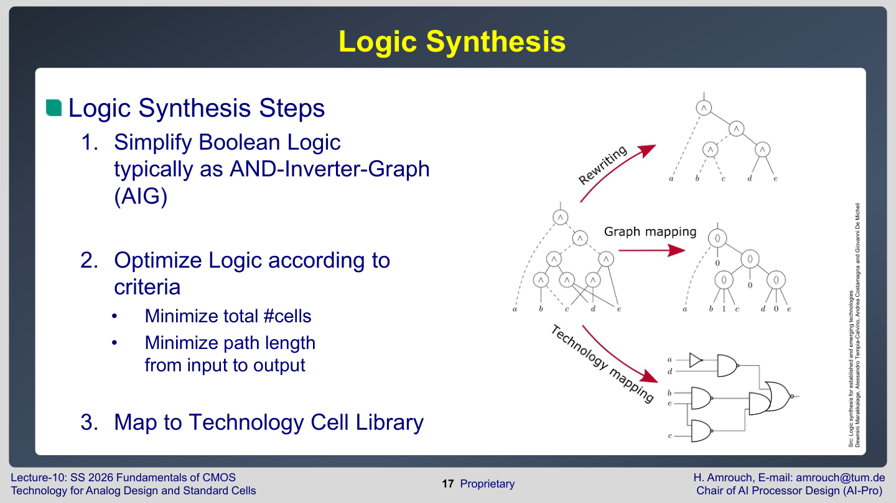

Logic synthesis는 Boolean logic을 실제 standard cell network로 바꾸는 과정이다. Lecture 10은 세 단계를 제시한다.

1. Boolean logic을<font color="#ffc000"> 단순화</font>한다.
2. 기준에 맞게 logic을 <font color="#ffc000">최적화</font>한다.
3. <font color="#ffc000">Technology cell library에 mapping</font>한다.

첫 단계에서는 내부 표현으로 **AND-Inverter Graph, AIG**를 자주 쓴다. AIG는 모든 논리를 2-input AND node와 inversion edge로 표현하는 graph다. 이렇게 하면 복잡한 Boolean function도 graph rewriting, graph mapping, technology mapping 같은 알고리즘으로 다루기 쉬워진다.

두 번째 단계의 최적화 기준은 슬라이드에 두 가지로 제시된다.

- <font color="#e84d4d">전체 cell 수 최소화</font>
- input에서 output까지 <font color="#e84d4d">path length 최소화</font>

실제 synthesis에서는 여기에 area, power, timing slack, fan-out, design rule도 함께 들어간다. Aging-aware synthesis에서는 "aged timing"과 "aged power"도 최적화 기준에 들어간다.

세 번째 단계에서는 논리 graph를 실제 standard cell library의 NAND, NOR, AOI, OAI, INV, buffer, flip-flop 등으로 바꾼다.<font color="#00b0f0"> 이때 library가 fresh 정보만 담고 있으면 synthesis는 aging 이후의 delay 악화를 모른다</font>. 반대로 degradation-aware library가 있으면 aging 이후까지 고려해 cell 선택을 바꿀 수 있다.

## 같은 Boolean function, 다른 회로 구조

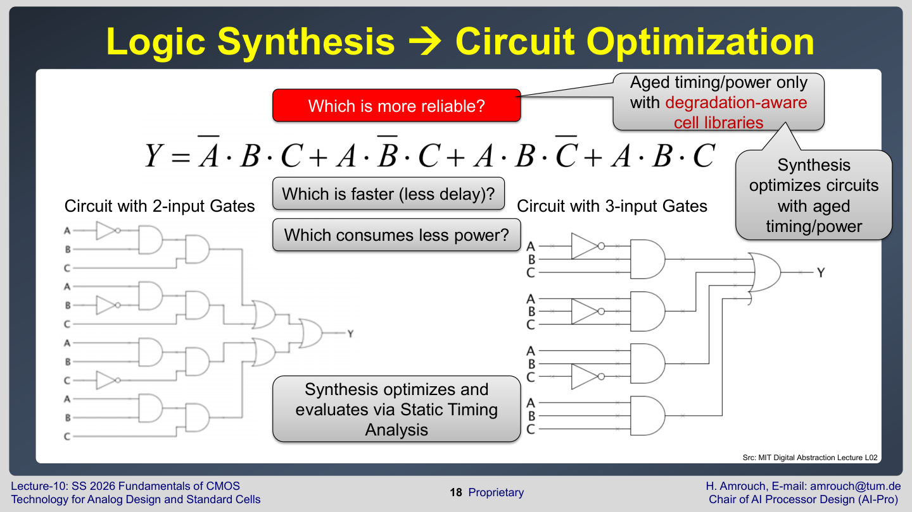

슬라이드의 Boolean function은 다음과 같다.

$$
Y = \overline{A}BC + A\overline{B}C + AB\overline{C} + ABC
$$

이 함수는 $A$, $B$, $C$ 중 적어도 두 개가 1이면 $Y=1$이 되는 **majority-of-three logic**이다. 같은 함수라도 여러 방식으로 구현할 수 있다.

| 구현 방식               | 가능한 장점                                                     | 가능한 단점                                                                 |
| ------------------- | ---------------------------------------------------------- | ---------------------------------------------------------------------- |
| **2-input** gate 위주 | 작은 gate를 많이 써서 <font color="#ffc000">library 선택이 유연함       | logic level이 길어져 delay가 커</font>질 수 있음                                 |
| **3-input** gate 위주 | <font color="#ffc000">gate 수와 logic level이 줄 수</font> 있음   | series transistor stack, input capacitance, 특정 path aging 민감도가 커질 수 있음 |
| **complex cell** 사용 | <font color="#ffc000">area/power/delay를 동시에</font> 줄일 수 있음 | cell별 aging 특성을 정확히 알아야 함                                              |

슬라이드가 던지는 질문은 세 가지다.

- Which consumes less power?
- Which is more reliable? 
- Which is faster, 즉 less delay인가?

정답은 회로 그림만 보고 항상 정해지지 않는다. Load, slew, input activity, transistor sizing, cell topology, aging mechanism을 함께 봐야 한다. 그래서 synthesis는 Static Timing Analysis, STA로 timing을 평가하고, cell library의 power table로 power를 평가한다.

중요한 결론은 다음이다.

```text
aged timing/power는 degradation-aware cell library가 있어야 synthesis가 볼 수 있다.
```

Fresh library만 쓰면 synthesis tool은<font color="#ffc000"> fresh 상태에서 빠른 회로를 만들 수는 있지만</font>, <font color="#ffc000">aging 후 어느 구조가 더 안전한지는 알 수 없다</font>.

## Aging-aware flow와 traditional flow 비교

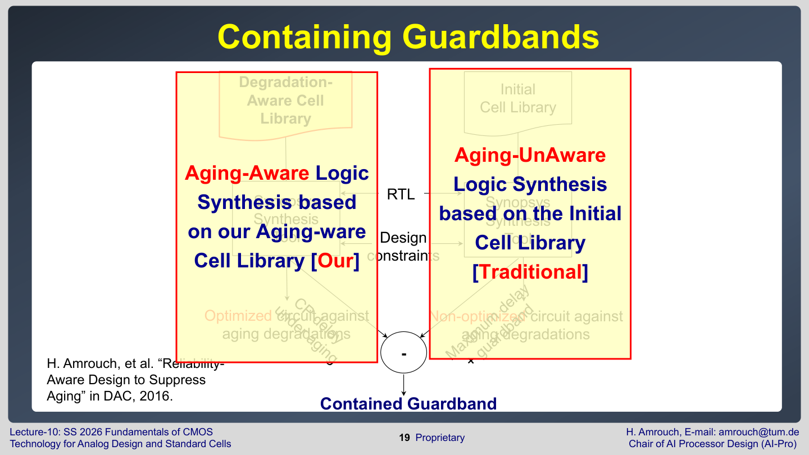

Lecture 10은 같은 synthesis flow를 두 갈래로 비교한다.

이 flow는 슬라이드가 인용한 Hussam Amrouch et al.의 DAC 2016 논문 Reliability-Aware Design to Suppress Aging의 관점과 연결된다.

| Flow                              | 사용하는 library                                  | 설계 성격                                                             |
| --------------------------------- | --------------------------------------------- | ----------------------------------------------------------------- |
| **Aging-unaware** logic synthesis | initial cell library                          | 전통적인 방식. <font color="#ffc000">fresh timing/power 기준</font>으로 최적화 |
| **Aging-aware** logic synthesis   | aging-aware 또는 degradation-aware cell library | <font color="#ffc000">aging 이후 timing/power까지 고려</font>해 최적화      |

<font color="#00b0f0">두 flow 모두 RTL과 design constraints를 입력으로</font> 받는다. <font color="#00b0f0">차이는 synthesis tool이 cell을 평가할 때 어떤 delay/power 정보를 사용하느냐</font>다.

Traditional flow에서는 aging을 나중에 guardband로 덮는다. 즉 설계는 aging을 모르고, 검증 단계에서 margin을 크게 잡는다.

Aging-aware flow에서는 aging을 library 단계에서 미리 반영한다. 따라서 synthesis가 다음과 같은 선택을 할 수 있다.

- <font color="#e84d4d">aging에 민감한 cell을 덜 사용</font>한다.
- **critical path**에는 <font color="#e84d4d">aged delay가 작은 cell</font>을 쓴다.
- <font color="#e84d4d">fresh delay가 조금 나쁘더라도 장기 delay 증가가 작은 구조</font>를 고른다.
- unnecessary guardband를 줄인다.

이 접근은 guardband를 없애는 것이 아니다. aging은 여전히 존재한다. 다만 <font color="#ffc000">실제 aging 영향을 더 정확히 반영해서 필요한 guardband만 남기는 것</font>이다.

## Guardband 감소 결과

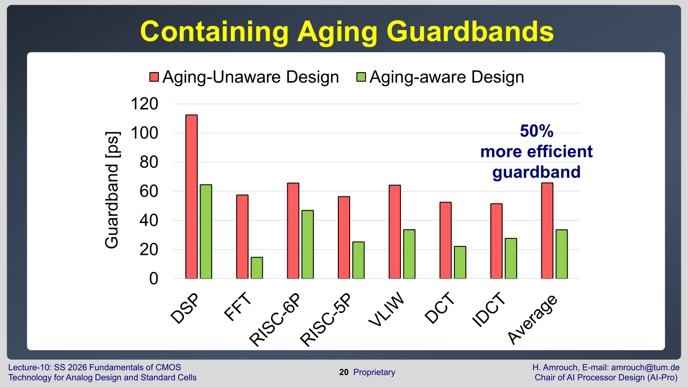

마지막 그래프는 benchmark별 guardband를 비교한다.

| 항목 | 의미 |
| --- | --- |
| x축 | DSP, FFT, RISC-6P, RISC-5P, VLIW, DCT, IDCT, Average |
| y축 | Guardband [ps] |
| 빨간 막대 | Aging-unaware design |
| 초록 막대 | Aging-aware design |

모든 benchmark에서 초록 막대가 빨간 막대보다 낮다. 즉 **aging-aware synthesis를 사용하면** <font color="#ffc000">같은 reliability 목표를 위해 필요한 timing guardband가 줄어든다</font>.

슬라이드에서 읽을 수 있는 대략적인 값은 다음과 같다. 정확한 수치보다 중요한 것은 <font color="#00b0f0">모든 benchmark에서 같은 방향의 감소가 나온다는 점</font>이다.

| Benchmark | Aging-unaware design | Aging-aware design |
| --- | ---: | ---: |
| DSP | 약 112 ps | 약 64 ps |
| FFT | 약 57 ps | 약 14 ps |
| RISC-6P | 약 65 ps | 약 46 ps |
| RISC-5P | 약 56 ps | 약 25 ps |
| VLIW | 약 64 ps | 약 33 ps |
| DCT | 약 52 ps | 약 22 ps |
| IDCT | 약 51 ps | 약 27 ps |
| Average | 약 66 ps | 약 33 ps |

Average 기준으로는<font color="#00b0f0"> guardband가 대략 절반 수준으로 감소</font>한다. 슬라이드는 이를 $50\%$ more efficient guardband라고 표현한다.

이 결과가 의미하는 바는 다음이다.

**aging-aware synthesis**는 <font color="#e84d4d">회로를 aging에 덜 민감한 구조로 만들어, 나중에 붙여야 하는 timing margin을 줄인다</font>.

이것은 성능을 회복한다는 뜻이기도 하다. <font color="#ffc000">Timing guardband가 작아지면 clock period를 덜 늘려도 되므로, 같은 reliability 조건에서 더 높은 frequency를 유지</font>할 수 있다.

다만 이 방법은 <font color="#e84d4d">degradation-aware cell library의 정확도에 크게 의존</font>한다. Library characterization이 실제 aging 조건, workload, temperature, voltage를 잘 반영하지 못하면 synthesis가 잘못된 선택을 할 수 있다.

## 시험 대비 핵심

- Guardband는 reliability를 위한 여유지만, voltage guardband는 power/temperature 비용을, timing guardband는 performance 비용을 만든다.
- Recovery는 stress 제거 후 자연적으로 일어나는 defect 회복이고, annealing은 높은 온도로 activation energy 장벽을 넘겨 더 강하게 defect를 회복시키는 방법이다.
- Annealing은 trapped charge 방출, oxide/interface trap 비활성화, 일부 결합 안정화로 $V_{th}$ shift를 줄이고 $I_{ON}$과 delay를 회복시킨다.
- 정상 동작 중 고온은 aging을 키울 수 있지만, annealing은 stress를 제어한 상태에서 회복 반응을 의도적으로 유도하는 열처리다.
- Dynamic stress는 oscillation과 current 때문에 BTI뿐 아니라 HCI도 포함하므로 static BTI stress보다 회복이 어려울 수 있다.
- Annealing은 제조 중 생긴 defect까지 완화할 수 있어 100% 이상의 recovery처럼 보일 수 있다.
- Self-heating은 $\Delta T=R_{\theta}P_{diss}$로 이해한다. Transistor-local 온도는 높을 수 있지만, CPU 전체 self-heating은 annealing 온도에 부족할 수 있다.
- On-chip heater는 annealing 온도를 만들 수 있지만 area와 power 비용이 있다. Self-heating은 heater가 올려야 할 온도를 줄이는 보조 역할을 할 수 있다.
- Aging-aware synthesis의 핵심은 initial library가 아니라 degradation-aware cell library를 사용해 aged delay/power를 기준으로 logic mapping을 최적화하는 것이다.
- 같은 Boolean function도 2-input gate, 3-input gate, complex cell 구현에 따라 delay, power, aging 민감도가 달라진다.
- Aging-aware design은 guardband를 없애는 것이 아니라, 실제 필요한 만큼으로 줄인다.

## 포함 범위

| 원본 | 페이지 | 문서 반영 위치 | 반영 상태 |
| --- | --- | --- | --- |
| Lecture 10 | p1 | 표지, 행정성 정보 | 제외 |
| Lecture 10 | p2 | Guardband를 왜 줄여야 하는가 | 반영 |
| Lecture 10 | p3 | Aging Annealing 섹션 구분 | p5-p12 본문에 통합 |
| Lecture 10 | p4 | IRPS 2024 paper 기반 설명 | Recovery와 annealing의 차이에 반영 |
| Lecture 10 | p5 | Recovery vs. Annealing 그래프 | 반영 |
| Lecture 10 | p6 | Recovery/irrecoverable/annealing 정의 | 반영 |
| Lecture 10 | p7 | Recovery/annealing 시간 그래프 | 반영 |
| Lecture 10 | p8 | 28 nm planar CMOS와 16 nm FinFET 비교 | 반영 |
| Lecture 10 | p9 | On-chip heater 구조 | 반영 |
| Lecture 10 | p10 | Nanowire self-heating | 반영 |
| Lecture 10 | p11 | Inverter self-heating | 반영 |
| Lecture 10 | p12 | RISC-V CPU self-heating | 반영 |
| Lecture 10 | p13 | Aging-aware synthesis 섹션 구분 | p15-p20 본문에 통합 |
| Lecture 10 | p14 | Aging-aware synthesis 제목 | p15-p20 본문에 통합 |
| Lecture 10 | p15 | Containing guardbands flow | 반영 |
| Lecture 10 | p16 | Aging 조건의 timing/power characterization | 반영 |
| Lecture 10 | p17 | Logic synthesis 단계 | 반영 |
| Lecture 10 | p18 | 2-input/3-input gate 회로 최적화 비교 | 반영 |
| Lecture 10 | p19 | Aging-aware vs aging-unaware synthesis | 반영 |
| Lecture 10 | p20 | Guardband 감소 benchmark 그래프 | 반영 |
