# 08. Aging이 전기 파라미터, 전력, 지연에 미치는 영향

## 이 장의 위치

이 장은 Lecture 11을 정리한다. 앞 장에서는 guardband를 줄이기 위해 recovery, annealing, aging-aware synthesis를 보았다. Lecture 11은 그보다 한 단계 아래 질문을 다룬다.

```text
aging은 실제 transistor와 standard cell의 전기적 파라미터를 어떻게 바꾸는가?
```

초기 학습에서는 aging을 $V_{th}$가 <font color="#00b0f0">증가하는 현상으로 단순화</font>했다. 하지만 Lecture 11의 핵심은 이 단순화가 부족하다는 점이다. BTI와 HCI로 생긴 defect와 charge는 threshold voltage만 바꾸지 않는다. Mobility, subthreshold slope, transconductance, capacitance, leakage, dynamic power, propagation delay까지 함께 바꾼다.

이 장은 aging-aware synthesis가 왜 degradation-aware cell library를 필요로 하는지 설명하는 연결 고리다.


## 핵심 질문

- 왜 aging을 단순한 $\Delta V_{th}$ shift로만 모델링하면 부족한가?
- BTI는 mobility, subthreshold slope, transconductance, gate-drain capacitance에 어떤 영향을 줄 수 있는가?
- Aging은 power를 줄이는가, 늘리는가?
- 왜 어떤 cell은 aging 후 delay가 늘고, 어떤 cell은 오히려 빨라질 수 있는가?
- Aging-aware synthesis는 cell library에 어떤 정보를 추가로 넣어야 하는가?

## Aging은 gate 근처의 charge 문제다

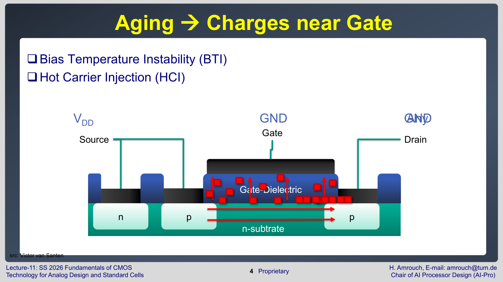

Lecture 11은 BTI와 HCI를 다시 gate 근처 charge 관점에서 시작한다.

| Aging mechanism | 주된 원인                                                                            | charge/defect가 생기는 위치      | 회로에 보이는 결과                                      |
| --------------- | -------------------------------------------------------------------------------- | -------------------------- | ----------------------------------------------- |
| **BTI**         | <font color="#00b0f0">gate bias</font>와 <font color="#00b0f0">temperature</font> | gate dielectric, interface | $V_{th}$ shift, leakage 변화, delay 변화            |
| **HCI**         | <font color="#00b0f0">높은 drain 전계</font>와 carrier energy                         | drain 근처 interface/oxide   | interface defect, mobility 저하, drive current 감소 |

**Gate dielectric**이나 silicon **interface 근처**에 <font color="#ffc000">charge가 생기면 channel 형성이 더 어려워진다</font>. NMOS 기준으로 gate가 minority carrier를 끌어당겨 inversion channel을 만들어야 하는데, <font color="#ffc000">defect charge가 그 전기장을 방해</font>한다. 그래서 같은 $V_{GS}$에서도 channel이 덜 잘 만들어지고, 더 큰 gate voltage가 필요해진다. 이것을 보통 threshold voltage shift, 즉 $\Delta V_{th}$로 표현한다.

하지만 이 설명은 첫 번째 근사일 뿐이다.<font color="#ffc000"> Charge는 단순히</font> $V_{th}$<font color="#ffc000">만 밀어내지 않는다</font>. <font color="#e84d4d">Channel을 흐르는 carrier의 이동, gate와 drain 사이의 capacitance, subthreshold 영역의 기울기까지 함께 바꿀 수 있다</font>.

## $\Delta V_{th}$만으로는 measured current를 맞출 수 없다

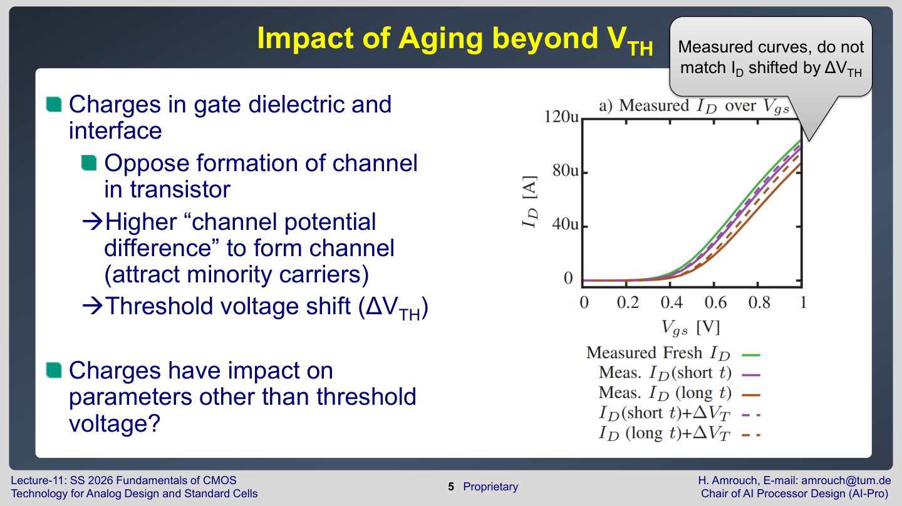

슬라이드는 measured $I_{D}$ curve가 <font color="#ffc000">단순히</font> $\Delta V_{th}$<font color="#ffc000">만큼 옆으로 이동한 곡선과 맞지 않는다</font>고 보여준다. 이것은 중요한 신호다.

MOSFET 전류를 아주 단순화하면 다음처럼 생각할 수 있다.

$$
I_{ON} \sim \mu C_{ox}\frac{W}{L}(V_{GS}-V_{th})^2
$$

| 항               | 의미                     | aging이 줄 수 있는 영향                                                                        |
| --------------- | ---------------------- | --------------------------------------------------------------------------------------- |
| $\mu$           | carrier mobility       | <font color="#ffc000">defect와 scattering 증가로 감소</font> 가능                               |
| $C_{ox}$        | gate oxide capacitance | <font color="#e84d4d">oxide 구조와 charge 환경에 따라 effective capacitance 변화</font> 가능        |
| $W/L$           | channel geometry       | aging 자체가 geometry를 바꾸지는 않지만, <font color="#e84d4d">effective drive strength는 바뀜</font> |
| $V_{GS}-V_{th}$ | overdrive voltage      | $V_{th}$ 증가로 <font color="#ffc000">감소                             </font>               |

$V_{th}$만 증가한다고 가정하면 전류 감소를 어느 정도 설명할 수 있다. 그러나 measured curve가 맞지 않는다는 것은 전류식의 다른 항도 바뀐다는 뜻이다.

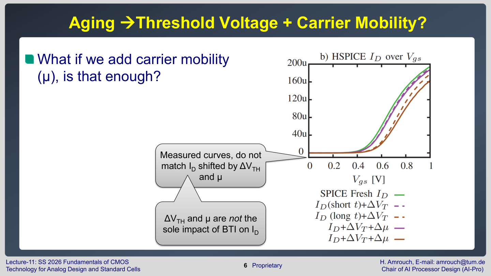

Lecture 11은 mobility $\mu$까지 추가해도 measured $I_{D}$ curve를 완전히 맞추지 못한다고 말한다. 즉 $\Delta V_{th}$와 $\Delta \mu$만으로도 부족하다.

이 결론은 model 관점에서 중요하다.

- 단순 model: aging 후 $V_{th}$만 증가시킨다.
- 조금 나은 model: $V_{th}$와 <font color="#00b0f0">mobility를 함께</font> 바꾼다.
- 더 필요한 model: <font color="#ffc000">subthreshold slope</font>, $g_{m}$, <font color="#ffc000">capacitance까지 포함</font>한다.

## Transconductance $g_{m}$도 aging의 영향을 받는다

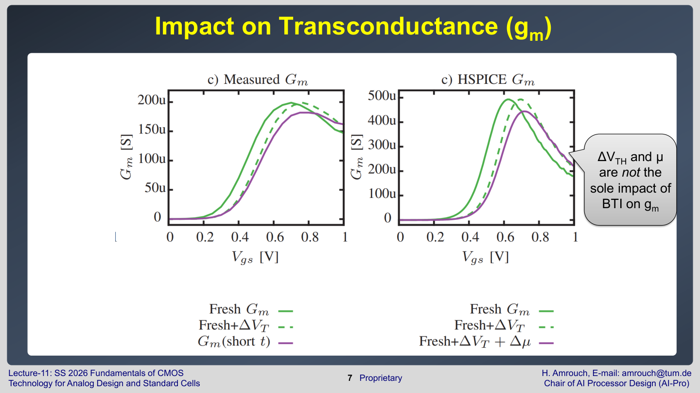

**Transconductance** $g_{m}$은 <font color="#00b0f0">gate voltage 변화가 drain current를 얼마나 강하게 바꾸는지</font>를 나타낸다.

$$
g_m = \frac{\partial I_D}{\partial V_{GS}}
$$

$g_{m}$이 크면 작은 input voltage 변화도 큰 current 변화로 이어진다. Analog 회로에서는 <font color="#ffc000">gain과 속도에 직접 중요</font>하고, digital cell에서도<font color="#ffc000"> switching edge와 delay에 영향</font>을 준다.

$\Delta V_{th}$와 $\Delta \mu$만으로 $g_{m}$ 변화를 설명할 수 없다면, aging model은 <font color="#00b0f0">drive current의 크기뿐 아니라 curve의 모양까지 잘못 예측할 수 있다</font>. 이것은 library characterization에서 큰 문제다. Cell delay table은 input slew와 load capacitance에 따라 delay를 저장하는데, $g_{m}$<font color="#ffc000">이 틀리면 switching waveform 자체가 틀어진다.</font>

## Subthreshold slope를 빼면 leakage 감소를 과대평가한다

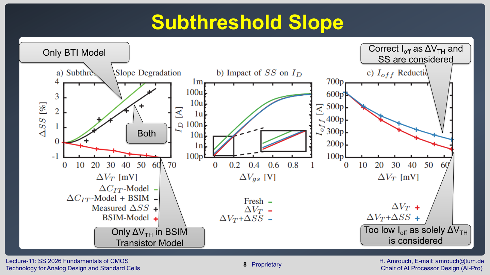

**Subthreshold slope**는 <font color="#e84d4d">OFF 근처에서 gate voltage를 조금 바꿀 때 drain current가 얼마나 빨리 변하는지</font>를 나타낸다. 보통 $\mathrm{mV/decade}$ 단위로 표현한다. <font color="#ffc000">값이 작을수록 gate가 channel을 더 날카롭게 제어</font>한다.

Subthreshold 영역의 전류는 대략 지수 형태다.

$$
I_D \approx I_0 \exp\left(\frac{V_{GS}-V_{th}}{nV_T}\right)
$$

| 항        | 의미                            |
| -------- | ----------------------------- |
| $I_{0}$  | 기준 전류                         |
| $V_{GS}$ | gate-source voltage           |
| $V_{th}$ | threshold voltage             |
| $n$      | **subthreshold slope factor** |
| $V_{T}$  | thermal voltage               |

OFF current $I_{OFF}$는 $V_{GS}=0$ 근처의 전류다. $V_{th}$가 증가하면 $I_{OFF}$는 줄어든다. 그래서 단순 model은 aging이 leakage를 크게 줄인다고 예측한다.

**문제는 aging이 subthreshold slope도 바꾼다는 점**이다. <font color="#ffc000">Slope가 나빠지면 gate control이 둔해지고, OFF 영역 전류가 생각보다 크게 남을 수 있다</font>.

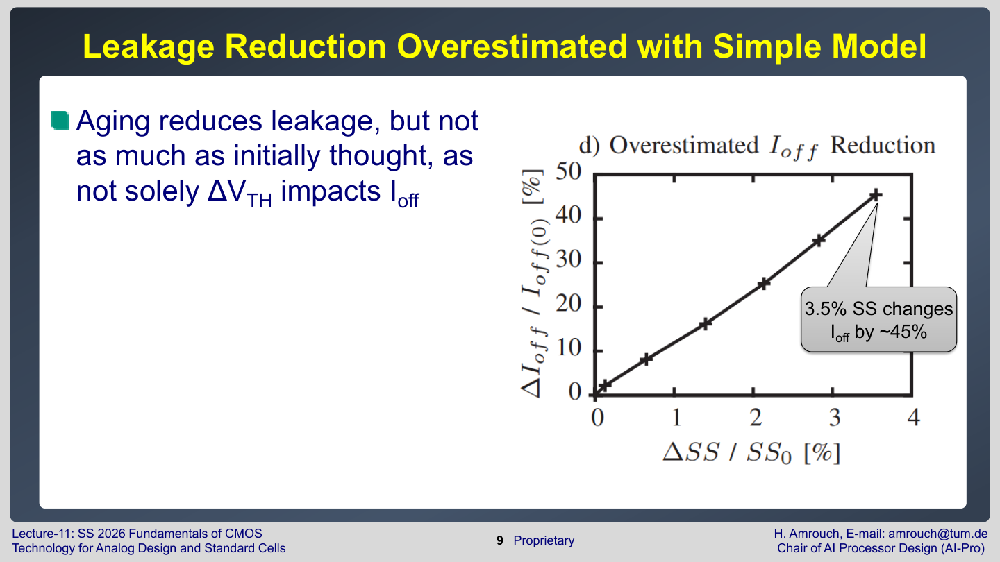

슬라이드는 $3.5\%$<font color="#ffc000">의 subthreshold slope 변화가</font> $I_{OFF}$<font color="#ffc000">를 약 45% 바꿀 수 있다</font>고 말한다. 이 숫자가 중요한 이유는 <font color="#00b0f0">leakage가 지수적으로 변하기 때문</font>이다. $V_{th}$ shift만 넣은 model은 leakage 감소를 과대평가할 수 있다.

정리하면 다음과 같다.

| Model                | 고려하는 것                                        | $I_{OFF}$ 예측 위험                               |
| -------------------- | --------------------------------------------- | --------------------------------------------- |
| $\Delta V_{th}$ only | threshold voltage shift만 반영                   | leakage가 너무 낮게 예측될 수 있음                       |
| BTI model only       | BTI effect 일부만 반영                             | <font color="#00b0f0">다른 파라미터 변화 누락</font> 가능 |
| $\Delta V_{th}+SS$   | <font color="#ffc000">threshold와 slope를 함께 반영 | OFF current 예측이 더 현실적 </font>                 |

시험에서 중요한 문장은 이것이다.

**Aging은 leakage를 줄이는 경향**이 있지만, <font color="#e84d4d">Delta Vth만 고려하면 그 감소량을 과대평가</font>할 수 있다.


## 온도 상승  vs.  Aging의 영향 제대로 이해하기

>**온도 상승** 효과는 “<font color="#e84d4d">재료/통계 상태가 바뀌어서 필요한 band bending이 줄어드는 효과</font>”
>vs 
>**Aging 효과**는 “<font color="#e84d4d">oxide/interface에 새 전하나 trap이 생겨 gate 전압 일부가 상쇄되는 효과</font>”


**<온도 상승>**
온도 상승에서 $V_{th}$가 감소하는 주된 이유는 trap carrier의 운동량이라기보다, <font color="#ffc000">반도체 내부의 carrier 통계가 바뀌기 때문</font>입니다. 예를 들어 NMOS에서 대략

$$V_{th}=V_{FB}+2\phi_F+\frac{\sqrt{4q\epsilon_{si}N_A\phi_F}}{C_{ox}}$$

이고,
$$\phi_F=\frac{kT}{q}\ln\left(\frac{N_A}{n_i}\right)$$

입니다. 온도가 올라가면 intrinsic carrier concentration $n_i$가 크게 증가하고, 결과적으로 $\phi_F$가 줄어듭니다. 그러면<font color="#00b0f0"> inversion을 만들기 위해 필요한 surface potential과 depletion charge 항이 줄어서</font> $V_{th}$가 내려가는 경향이 생깁니다. 쉽게 말하면, <font color="#ffc000">고온에서는 carrier가 열적으로 더 쉽게 생기고 분포도 넓어져서 “채널을 만들기 위해 gate가 밀어줘야 하는 electrostatic 조건”이 약해집니다</font>.


**<Aging 발생>**
Aging은 반대로, gate oxide나 Si/oxide interface에 <font color="#00b0f0">새로운 trapped charge와 interface trap을 남기는 쪽</font>입니다. 여기서 중요한 점은 “major carrier가 그냥 쌓여서 서로 밀어낸다”라기보다, 그 <font color="#e84d4d">trap charge가 gate가 채널에 걸어주는 전기장을 일부 가로막거나 보상해서, 같은 inversion을 만들려면 더 큰 gate bias가 필요해진다</font>는 것입니다.

**BTI**는 vertical field가 강한 상태에서 oxide/interface defect가 생성되거나 carrier가 trap되는 현상입니다. **NMOS의 PBTI**에서는 <font color="#ffc000">electron trapping이 대표적</font>이고, <font color="#e84d4d">trapped negative charge가 gate의 positive field를 부분적으로 상쇄</font>합니다. 그래서 같은 electron channel을 만들려면 더 큰 $V_{GS}$가 필요해져 $V_{th}$가 증가합니다. **PMOS의 NBTI**에서는 $V_{th}$<font color="#ffc000">가 더 negative해지는 방향</font>, 즉 $|V_{th}|$가 증가하는 방향으로 이해하면 됩니다. <font color="#ffc000">회로 관점에서는 둘 다 “켜기 어려워진다”</font>로 보면 됩니다.

**HCI**는 위치가 다릅니다. drain 근처의 큰 lateral electric field 때문에 carrier가 높은 에너지를 얻고, oxide/interface에 주입되거나 defect를 만듭니다. 그래서 <font color="#00b0f0">drain 근처에 localized trap/interface state가 생깁니다</font>. 이것도 <font color="#ffc000">단순히 carrier가 쌓이는 것이 아니라</font>, <font color="#e84d4d">소자 내부의 전하 환경과 scattering 환경이 망가지는 것</font>입니다. 결과적으로 $V_{th}$ shift, mobility 감소, $g_{m}$ 감소, $I_{ON}$ 감소가 나타납니다.


| 현상        | 본질                                      | $V_{th}$ 경향                           |
| --------- | --------------------------------------- | ------------------------------------- |
| 온도 즉시 상승  | carrier 통계, $n_i$, bandgap, $\phi_F$ 변화 | 보통 감소                                 |
| BTI aging | oxide/interface trap charge 생성          | 켜기 어려워짐, $                            |
| HCI aging | drain 근처 hot carrier damage/trap 생성     | 대체로 $V_{th}$ 증가 및 mobility/current 악화 |

따라서 “<font color="#ffc000">온도가 올라가면 즉시</font> $V_{th}$<font color="#ffc000">는 내려갈 수 있지만</font>, <font color="#e84d4d">높은 온도는 동시에 aging 반응을 빠르게 해서 장기적으로는</font> $V_{th}$ <font color="#e84d4d">shift를 키울 수 있다</font>”가 정확한 그림


## Defect charge는 capacitance처럼도 작용한다

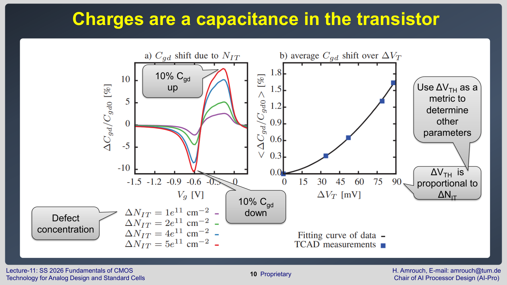

Gate dielectric과 interface에 생긴<font color="#ffc000"> charge는 전기장을 바꾸므로 capacitance에도 영향</font>을 준다. 슬라이드는 $C_{gd}$가 defect concentration에 따라 증가하거나 감소할 수 있음을 보여준다. 여기서 $C_{gd}$는 gate-drain capacitance다.

>Transistor에서는 <font color="#ffc000">Defect에 붙잡힌 Carrier가 Charge를 형성</font>
>$\rightarrow$ $Q=CV$에 의해 <font color="#e84d4d">Charge의 형성은 Capacitance의 변동</font>을 의미함

$C_{gd}$가 중요한 이유는 switching할 때 gate와 drain 사이가 <font color="#ffc000">capacitive coupling으로 연결</font>되기 때문이다. Digital cell에서 capacitance가 커지면 다음 dynamic power 항이 커질 수 있다.

$$
P_{dyn} \approx \alpha C_L V_{DD}^2 f
$$

| 항 | 의미 | 커지면 |
| --- | --- | --- |
| $\alpha$ | switching activity | dynamic power 증가 |
| $C_{L}$ | effective load capacitance | dynamic power 증가, delay 증가 |
| $V_{DD}$ | supply voltage | dynamic power가 제곱으로 증가 |
| $f$ | switching frequency | dynamic power 증가 |

$C_{gd}$가 변하면 effective capacitance와 waveform이 바뀐다. 그래서<font color="#ffc000"> aging이 dynamic power와 delay에 영향을 줄 수 있다</font>. 단순히 $V_{th}$가 증가해서 current가 감소한다는 설명만으로는 부족하다.

슬라이드는 $\Delta V_{th}$가 $\Delta N_{IT}$에 비례한다고 말한다. $N_{IT}$는 <font color="#92d050">interface trap density</font>다. 따라서 $\Delta V_{th}$를 하나의 aging severity metric으로 쓸 수 있다. 중요한 점은 $\Delta V_{th}$만이 영향이라는 뜻이 아니다. $\Delta V_{th}$를 기준 변수로 삼아 mobility, subthreshold slope, capacitance 같은 다른 파라미터 변화를 모델링할 수 있다는 뜻이다.

## BTI가 바꾸는 전기 파라미터 정리

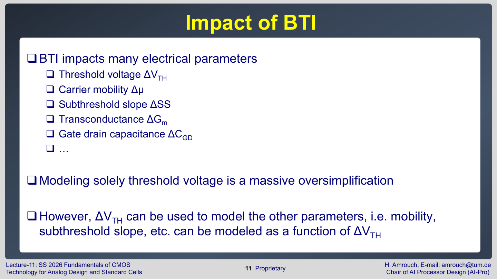

Lecture 11의 중간 결론은 다음과 같다.

| 파라미터            | 의미                         | aging 후 회로 영향                                                                                       |
| --------------- | -------------------------- | --------------------------------------------------------------------------------------------------- |
| $\Delta V_{th}$ | threshold voltage shift 상승 | <font color="#ffc000">drive current 감소</font>, delay 증가,<font color="#ffc000"> leakage 감소 </font>경향 |
| $\Delta \mu$    | mobility 변화                | <font color="#ffc000">carrier 이동 저하</font>, ON current 감소                                           |
| $\Delta SS$     | **subthreshold slope 변화**  | OFF current 예측 변화                                                                                   |
| $\Delta g_{m}$  | transconductance 변화        | waveform, delay, analog gain 변화                                                                     |
| $\Delta C_{gd}$ | gate-drain capacitance 변화  | dynamic power, delay, coupling 변화                                                                   |

따라서 $V_{th}$만 aging model에 넣는 것은 큰 단순화다. 하지만 $\Delta V_{th}$는 여전히 유용하다. <font color="#00b0f0">다른 파라미터 변화를</font> $\Delta V_{th}$<font color="#00b0f0">의 함수로 표현하면, aging severity를 하나의 축으로 정리</font>할 수 있기 때문이다.

## Aging이 power에 미치는 영향

Lecture 11의 power 파트는 NBTI와 PBTI를 나누어 보고, 다시 둘을 함께 보면서 cell-level power를 해석한다.

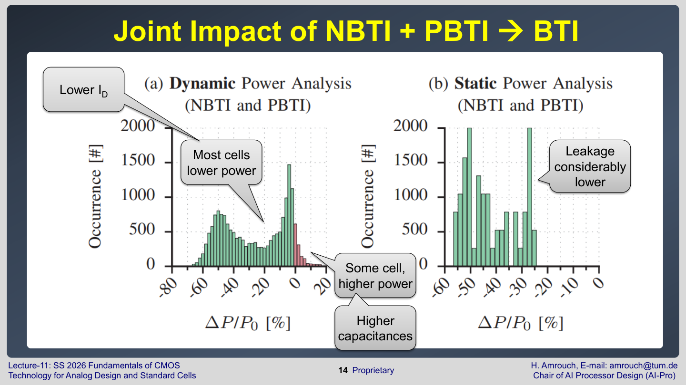

NBTI는 주로 PMOS에서, PBTI는 주로 NMOS에서 중요한 bias temperature instability다. 실제 CMOS cell에서는 PMOS network와 NMOS network가 함께 존재하므로 <font color="#00b0f0">둘을 따로만 보면 전체 power를 잘못 예측</font>할 수 있다.

슬라이드의 핵심 관찰은 다음과 같다.

- 대부분의 cell은 aging 후 power가 낮아진다.
- 어떤 cell은 aging 후 power가 높아질 수 있다.
- <font color="#ffc000">Leakage는 상당히 낮아지는 경향</font>이 있다.
- 하지만<font color="#e84d4d"> capacitance 증가나 waveform 변화 때문에 dynamic power는 항상 단순히 감소한다고 말할 수 없다</font>.

Power는 크게 두 부분으로 나눈다.

$$
P_{total} = P_{dyn} + P_{leak}
$$

Leakage power는 OFF 상태에서도 흐르는 전류 때문에 생긴다.

$$
P_{leak} \approx I_{leak} V_{DD}
$$

$V_{th}$가 올라가면 보통 $I_{leak}$가 줄어든다. 그래서 leakage power는 aging 후 감소하는 경향이 있다. 그러나 dynamic power는 effective capacitance, short-circuit current, waveform, switching path에 영향을 받는다. 그래서 cell마다 결과가 다를 수 있다.

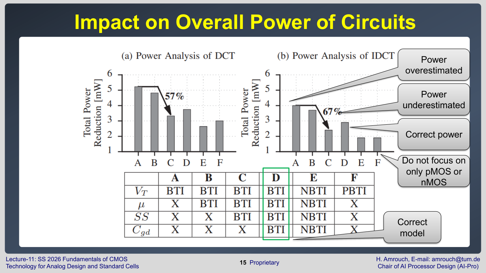

Lecture 11은 "<font color="#ffc000">PMOS만 보거나 NMOS만 보지 말라</font>"고 강조한다. **CMOS cell**의 <font color="#00b0f0">power는 pull-up network와 pull-down network, input pattern, output transition, load가 함께 결정</font>한다.

| 관점                 | 위험                                                                    |
| ------------------ | --------------------------------------------------------------------- |
| **PMOS aging**만 보기 | NMOS PBTI와 pull-down path 영향을 놓침                                      |
| **NMOS aging**만 보기 | PMOS NBTI와 pull-up path 영향을 놓침                                        |
| $V_{th}$만 보기       | capacitance, $g_{m}$, subthreshold slope 변화를 놓침                       |
| **cell 평균만** 보기    | <font color="#00b0f0">특정 input transition에서 power가 증가하는 경우</font>를 놓침 |

Lecture 11의 power 결론은 다음이다.

```text
Aging은 회로의 total power를 줄이는 경향이 있다.
Aging은 leakage power를 줄인다.
Aging은 대부분의 경우 dynamic power도 줄이지만, cell과 transition에 따라 예외가 있다.
```

## Aging이 delay에 미치는 영향

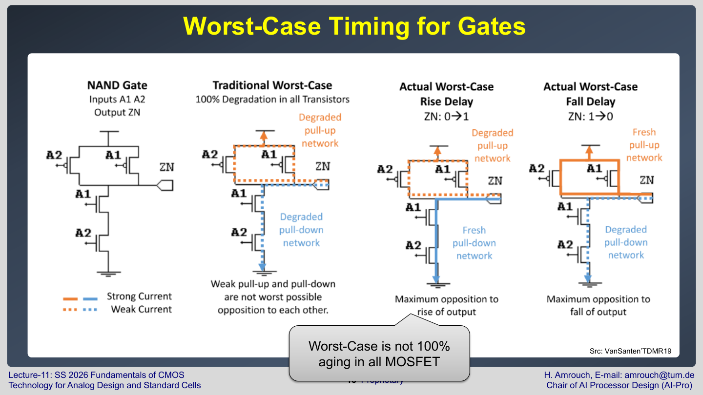

Delay 파트의 첫 번째 메시지는 **worst-case timing**이 단순히 "<font color="#00b0f0">모든 MOSFET이 100% aging된 상태"가 아니라는 점</font>이다.

Cell delay는 특정 input transition에서 output이 rise 또는 fall하는 데 걸리는 시간이다. 이때 실제로 delay에 영향을 주는 transistor는 그 transition의 active path에 있는 소자다. 어떤 transistor는 켜져 있고, 어떤 transistor는 꺼져 있으며, 어떤 transistor는 output 전환에 거의 영향을 주지 않을 수 있다.

그래서 cell-level worst case를 찾으려면 다음 조건을 같이 봐야 한다.

| 조건 | 왜 필요한가 |
| --- | --- |
| input vector | 어떤 transistor가 stress를 받았는지 결정 |
| output transition direction | pull-up delay인지 pull-down delay인지 결정 |
| transistor stack | 직렬 stack이면 resistance와 delay가 커짐 |
| load capacitance | output이 충전/방전해야 하는 양 결정 |
| input slew | transistor가 켜지는 속도와 short-circuit current에 영향 |

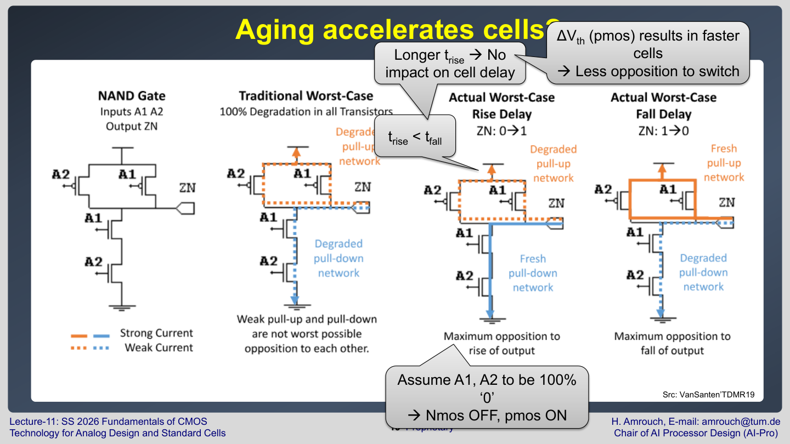

슬라이드는 <font color="#e84d4d">aging이 어떤 cell을 오히려 빠르게 만들 수 있음</font>을 보여준다. 처음 보면 이상하지만, cell delay의 정의를 보면 이해할 수 있다.

예를 들어 어떤 cell에서 $t_{rise}<t_{fall}$이고, 전체 cell delay를 결정하는 worst transition이 fall 쪽이라고 하자. <font color="#00b0f0">PMOS aging 때문에 rise transition이 느려져도, 여전히 fall transition보다 빠르면 cell의 worst delay는 변하지 않는다</font>. 반대로 aging이 특정 path의 opposition을 줄이거나 waveform을 바꾸면, 측정된 delay가 짧아지는 경우도 생길 수 있다.

중요한 해석은 이것이다.


>Aging은 transistor 하나의 성능을 보통 악화시키지만, **cell delay라는 측정값**은 <font color="#e84d4d">input pattern과 transition path에 따라 증가하지 않을 수도 있다</font>.


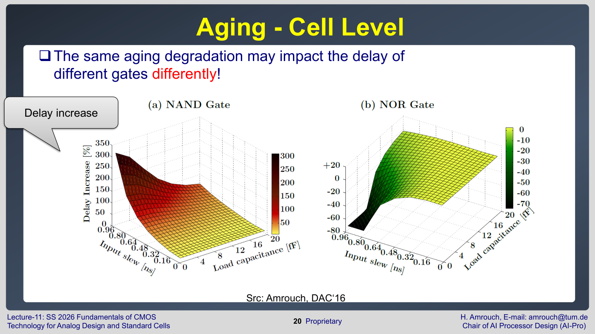

<font color="#ffc000">같은 aging degradation도 gate마다 delay에 다르게 작용</font>한다. NAND, NOR, AOI, inverter는 PMOS/NMOS의 <font color="#ffc000">직렬/병렬 구조가 다르다</font>. 그래서 <font color="#e84d4d">같은</font> $\Delta V_{th}$<font color="#e84d4d">라도 propagation delay 변화량은 cell topology에 따라 달라진다</font>.

Lecture 11의 delay 결론은 다음이다.

- Aging은 대부분의 회로에서 propagation delay를 늘린다.
- 대부분의 cell은 aging 후 느려진다.
- <font color="#00b0f0">일부 cell은 특정 transition에서 더 빨라질 수 있다</font>.
- 그래도 <font color="#00b0f0">전체 회로 수준에서는 critical path가 느려지는 경우</font>가 많다.

## Aging-aware synthesis에 필요한 정보

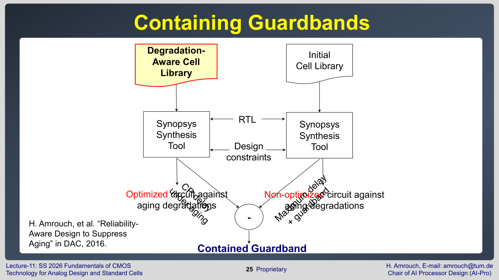

기존 synthesis flow는 RTL과 design constraints를 입력으로 받고 initial cell library를 사용해 circuit을 만든다. Aging-aware synthesis는 여기에 degradation-aware cell library를 추가한다.

| Flow                        | 사용하는 library                                                | 결과                                                              |
| --------------------------- | ----------------------------------------------------------- | --------------------------------------------------------------- |
| **Aging-unaware** synthesis | <font color="#ffc000">fresh 상태의 initial</font> cell library | aging 후 delay/power<font color="#00b0f0"> 변화가 반영되지 않은</font> 회로 |
| **Aging-aware** synthesis   | <font color="#ffc000">degradation-aware </font>cell library | <font color="#00b0f0">aging 후 delay/power까지 고려</font>해 cell 선택  |

Degradation-aware cell library는 단순히 "이 cell은 aging 후 느려진다" 정도의 정보가 아니다. <font color="#ffc000">Cell마다 input transition, load, slew, aging severity에 따른 delay와 power를 포함</font>해야 한다.

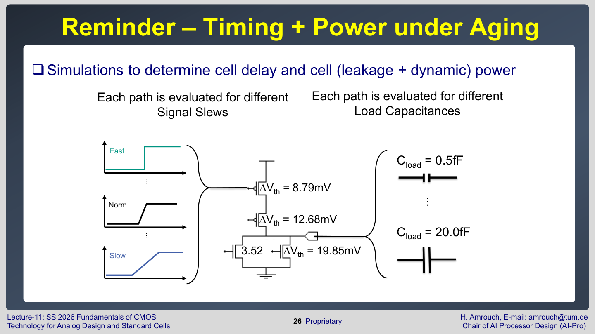

Library characterization에서는 각 path를 여러 조건에서 평가한다.

| Characterization 축 | 의미 |
| --- | --- |
| load capacitance | output이 구동해야 하는 capacitance |
| signal slew | input transition의 빠르기 |
| $\Delta V_{th}$ | aging severity |
| delay | rise/fall propagation delay |
| power | leakage와 dynamic power |

슬라이드는 $\Delta V_{th}=8.79\,\mathrm{mV}$, $12.68\,\mathrm{mV}$, $19.85\,\mathrm{mV}$ 같은 aging level을 예시로 보여준다. Load도 $0.5\,\mathrm{fF}$에서 $20.0\,\mathrm{fF}$처럼 여러 값으로 바꾼다. 이렇게 만든 table을 synthesis tool이 사용하면,<font color="#ffc000"> fresh 상태에서만 빠른 cell이 아니라 aging 후에도 guardband를 덜 필요로 하는 cell을 고를 수 있다</font>.

## Logic synthesis와 cell selection

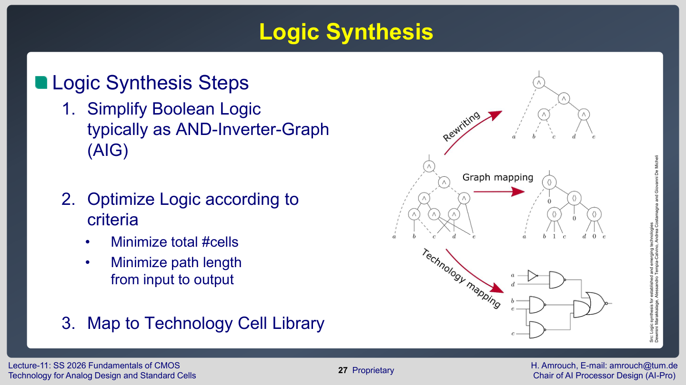

Logic synthesis는 크게 세 단계로 볼 수 있다.

1. Boolean logic을 단순화한다. 보통 AND-Inverter Graph, AIG 같은 내부 표현을 쓴다.
2. 최적화 기준에 따라 logic을 바꾼다. 예를 들어 cell 수를 줄이거나 input-output path length를 줄인다.
3. Technology cell library에 mapping한다. 즉 논리식을 실제 NAND, NOR, AOI, inverter 같은 standard cell로 바꾼다.

Fresh 상태에서는 delay가 빠르고 power가 낮은 cell이 좋아 보일 수 있다. 하지만 aging-aware synthesis에서는 다른 질문을 한다.


>이 cell은 aging 후에도 timing을 잘 지키는가?
>이 cell은 aging 후 power가 어떻게 변하는가?
>이 cell을 쓰면 guardband를 얼마나 줄일 수 있는가?


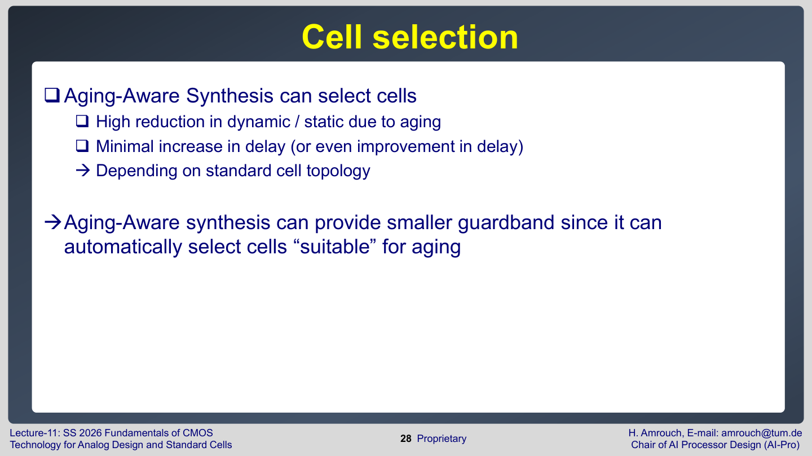

Aging-aware synthesis는 다음과 같은 cell을 선호할 수 있다.

- aging 후 <font color="#ffc000">dynamic/static power가 많이 줄어드는 cell</font>
- aging 후 <font color="#ffc000">delay 증가가 작은 cell</font>
- **특정 transition**에서 <font color="#ffc000">delay가 거의 변하지 않거나 개선되는 cell</font>
- **critical path**에 놓였을 때 <font color="#ffc000">guardband 요구량을 줄이는 cell</font>

이것은 무조건 큰 drive strength cell을 쓰는 것과 다르다. Drive strength를 키우면 fresh delay는 줄 수 있지만 area와 capacitance가 늘어 power가 증가할 수 있다. **Aging-aware synthesis**의 목표는<font color="#e84d4d"> aging 후 timing과 power를 함께 고려해 guardband overhead를 줄이는 것</font>이다.

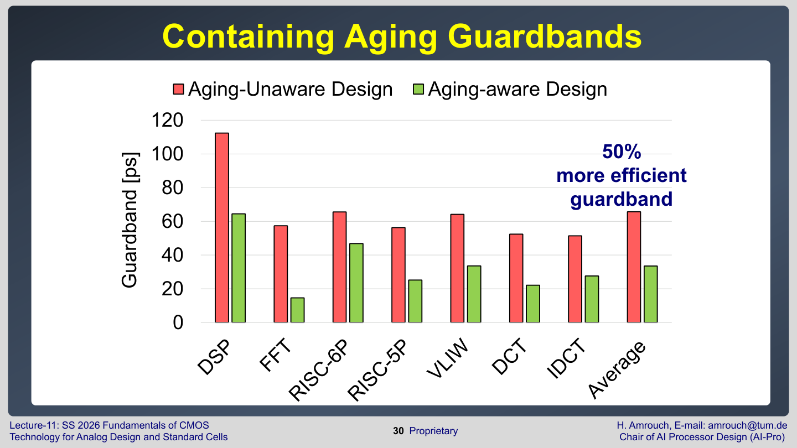

마지막 슬라이드는 aging-aware design이 guardband를 약 $50\%$ 더 효율적으로 만들 수 있음을 보여준다. 여기서 "효율적"이라는 말은 같은 aging protection을 더 작은 guardband로 달성한다는 뜻이다.

시험 답안에서는 다음처럼 쓰면 정확하다.


> Aging-aware synthesis는 degradation-aware cell library를 이용해 *aging 후 delay/power를 예측하고, aging에 더 적합한 cell topology를 선택*한다. 그래서 *aging-unaware design보다 필요한 timing guardband를 줄일 수 있다*.

## 시험 대비 핵심

- Aging을 $\Delta V_{th}$ 증가로만 보는 것은 과도한 단순화다.
- BTI는 $V_{th}$, mobility, subthreshold slope, $g_{m}$, $C_{gd}$ 등 여러 electrical parameter를 바꿀 수 있다.
- $\Delta V_{th}$는 유용한 aging severity metric이지만, 영향 전체를 뜻하지는 않는다.
- Subthreshold slope 변화를 빼면 $I_{OFF}$와 leakage power 감소를 과대평가할 수 있다.
- Aging은 total power와 leakage power를 줄이는 경향이 있지만, dynamic power는 cell과 transition에 따라 다를 수 있다.
- Worst-case timing은 모든 transistor가 동일하게 aged된 상태가 아니라, 실제 critical transition과 path에 의해 결정된다.
- 어떤 cell은 aging 후 특정 delay가 짧아질 수 있지만, 전체 회로에서는 critical path delay가 증가하는 경우가 많다.
- Aging-aware synthesis에는 load, slew, aging severity별 delay/power를 담은 degradation-aware cell library가 필요하다.
- Aging-aware cell selection은 guardband를 줄이는 설계 자동화 방법이다.

## 포함 범위

- Lecture 11: pages 2-30
- 주요 제외: 표지, 반복 section divider 자체
- 핵심 반영: BTI/HCI charge, $\Delta V_{th}$ 한계, mobility, subthreshold slope, $g_{m}$, $C_{gd}$, power 영향, delay 영향, degradation-aware library, aging-aware synthesis, guardband 감소 결과
