# 09. 오류, 마스킹, 근사 컴퓨팅

## 이 장의 위치

이 장은 Lecture 12를 정리한다. 앞 장에서는 aging이 electrical parameter, power, delay를 어떻게 바꾸는지 보았다. Lecture 12는 그 결과가 실제 digital logic에서 어떤 오류로 이어지는지, 그리고 오류를 무조건 막는 대신 제어 가능한 품질 저하로 바꾸는 방법을 다룬다.

핵심 흐름은 다음과 같다.

```text
aging -> delay 증가 -> timing error 가능성 -> error가 항상 fault는 아님 -> masking과 approximation을 이용해 guardband를 줄일 수 있음
```

이 장은 reliability와 approximate computing을 연결한다. <font color="#00b0f0">모든 오류를 같은 무게로 보지 않고, 어디에서 언제 생긴 오류가 실제 출력 품질에 영향을 주는지 따진다</font>.

## 핵심 질문

- Timing violation과 data corruption은 무엇이 다른가?
- Error와 fault는 왜 같은 말이 아닌가?
- Logic masking과 latch masking은 어떤 방식으로 오류 전파를 막는가?
- 왜 MSB error는 LSB error보다 더 위험한가?
- Approximate computing은 delay, power, energy를 줄이기 위해 무엇을 포기하는가?
- Aging-induced approximation은 guardband를 어떤 품질 trade-off로 바꾸는가?

## CMOS logic에서 생기는 오류

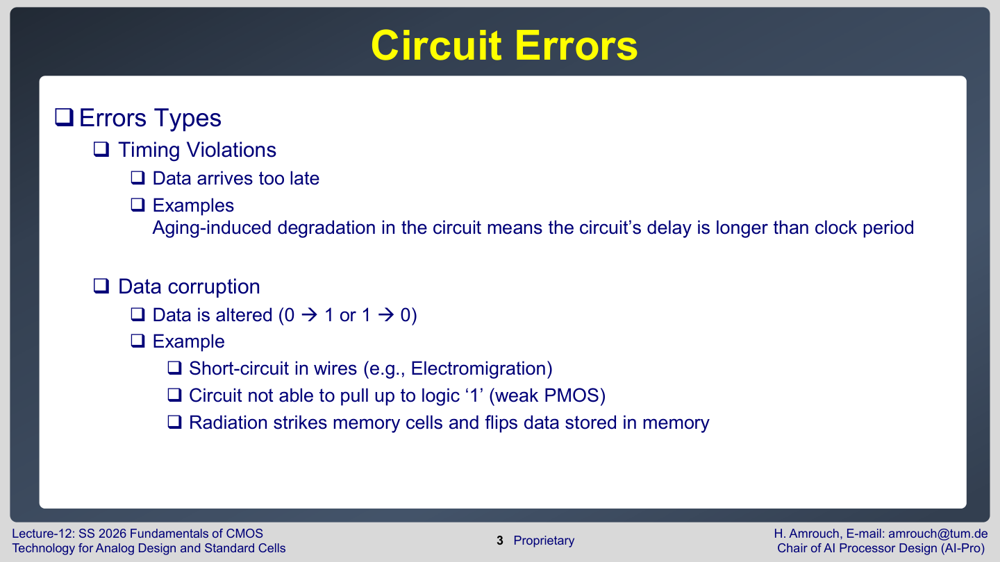

Lecture 12는 circuit error를 크게 두 종류로 나눈다.

| Error type           | 의미                                                         | 예시                                                                            |
| -------------------- | ---------------------------------------------------------- | ----------------------------------------------------------------------------- |
| **Timing violation** | data가 <font color="#ffc000">clock deadline보다 늦게 도착</font>함 | aging으로 critical path delay가 clock period보다 길어짐                               |
| **Data corruption**  | data <font color="#ffc000">값 자체가 바뀜                        | wire short</font>, weak PMOS로 logic 1 pull-up 실패, radiation으로 memory bit flip |

**Timing violation**은 값이 틀렸다기보다<font color="#ffc000"> 시간이 늦은 문제</font>다. Combinational logic의 <font color="#ffc000">계산 결과가 맞더라도 flip-flop이 sampling하는 clock edge까지 도착하지 못하면 잘못된 값이 저장될 수 있다</font>.

**Data corruption**은 <font color="#ffc000">logic value가 직접 바뀌는 문제</font>다. 예를 들어 원래 $0$이어야 할 bit가 $1$로 바뀌거나, 원래 $1$이어야 할 bit가 $0$으로 바뀐다.

**Aging**은 두 오류 중 <font color="#e84d4d">특히 timing violation과 강하게 연결</font>된다. Aging이 $V_{th}$<font color="#00b0f0">를 올리고 drive current를 낮추면 propagation delay가 길어질 수 있다</font>. Clock period가 그대로라면 **setup timing을 만족하지 못한다**.

## Error는 항상 fault가 아니다

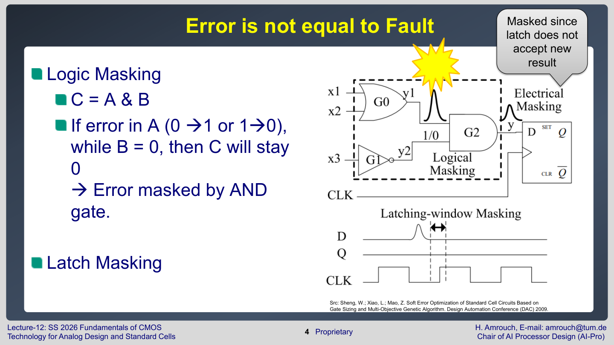

Lecture 12의 중요한 구분은 error와 fault다.

| 용어        | 의미                                                                |
| --------- | ----------------------------------------------------------------- |
| **Error** | 회로 내부의 어떤 signal이 <font color="#ffc000">원래 값과 달라진 상태</font>       |
| **Fault** | 그 error가 시스템의 <font color="#ffc000">관측 가능한 잘못된 동작으로 이어진 상태</font> |

<font color="#e84d4d">내부 error가 생겨도 반드시 출력 fault가 되지는 않는다</font>. 그 이유가 **masking**이다.

### Logic masking

AND gate를 보자.

$$
C = A \land B
$$

만약 $B=0$이면, $A$가 $0$이든 $1$이든 출력 $C$는 항상 $0$이다. 따라서 $A$에서 <font color="#00b0f0">bit flip error가 생겨도 출력으로 전파되지 않는다</font>.

| 조건 | $A$ error 영향 | 출력 $C$ |
| --- | --- | --- |
| $B=0$ | masking됨 | 항상 0 |
| $B=1$ | 전파됨 | $A$ 값에 따라 바뀜 |

이것이 **logic masking**이다. <font color="#ffc000">Boolean function 자체가 특정 입력 오류를 가려서 출력 변화로 이어지지 않게 만든다</font>.

### Latch masking

Latch나 flip-flop은 특정 시간에만 input을 받아들인다. <font color="#ffc000">Error가 생겼더라도 latch가 값을 받아들이지 않는 시간에 사라지면 저장되지 않는다</font>.

따라서 error가 fault가 되는지는 두 가지에 의해 결정된다.

- 오류가 **생긴 위치**: Boolean logic이 <font color="#00b0f0">그 오류를 출력으로 전파하는가</font>?
- 오류가 **생긴 시간**: latch/flip-flop이 <font color="#00b0f0">그 오류를 sampling하는가</font>?

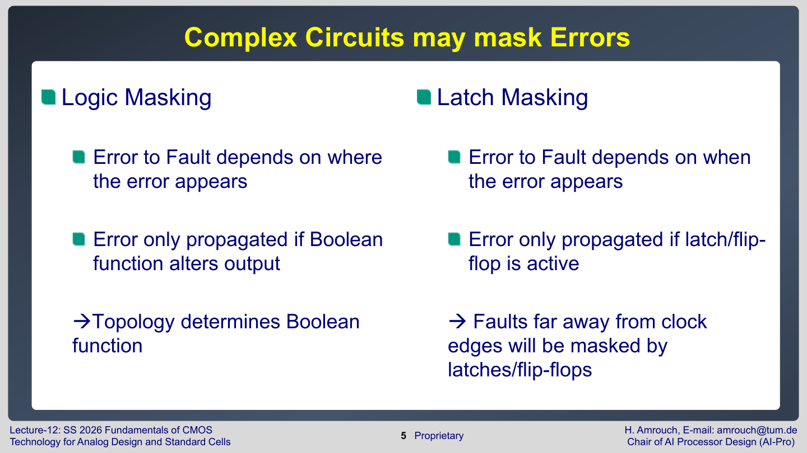

복잡한 회로에서는 masking 가능성이 더 커진다. 어느 gate에서 error가 생겼는지, 그 gate의 output이 어떤 logic cone을 통과하는지, clock edge와 얼마나 가까운지에 따라 error-to-fault 확률이 달라진다.

## 모든 error는 같은 중요도를 갖지 않는다

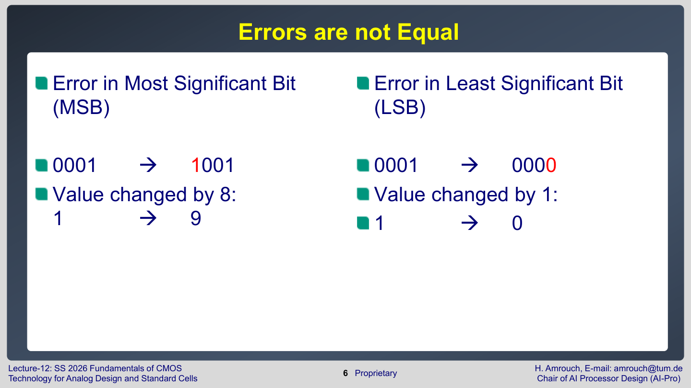

숫자 데이터에서는 **bit 위치에 따라 error의 크기가 다르다**. 4-bit unsigned number를 예로 들면 $0001$은 1이다.

| Error 위치 | 변화 | 숫자 변화 |
| --- | --- | --- |
| MSB error | $0001\to1001$ | $1\to9$, 변화량 8 |
| LSB error | $0001\to0000$ | $1\to0$, 변화량 1 |

MSB는 most significant bit, 즉 가장 큰 자리 bit다. **MSB**가 <font color="#00b0f0">바뀌면 숫자가 크게 변한다</font>. **LSB**는 least significant bit라서 <font color="#00b0f0">바뀌어도 숫자 변화가 작다</font>.

<font color="#ffc000">이 차이는 approximate computing의 기본 판단 기준</font>이다.

>**정확도를 일부 포기**해야 한다면 <font color="#e84d4d">MSB는 보호하고 LSB부터 희생</font>한다.

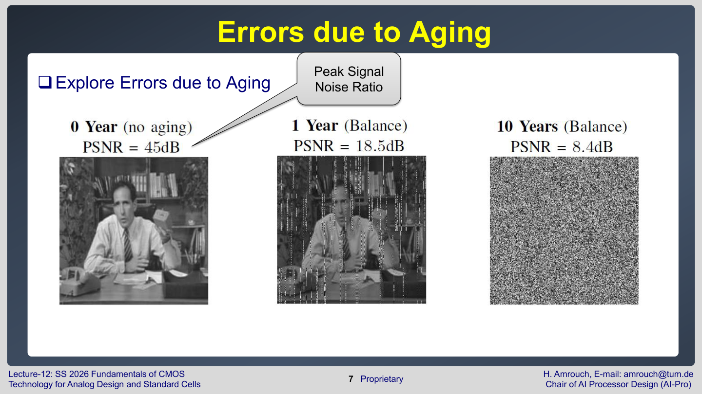

이미지나 신호 처리에서는 error의 영향을 PSNR 같은 품질 지표로 볼 수 있다. PSNR은 peak signal-to-noise ratio이고, 원본과 결과 사이의 평균 제곱 오차가 작을수록 커진다.

$$
PSNR = 10 \log_{10}\left(\frac{MAX_I^2}{MSE}\right)
$$

| 항 | 의미 |
| --- | --- |
| $MAX_{I}$ | pixel 값의 최대 가능 크기 |
| $MSE$ | 원본과 결과의 평균 제곱 오차 |
| $PSNR$ | 값이 클수록 원본과 더 비슷함 |

즉 error가 있어도 품질 지표가 충분히 좋으면 application 관점에서는 받아들일 수 있다.

## Error를 shaping할 수 있는가

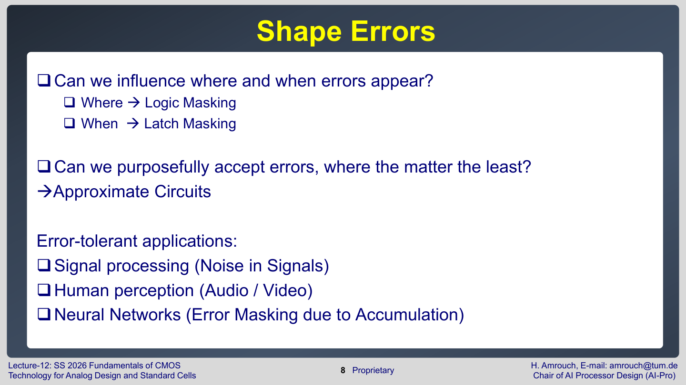

Lecture 12는 오류를 무조건 제거하는 대신, 오류가 생기는 위치와 시간을 어느 정도 조절할 수 있는지 묻는다.

| 질문                           | 연결 개념                                             |
| ---------------------------- | ------------------------------------------------- |
| Where? **어디**에서 error가 생기는가? | <font color="#ffc000">logic</font> masking        |
| When? **언제** error가 생기는가?    | <font color="#ffc000">latch</font> masking        |
| **어느 error를 받아들일 수** 있는가?    | <font color="#ffc000">approximate circuits</font> |

**Approximate circuit**은 <font color="#ffc000">정확도를 조금 포기하고 delay, power, energy를 줄이는 회로</font>다. 모든 application에 쓸 수는 없지만, 다음 분야에서는 일정 수준의 오류를 받아들일 수 있다.

- **Signal processing**: 신호에는 이미 noise가 존재한다.
- **Audio/video**: 사람의 지각은 작은 오차를 항상 구별하지 못한다.
- **Neural networks**: 많은 연산의 누적과 activation 때문에 <font color="#00b0f0">작은 연산 오류가 masking될 수 있다</font>.

이때 중요한 조건은 <font color="#e84d4d">error가 random하고 catastrophic하게 생기면 안 된다는 점</font>이다. 제어 가능한 위치에서, 제어 가능한 크기로, 품질 기준 안에서 생겨야 한다.

## Aging-induced approximation의 출발점

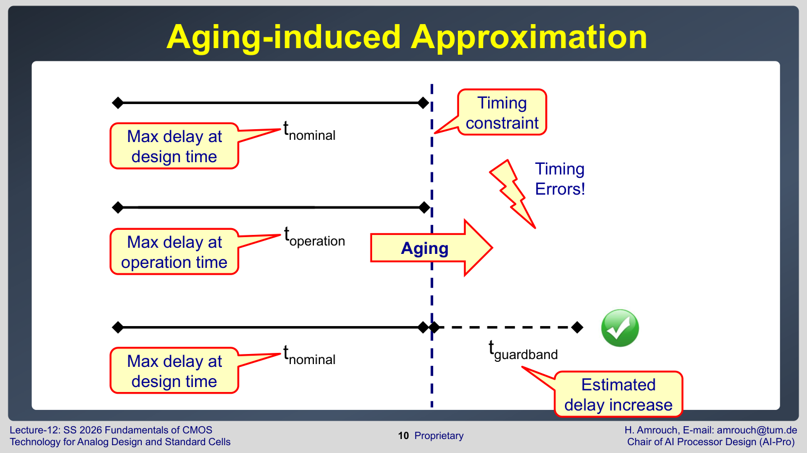

Aging이 진행되면 operation time의 max delay가 design time보다 길어진다. Clock timing constraint가 그대로이면 timing error가 생긴다.

이를 막는 전통적 방법은 guardband다.

$$
t_{nominal} + t_{guardband} \ge t_{operation}
$$

| 항 | 의미 |
| --- | --- |
| $t_{nominal}$ | design time 또는 fresh 상태의 max delay |
| $t_{operation}$ | aging 후 실제 operation time의 max delay |
| $t_{guardband}$ | aging delay 증가를 견디기 위한 시간 여유 |

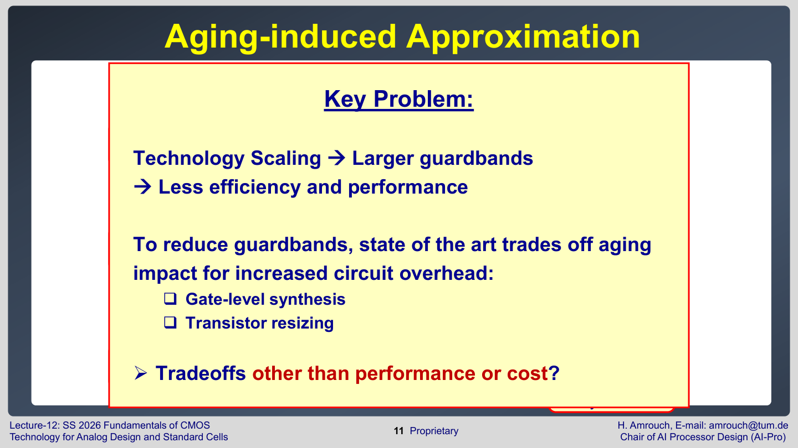

문제는 technology<font color="#ffc000"> scaling이 진행될수록 guardband가 커지고, 효율과 성능이 줄어든다는 점</font>이다. Guardband를 줄이기 위한 <font color="#00b0f0">기존 방법은 보통 circuit overhead를 늘린다</font>.

| 방법 | aging protection 방식 | 비용 |
| --- | --- | --- |
| gate-level synthesis | aging에 강한 gate 구조 선택 | area/power/설계 복잡도 증가 가능 |
| transistor resizing | transistor를 키워 delay margin 확보 | capacitance, area, power 증가 |
| guardband | clock period를 길게 잡음 | performance 감소 |

Lecture 12의 질문은 이것이다.

```text
성능이나 비용만이 아니라, quality를 trade-off로 쓸 수 있는가?
```

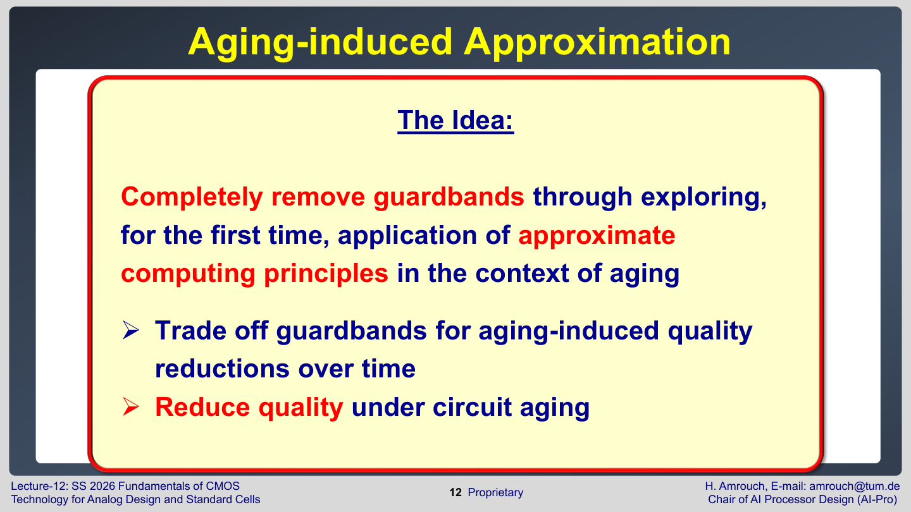

**Aging-induced approximation**의 아이디어는 <font color="#e84d4d">guardband를 완전히 제거하고, 대신 aging으로 시간이 지나며 생기는 quality reduction을 받아들이는 것</font>이다.

정확히 말하면 다음 trade-off다.

| 기존 reliability 설계              | Aging-induced approximation                                                 |
| ------------------------------ | --------------------------------------------------------------------------- |
| aging 후에도 정확한 계산 유지            | aging 후<font color="#ffc000"> precision 또는 quality 일부 감소</font>             |
| timing error를 guardband로 방지    | timing error를 <font color="#ffc000">deterministic approximation으로 대체</font> |
| performance/energy overhead 발생 | <font color="#ffc000">quality loss를 정해진 범위 안</font>에 둠                      |

이 접근은 아무 오류나 허용하는 것이 아니다.<font color="#ffc000"> Nondeterministic하고 catastrophic한 timing error를 deterministic하고 controlled precision reduction으로 바꾸는 것이 목표</font>다.

## Approximate computing의 기본 원리

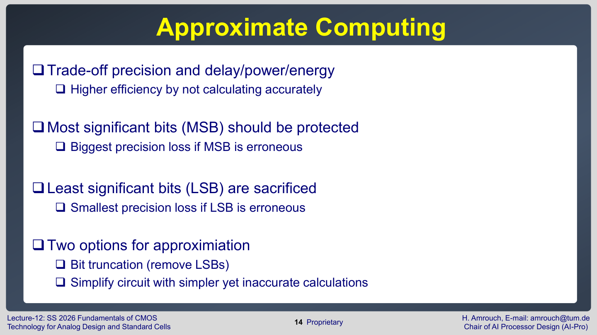

Approximate computing은 precision과 delay/power/energy 사이의 trade-off다. <font color="#ffc000">계산을 완전히 정확하게 하지 않는 대신, 더 빠르고 더 작고 더 적은 에너지를 쓰는 회로를 만든다</font>.

기본 원칙은 다음과 같다.

>- MSB는 **보호**한다.
>- LSB는 **필요하면 희생**한다.
>- 정확도 <font color="#00b0f0">손실은 application 품질 기준 안</font>에 있어야 한다.

대표적인 방법은 두 가지다.

| 방법                                 | 설명                                                        | 장점                              | 단점                              |
| ---------------------------------- | --------------------------------------------------------- | ------------------------------- | ------------------------------- |
| **Bit truncation**                 | <font color="#ffc000">LSB 쪽 계산 회로를 제거하거나 결과를 고정           | 구현이 쉽고 delay/power 감소가 </font>큼 | error bound는 쉽지만 정확도 손실이 클 수 있음 |
| **Simplified approximate circuit** | <font color="#ffc000">full circuit보다 단순한 부정확 회로 사용</font> | truncation보다 error가 작을 수 있음     | 설계와 error 분석이 어려움               |

## Bit truncation: LSB 회로 제거

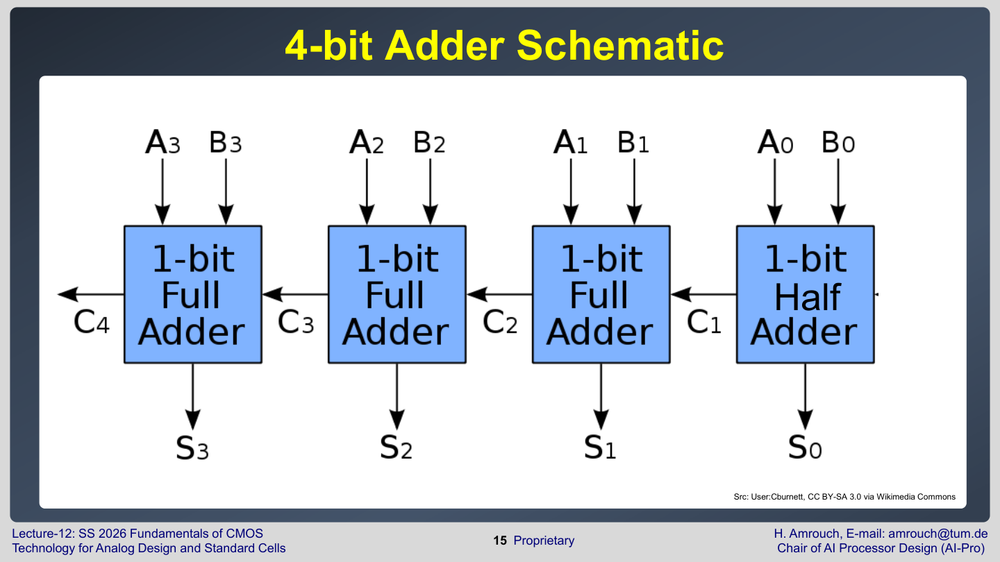

4-bit adder는 여러 bit position의 adder가 carry를 전달하면서 동작한다. 일반적으로 lower bit의 carry가 higher bit로 이어지기 때문에 ripple-carry path가 critical path가 될 수 있다.

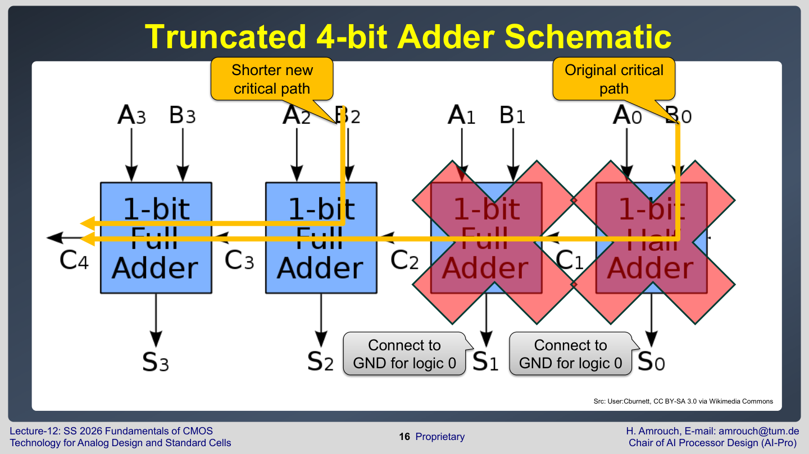

Truncated 4-bit adder는 일부 LSB 결과를 계산하지 않고 $GND$에 연결해 logic $0$으로 고정한다. 슬라이드에서는 $S_{0}$와 $S_{1}$을 $GND$에 연결하는 예를 보여준다. 이렇게 하면 <font color="#00b0f0">해당 LSB 회로와 carry 경로 일부가 사라져 critical path가 짧아진다</font>.

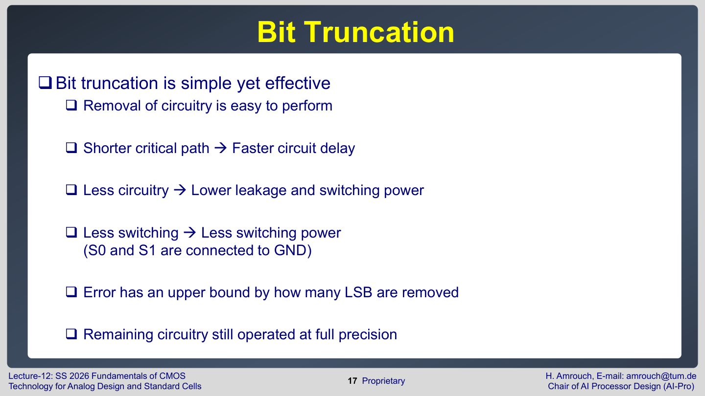

Bit truncation의 효과는 다음과 같다.

| 효과                           | 이유                                                                         |
| ---------------------------- | -------------------------------------------------------------------------- |
| **delay 감소**                 | <font color="#ffc000">제거된 LSB 회로와 carry path 때문에 critical path가 짧아짐</font> |
| **leakage power 감소**         | transistor 수가 줄어듦                                                          |
| **switching power 감소**       | switching하는 node 수가 줄어듦                                                    |
| **error upper bound 추정 쉬움**  | 몇 개의 LSB를 제거했는지로 최대 오차를 계산할 수 있음                                           |
| **남은 회로는 full precision 유지** | 제거하지 않은 bit는 정확히 계산                                                        |

예를 들어 $k$개의 LSB를 truncation하면 <font color="#ffc000">unsigned value의 최대 오차는 대략 다음 범위 안</font>에 있다.

$$
0 \le error \le 2^k - 1
$$

이 식은 <font color="#00b0f0">제거한 LSB들이 원래 모두 1이어야 했는데 0으로 고정되는 경우를 생각</font>하면 된다.

## Simplified approximate circuit: 회로를 단순화하기

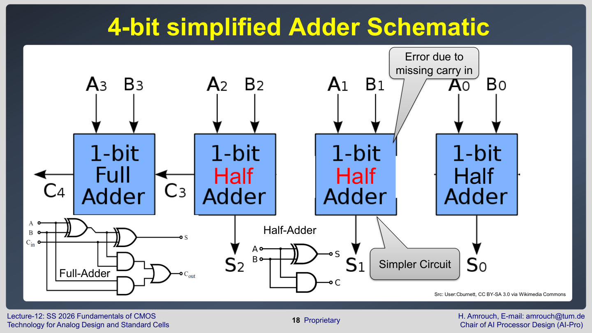

두 번째 방법은 회로 전체를 제거하지 않고 더 단순한 approximate circuit으로 바꾸는 것이다. 예를 들어 full-adder 대신 half-adder와 더 단순한 logic을 쓰면 carry 계산 일부가 빠질 수 있다.

Full-adder는 세 입력 $A$, $B$, $C_{in}$을 받아 $SUM$과 $C_{OUT}$을 만든다.

$$
SUM = A \oplus B \oplus C_{in}
$$

$$
C_{OUT} = AB + C_{in}(A \oplus B)
$$

Half-adder는 $C_{in}$이 없다.

$$
SUM = A \oplus B
$$

$$
CARRY = AB
$$

따라서 full-adder를 half-adder처럼 단순화하면 carry-in이 만드는 효과를 놓칠 수 있다. 이 missing carry가 error의 원인이 된다.

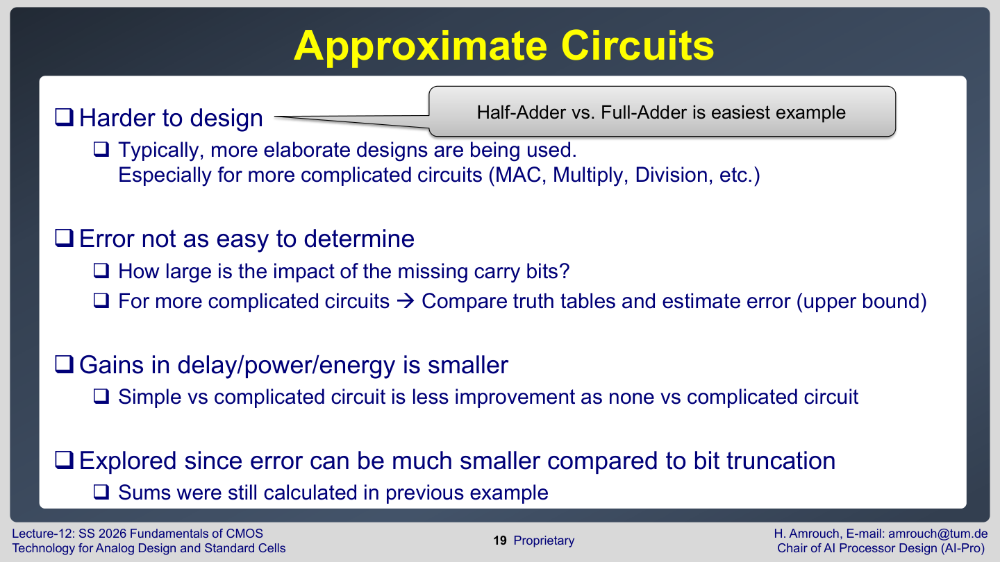

<font color="#00b0f0">Approximate circuit은 bit truncation보다 어렵다</font>.

- 회로가 더 복잡할수록 <font color="#ffc000">어떤 error가 생기는지 truth table 비교가 필요</font>하다.
- Missing carry, missing partial product 같은 error가 output에 어떻게 누적되는지 분석해야 한다.
- delay/power/energy gain은 truncation보다 작을 수 있다. "<font color="#ffc000">복잡한 회로를 단순한 회로로 바꾸는 것"은 "회로를 아예 제거하는 것"보다 gain이 작다</font>.
- 대신 error는 truncation보다 작을 수 있다.

그래서 approximate circuit은 multiplier, MAC, division처럼 복잡한 datapath에서 더 정교하게 설계된다.

## Aging delay를 approximation gain으로 보상하기

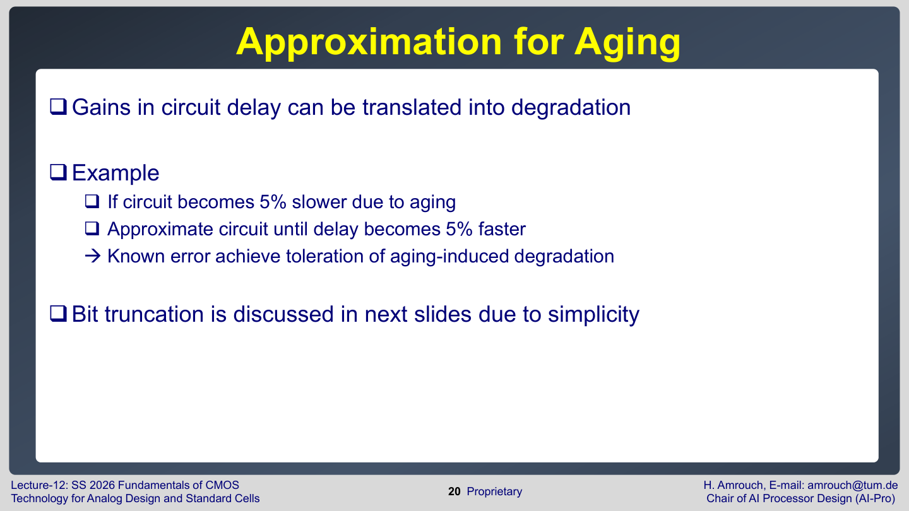

**Aging-induced approximation**은<font color="#ffc000"> delay gain을 aging degradation 보상으로 해석</font>한다.

예를 들어 어떤 회로가 10년 aging 후 $5\%$ 느려진다고 하자. 이때 approximate version이 fresh full-precision version보다 $5\%$ 빠르면, <font color="#00b0f0">aging으로 늘어난 delay를 approximation으로 되돌릴 수 있다</font>.

$$
t_{approx, aged} \le t_{full, fresh}
$$

<font color="#e84d4d">이 부등식이 만족되면, 원래 clock timing을 지키기 위해 큰 guardband를 넣지 않아도 된다</font>. <font color="#ffc000">대신 precision loss가 생긴다</font>.

이 접근의 핵심은 timing error를 그대로 방치하지 않는 것이다. Timing error는 언제 어떤 bit가 틀릴지 예측하기 어렵고 catastrophic할 수 있다. **Approximation error**는 <font color="#ffc000">어떤 bit를 줄였는지, 어떤 component를 approximate했는지 알 수 있으므로 더 제어 가능</font>하다.

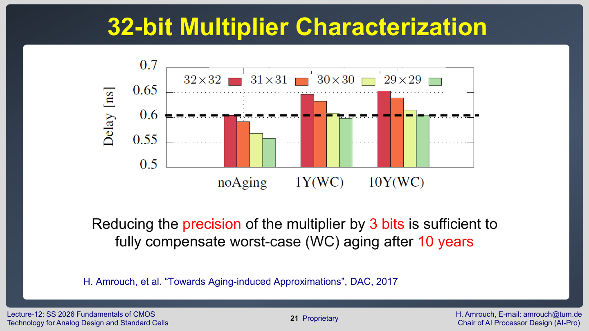

슬라이드는 32-bit multiplier characterization 예를 든다. <font color="#00b0f0">10년 worst-case aging을 완전히 보상하기 위해 multiplier precision을 3 bit 줄이는 것으로 충분</font>했다고 한다.

이 문장을 설계 관점으로 풀면 다음과 같다.

| 관찰                        | 의미                                                             |
| ------------------------- | -------------------------------------------------------------- |
| multiplier가 aging 후 느려짐   | critical path delay가 증가                                        |
| precision 3 bit reduction | LSB 쪽 회로 또는 연산 정확도 일부 축소                                       |
| aging 보상 가능               | <font color="#e84d4d">줄어든 회로 delay가 aging delay 증가와 맞먹음</font> |

단, 이것은 모든 circuit에 일반화되는 숫자가 아니다. *어떤 component가 critical path인지, 어떤 application quality 기준을 쓰는지, worst-case aging인지 actual-case aging인지에 따라 필요한 precision reduction은 달라진다*.

## Design flow: component level과 microarchitecture level

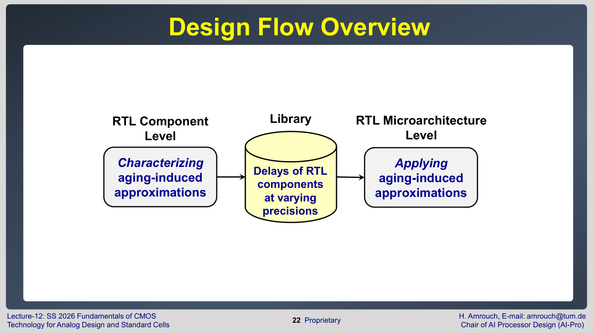

Lecture 12의 design flow는 두 층으로 나뉜다.

| 단계                              | 역할                                                                                                       |
| ------------------------------- | -------------------------------------------------------------------------------------------------------- |
| RTL **component** level         | multiplier, adder, IDCT block 같은 component를 <font color="#ffc000">여러 precision에서 characterization</font> |
| RTL **microarchitecture** level | 전체 datapath에서 <font color="#ffc000">어떤 block을 얼마나 approximate할지</font> 결정                                |

먼저 component library를 만든다. <font color="#e84d4d">각 component</font> $C_{j}$<font color="#e84d4d">에 대해 precision reduction</font> $K_{j}$<font color="#e84d4d">를 바꾸면서 delay, aging impact, quality impact를 측정</font>한다.

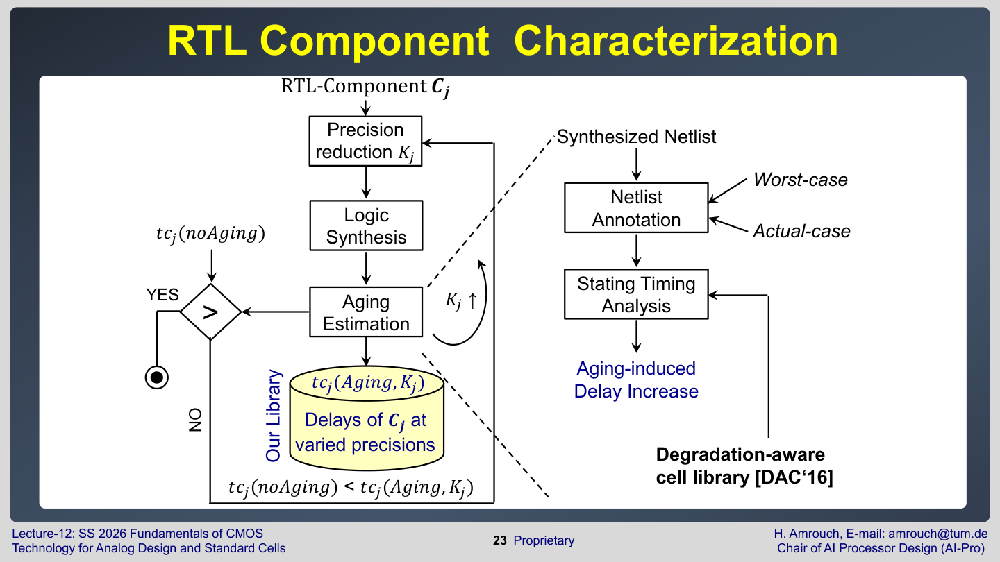

Component characterization flow는 다음 순서다.

1. RTL component $C_{j}$를 고른다.
2. Precision reduction $K_{j}$를 정한다.
3. Logic synthesis를 수행한다.
4. Aging estimation을 수행한다.
5. <font color="#ffc000">Degradation-aware cell library를 이용해 aging-aware STA</font>를 한다.
6. $t_{C_{j}}(aging,K_{j})$<font color="#e84d4d">를 얻는다</font>.
7. 이 값이 $t_{C_{j}}(noAging)$<font color="#e84d4d">보다 작아질 때까지</font> $K_{j}$<font color="#e84d4d">를 키운다</font>.

수식으로는 다음 조건을 찾는 과정이다.

$$
t_{C_j}(aging, K_j) \le t_{C_j}(noAging)
$$

| 항 | 의미 |
| --- | --- |
| $C_{j}$ | j번째 RTL component |
| $K_{j}$ | precision reduction 정도 |
| $t_{C_{j}}(noAging)$ | fresh full-precision 기준 delay |
| $t_{C_{j}}(aging,K_{j})$ | aging과 approximation을 모두 반영한 delay |

$K_{j}$<font color="#ffc000">가 커지면 precision은 더 줄어들지만 delay도 더 줄어들 수 있다</font>. 그래서 timing 조건과 quality 조건을 함께 만족하는 최소 precision reduction을 찾는 것이 중요하다.

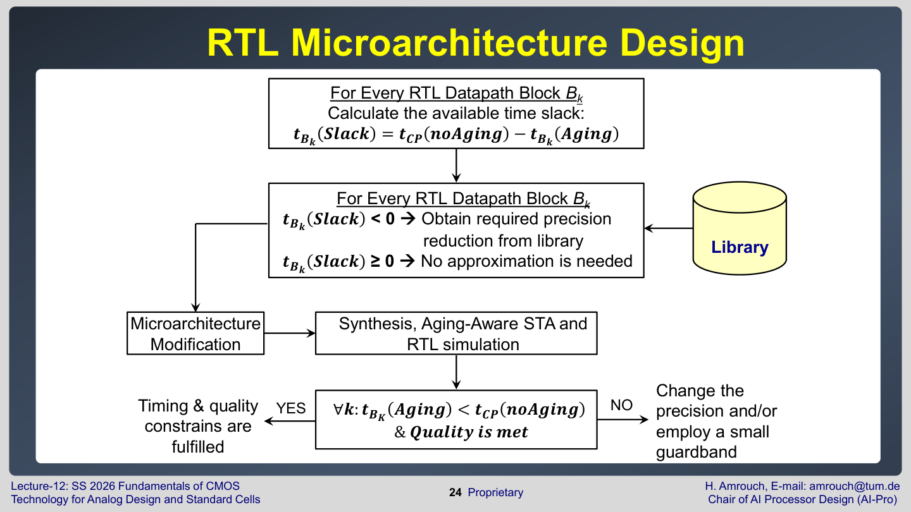

**Microarchitecture level**에서는 각 datapath block $B_{k}$의 <font color="#ffc000">available time slack을 계산</font>한다.

$$
t_{B_k}^{Slack} = t_{CP}^{noAging} - t_{B_k}^{Aging}
$$

| 조건                      | 해석                                                                               | 조치                                    |
| ----------------------- | -------------------------------------------------------------------------------- | ------------------------------------- |
| $t_{B_{k}}^{Slack}\ge0$ | aging 후에도 block <font color="#ffc000">delay가 fresh critical path 기준 안</font>에 있음 | **approximation 불필요**                 |
| $t_{B_{k}}^{Slack}<0$   | aging 후 <font color="#ffc000">block이 timing을 넘김</font>                           | library에서 필요한 precision reduction을 찾음 |

최종 조건은 다음이다.

```text
모든 block이 timing을 만족하고, application quality constraint도 만족해야 한다.
```

만약 <font color="#00b0f0">둘 중 하나라도 실패하면 precision을 조정하거나 작은 guardband를 다시 넣는다</font>. 즉 **aging-induced approximation**은 <font color="#e84d4d">guardband를 무조건 0으로 만드는 마법이 아니라, quality constraint 안에서 guardband를 줄이는 방법</font>이다.

## IDCT 예시와 결과

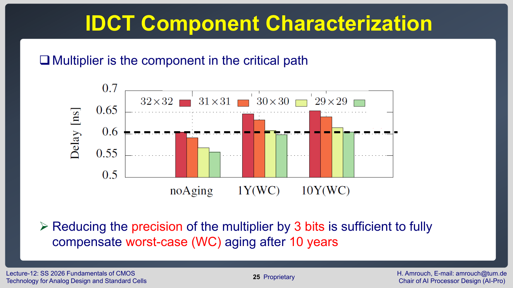

Lecture 12의 예시는 image decoding의 IDCT component다. IDCT에서는 multiplier가 critical path에 놓인다. 슬라이드는 multiplier precision을 3 bit 줄이면 10년 worst-case aging을 보상할 수 있다고 말한다.

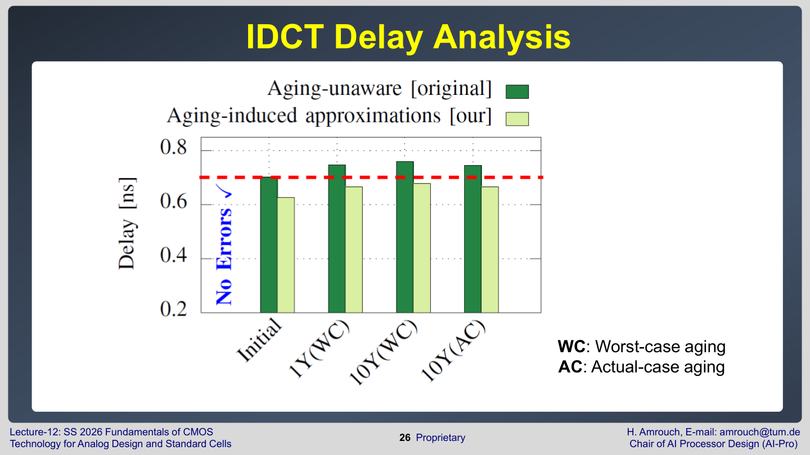

Delay analysis에서는 두 aging case를 구분한다.

| 약어     | 의미                |
| ------ | ----------------- |
| **WC** | worst-case aging  |
| **AC** | actual-case aging |

**Worst-case aging**은 <font color="#00b0f0">모든 관련 조건이 가장 나쁘다고 보는 보수적 추정</font>이다. **Actual-case aging**은 <font color="#ffc000">실제 workload나 activity를 고려한 더 현실적인 추정</font>이다. WC는 안전하지만 guardband가 커질 수 있고, AC는 효율적일 수 있지만 workload 추정이 틀리면 위험하다.

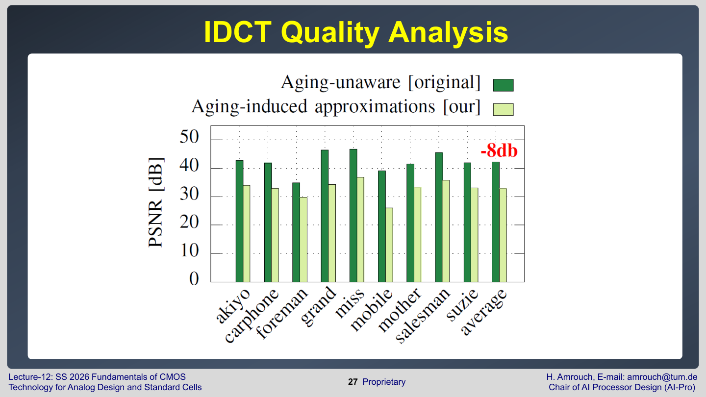

Quality analysis는 approximation 후 image 품질이 허용 범위에 있는지 확인하는 단계다. Timing만 만족해도 출력 품질이 너무 나쁘면 설계는 실패다.

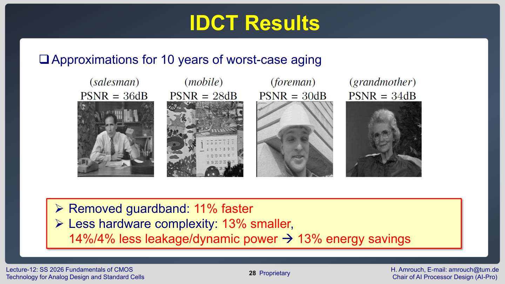

슬라이드의 IDCT 결과는 다음과 같다.

| 결과 | 의미 |
| --- | --- |
| guardband 제거 | aging을 위해 clock을 느리게 잡는 overhead 제거 |
| $11\%$ faster | guardband 없이 더 빠른 동작 가능 |
| $13\%$ smaller | hardware complexity 감소 |
| $14\%$ less leakage power | 회로 감소와 activity 감소로 leakage 감소 |
| $4\%$ less dynamic power | switching capacitance/activity 감소 |
| $13\%$ energy saving | delay/power 감소가 함께 반영된 총 에너지 이득 |

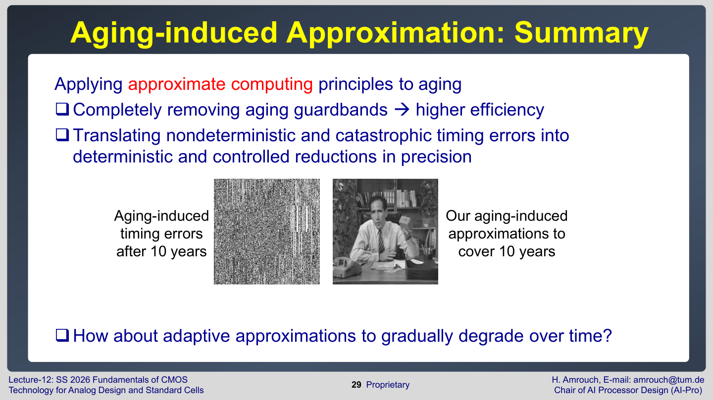

Lecture 12의 마지막 결론은 다음이다.

>**Aging-induced approximation**은 10년 뒤 생길 수 있는<font color="#e84d4d"> 불확실한 timing error를, 설계자가 알고 있는 precision reduction으로 바꾼다</font>.


즉 <font color="#ffc000">guardband를 줄이는 대신 품질이 조금 줄어든다</font>. <font color="#e84d4d">중요한 차이는 오류의 성격</font>이다.

| Timing error 방치                                       | Aging-induced approximation                           |
| ----------------------------------------------------- | ----------------------------------------------------- |
| <font color="#00b0f0">언제 어떤 output이 틀릴지 예측 어려움</font> | <font color="#e84d4d">어떤 precision이 줄었는지 알고 있음</font> |
| **catastrophic fault** 가능                             | **deterministic** quality reduction                   |
| reliability failure로 보일 수 있음                          | application-level quality trade-off                   |

슬라이드는 마지막으로 adaptive approximation을 질문한다. *시간이 지나며 aging이 조금씩 커지므로, approximation도 처음부터 크게 넣는 대신 시간이 지날수록 점진적으로 적용할 수 있는지 묻는다*. 이것은 aging monitor, workload 정보, runtime control과 연결되는 후속 주제다.

## 시험 대비 핵심

- Timing violation은 data가 늦게 도착하는 오류이고, data corruption은 값 자체가 바뀌는 오류다.
- Error는 내부 값의 이상이고, fault는 그 error가 실제 잘못된 동작으로 관측되는 것이다.
- Logic masking은 Boolean function이 오류 전파를 막는 현상이다.
- Latch masking은 오류가 sampling window 밖에서 생기거나 사라져 저장되지 않는 현상이다.
- MSB error는 LSB error보다 숫자 품질에 훨씬 큰 영향을 준다.
- Approximate computing은 precision을 줄여 delay, power, energy를 개선한다.
- Bit truncation은 LSB 회로를 제거하거나 출력을 고정해 delay와 power를 줄이는 단순한 방법이다.
- Simplified approximate circuit은 error가 더 작을 수 있지만 설계와 분석이 어렵다.
- Aging-induced approximation은 guardband overhead를 application quality reduction으로 바꾸는 방법이다.
- 목표는 random timing error를 허용하는 것이 아니라 deterministic하고 controlled precision loss로 바꾸는 것이다.

## 포함 범위

- Lecture 12: pages 2-29
- 주요 제외: 표지, section divider 자체
- 핵심 반영: timing violation, data corruption, error/fault 차이, logic/latch masking, MSB/LSB error, PSNR, approximate computing, bit truncation, simplified approximate circuits, aging-induced approximation, RTL component characterization, microarchitecture design, IDCT 결과
