# 10. SPICE 복합셀, 가산기, 자동화

## 이 장의 위치

이 장은 `Exercise/Slides Exercise 05.pdf`의 과제와 `Exercise/Slides Exercsie 06.pdf`의 해답을 함께 정리한다. Exercise 05의 슬라이드 내부 표기는 Exercise-4로 되어 있지만, 현재 파일명과 자료 순서 기준으로 이 문서에서는 Exercise 05로 기록한다. Exercise 06의 파일명에는 `Exercsie` 오타가 있으나, 슬라이드 내부 표기는 Exercise-6이다.

두 자료의 역할은 다르다.

1. Exercise 05는 NAND를 복습하고 AOI complex cell과 4-bit adder 과제를 제시한다.
2. Exercise 06은 AOI21 transistor network, adder path sensitization, 결과의 타당한 범위를 해답으로 보여준다.

앞 장의 Lecture 11/12가 aging, delay, power, approximation을 이론적으로 다뤘다면, 이 장은 그 질문을 SPICE 기반 complex cell과 adder 측정으로 확장한다.

```text
cell/adders를 SPICE로 측정한다 -> delay, power, worst case, 자동화 필요성을 회로 구조와 연결한다
```

## 핵심 질문

- SPICE simulation file은 time variable, voltage source, cell definition, sweep, measurement를 어떻게 나누어 쓰는가?
- NAND2_X2와 NAND2_X4를 비교할 때 fins, load capacitance, delay, power를 어떻게 해석해야 하는가?
- AOI21 direct complex cell과 $\mathrm{NAND}+\mathrm{INV}+\mathrm{NOR}$ 분해 구현은 무엇을 비교하는가?
- 같은 AOI21에서도 rise/fall delay가 다른 이유와 measurement 정의의 중요성은 무엇인가?
- Half-adder, full-adder, 4-bit ripple-carry adder는 어떤 logic block으로 구성되는가?
- 특정 adder path를 측정하려면 왜 다른 input을 고정해 path를 sensitization해야 하는가?
- 4-bit adder에서 longest propagation delay와 highest power case를 왜 수동으로 찾기 어려운가?
- Python으로 SPICE deck 생성, HSPICE 실행, CSV 결과 취합을 자동화해야 하는 이유는 무엇인가?

## 이전 NAND 실습의 SPICE file 구조

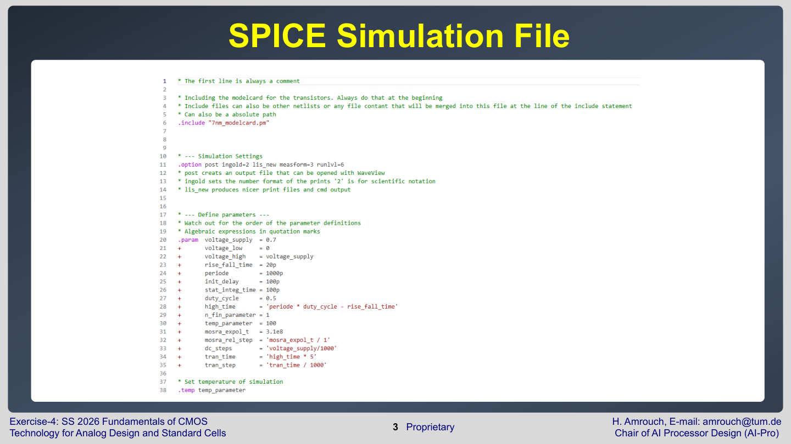

Exercise 05는 먼저 이전 NAND cell simulation file을 복습한다. SPICE deck은 한 줄로 길게 쓰는 파일이 아니라, 역할별 block으로 나누어 읽어야 한다.

| Block | 역할 |
| --- | --- |
| include/modelcard | transistor model과 cell definition을 불러옴 |
| parameter/time variables | rise time, fall time, pulse timing, simulation duration을 통일 |
| voltage sources | $V_{DD}$, input pulse, static input을 정의 |
| cell instantiation | NAND2_X2, NAND2_X4 같은 subcircuit을 실제 회로에 배치 |
| load capacitance | output이 구동해야 하는 capacitance를 정의 |
| temperature/aging sweep | 온도와 aging time을 바꾸며 반복 simulation |
| `.measure` | delay, dynamic power, static power를 측정 |

이렇게 나누면 나중에 조건을 바꾸거나 Python으로 자동 생성할 때 실수가 줄어든다.

## Time variables를 먼저 정의하는 이유

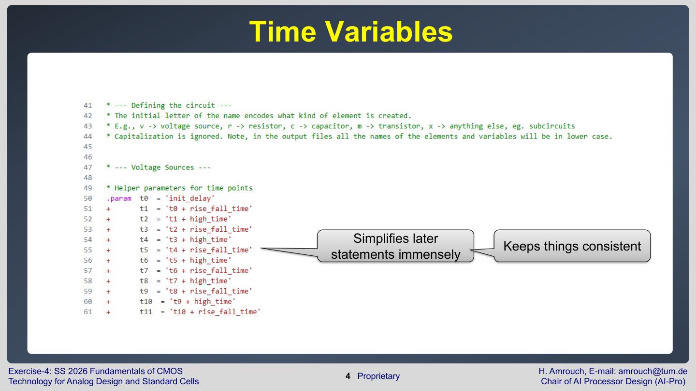

슬라이드는 time variable을 쓰면 뒤의 statement가 훨씬 단순해지고 일관된다고 말한다.

예시 형태는 다음과 같다.

```spice
.param t_start = 0n
.param t_rise  = 10p
.param t_fall  = 10p
.param t_high  = 200p
.param t_stop  = 500p
```

이런 parameter를 쓰면 pulse source와 `.tran`, `.measure`에서 같은 timing 기준을 공유할 수 있다.

| 장점 | 설명 |
| --- | --- |
| 일관성 | 모든 input pulse가 같은 rise/fall time을 씀 |
| 수정 용이성 | 한 곳만 바꾸면 전체 timing 조건이 바뀜 |
| 자동화 친화성 | Python f-string으로 parameter 값을 쉽게 삽입 |
| 측정 오류 감소 | trigger/target time window가 서로 어긋나는 실수를 줄임 |

시험이나 보고서에서는 "time variable을 쓴다"보다 "입력 transition과 measurement window를 일관되게 유지하기 위해 쓴다"라고 설명하는 편이 좋다.

## Voltage source는 한 줄에 몰아쓰지 않는다

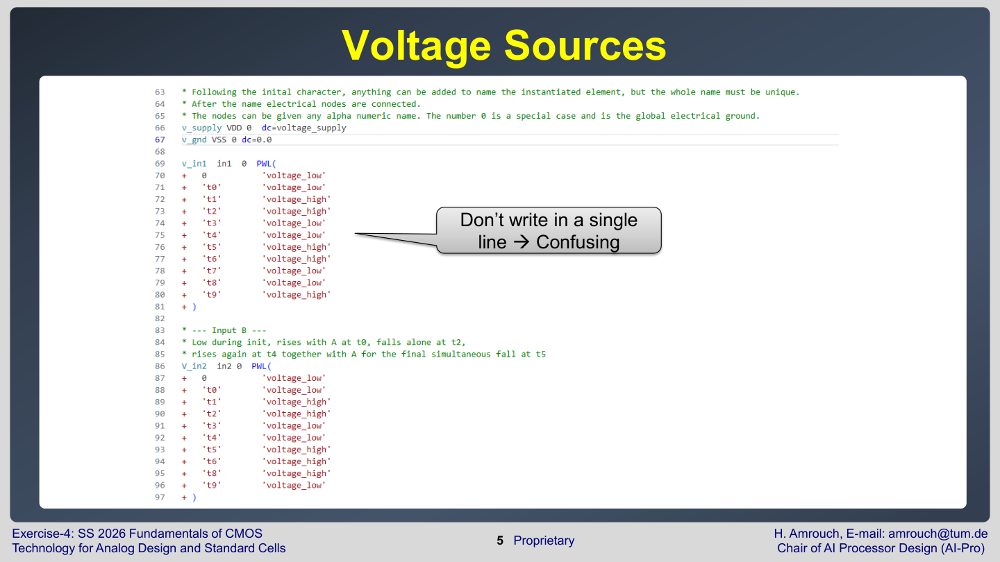

Voltage source는 supply와 input stimulus를 정의한다. 슬라이드는 긴 source definition을 한 줄에 몰아쓰면 혼란스럽다고 경고한다.

읽기 쉬운 형태는 다음과 같다.

```spice
VDD VDD VSS 0.7

VA A VSS PULSE(
+ 0 0.7
+ 0n
+ 10p 10p
+ 200p 400p
)
```

$PULSE$는 input transition을 만들 때 쓴다.

| 항목 | 의미 |
| --- | --- |
| initial value | 시작 전압 |
| pulsed value | 바뀐 뒤 전압 |
| delay | pulse 시작 전 기다리는 시간 |
| rise/fall time | 전압이 올라가거나 내려가는 시간 |
| pulse width | high 또는 low 상태를 유지하는 시간 |
| period | pulse 반복 주기 |

Delay나 power를 측정하려면 input이 언제 바뀌는지, output이 언제 threshold를 통과하는지 알아야 한다. 그래서 voltage source는 measurement와 직접 연결된다.

## NAND definition: fins와 load를 같이 본다

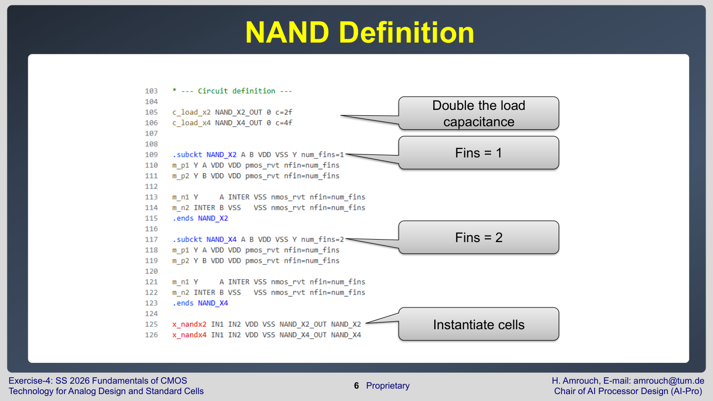

NAND 실습에서는 NAND2_X2와 NAND2_X4를 비교한다. 여기서 $X2$, $X4$는 drive strength 차이를 나타내는 이름이다. FinFET에서는 transistor width를 연속적으로 마음대로 키우기보다 fin 개수로 drive strength를 조절한다.

| Cell | 의미 | 기대 효과 |
| --- | --- | --- |
| NAND2_X2 | 상대적으로 작은 drive strength | capacitance와 power가 작지만 drive가 약함 |
| NAND2_X4 | 더 큰 drive strength | 더 큰 load를 빠르게 구동 가능하지만 input/output capacitance와 power가 커질 수 있음 |

슬라이드는 load capacitance를 두 배로 하는 것도 함께 보여준다. Drive strength가 커졌는지 판단하려면 같은 load만 볼 수도 있고, 더 큰 load를 얼마나 견디는지도 볼 수 있다.

NAND2의 transistor 구조는 다음처럼 기억하면 된다.

```text
PMOS: 병렬
NMOS: 직렬
```

두 입력이 모두 $1$일 때만 NMOS stack이 완전히 켜져 output이 $0$으로 내려간다. 하나라도 $0$이면 병렬 PMOS 중 하나가 켜져 output이 $1$로 올라간다.

## Temperature sweep과 aging sweep

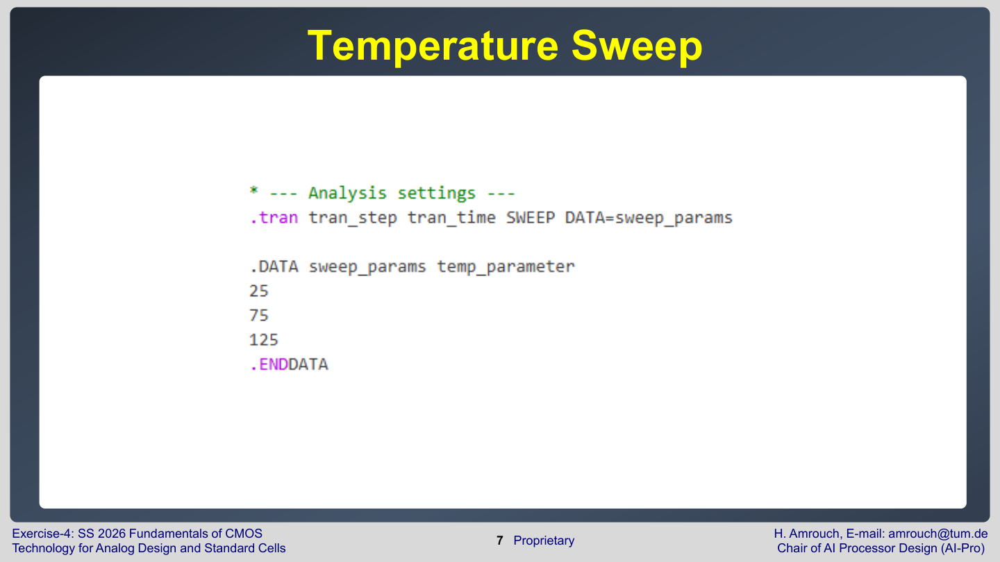

Temperature sweep은 같은 circuit을 여러 온도에서 반복 측정하는 것이다. 이 실습에서는 대표적으로 $25\,^{\circ}\mathrm{C}$와 $125\,^{\circ}\mathrm{C}$를 비교한다.

온도는 두 가지 방향으로 회로에 영향을 준다.

| 영향 | 설명 | 결과 |
| --- | --- | --- |
| mobility 감소 | lattice vibration 증가로 carrier scattering 증가 | drive current 감소, delay 증가 |
| leakage 증가 | thermal energy 증가로 OFF current 증가 | static power 증가 |

Aging sweep은 fresh 상태와 10년 aging 같은 장기 stress 상태를 비교한다. 슬라이드의 aging time $8.15\times10^{8}\,\mathrm{s}$는 약 10년에 해당한다.

$$
10 \text{ years} \approx 10 \times 365 \times 24 \times 3600 \approx 3.15 \times 10^8 \text{ s}
$$

슬라이드의 값은 모델 내부 조건 또는 가속 조건을 반영한 simulation time으로 볼 수 있다. 중요한 것은 fresh와 aged case를 같은 measurement 기준으로 비교하는 것이다.

## NAND2_X2/X4 measurement

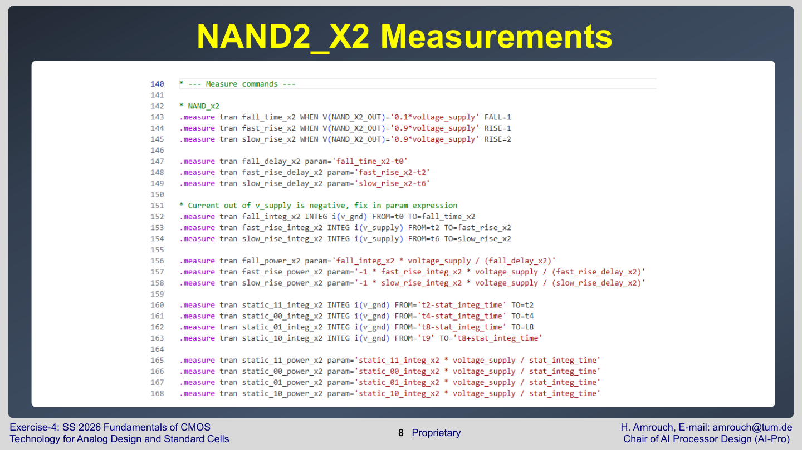

NAND2_X2 measurement는 작은 drive cell의 delay와 power를 측정한다. Rise/fall transition을 따로 측정해야 한다. NAND는 PMOS pull-up path와 NMOS pull-down path 구조가 다르기 때문이다.

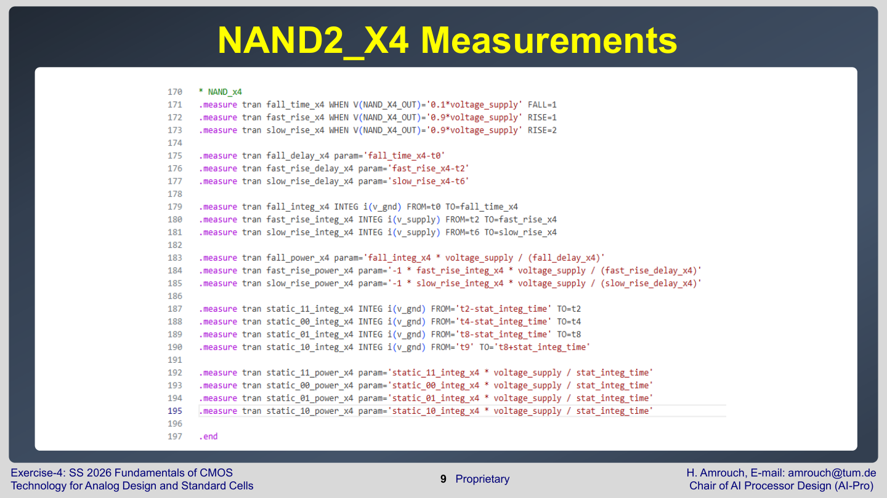

NAND2_X4 measurement는 더 큰 drive strength cell을 측정한다. X4는 더 큰 load를 빠르게 구동할 수 있지만, transistor가 커지면 capacitance와 switching energy도 커진다.

측정 항목은 다음처럼 나누어야 한다.

| Metric | 의미 |
| --- | --- |
| fall delay | output이 high에서 low로 내려가는 propagation delay |
| fast rise delay | output이 빠르게 low에서 high로 올라가는 case |
| slow rise delay | input condition 때문에 rise가 느려지는 case |
| fall power | fall transition 동안의 dynamic power |
| rise power | rise transition 동안의 dynamic power |
| static power | input이 고정된 상태에서 흐르는 leakage power |

## NAND 결과표 읽기

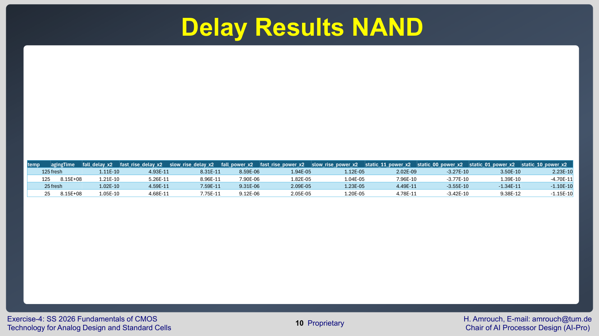

슬라이드의 NAND2_X2 결과는 temperature와 aging이 delay/power를 어떻게 바꾸는지 보여준다. 숫자를 ps 단위로 바꾸면 흐름이 더 잘 보인다.

| Temp | Aging | Fall delay | Fast rise | Slow rise | 해석 |
| --- | --- | --- | --- | --- | --- |
| 125 °C | fresh | 111 ps | 49.3 ps | 83.1 ps | 고온 fresh 기준 |
| 125 °C | aged | 121 ps | 52.6 ps | 89.6 ps | aging 후 delay 증가 |
| 25 °C | fresh | 102 ps | 45.9 ps | 75.9 ps | 저온 fresh 기준 |
| 25 °C | aged | 105 ps | 46.8 ps | 77.5 ps | aging 후 delay 증가가 작음 |

이 표에서 보이는 핵심은 다음이다.

- $125\,^{\circ}\mathrm{C}$는 $25\,^{\circ}\mathrm{C}$보다 delay가 크다.
- 같은 온도에서는 aged case가 fresh case보다 delay가 크다.
- $125\,^{\circ}\mathrm{C}$ aged case가 가장 큰 guardband를 요구한다.
- Power는 delay와 같은 방향으로만 움직이지 않는다.

슬라이드의 discussion question은 "hot circuit을 어떻게 다르게 operate할 것인가"를 묻는다. 답은 전압, clock, cooling, guardband 관점으로 정리할 수 있다.

| 방법 | 효과 | 비용 |
| --- | --- | --- |
| clock frequency 낮추기 | timing violation 방지 | 성능 감소 |
| voltage guardband 추가 | drive current 회복 | dynamic power와 temperature 증가 |
| cooling 강화 | mobility 회복, leakage/aging 완화 | 시스템 비용 증가 |
| aging-aware library 사용 | 실제 aging 후 delay를 더 정확히 반영 | characterization 비용 증가 |

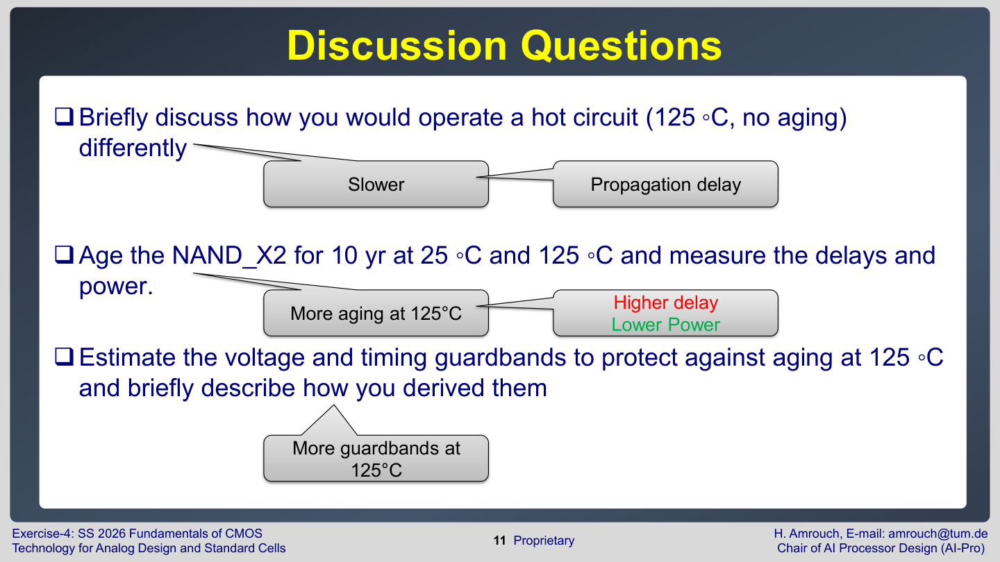

Exercise 05의 결론은 앞 장들과 연결된다.

```text
125 °C에서는 propagation delay가 커지고 aging도 더 강하다.
따라서 aging protection을 위해 더 큰 timing/voltage guardband가 필요하다.
동시에 aging은 power를 낮추는 경향도 있으므로 delay와 power를 함께 봐야 한다.
```

## AOI21 complex cell 과제

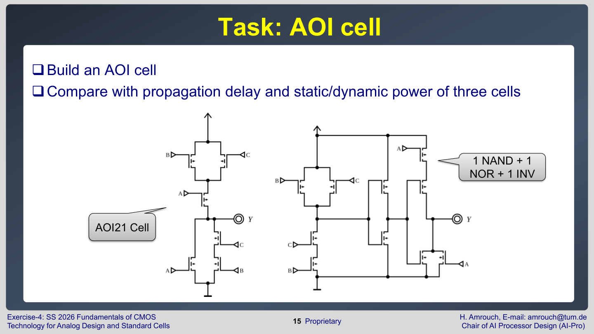

새 실습의 첫 번째 과제는 AOI cell을 만드는 것이다. AOI21은 AND-OR-Invert 구조다.

$$
Y = \overline{A \cdot B + C}
$$

이 함수는 두 방식으로 구현할 수 있다.

| 구현 | 구조 | 비교 포인트 |
| --- | --- | --- |
| Direct AOI21 | 하나의 complex cell 안에 transistor network 구성 | cell 수와 내부 node가 적음 |
| Decomposed AOI21 | $\mathrm{NAND}+\mathrm{INV}+\mathrm{NOR}$ 조합 | 기존 simple gate로 구현 가능하지만 cell 수 증가 |

현재 폴더에는 이 비교와 연결되는 cell library가 있다.

원본 파일: `Assignment/exercise4/report/projectfiles/cell_lib.sp`

```spice
* AOI21_X1 implements Y = ~(A*B + C).
.subckt AOI21_X1 A B C VDD VSS Y num_fins=1
* Pull-up: pC in series with parallel pA/pB.
m_pc PUP C VDD VDD pmos_rvt nfin=num_fins
m_pa Y A PUP VDD pmos_rvt nfin=num_fins
m_pb Y B PUP VDD pmos_rvt nfin=num_fins
* Pull-down: nC in parallel with series nA/nB.
m_nc Y C VSS VSS nmos_rvt nfin=num_fins
m_na Y A NDN VSS nmos_rvt nfin=num_fins
m_nb NDN B VSS VSS nmos_rvt nfin=num_fins
.ends AOI21_X1
```

이 transistor network를 회로도 설명 방식으로 읽으면 다음과 같다.

- Pull-down network는 $C$ 단독 NMOS path와 $A-B$ 직렬 NMOS path가 병렬이다.
- 따라서 $C=1$이거나 $A=1$이고 $B=1$이면 output $Y$가 $0$으로 내려간다.
- Pull-up network는 그 반대 조건에서 output을 $1$로 올린다.
- 그래서 전체 함수는 $Y=\overline{A\cdot B+C}$이다.

분해 구현은 다음과 같다.

```spice
* Equivalent implementation: NAND(A,B), INV, NOR(AB,C).
.subckt AOI21_DECOMP_X1 A B C VDD VSS Y num_fins=1
x_nand A B VDD VSS NAB NAND2_X1 num_fins=num_fins
x_inv NAB VDD VSS AB INV_X1 num_fins=num_fins
x_nor AB C VDD VSS Y NOR2_X1 num_fins=num_fins
.ends AOI21_DECOMP_X1
```

Direct AOI21과 decomposed AOI21을 비교할 때는 delay만 보면 부족하다.

| 비교 항목 | 왜 중요한가 |
| --- | --- |
| propagation delay | complex cell이 logic depth를 줄이는지 확인 |
| dynamic power | 내부 node와 capacitance 차이를 반영 |
| static power | transistor 수와 stack 상태에 따른 leakage 비교 |
| input transition별 결과 | $A$, $B$, $C$ 중 어느 입력이 바뀌는지에 따라 path가 다름 |

### Exercise 06 해답: AOI21에서 확인할 원리

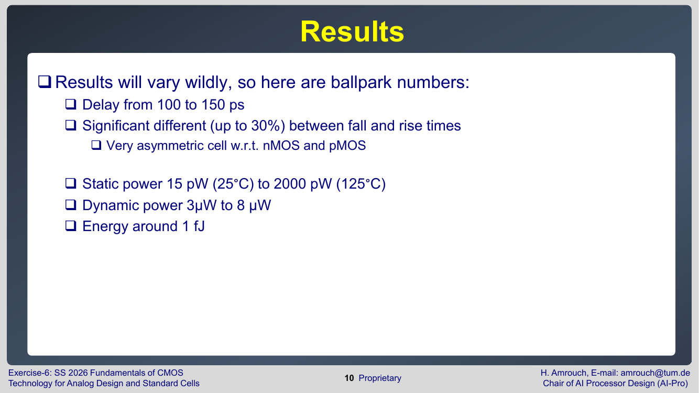

Exercise 06의 direct AOI21은 6개 transistor로 $Y=\overline{A\cdot B+C}$를 구현한다. 공식 netlist의 pin 순서는 `INC INB INA`, 즉 $C,B,A$ 순서다. Cell 이름만 보고 $A,B,C$ 순서로 연결하면 다른 함수가 되므로, **subcircuit pin 순서와 transistor gate 연결을 함께 확인**해야 한다.

공식 해답에서 rise와 fall delay는 최대 약 30% 차이가 난다. 이는 오류가 아니라 pull-up과 pull-down의 구조가 다르기 때문이다.

- Pull-down은 $C$ 단독 path와 $A$-$B$ stack이 병렬이다.
- Pull-up은 그 dual network이므로 transition마다 통과하는 PMOS 수와 내부 node가 달라진다.
- PMOS/NMOS mobility, fin 수, load까지 더해져 rise와 fall drive strength가 같지 않다.

Exercise 06의 AOI21 결과는 delay $100$-$150\,\mathrm{ps}$, static power 약 $15\,\mathrm{pW}$ at $25\,^{\circ}\mathrm{C}$에서 $2000\,\mathrm{pW}$ at $125\,^{\circ}\mathrm{C}$, dynamic power $3$-$8\,\mathrm{\mu W}$, transition energy 약 $1\,\mathrm{fJ}$를 ballpark로 제시한다. 외울 숫자가 아니라 구현과 측정이 비정상적인지 확인하는 대략적 범위다.

전원에서 가져온 transition energy와 평균 power의 관계는 다음과 같다.

```math
E_{transition}=-V_{DD}\int_{t_0}^{t_1} i_{VDD}(t)\,dt,
\qquad
P_{avg}=\frac{E_{transition}}{t_1-t_0}.
```

| 항 | 의미 |
| --- | --- |
| $i_{VDD}(t)$ | supply source를 흐르는 순간 전류 |
| $t_0,t_1$ | 측정하려는 transition window의 시작과 끝 |
| 음수 부호 | SPICE source-current 방향을 회로가 소비한 양의 energy로 바꾸기 위한 convention |

Exercise 06은 input transition 시작점에서 output이 fall 시 $0.1V_{DD}$, rise 시 $0.9V_{DD}$에 도달할 때까지를 사용한다. 앞 장의 50%-to-50% propagation delay와 정의가 다르므로, **trigger/target threshold가 다른 delay 숫자를 직접 비교하면 안 된다**.

## Half-adder와 full-adder

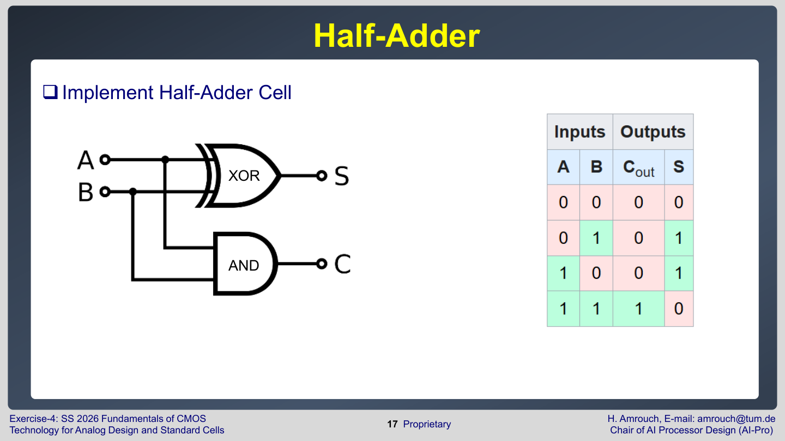

Half-adder는 두 bit $A$, $B$를 더해 $SUM$과 $CARRY$를 만든다.

$$
SUM = A \oplus B
$$

$$
CARRY = A \cdot B
$$

즉 XOR와 AND가 필요하다.

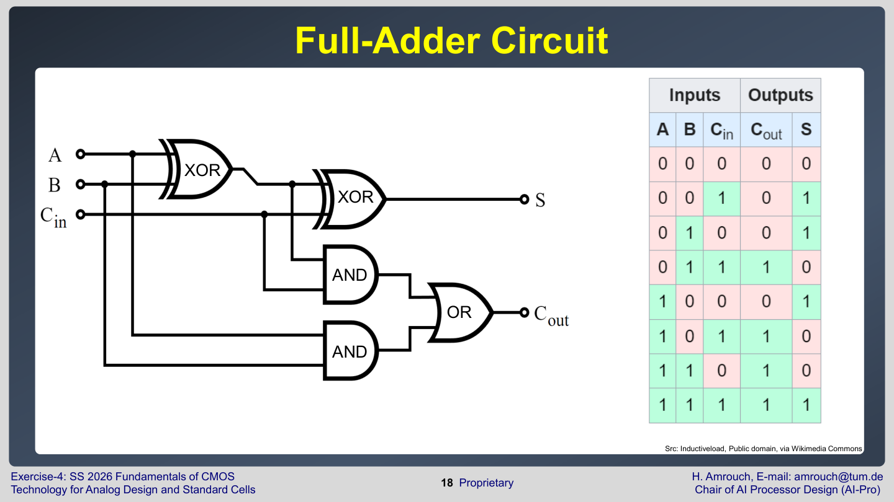

Full-adder는 $A$, $B$, $C_{in}$을 더한다. Carry-in이 추가되므로 half-adder보다 복잡하다.

$$
SUM = A \oplus B \oplus C_{in}
$$

$$
C_{OUT} = A B + C_{in}(A \oplus B)
$$

이 식은 다음 gate들로 구현할 수 있다.

- XOR: sum bit 계산
- AND: generate와 propagate carry term 계산
- OR: carry output 결합

현재 cell library의 full-adder도 이 구조를 따른다.

```spice
.subckt FA_X1 A B CIN VDD VSS SUM COUT num_fins=1
x_xor1 A B VDD VSS P XOR2_X1 num_fins=num_fins
x_xor2 P CIN VDD VSS SUM XOR2_X1 num_fins=num_fins
x_and1 A B VDD VSS G AND2_X1 num_fins=num_fins
x_and2 P CIN VDD VSS PC AND2_X1 num_fins=num_fins
x_or1 G PC VDD VSS COUT OR2_X1 num_fins=num_fins
.ends FA_X1
```

## 4-bit ripple-carry adder

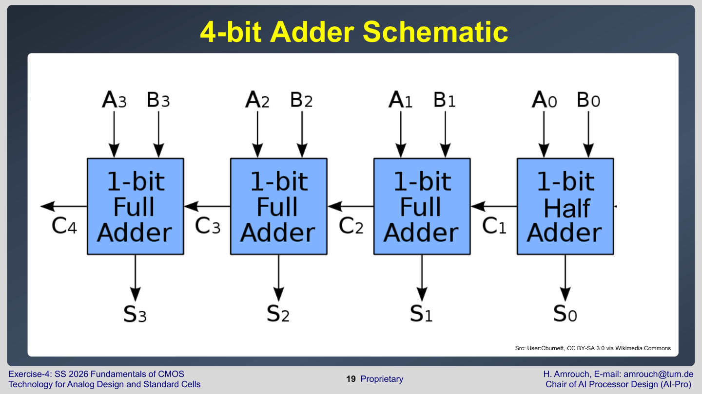

4-bit adder는 1-bit adder를 여러 개 이어 붙여 만든다. 낮은 bit에서 생긴 carry가 다음 bit의 carry-in으로 들어간다.

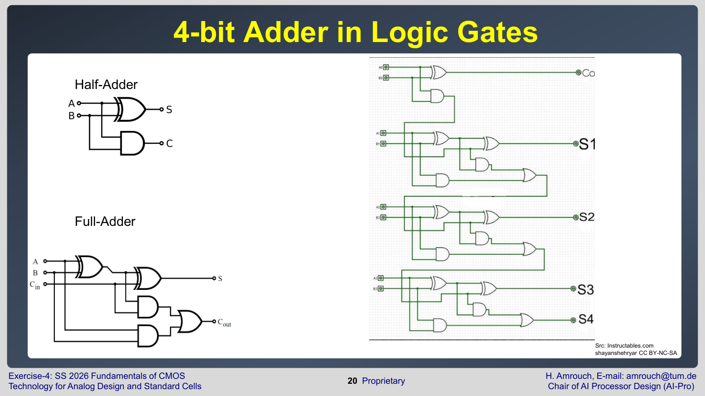

Ripple-carry 구조의 중요한 특징은 carry propagation이다. 하위 bit에서 생긴 carry가 상위 bit까지 연쇄적으로 전달될 수 있다.

현재 cell library의 $\mathrm{ADD4}$는 다음처럼 full-adder 네 개를 연결한다.

```spice
.subckt ADD4 A0 A1 A2 A3 B0 B1 B2 B3 CIN VDD VSS S0 S1 S2 S3 COUT num_fins=1
x_fa0 A0 B0 CIN VDD VSS S0 C1 FA_X1 num_fins=num_fins
x_fa1 A1 B1 C1  VDD VSS S1 C2 FA_X1 num_fins=num_fins
x_fa2 A2 B2 C2  VDD VSS S2 C3 FA_X1 num_fins=num_fins
x_fa3 A3 B3 C3  VDD VSS S3 COUT FA_X1 num_fins=num_fins
.ends ADD4
```

이 구조에서는 $S_{0}$보다 $S_{3}$나 $C_{OUT}$ delay가 커지기 쉽다. $S_{3}$와 $C_{OUT}$은 여러 stage를 거친 carry의 영향을 받을 수 있기 때문이다.

## Adder power/delay 측정 방식

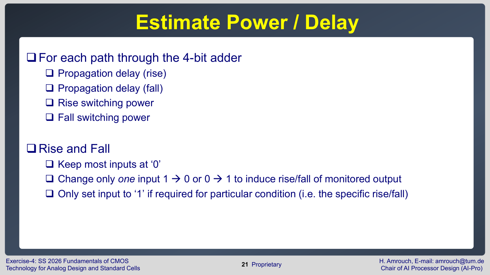

Exercise 05는 4-bit adder의 각 path에 대해 다음을 측정하라고 한다.

- propagation delay rise
- propagation delay fall
- rise switching power
- fall switching power
- static power

측정 원칙은 다음이다.

```text
대부분의 input은 0으로 유지하고, 한 input만 0 -> 1 또는 1 -> 0으로 바꾸어 monitored output의 rise/fall을 유도한다.
```

이렇게 하는 이유는 원인과 결과를 분리하기 위해서다. 여러 input이 동시에 바뀌면 output 변화가 어느 input 때문인지, 어느 path를 통과했는지 판단하기 어렵다.

| 조건 | 목적 |
| --- | --- |
| one-input toggle | 특정 path의 delay를 분리 |
| rise/fall 분리 | pull-up path와 pull-down path 차이 확인 |
| output별 측정 | $S_{0}$, $S_{1}$, $S_{2}$, $S_{3}$, $C_{OUT}$의 path 차이 확인 |
| static input state 측정 | leakage가 operand에 따라 달라지는지 확인 |

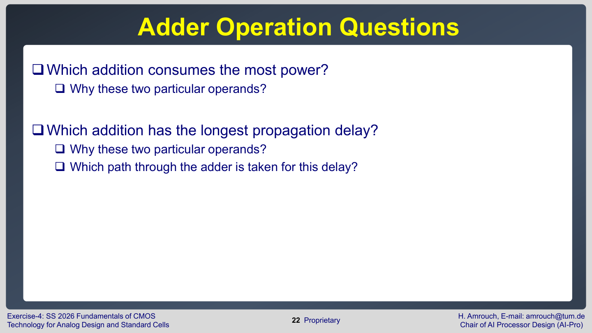

Adder operation question은 세 가지를 묻는다.

1. 어떤 addition이 가장 많은 power를 소비하는가?
2. 어떤 addition이 가장 긴 propagation delay를 만드는가?
3. 그 delay는 adder 내부의 어떤 path를 통과하는가?

이 질문은 손으로 직감하기 어렵다. Ripple-carry path, output switching 개수, internal node switching, load capacitance가 동시에 작용하기 때문이다.

### Exercise 06 해답: path sensitization

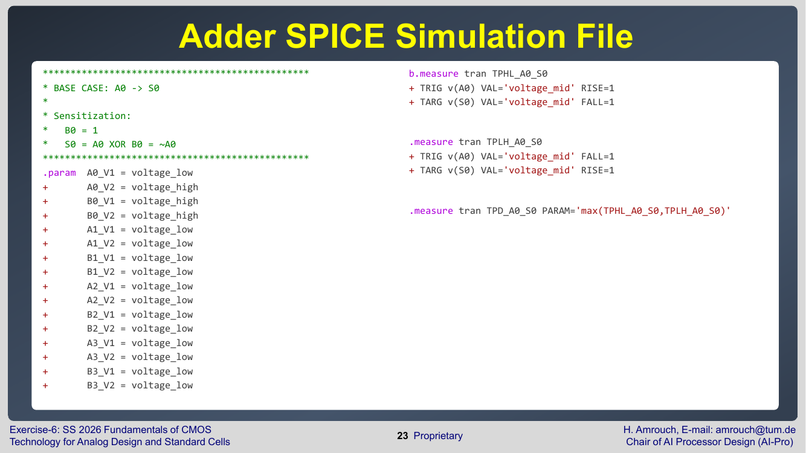

**Path sensitization**은 측정할 input 변화가 목표 output까지 실제로 전달되도록 다른 input을 고정하는 것이다. 예를 들어 $A_0\rightarrow S_0$ path를 보려면 $B_0=1$로 두어

```math
S_0=A_0\oplus 1=\overline{A_0}
```

이 되게 한다. 그러면 $A_0$의 rise는 $S_0$의 fall로, $A_0$의 fall은 $S_0$의 rise로 나타나므로 $t_{PHL}$과 $t_{PLH}$를 각각 측정할 수 있다.

긴 carry path를 보려면 중간 bit가 carry를 막지 않도록 propagate 조건 $A_i\oplus B_i=1$을 유지해야 한다. 그렇지 않으면 앞단의 변화가 logic masking되어 목표 output까지 도달하지 않는다. 따라서 worst-case delay 탐색은 단순히 모든 input을 toggle하는 문제가 아니라 **논리적으로 유효한 path를 만든 뒤 그 path의 rise/fall을 분리하는 문제**다.

현재 폴더의 기존 결과 요약은 이 질문과 직접 연결된다.

원본 결과:

- `Assignment/exercise4/analysis_tables/ex4_adder_output_summary.csv`
- `Assignment/exercise4/analysis_tables/ex4_adder_worst_cases_report.csv`
- `Assignment/exercise4/analysis_tables/ex4_aoi_summary.csv`

예를 들어 기존 결과에서는 $S_{3}$의 최대 delay가 $184.4\,\mathrm{ps}$로 가장 컸고, maximum delay case는 $B_{0}$ 변화가 $S_{3}$까지 전달되는 carry-related transition이었다. 이것은 ripple-carry 구조에서 낮은 bit의 변화가 높은 bit까지 전파될 때 delay가 커진다는 설명과 맞다.

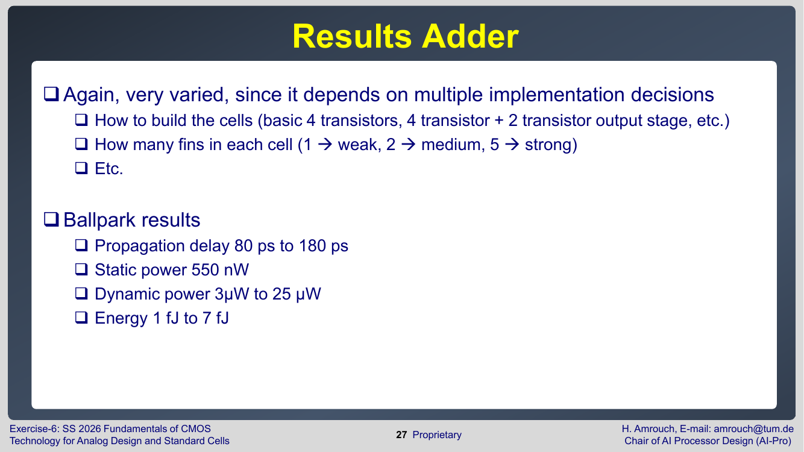

Exercise 06은 adder의 ballpark로 propagation delay $80$-$180\,\mathrm{ps}$, static power 약 $550\,\mathrm{nW}$, dynamic power $3$-$25\,\mathrm{\mu W}$, energy $1$-$7\,\mathrm{fJ}$를 제시한다. 하지만 같은 슬라이드가 강조하듯 이 값은 cell topology, output stage, fin 수, load, temperature, 측정 threshold에 따라 달라진다. 기존 결과의 $184.4\,\mathrm{ps}$가 공식 범위의 위쪽과 비슷하거나 조금 큰 것도 모순이 아니다. **결과 숫자보다 어떤 path와 sizing이 그 숫자를 만들었는지가 핵심**이다.

## 왜 자동화가 필요한가

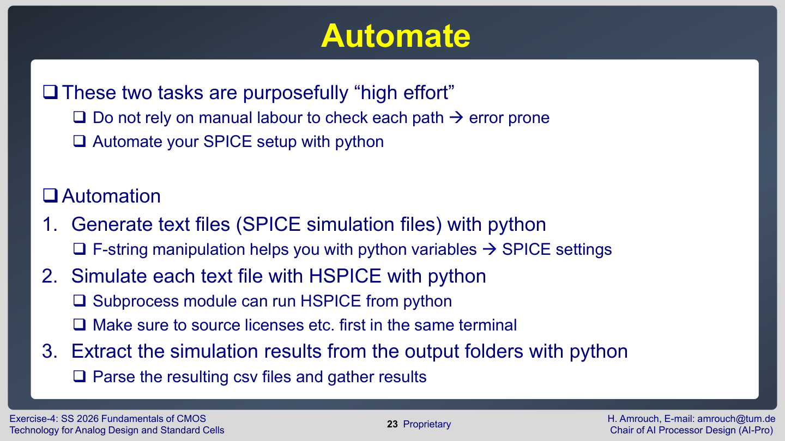

Exercise 05는 이 과제가 일부러 high effort라고 말한다. 이유는 가능한 transition과 input state가 많기 때문이다.

4-bit adder의 input은 다음과 같다.

```text
A3 A2 A1 A0
B3 B2 B1 B0
Cin
```

총 9개 input bit가 있으므로 input state는 $2^{9}=512$개다. 각 state에서 한 bit만 toggle하는 경우까지 고려하면 수천 개의 directed transition이 생긴다. 이를 수동으로 SPICE deck으로 만들고 결과를 읽으면 실수 가능성이 매우 크다.

자동화 flow는 세 단계다.

| 단계 | 작업 | Python에서 필요한 기능 |
| --- | --- | --- |
| 1 | SPICE simulation file 생성 | f-string, template 작성 |
| 2 | HSPICE 실행 | `subprocess`로 command 실행 |
| 3 | 결과 취합 | CSV parsing, summary table 생성 |

현재 `Assignment/exercise4/report/projectfiles/README_run_ko.md`도 같은 구조를 따른다.

```bash
python generate_ex4_decks.py
python run_ex4_hspice.py
python collect_ex4_results.py
```

자동화를 할 때 중요한 점은 case id를 안정적으로 붙이는 것이다. 예를 들어 `addp_04324`처럼 case id가 있으면, worst-case table에서 해당 case의 `.sp`, `.lis`, `.mt0.csv`를 다시 추적할 수 있다.

## 실습 결과를 이론과 연결하는 법

Exercise 05의 목적은 단순히 HSPICE를 많이 돌리는 것이 아니다. 측정값을 회로 구조와 연결해야 한다.

| 측정 결과 | 연결해야 하는 원인 |
| --- | --- |
| AOI direct/decomposed delay 차이 | logic depth, transistor stack, internal node capacitance |
| AOI static power 차이 | cell 수, leakage path, stack effect |
| ADD4 $S_{3}$ delay 증가 | ripple-carry propagation |
| 특정 transition의 high power | switching node 수, capacitance, transition duration |
| 고온 delay 증가 | mobility 감소 |
| 고온 static power 증가 | leakage 증가 |
| aging 후 delay 증가 | $V_{th}$ shift와 drive current 감소 |

보고서 답안에서는 다음 순서가 좋다.

1. 어떤 회로를 비교했는지 말한다.
2. 어떤 input transition 또는 operand가 worst case인지 말한다.
3. 그 case가 어떤 path를 통과하는지 설명한다.
4. delay/power 숫자를 제시한다.
5. 회로 구조와 물리 원인을 연결한다.

## 시험 대비 핵심

- SPICE deck은 parameter, source, cell instantiation, sweep, measurement를 구분해서 읽어야 한다.
- Time variable은 input transition과 measurement window를 일관되게 유지하기 위해 쓴다.
- NAND2_X4는 NAND2_X2보다 drive strength가 크지만 capacitance와 power 비용도 커질 수 있다.
- 고온에서는 mobility 감소 때문에 delay가 증가하고, leakage 증가 때문에 static power가 증가한다.
- Aging은 delay를 증가시키므로 timing guardband가 필요하고, 특히 고온 aging 조건에서 guardband 요구가 커진다.
- AOI21 direct complex cell은 $Y=\overline{A\cdot B+C}$를 하나의 transistor network로 구현한다.
- Decomposed AOI21은 $\mathrm{NAND}+\mathrm{INV}+\mathrm{NOR}$로 같은 Boolean function을 구현하지만 internal node와 cell 수가 늘어난다.
- AOI21의 pull-up/pull-down 비대칭 때문에 rise와 fall delay는 같지 않을 수 있다.
- Delay나 power를 비교하려면 input/output threshold와 integration window가 같아야 한다.
- Half-adder는 XOR와 AND, full-adder는 XOR/AND/OR 조합으로 구현된다.
- 4-bit ripple-carry adder에서는 carry가 낮은 bit에서 높은 bit로 전달되므로 상위 bit delay가 커질 수 있다.
- Path sensitization은 다른 input을 고정해 특정 transition이 목표 output까지 전달되게 만드는 과정이다.
- Official solution의 숫자는 구현 타당성을 보는 ballpark이며 universal specification이 아니다.
- Adder path/power 측정은 가능한 case가 많아 수동 작업보다 Python 자동화가 필요하다.

## 포함 범위


- Exercise 05: pages 2-11, 14-23
- Exercise 06 선별 반영: pages 5, 8, 10, 21-24, 27
- 주요 제외: Exercise evaluation 안내 pages 12-13
- Exercise 06 중복/도구성 제외: section divider pages 2, 9, 11, 26, 반복적인 SPICE setup·primitive-cell boilerplate pages 3-4, 6-7, 12-20, `.ALTER`/Python 실행 선택만 다루는 page 25
- 핵심 반영: NAND 결과 해석, AOI21 transistor asymmetry와 energy metric, half/full/4-bit adder 구조, path sensitization, implementation-dependent result range, 자동화 필요성
