# 11. 레이아웃, 물리 설계, DRC/LVS

## 이 장의 위치

이 장은 `Lecture/Slides Lecture 13.pdf`, `Lecture/Slides Lecture 14.pdf`, `Lecture/Slides Lecture 15.pdf`를 하나로 묶어 정리한다. Lecture 13부터 주제가 transistor-level SPICE 실습에서 digital layout flow로 넘어가고, Lecture 15는 LVS 이후의 I/O, timing signoff, standard-cell layout까지 흐름을 완성한다.

앞의 10번 노트가 NAND, AOI21, adder를 SPICE로 측정하는 법을 다뤘다면, 이 장은 그 논리 회로가 실제 chip layout으로 바뀌는 과정을 다룬다.

```text
RTL 기능 설명 -> gate-level netlist -> placement/routing -> RC extraction/signoff -> 제조 가능한 layout
```

핵심은 단순하다. Gate-level netlist는 무엇이 연결되어야 하는지만 알려준다. 실제로 어디에 놓고, 어떤 metal layer로 연결하고, 어느 정도의 wire resistance/capacitance와 power drop을 갖는지는 layout 단계에서 결정된다.

## 핵심 질문

- RTL, gate-level netlist, GDSII layout은 서로 무엇이 다른가?
- Placement, routing, RC extraction은 delay와 power를 어떻게 바꾸는가?
- I/O cell은 왜 ESD 보호, 큰 부하 구동, voltage level 변환을 맡는가?
- STA는 왜 가장 긴 path와 가장 짧은 path를 모두 검사하는가?
- NMOS, PMOS, inverter, NAND의 회로 연결은 2D layout에서 어떻게 표현되는가?
- Tap cell은 무엇을 연결하며, 왜 standard cell 밖에 따로 배치하는가?
- DRC와 LVS는 각각 무엇을 검증하며, 왜 둘 다 필요한가?

## 왜 layout까지 봐야 하는가

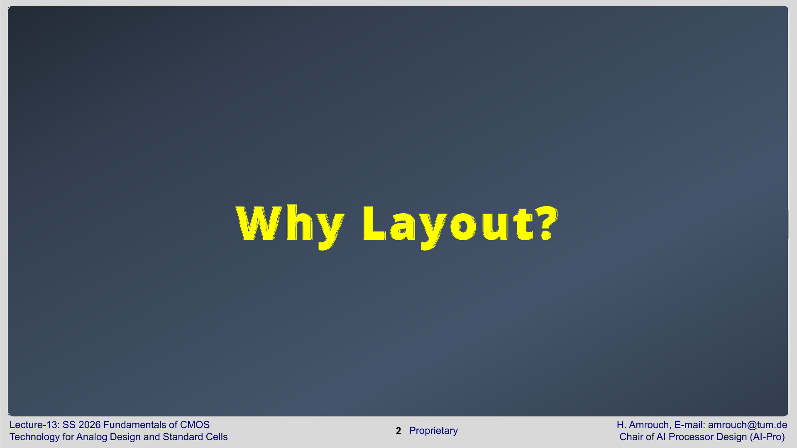

Lecture 13의 첫 질문은 "Why Layout?"이다. Gate-level netlist까지 얻으면 Boolean function은 정해졌지만, <font color="#ffc000">chip에서의 실제 성능은 아직 정해지지 않았다</font>. 그 이유는<font color="#00b0f0"> wire가 추상적인 선이 아니라, resistance와 capacitance를 가진 물리적인 구조물이기 때문</font>이다.

Layout 단계에서 새로 결정되는 것은 다음과 같다.

| Layout에서 정해지는 것 | 의미                                                                                                                       |
| --------------- | ------------------------------------------------------------------------------------------------------------------------ |
| cell 위치         | 연결된 cell 사이의 거리와 wire 길이를 결정                                                                                             |
| **metal layer** | wire <font color="#00b0f0">resistance, capacitance, current capacity</font>를 결정                                          |
| via 위치와 개수      | layer 사이 연결 resistance와 reliability를 결정                                                                                  |
| **power grid**  | $V_{DD}$와 $V_{SS}$ 공급 품질, <font color="#00b0f0">IR drop</font>, <font color="#00b0f0">electromigration margin</font>을 결정 |

따라서 같은 logic이라도 <font color="#ffc000">layout이 나쁘면 delay가 길어지고, switching power가 증가하고, routing congestion이나 reliability 문제가 생길 수 있다</font>.

## RTL에서 GDSII까지의 큰 흐름

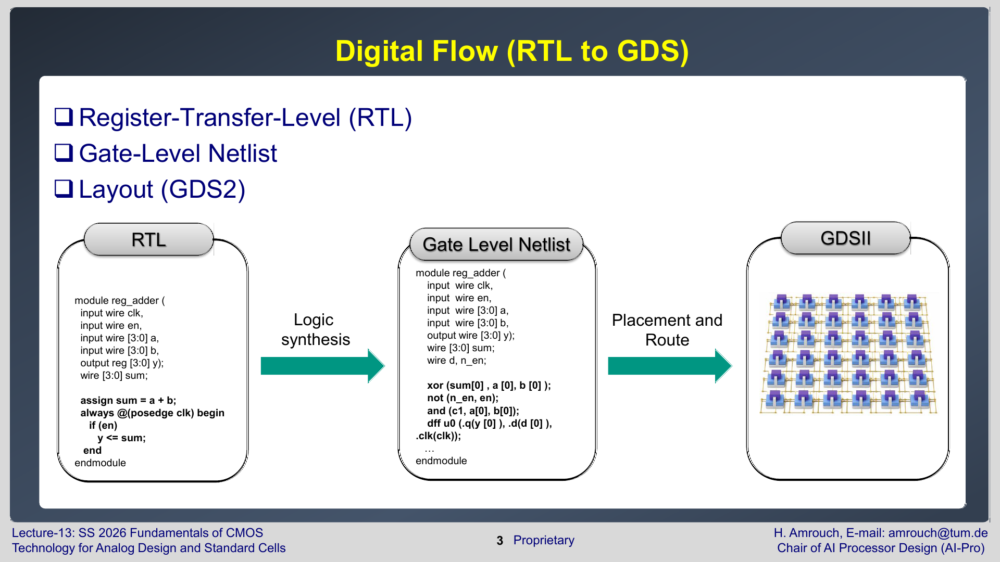

Digital backend flow는 다음처럼 읽으면 된다.

```text
RTL
  -> logic synthesis
  -> gate-level netlist
  -> placement and routing
  -> GDSII layout
```

각 단계의 역할은 다르다.

| 단계                           | 담고 있는 정보                                                              | 아직 없는 정보                                                                |
| ---------------------------- | --------------------------------------------------------------------- | ----------------------------------------------------------------------- |
| **RTL**                      | 기능, register 동작, clocked<font color="#ffc000"> behavior</font>        | 어떤 standard cell을 쓸지, 어디에 놓을지                                           |
| **gate-level netlist**       | standard <font color="#ffc000">cell 연결 graph</font>                   | cell 좌표, wire 길이, metal layer, via                                      |
| **placed-and-routed layout** | <font color="#ffc000">실제 cell 위치</font>, metal/via geometry, power 연결 | 제조 signoff 전까지는 <font color="#00b0f0">rule violation 여부가 확정되지 않음</font> |
| **GDSII**                    | foundry에 전달 가능한<font color="#ffc000"> layout geometry</font>          | 설계 의도 설명이 아니라 geometry database                                         |

Lecture 13의 예시 RTL은 adder를 기능적으로 설명한다.

```verilog
module add(
    input CLK,
    input [3:0] A,
    input [3:0] B,
    output reg [4:0] SUM
);
always @(posedge CLK) begin
    SUM <= A+B;
end
endmodule
```

여기서 중요한 것은 **RTL**이 "어떻게 transistor를 연결할지"를 말하지 않는다는 점이다. RTL은 $A+B$를 계산하고 clock edge에서 $SUM$ register에 저장한다는<font color="#ffc000"> functional intent를 표현</font>한다.

### GDSII와 layer mask

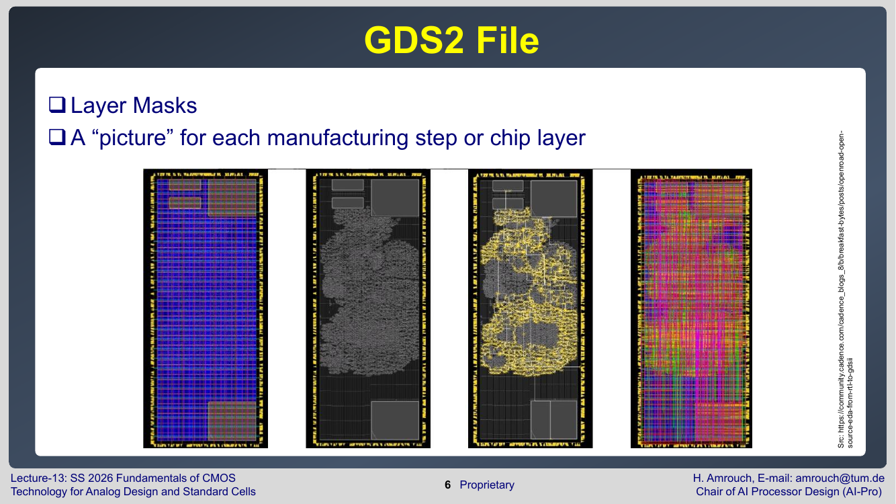

**GDSII(GDS2)**는 배치·배선이 끝난 chip의 polygon geometry를 layer별로 저장하는 최종 layout database다. Foundry는 이 layer 정보를 공정 단계에 맞는 mask data로 변환한다. 따라서 슬라이드의 “각 layer의 picture”라는 표현은 다음처럼 이해하면 된다.

```text
GDSII layer geometry -> foundry layer mapping -> lithography mask -> wafer 위 구조 형성
```

GDSII는 회로의 기능을 설명하는 파일이 아니다. 어느 layer의 어느 좌표에 어떤 도형을 만들지를 기록한다.

## I/O cell과 chip ring

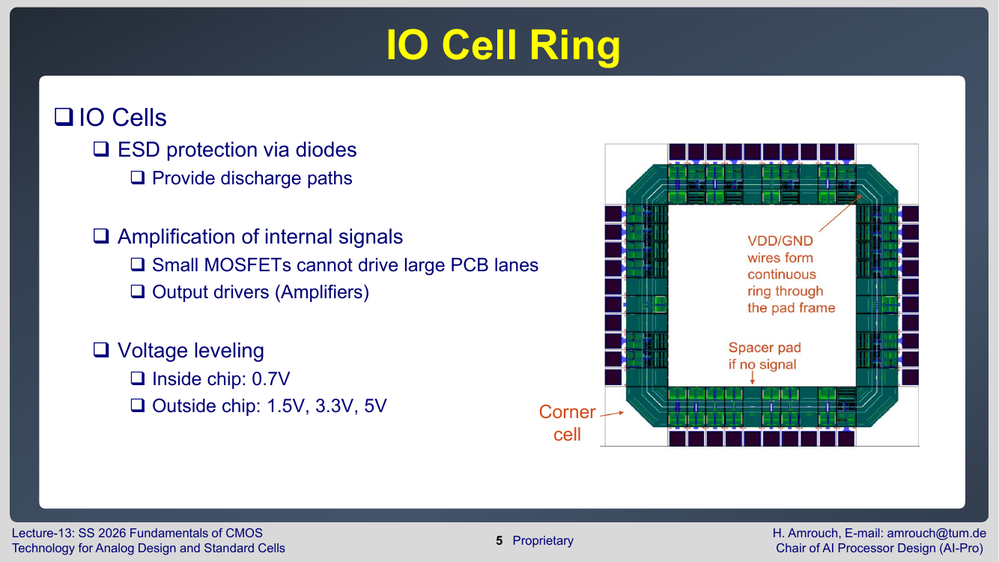

Core logic의 작은 transistor는 외부 pad와 PCB trace를 직접 다루기 어렵다. 그래서 chip 가장자리의 **I/O cell ring**이 core와 package 사이의 전기적 경계를 맡는다.

| I/O cell 기능 | 필요한 이유 |
| --- | --- |
| **ESD protection** | pad로 들어온 순간적인 고전압 전류를 $V_{DDIO}$/$V_{SSIO}$ 쪽 discharge path로 우회시켜 core gate oxide를 보호한다. |
| **Output driver** | 작은 core cell보다 큰 transistor로 pad와 PCB capacitance를 충·방전한다. |
| **Level shifting** | 예를 들어 $0.7\,\mathrm{V}$ core 신호와 $1.5/3.3/5\,\mathrm{V}$ 외부 신호 사이의 voltage domain을 변환한다. |

I/O cell은 보통 chip 둘레에 ring 형태로 배치되고, corner cell은 모서리에서 well·power·geometry의 연속성을 맞춘다. 핵심은 **I/O ring이 단순한 pin 배열이 아니라 보호·구동·전압 변환 회로**라는 점이다.

## RTL file과 gate-level netlist의 차이

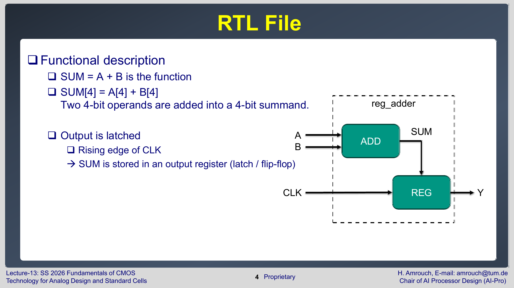

RTL file은 <font color="#00b0f0">사람이 읽는 기능 설명에</font> 가깝다. 예를 들어 $SUM=A+B$는 "덧셈을 수행한다"는 의미지만, 이 표현만으로는 XOR, AND, OR<font color="#ffc000"> gate가 몇 개 필요한지, carry path가 어떻게 구성되는지 알 수 없다</font>.

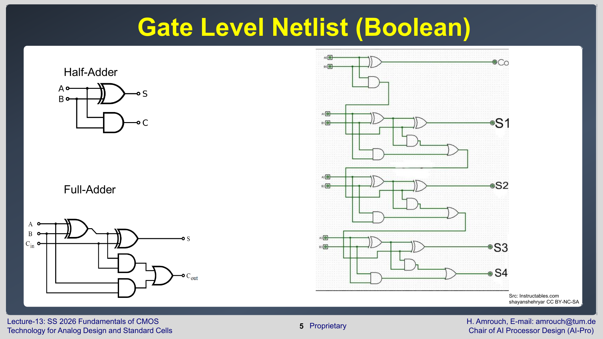

Logic synthesis를 거치면 half-adder, full-adder 같은 gate-level 구조가 나온다.

| 구조 | 핵심 식 | 의미 |
| --- | --- | --- |
| half-adder | $S=A\oplus B$, $C=A\cdot B$ | carry-in이 없는 1-bit addition |
| full-adder | $S=A\oplus B\oplus C_{in}$ | carry-in까지 포함한 1-bit addition |
| full-adder carry | $C_{out}=A\cdot B + C_{in}(A\oplus B)$ | generate와 propagate를 함께 표현 |

이 단계부터 논리 gate의 연결은 보이지만, 여전히 layout은 아니다.

## Logic synthesis가 하는 일

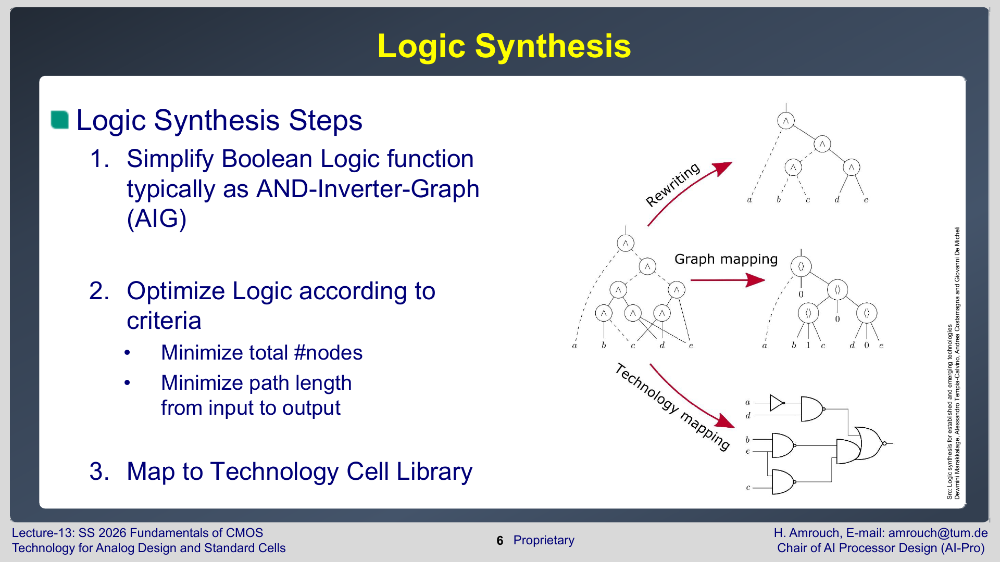

**Logic synthesis**는 RTL의 <font color="#ffc000">Boolean behavior를 실제 standard cell library에 맞는 gate network로 바꾼다</font>.

주요 작업은 세 가지다.

| 작업                         | 설명                                                                                                                       |
| -------------------------- | ------------------------------------------------------------------------------------------------------------------------ |
| **Boolean simplification** | 불필요한 logic을 줄이고 <font color="#e84d4d">같은 기능을 더 작은 graph로 표현</font>                                                       |
| **path optimization**      | critical path의 <font color="#e84d4d">logic depth를 줄이거나 drive strength를 조정</font>                                         |
| **technology mapping**     | abstract gate를 <font color="#e84d4d">실제 library cell</font>, 예를 들어 NAND2_X2, <font color="#e84d4d">XOR2_X1 등으로 매핑</font> |

여기서 optimization은 단순히 gate 수를 줄이는 것만이 아니다. 너무 작은 cell을 쓰면 capacitance는 줄지만 drive가 약하고, 너무 큰 cell을 쓰면 delay는 줄 수 있지만 input capacitance와 power가 증가한다. 그래서 **synthesis**는 <font color="#ffc000">area, delay, power constraint 사이에서 균형</font>을 잡는다.

## Gate-level netlist는 graph이지 layout이 아니다

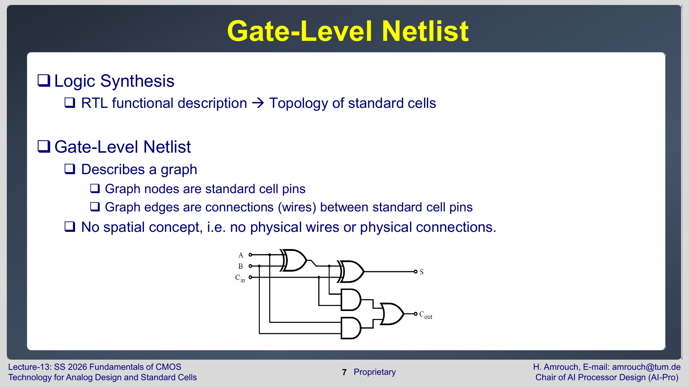

Gate-level netlist를 graph로 보면 node는 cell pin, edge는 전기적 연결이다. 하지만 이 edge는 아직 물리 wire가 아니다.


**netlist의 edge** = "<font color="#00b0f0">이 pin과 저 pin이 같은 net이다</font>"
**layout의 wire** = "특정 metal layer 위의 <font color="#00b0f0">특정 폭/길이/간격을 가진 물리 도형</font>이다"

이 차이가 중요하다. Netlist만 보면 두 cell이 연결되어 있다는 사실은 알 수 있지만, 그 연결이 $10\,\mathrm{\mu m}$인지 $2\,\mathrm{mm}$인지, $M_{1}$으로 가는지 $M_{8}$으로 가는지, via가 몇 개 필요한지는 알 수 없다. 이 정보가 생기는 단계가 physical design이다.

## Physical design의 목표

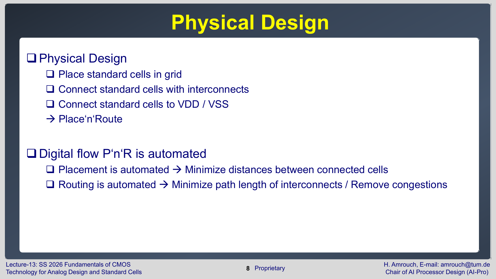

**Physical design**은 <font color="#ffc000">gate-level netlist를 실제 layout으로 바꾼다</font>. 핵심 작업은 세 가지다.

| 작업                   | 질문                                                                             |
| -------------------- | ------------------------------------------------------------------------------ |
| **placement**        | 각 standard <font color="#e84d4d">cell과 macro를 어디에 둘 것인가?</font>                |
| **routing**          | 각 net을 <font color="#e84d4d">어떤 metal layer와 via로 연결</font>할 것인가?              |
| **power connection** | 모든 cell에 $V_{DD}$와 $V_{SS}$를 <font color="#e84d4d">충분히 안정적으로 공급</font>할 수 있는가? |

결과적으로 **physical design**은 <font color="#ffc000">"논리적으로 맞는 회로"를 "제조 가능한 물리적 도형"으로 바꾸는 과정</font>이다.

## Interconnect와 via

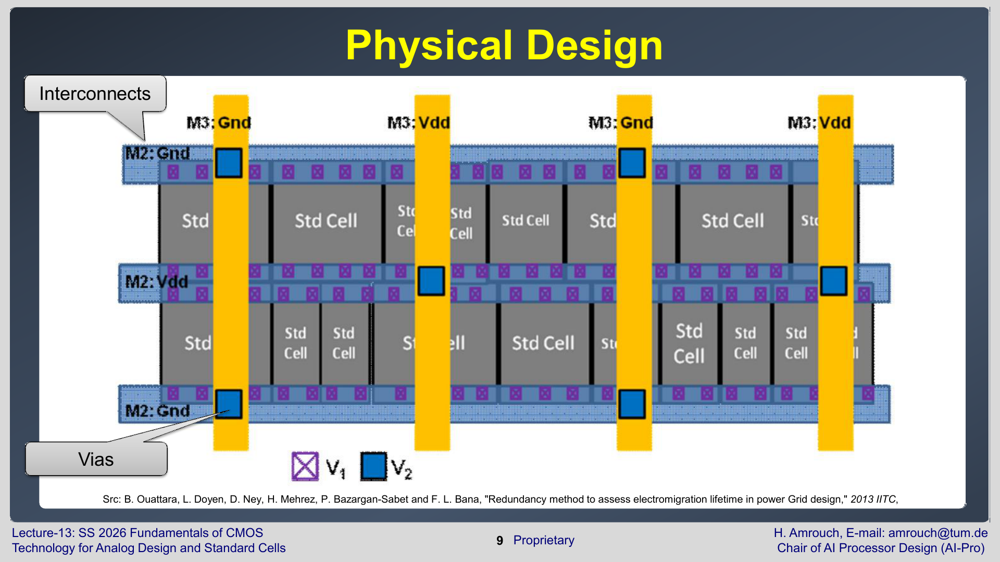

**Interconnect**는 <font color="#ffc000">같은 metal layer 안에서 옆으로 이어지는 wire</font>이고, **via**는 <font color="#ffc000">서로 다른 metal layer를 수직으로 연결</font>한다.

| 구조             | 역할                                                                 | 물리적 비용                            |
| -------------- | ------------------------------------------------------------------ | --------------------------------- |
| **metal wire** | <font color="#e84d4d">horizontal/vertical routing</font>           | resistance, capacitance, area     |
| **via**        | <font color="#e84d4d">layer 사이 연결                          </font> | via resistance, reliability limit |
| **via array**  | 큰 current나 낮은 resistance가 필요할 때 여러 via 병렬 사용                       | area와 routing blockage 증가         |

시험에서 중요한 직관은 "<font color="#92d050">via는 공짜 연결점이 아니다</font>"라는 점이다. <font color="#e84d4d">Via도 resistance를 갖고, electromigration이나 제조 rule의 제약을 받는다</font>.

## Chip stack: transistor 위에 금속 배선을 쌓는다

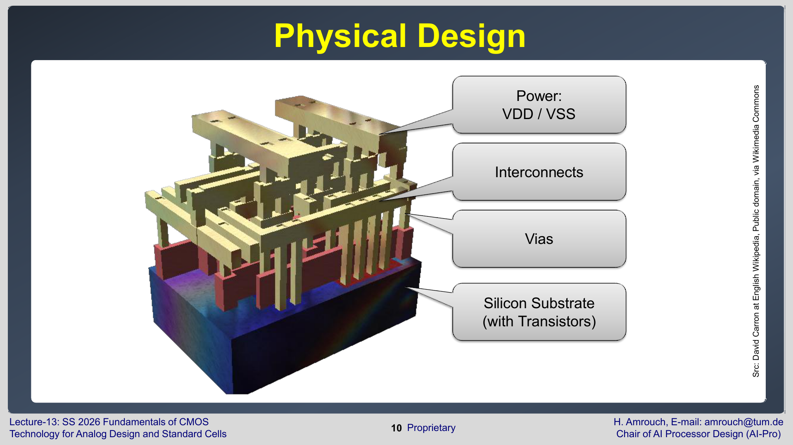

Chip은 아래쪽 silicon substrate에 transistor가 있고, 그 위로 여러 층의 metal interconnect가 쌓인 구조다.

```text
top metal / global routing / power distribution
middle metal routing
local metal routing
transistors in silicon substrate
```

Lecture 13의 instructional video slide는 이 3D stack을 직관적으로 보여주기 위한 참고 자료다. 핵심은 <font color="#ffc000">transistor 자체는 아래층에 있고, 신호와 power는 그 위의 metal/via network를 통해 분배</font>된다는 점이다.

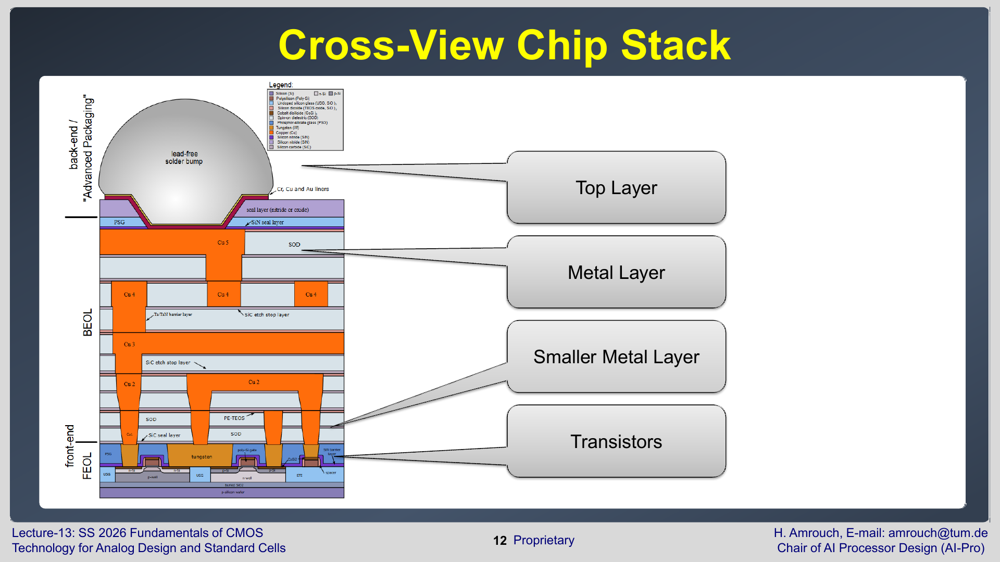

위에서 본 layout은 2D 도형처럼 보이지만, 실제로는 여러 층이 쌓인 3D 구조다. Top layer, lower metal layer, transistor layer가 서로 다른 높이에 존재하고, via가 이 층들을 이어 준다.

>Via는 전기 전도성이 좋은<font color="#92d050"> 구리를 위주로 사용</font>


## FEOL, BEOL, metal stack

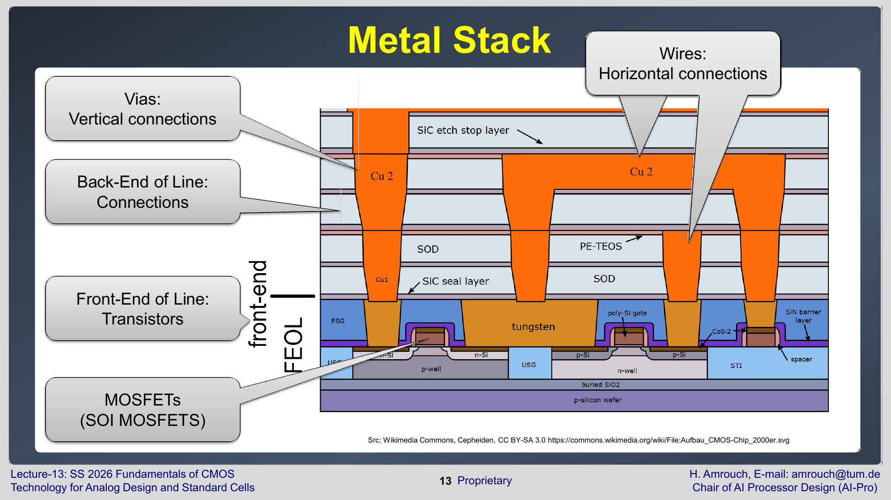

Layout stack은 크게 FEOL과 BEOL로 나눌 수 있다.

| 구분              | 의미                    | 역할                                                                           |
| --------------- | --------------------- | ---------------------------------------------------------------------------- |
| **FEOL**        | front-end-of-line     | <font color="#e84d4d">transistor 자체를 형성                             </font>  |
| **MOL/contact** | middle/contact region | transistor terminal을 lower metal에 연결                                         |
| **BEOL**        | back-end-of-line      | <font color="#e84d4d">metal wire와 via</font>로 cell, signal, clock, power를 연결 |

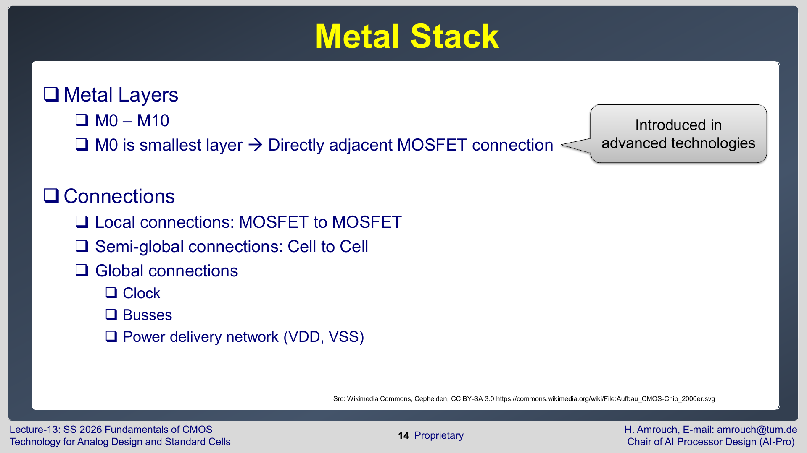
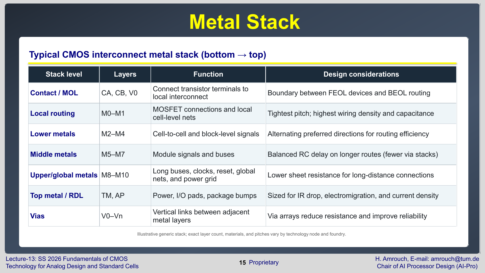
**Metal layer**는 보통 <font color="#00b0f0">낮은 층과 높은 층의 역할이 다르다</font>.

| Layer 범위          | 주 용도                            | 특징                                              |
| ----------------- | ------------------------------- | ----------------------------------------------- |
| $M_{0}$-$M_{1}$   | local routing                   | cell 내부 또는 가까운 cell 연결                          |
| $M_{2}$-$M_{4}$   | lower metal                     | standard cell row 주변 signal routing             |
| $M_{5}$-$M_{7}$   | middle metal                    | 더 긴 signal, clock 일부, block-level routing       |
| $M_{8}$-$M_{10}$  | upper/global metal              | bus, clock trunk, power grid                    |
| **top metal/RDL** | package bump, pad, global power | <font color="#ffc000">두껍고 resistance가 낮음</font> |

>금속 레이어는 **계층적으로 구성**되며, <font color="#ffc000">낮은 레이어에서 상위 레이어로 올라갈 수록 Local -> Global 연결</font>


**낮은 metal**은<font color="#00b0f0"> 좁고 촘촘한 local connection에 적합</font>하고, **높은 metal**은 <font color="#00b0f0">두껍고 저항이 낮아 먼 거리의 global connection이나 power delivery에 적합</font>하다. 이 때문에 routing은 "아무 layer나 쓰는 작업"이 아니라, 신호의 거리와 current 요구를 보고 layer를 선택하는 작업이다.

## Standard-cell layout을 읽는 법

Layout은 회로 기호가 아니라 **전도성·반도체 layer의 2D 도형**으로 그린다. 위에서 본 도형은 2D지만, contact와 via까지 포함하면 실제 구조는 3D다.

| Layout 요소 | 회로에서의 의미 |
| --- | --- |
| diffusion/active | source와 drain이 형성되는 반도체 영역 |
| polysilicon gate | diffusion을 가로지르는 지점에 transistor channel을 만든다. |
| N-well | PMOS의 P+ diffusion과 body가 놓이는 영역 |
| contact/via | diffusion·gate·metal 또는 서로 다른 metal layer를 연결한다. |
| metal | 전원과 신호 net을 실제 폭을 가진 도형으로 연결한다. |

NMOS는 N+ diffusion이 있는 NMOS 영역에, PMOS는 N-well 안의 P+ diffusion에 만든다. 서로 다른 layer의 도형이 그림에서 겹쳐 보여도, 허용된 contact/via가 없으면 전기적으로 연결된 것이 아니다.

### Inverter layout

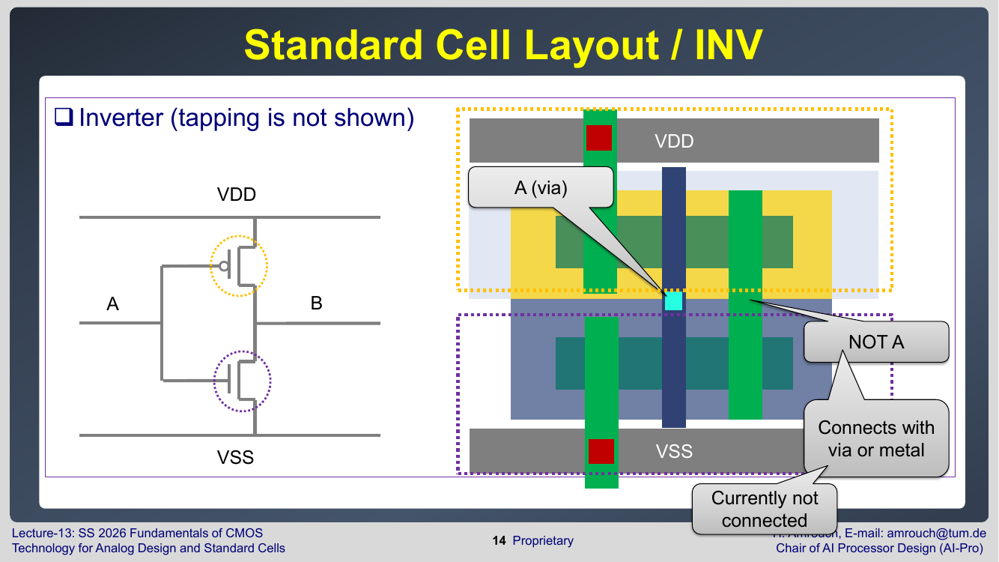

Inverter에서는 입력 $A$가 PMOS와 NMOS의 gate에 함께 연결된다. PMOS source는 $V_{DD}$, NMOS source는 $V_{SS}$에 연결되고, 두 drain을 묶은 node가 출력 $B=\overline{A}$가 된다. 실제 layout에서는 metal과 via가 이 연결을 완성한다. EDA 화면에 보이는 dummy poly는 edge pattern을 일정하게 만드는 보조 구조이며 logic transistor의 입력이 아니다.

### NAND layout

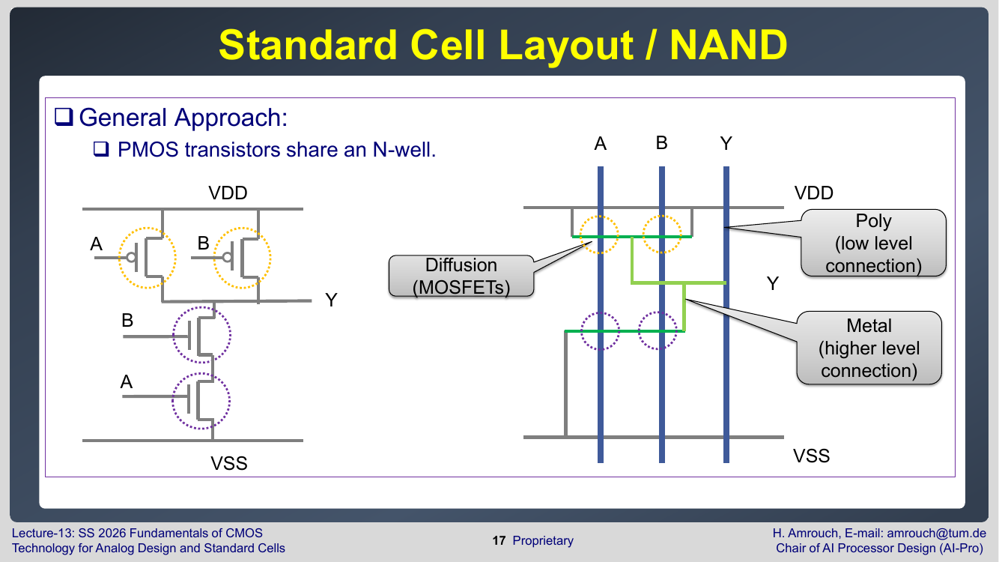

2-input NAND는 **PMOS 두 개가 병렬**, **NMOS 두 개가 직렬**이다. 두 input poly $A$, $B$가 diffusion을 가로지르며 transistor를 만들고, metal이 PMOS drain과 NMOS stack의 위쪽 node를 출력 $Y$로 묶는다. $A=B=1$일 때만 NMOS path가 $V_{SS}$까지 완성되어 $Y=0$이 된다.

Layout의 net은 1D 선이 아니라 폭과 면적을 가진 도형이다. 큰 전류가 흐르는 전원 연결에는 contact/via를 여러 개 병렬로 두어 resistance와 한 개 via에 집중되는 current를 줄인다.

## Tap cell: N-well과 substrate를 안정적으로 고정하기

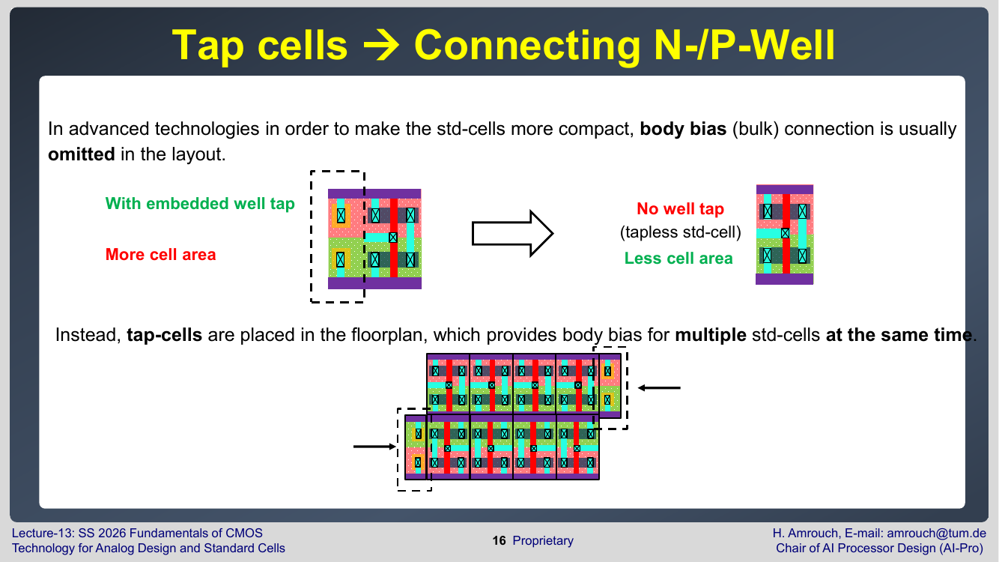

각 standard cell 안에 well tap을 넣으면 body connection은 명확하지만 cell area가 커진다. Advanced standard-cell library는 개별 cell의 tap을 생략하고, floorplan에 **tap cell**을 일정 간격으로 배치해 여러 cell의 body를 함께 연결한다.

- N-well tap은 PMOS body를 보통 $V_{DD}$에 연결한다.
- substrate/P-well tap은 NMOS body를 보통 $V_{SS}$에 연결한다.
- Tap cell 간격은 latch-up, well resistance, noise, foundry rule을 만족해야 하므로 임의로 정하지 않는다.

즉 tapless standard cell은 작아지지만, tap 기능이 사라지는 것이 아니라 별도 physical-only cell로 이동한 것이다.

## Placement: cell을 어디에 둘 것인가

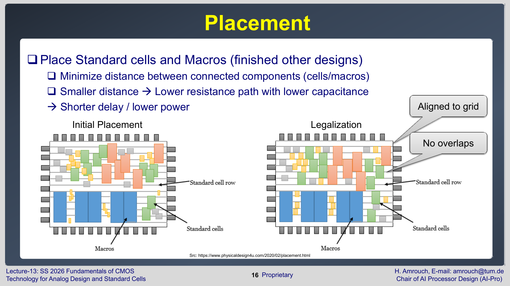

**Placement**는 standard <font color="#ffc000">cell과 macro를 chip 안에 배치하는 단계</font>다. 목표는 <font color="#e84d4d">연결된 cell 사이의 거리를 줄여 delay와 power를 낮추는 것</font>이다.

하지만 placement는 <font color="#00b0f0">단순히 모든 cell을 가장 가까이 모으는 문제가 아니다</font>.

| 목표                   | 너무 강하게 밀면 생기는 문제                                                   |
| -------------------- | ------------------------------------------------------------------ |
| **연결된 cell을 가깝게 둔다** | 특정 영역에 cell이 몰려<font color="#00b0f0"> routing congestion 발생</font> |
| **wire 길이를 줄인다**     | cell density가 높아져 <font color="#00b0f0">routing space 부족</font>    |
| **area를 줄인다**        | <font color="#ffc000">later routing과 timing closure가 어려워짐                             </font>   |

Placement flow에는 보통 initial placement와 legalization이 있다. **Initial placement**는 <font color="#e84d4d">비용함수를 줄이는 방향으로 cell을 대략 배치</font>하고, **legalization**은 <font color="#e84d4d">cell을 row/grid에 맞추며 overlap을 제거</font>한다.

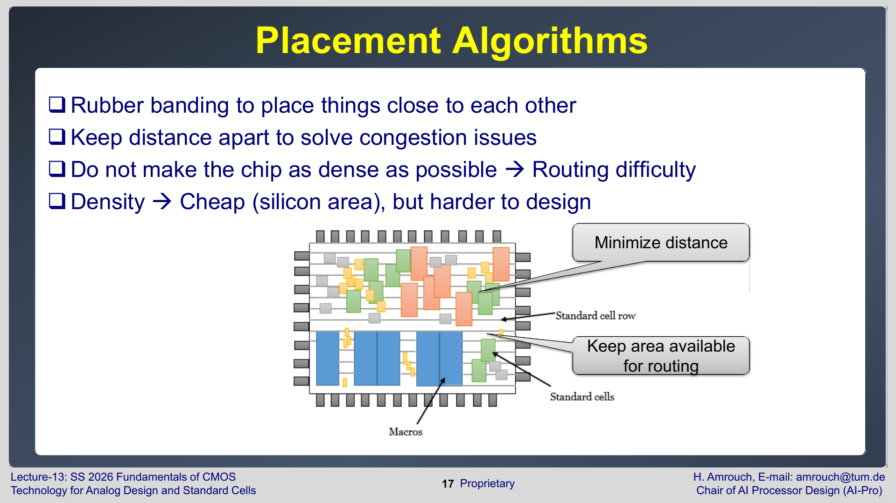

Lecture 13과 14의 placement algorithm slide에서 나온 "**rubber banding**"은 <font color="#ffc000">연결된 물체가 서로 가까워지도록 당기는 직관</font>을 뜻한다. 그러나<font color="#00b0f0"> 실제 chip에서는 routing resource가 제한되어 있으므로 적당한 빈 공간을 남겨야 한다</font>. <font color="#ffc000">가장 높은 density가 항상 좋은 답은 아니다</font>.

## Routing: 정확한 metal path를 정한다

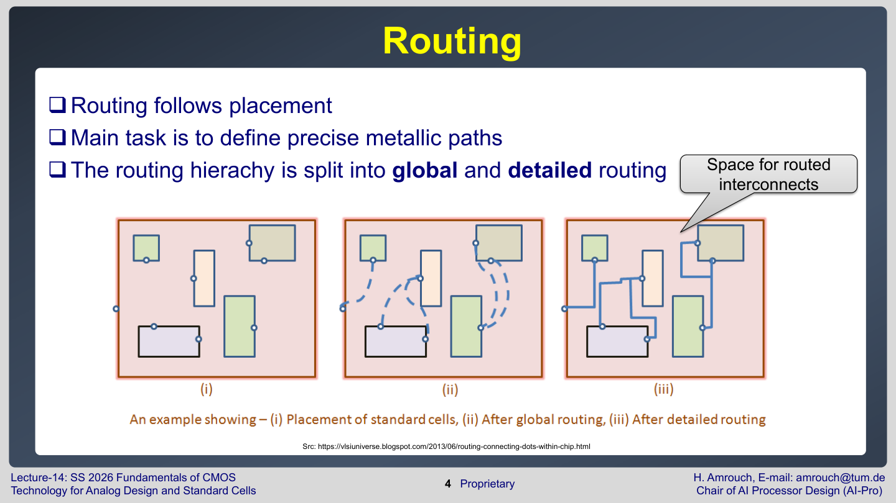

**Routing**은 placement 이후 <font color="#ffc000">각 net을 실제 metal/via geometry로 연결</font>하는 단계다.

Routing은 보통 두 단계로 나누어 생각한다.

| 단계                   | 역할                                                                              |
| -------------------- | ------------------------------------------------------------------------------- |
| **global routing**   | <font color="#e84d4d">대략 어느 routing region과 layer를 지나갈지</font> 결정               |
| **detailed routing** | 실제 wire width, spacing, via 위치를 <font color="#e84d4d">design rule에 맞게 확정</font> |

Placement가 나쁘면 routing이 어려워지고, routing이 길어지면 wire capacitance와 resistance가 증가한다. 결국 placement와 routing은 분리된 작업처럼 보이지만 <font color="#00b0f0">timing, power, congestion 관점에서는 서로 강하게 묶여 있다</font>.

## Alternating routing directions

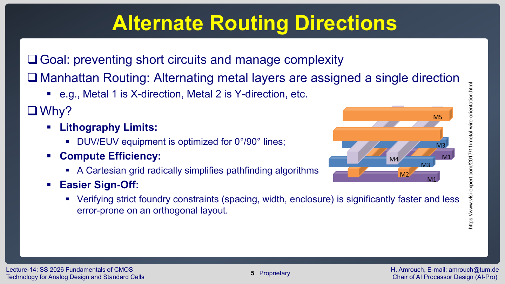

**Digital layout**에서는 <font color="#ffc000">Manhattan routing을 주로 쓴다</font>. 즉 wire는 보통 수평 또는 수직 방향으로 간다. 인접 metal layer의 preferred direction을 번갈아 두면 routing 복잡도와 short risk를 줄일 수 있다.

예를 들어 다음처럼 생각할 수 있다.

```text
M1: horizontal preferred
M2: vertical preferred
M3: horizontal preferred
M4: vertical preferred
```

이 방식은 세 가지 이유로 유리하다.

| 이유                     | 설명                                           |
| ---------------------- | -------------------------------------------- |
| **manufacturability**  | lithography가 $0^\circ/90^\circ$ edge를 다루기 쉬움 |
| **tool efficiency**    | routing search space가 줄어 자동화가 쉬움             |
| **signoff simplicity** | spacing/short checking이 체계적으로 쉬워짐            |

## RC extraction: wire가 delay와 power를 바꾼다

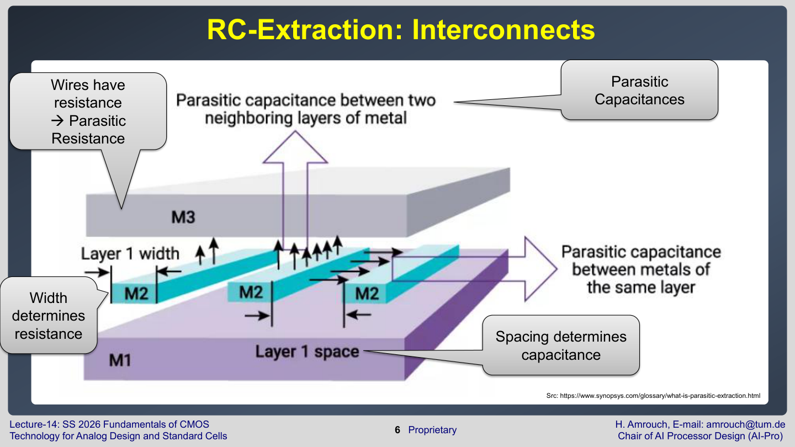

**RC extraction**은 <font color="#ffc000">layout geometry에서 parasitic resistance와 capacitance를 뽑아내는 과정</font>이다. 같은 net이라도 wire가 길고 좁으면 resistance가 증가하고, 주변 metal과 가까우면 capacitance가 증가한다.

| 물리량                        | 주로 무엇에 의해 커지는가                                              | 영향                         |
| -------------------------- | ----------------------------------------------------------- | -------------------------- |
| **wire resistance** $R$    | <font color="#ffc000">wire가 길수록, 폭이 좁을수록</font>             | delay 증가, IR drop 증가       |
| **ground capacitance** $C$ | substrate나 아래 <font color="#ffc000">layer와의 coupling</font> | switching power와 delay 증가  |
| **coupling capacitance**   | <font color="#ffc000">이웃 wire와 가까울수록</font>                 | crosstalk, delay variation |

간단히 말하면, netlist delay는 cell delay 중심이고, **post-layout delay**는 <font color="#e84d4d">cell delay에 wire RC가 더해진다</font>. 그래서 <font color="#e84d4d">실제 timing signoff는 placement/routing 이후의 extracted RC를 반영</font>해야 한다.

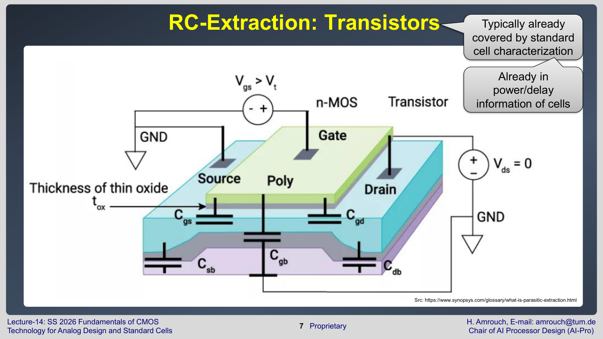

**Transistor 내부 parasitic**은<font color="#00b0f0"> 보통 standard cell characterization에 이미 반영</font>되어 있다. Standard cell library의 timing/power table은 cell 내부 device와 local parasitic을 포함해 characterization된 값이다. 반면 **cell 사이 wire의 RC**는 <font color="#ffc000">layout마다 달라지므로 placement/routing 이후에 별도로 추출</font>해야 한다.

## Timing closure와 Static Timing Analysis

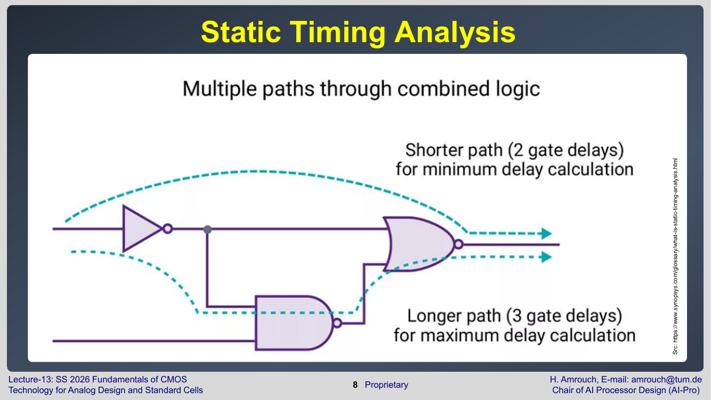

**Static Timing Analysis(STA)**는 모든 input vector를 transient simulation하지 않고, register와 combinational logic으로 이루어진 timing graph의 가능한 path delay를 계산한다. 같은 시작점과 끝점 사이에도 여러 경로가 있으므로 두 극단을 모두 본다.

| Check | 보는 path | 실패 조건 | 대표 대응 |
| --- | --- | --- | --- |
| **Setup** | maximum-delay path | data가 다음 capture edge 전에 안정되지 못함 | clock period 증가, critical path 단축 |
| **Hold** | minimum-delay path | 새 data가 같은 capture edge 직후 너무 빨리 도착함 | 짧은 data path에 delay 추가 |

Clock skew를 무시한 가장 단순한 조건은 다음과 같다.

```math
t_{cq,max}+t_{comb,max}+t_{setup}\le T_{clk}
```

```math
t_{cq,min}+t_{comb,min}\ge t_{hold}
```

| 항 | 의미 |
| --- | --- |
| $t_{cq}$ | launch register의 clock-to-Q delay |
| $t_{comb}$ | combinational logic와 extracted wire RC의 data-path delay |
| $t_{setup}$, $t_{hold}$ | capture register가 요구하는 안정 시간 |
| $T_{clk}$ | clock period |

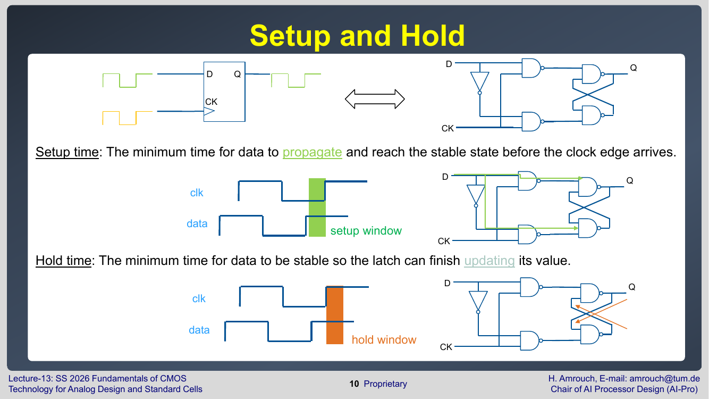

Setup window는 capture clock edge **직전**, hold window는 같은 edge **직후**에 있다. 실제 STA는 data path뿐 아니라 launch/capture register까지의 clock path와 skew도 함께 반영한다. 따라서 setup을 고치려고 path를 지나치게 빠르게 만들면 hold가 나빠질 수 있고, hold를 고치려고 delay를 과하게 넣으면 setup margin이 줄 수 있다.

## IR drop: 전원도 이상적인 선이 아니다

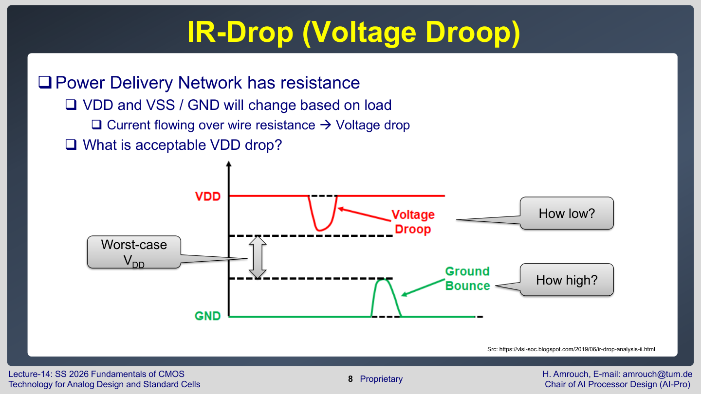

<font color="#00b0f0">Power delivery network에도 resistance가 있다</font>. 따라서 전류가 흐르면 전압 강하가 생긴다.

핵심 식은 $V_{drop}=I_{load}R_{PDN}$이다. <font color="#ffc000">회로가 많은 current를 순간적으로 요구하거나, power grid resistance가 크면 cell이 실제로 보는</font> $V_{DD}$<font color="#ffc000">가 nominal</font> $V_{DD}$<font color="#ffc000">보다 낮아진다</font>. $V_{DD}$가 낮아지면 drive current가 줄어들고 delay가 증가한다.

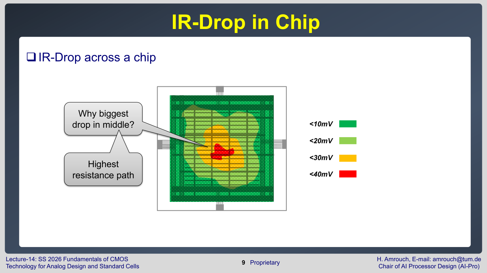

**IR drop map**에서는 <font color="#00b0f0">chip 중앙부가 더 큰 drop</font>을 보일 수 있다. <font color="#e84d4d">Power pad나 bump에서 멀수록 current path resistance가 커질 수 있기 때문</font>이다. 그래서 power grid 설계는 평균 전력뿐 아니라 공간적으로 어디서 current가 많이 소비되는지도 봐야 한다.

## Power delivery network

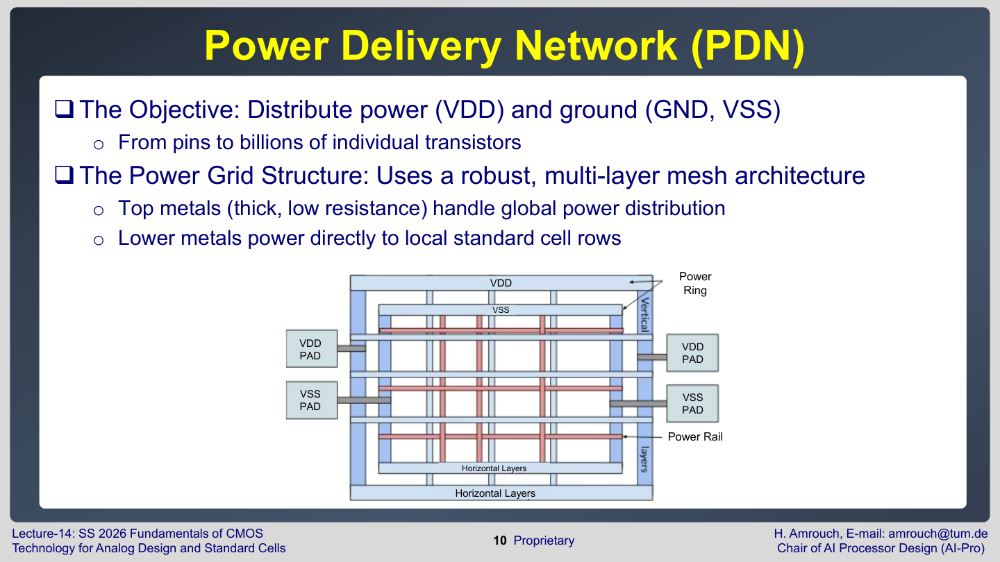

PDN의 목적은 $V_{DD}$, $V_{SS}$ 또는 GND를 chip 전체의 transistor에 안정적으로 공급하는 것이다. 보통 <font color="#00b0f0">상위 metal에는 두꺼운 global power mesh</font>를 만들고, <font color="#ffc000">하위 metal로 내려오면서 standard cell row의 power rail에 연결</font>한다.

PDN을 볼 때는 다음 요소를 함께 봐야 한다.

| 요소             | 의미                                                                                                    |
| -------------- | ----------------------------------------------------------------------------------------------------- |
| power pad/bump | package에서 chip으로 current가 들어오는 지점                                                                     |
| **power ring** | <font color="#00b0f0">block 또는 chip 주변을 둘러싼 큰 power route</font>                                      |
| power mesh     | upper metal의 반복적인 grid                                                                                |
| **power rail** | standard <font color="#00b0f0">cell row에 직접</font> $V_{DD}$/$V_{SS}$<font color="#00b0f0">를 공급</font> |
| via stack      | upper metal에서 lower rail로 power를 내려 보내는 수직 연결                                                         |

**높은 metal**을 power에 많이 쓰는 이유는 <font color="#ffc000">저항이 낮고 current capacity가 크기 때문</font>이다.

## Power-grid sizing, electromigration, signoff

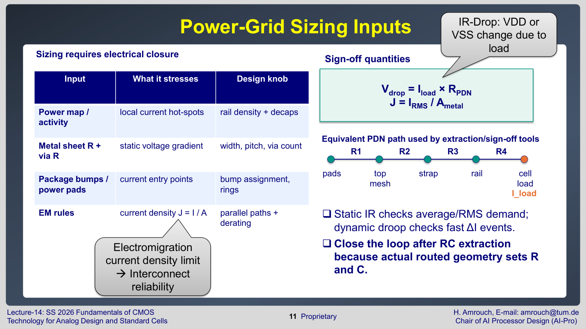

**Power grid**를 설계할 때는 <font color="#92d050">단순히 "두껍게 만들면 좋다"가 아니다</font>. Metal resource는 signal routing에도 필요하고, power grid가 너무 촘촘하면 area와 routing congestion이 증가한다.

Power grid sizing의 주요 입력은 다음과 같다.

| 입력                                    | 설계에 주는 영향                                                                            |
| ------------------------------------- | ------------------------------------------------------------------------------------ |
| power map/activity                    | current hot spot을 찾고<font color="#ffc000"> rail density와 decap 위치</font>를 조정         |
| metal sheet resistance/via resistance | <font color="#ffc000">static voltage gradient를 계산</font>하고 width/pitch/via count를 결정 |
| package bump/power pad 위치             | current entry point와 <font color="#ffc000">ring/mesh topology를 결정</font>             |
| EM rule                               | 허용 current density를 넘지 않도록 parallel path와 derating 적용                                |

**Electromigration**은 <font color="#00b0f0">높은 current density 때문에 metal atom이 장기적으로 이동해 wire가 약해지는 현상</font>이다. 그래서 current density는 다음처럼 본다.

전류 밀도는 $J=\frac{I_{RMS}}{A_{metal}}$로 본다. 여기서 $A_{metal}$은 wire의 단면적이다. 같은 current라도 wire가 좁으면 $J$가 커지고 EM margin이 줄어든다.

## Decoupling capacitor와 dynamic droop

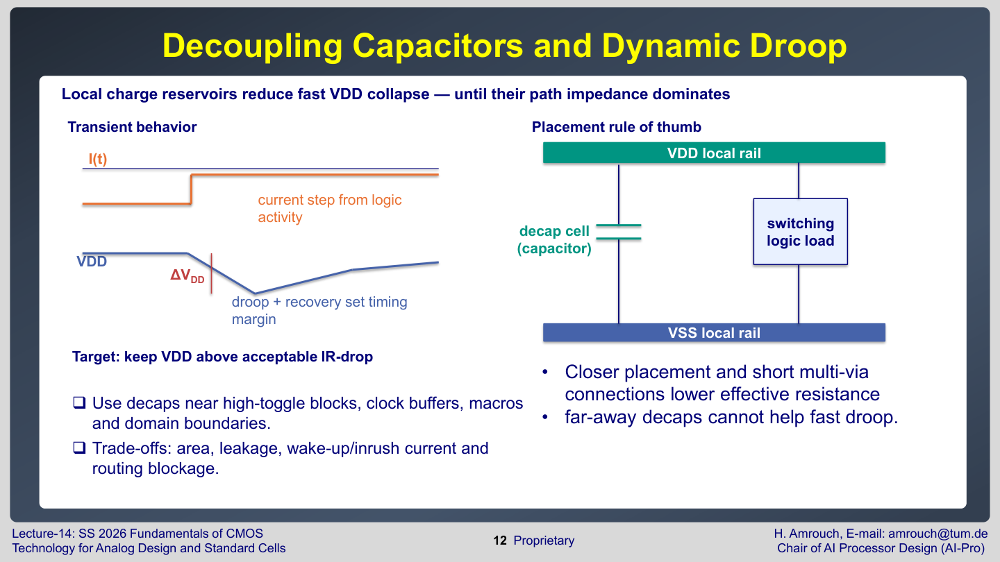

**Dynamic droop**은 회로가<font color="#e84d4d"> 짧은 시간에 큰 current를 요구할 때 local</font> $V_{DD}$<font color="#e84d4d">가 순간적으로 떨어지는 현상</font>이다. **Decoupling capacitor**는 이때 <font color="#e84d4d">근처에서 charge를 공급하는 local reservoir처럼 동작</font>한다.

Decap의 핵심 직관은 위치다.

| Decap 위치                     | 효과                                                        |
| ---------------------------- | --------------------------------------------------------- |
| **high-toggle block 근처**     | <font color="#ffc000">빠른 current demand를 직접 보완</font>     |
| **clock buffer 근처**          | clock <font color="#ffc000">switching에 의한 droop 완화</font> |
| **macro/domain boundary 근처** | block 간 current transient 완화                              |
| 너무 먼 위치                      | 빠른 droop에는 path impedance 때문에 효과가 제한적                     |

Decap도 공짜는 아니다. Area를 차지하고, leakage가 생기며, routing blockage와 wake-up inrush 문제가 생길 수 있다. 따라서 <font color="#ffc000">필요한 위치에 필요한 만큼 넣는 것이 중요</font>하다.

## Design rule과 DRC

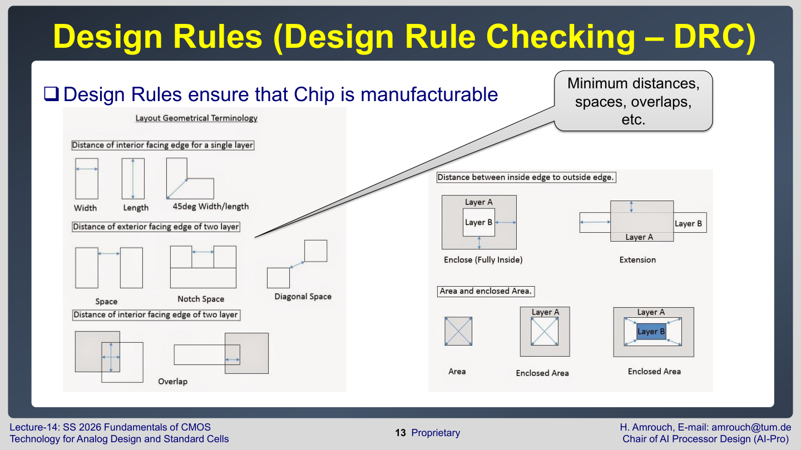

**Design rule**은 layout이 실제 공정에서 <font color="#ffc000">제조 가능하도록 지켜야 하는 geometric constraint</font>다. 예를 들어 minimum width, minimum spacing, enclosure, overlap 같은 rule이 있다.

| Rule 종류               | 의미                                                                    |
| --------------------- | --------------------------------------------------------------------- |
| **minimum width**     | wire나 shape가 <font color="#00b0f0">너무 좁으면</font> 제조 불량 위험 증가          |
| **minimum spacing**   | 두 shape가 <font color="#00b0f0">너무 가까우면</font> short 위험 증가             |
| **enclosure/overlap** | via나 contact가 <font color="#00b0f0">metal 안에 충분히 들어가야</font> 함        |
| **density rule**      | CMP와 lithography uniformity를 위해 <font color="#00b0f0">일정 밀도 유지</font> |

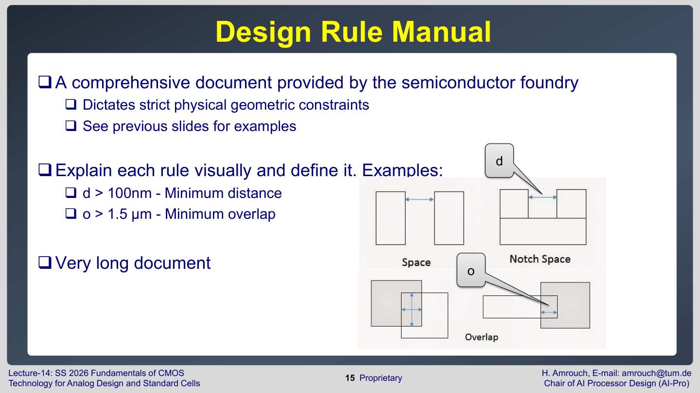

Design Rule Manual은 foundry가 제공하는 매우 긴 문서다. 이 문서는 "좋은 회로 설계법"을 설명하기보다,<font color="#00b0f0"> 특정 공정에서 제조 가능한 layout geometry의 허용 범위를 정의</font>한다.

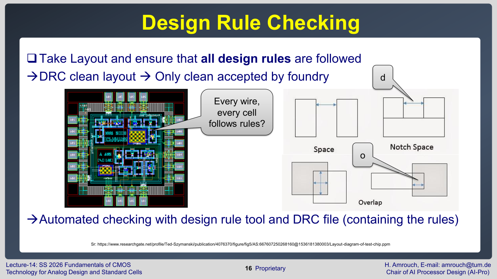

**DRC**, 즉 **Design Rule Checking**은 <font color="#ffc000">layout이 모든 design rule을 지켰는지 자동으로 검사하는 과정</font>이다. Foundry에 tape-out하려면 layout은 DRC clean이어야 한다.

## Antenna rule

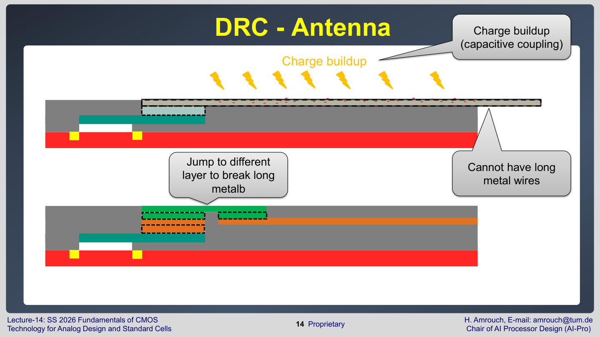

**Antenna effect**는 제조 과정에서 <font color="#e84d4d">긴 metal wire가 charge를 축적하고, 그 charge가 gate oxide에 stress를 줄 수 있는 문제</font>다. 특히 <font color="#ffc000">아직 discharge path가 충분히 형성되지 않은 공정 중간 단계에서 긴 metal이 gate에 연결되어 있으면 문제</font>가 될 수 있다.

Lecture slide의 해결 직관은 "<font color="#00b0f0">긴 metal을 그대로 두지 말고 layer jump를 사용해 antenna ratio를 줄인다</font>"는 것이다. Via를 통해 다른 layer로 넘어가면 한 공정 단계에서 gate에 매달리는 effective metal length가 줄어들 수 있다.

## LVS: layout이 schematic/netlist와 같은가

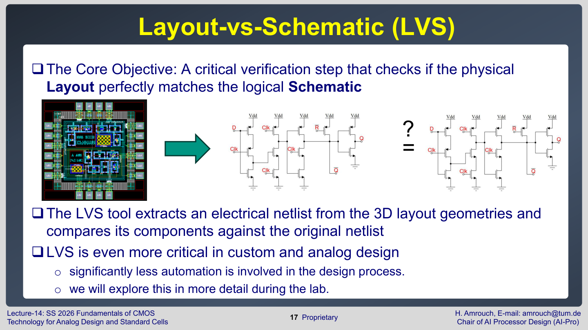

**LVS**는 **Layout Versus Schematic**의 약자다. DRC가 "제조 rule을 지켰는가"를 묻는다면, LVS는 "이 <font color="#ffc000">layout이 원래 의도한 회로와 전기적으로 같은가</font>"를 묻는다.

| 검증      | 묻는 질문                                                            | 예시 오류                                                               |
| ------- | ---------------------------------------------------------------- | ------------------------------------------------------------------- |
| **DRC** | <font color="#00b0f0">제조 가능한 geometry인가?                         | spacin</font>g violation, width violation, antenna violation        |
| **LVS** | <font color="#00b0f0">layout이 schematic/netlist와 같은 회로</font>인가? | missing connection, wrong transistor size, shorted net, swapped pin |

LVS tool은 3D layout geometry에서 transistor와 net을 추출해 extracted netlist를 만들고, 이를 원래 schematic 또는 gate-level netlist와 비교한다. Digital standard-cell flow에서는 자동화가 많이 되어 있지만, custom/analog layout에서는 사람이 직접 layout을 많이 만지므로 LVS의 중요성이 더 커진다.

자동화된 digital flow도 LVS가 필요하다. Placement와 routing은 계산량이 매우 큰 최적화 문제라 heuristic을 쓰며, tool constraint와 library·pin mapping은 사람이 설정한다. 그래서 자동화가 있어도 missing connection, short, 잘못된 size나 pin 같은 오류 가능성은 남는다.

## 시험 대비 핵심

- RTL은 기능과 register behavior를 설명하고, gate-level netlist는 standard cell 연결 graph를 설명한다.
- GDSII는 회로 기능이 아니라 제조 layer별 polygon geometry를 기록한다.
- I/O ring은 ESD 보호, output drive, voltage level shifting을 맡는다.
- Gate-level netlist에는 cell 좌표, wire length, metal layer, via 같은 physical information이 없다.
- Physical design은 placement, routing, power connection을 통해 netlist를 layout geometry로 바꾼다.
- FEOL은 transistor 형성, BEOL은 metal/via interconnect 형성에 해당한다.
- 낮은 metal layer는 local connection, 높은 metal layer는 global signal, clock, power grid에 주로 쓰인다.
- Placement는 연결된 cell 사이 거리를 줄이려 하지만, 너무 높은 density는 routing congestion을 만든다.
- Routing은 실제 metal/via path를 정하며, preferred direction을 번갈아 두면 short risk와 routing complexity를 줄일 수 있다.
- RC extraction은 layout-dependent wire parasitic을 timing/power 분석에 반영하기 위해 필요하다.
- STA는 maximum-delay path로 setup을, minimum-delay path로 hold를 검사한다.
- Setup은 data가 늦는 문제이고, hold는 data가 너무 빨리 바뀌는 문제다.
- Standard cell 내부 parasitic은 library characterization에 많이 포함되어 있지만, cell 사이 wire RC는 layout 이후에 추출해야 한다.
- IR drop은 $V_{drop}=I_{load}R_{PDN}$으로 이해할 수 있고, 실제 cell이 보는 $V_{DD}$를 낮춰 delay를 증가시킨다.
- EM은 current density $J=I_{RMS}/A_{metal}$이 너무 커질 때 장기 reliability 문제가 되는 현상이다.
- Decap은 fast dynamic droop을 줄이지만 area, leakage, routing blockage의 비용이 있다.
- Poly가 diffusion을 가로지르면 transistor가 형성되고, metal/contact/via가 회로의 실제 연결을 만든다.
- Tap cell은 N-well과 substrate/P-well을 전원에 고정하면서 개별 standard cell의 면적을 줄인다.
- DRC는 foundry design rule 위반을 찾고, LVS는 layout이 원래 회로/netlist와 같은지 확인한다.

## 포함 범위

- Lecture 13: pages 2-17
- Lecture 14: pages 2-17
- Lecture 15: pages 2-18
- 주요 제외: 각 lecture의 title/admin page
- 중복 통합: Lecture 13 pages 16-17과 Lecture 14 pages 2-3의 placement 내용은 하나의 placement section으로 통합
- 핵심 반영: Why layout, RTL-to-GDS flow, GDSII/layer mask, I/O ring, logic synthesis, placement/routing, RC extraction, STA, setup/hold, transistor/inverter/NAND layout, tap cell, IR drop, PDN, EM, decap, DRC, LVS
