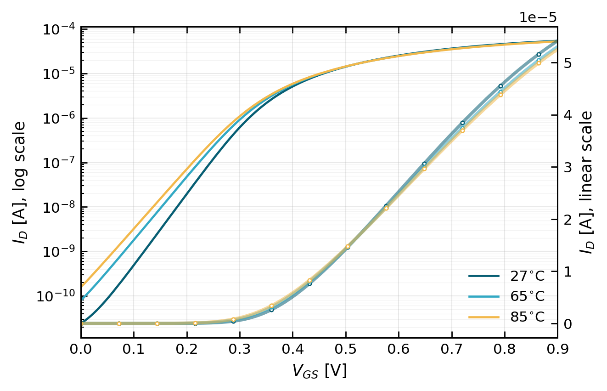
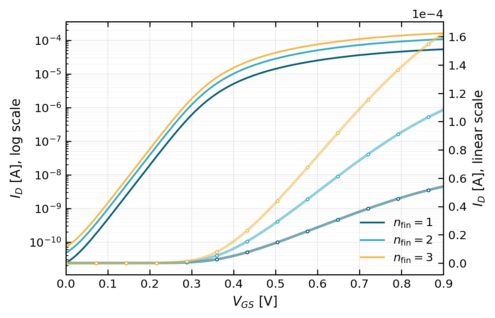

# 12. Assignment 1 — FinFET DC 특성

## 이 과제를 왜 했는가

첫 과제의 목적은 MOSFET 이론을 실제 $I_D$–$V_{GS}$ 곡선으로 확인하는 것이다. 선형 축은 ON 전류를, 로그 축은 OFF·subthreshold 전류를 읽는 데 적합하다. 같은 sweep에서 온도와 fin 수만 바꾸면 각각 **소자 물리**와 **구동 강도**의 영향을 분리할 수 있다.

## 질문의 의도

- $V_{GS}=0.9\,\mathrm{V}$의 $I_{ON}$과 $V_{GS}=0$의 $I_{OFF}$가 왜 서로 다른 설계 문제인가?
- 온도가 오르면 leakage와 drive current는 어느 방향으로 움직이는가?
- fin을 늘렸을 때 전류가 왜 거의 비례해서 증가하며, 그 대가는 무엇인가?
- DC point 수와 runtime은 물리 결과가 아니라 simulation 설정·비용이라는 점을 구분할 수 있는가?

## 결과 타당성 검수

**판정: 전체 추세가 이론과 잘 맞는다.**

| 비교 | 보고서 결과 | 검수 |
| --- | --- | --- |
| $27\rightarrow85\,^{\circ}\mathrm{C}$ | $I_{OFF}$: 약 $24\rightarrow156\,\mathrm{pA}$ | 고온에서 subthreshold leakage가 크게 증가하므로 합리적 |
| $27\rightarrow85\,^{\circ}\mathrm{C}$ | $I_{ON}$: 약 $54.2\rightarrow52.6\,\mathrm{\mu A}$ | 고온의 mobility 저하가 high-$V_{GS}$ drive를 약화하므로 합리적 |
| fin $1\rightarrow2\rightarrow3$ | $I_{ON}$과 $I_{OFF}$가 거의 $1:2:3$ | 동일한 fin이 병렬로 추가된 결과와 일치 |
| 기준 sweep | 1001 points, 약 0.89 s | sweep 해상도·실행 환경 정보이며 소자 특성은 아님 |

## 결과를 어떻게 읽어야 하는가

온도 상승은 두 효과를 동시에 만든다.

1. 문턱 부근과 OFF 영역에서는 thermal activation과 유효 문턱전압 변화 때문에 $I_{OFF}$가 크게 증가한다.
2. 강한 inversion 영역에서는 phonon scattering으로 mobility가 감소해 $I_{ON}$이 소폭 감소한다.

따라서 “온도가 오르면 전류가 모두 증가한다”는 해석은 틀리다. **동작 영역에 따라 지배 효과가 달라진다.**

fin 수를 늘리면 유효 channel 폭이 커져 drive current가 거의 선형 증가한다.

$$
I_D(N_{fin}) \approx N_{fin} I_D(1)
$$

하지만 $I_{OFF}$도 같은 비율로 늘어난다. 더 강한 cell은 빠르지만 공짜가 아니며, leakage·capacitance·면적도 함께 증가한다.

## 반드시 숙지할 Take away

- $I_{ON}$은 속도, $I_{OFF}$는 대기 전력과 직접 연결된다.
- 온도는 leakage를 크게 악화시키지만 ON current에는 mobility 저하를 통해 반대 방향으로 작용할 수 있다.
- fin 증가는 drive strength를 키우는 정량화된 sizing 수단이며, 전류와 leakage가 함께 증가한다.
- 그래프 축을 목적에 맞게 골라야 한다: ON 영역은 linear, OFF/subthreshold 영역은 log가 핵심이다.

## 근거 자료

- 문제: `Assignment/exercise1/Exercise1_Fundamentals_of_Technology_and_Standard_Cells.pdf`
- 보고서: `Assignment/exercise1/cmos_ex1_report.pdf`
- 원시 결과: `Assignment/exercise1/ex1_results/ex1_measurements.csv`

