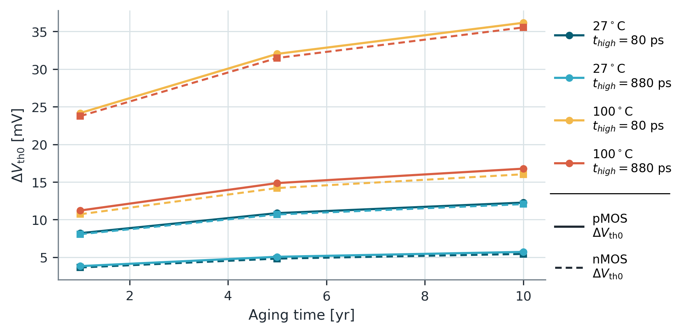
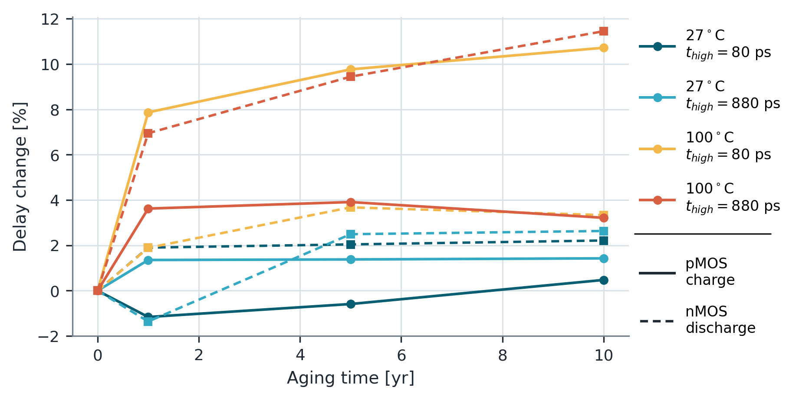

# 13. Assignment 2 — 트랜지스터 노화와 듀티사이클

## 이 과제를 왜 했는가

노화는 단순히 “시간이 지나면 느려진다”가 아니다. 각 transistor가 **얼마나 오래 stress 상태였는지**, 온도와 사용 기간이 어떠했는지가 $\Delta V_{th}$와 delay를 결정한다. 이 과제는 듀티사이클 → transistor별 stress → 문턱전압 변화 → rise/fall delay라는 인과관계를 확인한다.

## 질문의 의도

- 입력 high 비율이 NMOS와 PMOS의 stress duty를 어떻게 다르게 만드는가?
- 온도와 aging time이 $\Delta V_{th}$를 왜 키우는가?
- PMOS 열화는 charge/rise, NMOS 열화는 discharge/fall과 어떻게 연결되는가?
- 작은 delay 차이가 모델·측정 오차 수준인지, 실제 열화 추세인지 구분할 수 있는가?

## 결과 타당성 검수

**판정: $\Delta V_{th}$ 추세는 매우 명확하며, delay도 전반적으로 합리적이다. 저온·초기 조건의 미세한 음의 열화율은 물리적 회복으로 해석하면 안 된다.**

| 비교 | 보고서 결과 | 검수 |
| --- | --- | --- |
| high 80 ps / period 1 ns | NMOS 10%, PMOS 90% stress | 입력이 대부분 low이면 PMOS가 주로 stress되므로 합리적 |
| high 880 ps / period 1 ns | NMOS 90%, PMOS 10% stress | 입력이 대부분 high이면 NMOS가 주로 stress되므로 합리적 |
| 27→100 °C, 1→10년 | $|\Delta V_{th}|$ 단조 증가 | 고온·장시간이 열화를 가속한다는 모델과 일치 |
| 100 °C, 10년 | 강하게 stress된 edge delay가 약 10–11% 증가 | $V_{th}$ 증가에 따른 drive 감소와 일치 |
| 27 °C, 1년 일부 | delay가 약 1% 이내 감소 | 절대 차이가 약 1 ps 미만이라 측정 threshold·모델 민감도로 보는 것이 타당 |

## 결과를 어떻게 읽어야 하는가



듀티사이클은 inverter 전체의 한 숫자가 아니라 transistor마다 반대로 작용한다.

```text
입력이 오래 high  -> NMOS stress 큼 -> discharge/fall 경로 열화
입력이 오래 low   -> PMOS stress 큼 -> charge/rise 경로 열화
```

100 °C에서 1년 조건만 보아도, 90% stress된 소자의 $|\Delta V_{th}|$가 10% stress 소자보다 대략 두 배 이상 크다. 시간이 늘어날수록 차이는 유지되며 전체 열화량이 커진다.



문턱전압이 증가하면 overdrive가 줄어 ON current가 감소한다.

$$
V_{ov}=V_{GS}-V_{th}\downarrow
\quad\Rightarrow\quad
I_{ON}\downarrow
\quad\Rightarrow\quad
t_{delay}\uparrow
$$

다만 delay는 파형이 특정 threshold를 통과한 시점의 차이이므로 작은 $\Delta V_{th}$에서는 sub-ps 변화에 민감하다. 따라서 저온·1년에서 나타난 약간의 음수 열화율은 “aging이 빨라지게 했다”는 증거가 아니라 **수치적으로 작은 비단조성**이다. 강한 stress·고온·장시간에서 나타나는 일관된 증가가 물리적 신호다.

## 반드시 숙지할 Take away

- aging은 입력 통계와 무관하지 않다. 같은 회로라도 duty cycle에 따라 NMOS/PMOS 열화가 달라진다.
- PMOS 상태는 rise/charge, NMOS 상태는 fall/discharge delay와 우선 연결해 해석한다.
- 온도와 시간은 열화를 키우지만, delay 변화가 항상 완벽히 단조일 필요는 없다. 변화량과 측정 분해능을 같이 본다.
- $\Delta V_{th}$는 원인에 가까운 지표이고 delay는 회로 수준의 결과다. 둘을 인과관계로 연결해야 한다.

## 근거 자료

- 문제: `Assignment/exercise2/task_sheet_2.pdf`
- 보고서: `Assignment/exercise2/cmos_ex2_report.pdf`
- 원시 결과: `Assignment/exercise2/ex2_aging/ex2_duty_cycles.csv`, `ex2_delvth0_results.csv`, `ex2_delay_results.csv`
