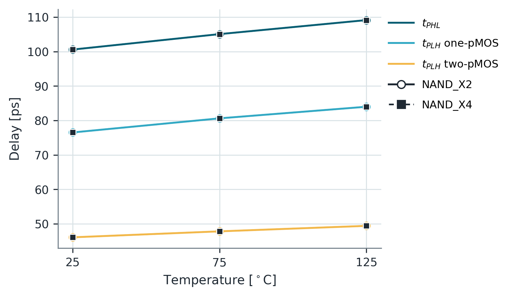
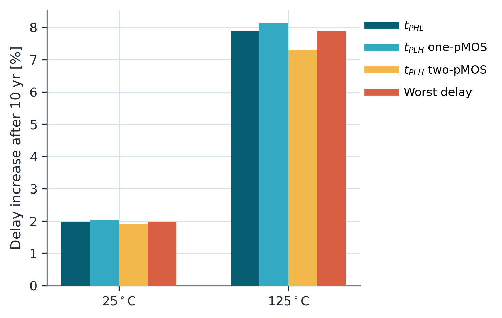
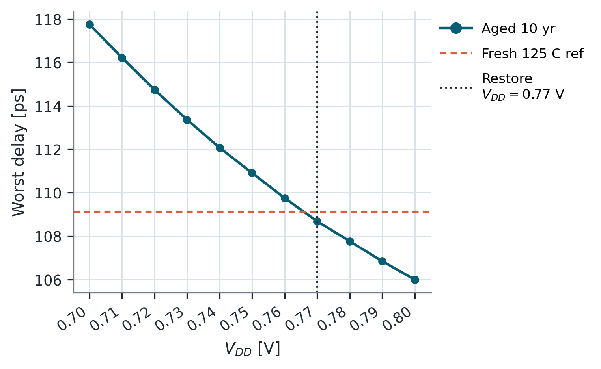

# 14. Assignment 3 — NAND 지연·전력·가드밴드

## 이 과제를 왜 했는가

표준셀 평가는 **한 개 delay 숫자로 끝나지 않는다**.<font color="#ffc000"> 입력 transition, pull-up/pull-down topology, drive strength, load, 온도, aging에 따라 delay와 power가 달라진다</font>. 이 과제는 NAND2_X2/X4를 통해 이 변수를 분리하고, aged cell이 fresh timing을 만족하도록 timing·voltage guardband를 구한다.

## 질문의 의도

- NAND의 fall과 두 가지 rise가 왜 서로 다른가?
- cell을 X2에서 X4로 키워도 load를 함께 두 배로 하면 왜 delay가 거의 같을 수 있는가?
- 온도와 aging은 delay, leakage, switching energy에 어떤 상충 효과를 만드는가?
- timing guardband와 voltage guardband가 각각 무엇을 보상하며, 비용은 무엇인가?

## 결과 타당성 검수

**판정: topology, normalized load, 온도, aging, guardband의 모든 주요 추세가 합리적이다.**

| 비교 | 보고서 결과 | 검수 |
| --- | --- | --- |
| X2/2 fF vs X4/4 fF | delay가 사실상 동일 | drive와 load가 함께 2배라 fan-out이 유지된 결과 |
| NAND transition | fall이 가장 느리고, PMOS 2개가 켜지는 rise가 가장 빠름 | 직렬 NMOS pull-down과 병렬 PMOS pull-up 구조와 일치 |
| 25→125 °C | fresh delay 증가 | mobility 저하에 따른 drive 감소와 일치 |
| 10년 aging | 25 °C 약 2%, 125 °C 약 7–8% delay 증가 | 고온에서 가속된 열화와 일치 |
| aged 125 °C static power | 약 62% 감소 | $V_{th}$ 증가로 leakage가 줄 수 있으나, 속도 열화와 함께 해석해야 함 |
| 0.70→0.77 V | aged delay가 fresh 수준으로 회복, energy 증가 | voltage guardband의 전형적인 성능–에너지 trade-off |

## 결과를 어떻게 읽어야 하는가



NAND2에서 **output fall**은 <font color="#ffc000">두 NMOS가 직렬인 경로를 통과</font>한다. 반면 **rise**는 <font color="#ffc000">병렬 PMOS 중 하나 또는 둘이 켜질 수 있다</font>.

```text
fall: 직렬 NMOS 2개       -> 큰 유효 저항 -> 가장 느림
rise: PMOS 1개 ON         -> 중간
rise: PMOS 2개 ON         -> 작은 유효 저항 -> 가장 빠름
```

X4가 X2보다 큰 cell인데도 delay가 같았던 것은 X4의 load도 4 fF로 두 배였기 때문이다. 이는 “큰 cell은 항상 더 빠르다”가 아니라 **drive/load 비율이 delay를 지배한다**는 실험이다. 대신 X4의 transistor·load capacitance가 커져 energy와 power는 대략 두 배가 된다.



고온은 fresh delay를 늘릴 뿐 아니라 aging도 가속한다. 보고서에서 125 °C, 10년의 worst delay 증가는 약 7.9%였다. 이때 static power가 감소한 것은 개선이 아니다. Aging으로 $V_{th}$가 올라 leakage는 줄었지만, 같은 이유로 ON current도 줄어 delay가 커졌다.

## Guardband 해석



보고서의 worst case는 다음처럼 요약된다.

- fresh 125 °C: 약 109.1 ps
- aged 125 °C, 0.70 V: 약 117.7 ps
- timing guardband: 약 8.6 ps, 즉 7.9%
- aged delay를 fresh 수준으로 되돌리는 최소 공급전압: 약 0.77 V

**Timing guardband**는<font color="#ffc000"> clock period에 여유를 더하는 방식</font>이고, **voltage guardband는** <font color="#ffc000">drive current를 높이는 방식</font>이다. 후자는 delay를 회복하지만 dynamic energy가 대략 $CV^2$에 따라 증가하고 더 높은 전압 stress를 줄 수 있다.

## 반드시 숙지할 Take away

- NAND의 worst transition은 transistor stack과 동시에 켜지는 pull-up 수로 설명한다.
- cell size만 보지 말고 load와 함께 본다. X4/4 fF와 X2/2 fF는 비슷한 electrical effort다.
- aging으로 leakage가 줄어도 성능이 좋아진 것은 아니다. delay와 power를 함께 봐야 한다.
- guardband는 불확실성을 무료로 없애는 것이 아니라 timing, voltage, energy, reliability 중 하나의 비용으로 흡수한다.

## 근거 자료

- 문제: `Assignment/exercise3/Exercise_3.pdf`
- 보고서: `Assignment/exercise3/cmos_ex3_report.pdf`
- 원시 결과: `Assignment/exercise3/ex3_out_hardcoded/`

