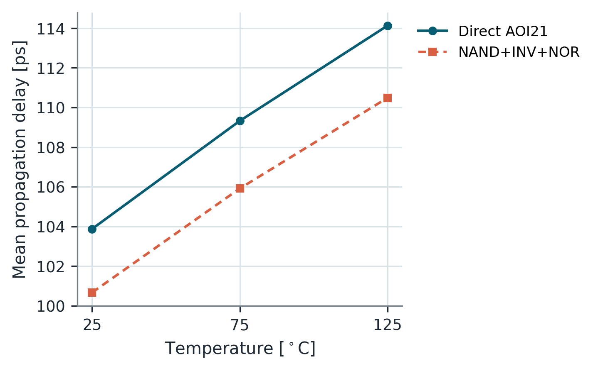
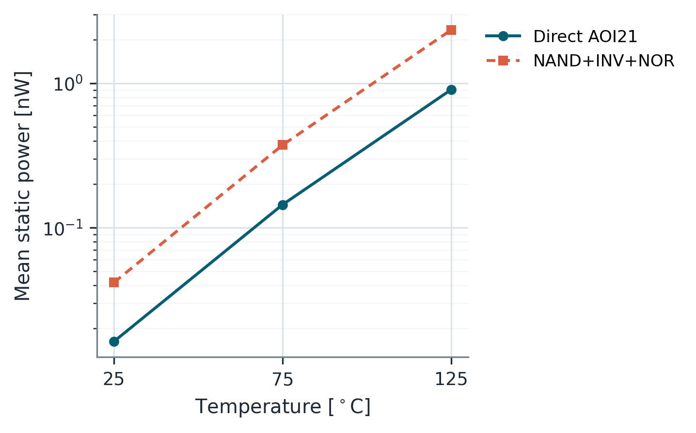
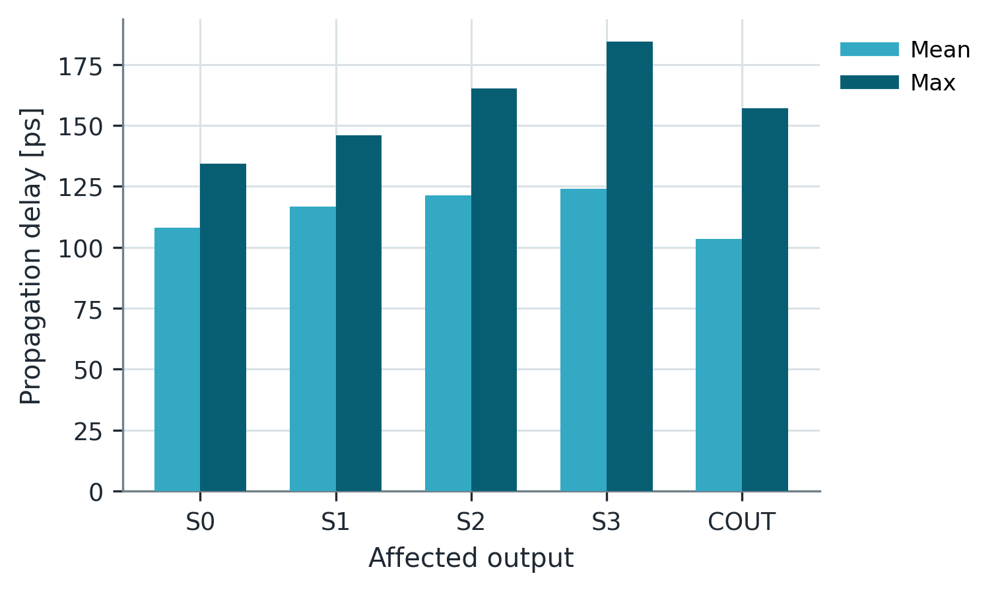

# 15. Assignment 4 — AOI21과 가산기 최악경로

## 이 과제를 왜 했는가

같은 Boolean function도 한 개 complex gate로 직접 구현하거나 여러 simple gate로 분해할 수 있다. 두 구현은 transistor 수, 내부 node, path별 stack이 달라 delay·energy·leakage가 달라진다. 이어서 4-bit ripple-carry adder를 전수 조사해 **최악 delay case와 최대 power/energy case가 왜 다를 수 있는지** 확인한다.

## 질문의 의도

- AOI21 direct CMOS와 NAND+INV+NOR 분해 구현의 차이는 무엇인가?
- 평균 delay와 worst delay 중 어느 하나만으로 구현을 평가해도 되는가?
- ripple-carry adder에서 상위 sum bit가 느린 이유는 무엇인가?
- 최대 delay, 최대 switching energy, 최대 average power를 왜 서로 따로 찾아야 하는가?

## 결과 타당성 검수

**판정: 결과는 합리적이다. 특히 direct cell의 이점이 모든 path에서 동일하지 않고, adder의 worst delay와 최대 power case가 분리된 점이 핵심이다.**

| 비교 | 보고서 결과 | 검수 |
| --- | --- | --- |
| Direct vs decomposed AOI21 | decomposed의 평균 delay는 소폭 작지만 worst delay는 큼 | path별 stack·stage effort가 달라 가능한 결과 |
| AOI21 energy/static power | decomposed가 더 큼 | 추가 cell과 내부 node가 capacitance·leakage를 늘린 결과 |
| 25→125 °C | delay와 static power 증가 | mobility 저하와 leakage 증가에 부합 |
| adder output | $S_0$에서 $S_3$로 갈수록 mean/max delay 증가 | 상위 bit로 갈수록 carry propagation 단계가 길어짐 |
| worst delay | $S_3$ fall, 약 184 ps | carry chain 뒤 final sum logic까지 통과하므로 합리적 |
| max energy/power | worst-delay vector와 서로 다름 | switched capacitance와 측정 시간도 metric에 관여 |

## AOI21 결과 해석

Direct complex cell은 한 transistor network 안에서 함수를 계산하므로 중간 gate와 내부 output load를 줄일 수 있다. 그러나 특정 transition의 series stack이나 input 위치가 불리하면 모든 path가 빨라지는 것은 아니다.

보고서에서는 decomposed 구현의 **평균 delay**가 약간 작았지만, **worst delay**는 direct 구현보다 컸다. 따라서 “평균이 빠르다”와 “timing signoff에 유리하다”는 같은 말이 아니다.

분해 구현은 더 많은 cell과 내부 node를 사용해 switching energy와 static power가 커졌다. 125 °C에서는 leakage 증가 때문에 두 구현의 차이가 더 뚜렷해졌다. Complex cell의 장점은 단순한 gate-count 감소가 아니라 **내부 capacitance와 경로 구조의 재구성**이다.

## 가산기 결과 해석

Ripple-carry adder에서 $S_i$는 해당 bit의 입력만으로 정해지지 않는다. 낮은 bit에서 생성된 carry가 여러 stage를 propagate한 뒤 마지막 XOR까지 통과할 수 있다.

$$
C_{i+1}=G_i+P_iC_i,
\qquad
S_i=P_i\oplus C_i
$$

$S_3$가 가장 느렸던 이유는 긴 carry chain에 final sum logic이 더해졌기 때문이다. $C_{out}$은 carry만 출력하므로 어떤 case에서는 $S_3$보다 짧을 수 있다.

최대 average power case가 최대 energy case와도 다를 수 있다.

$$
P_{avg}=\frac{E_{transition}}{\Delta t}
$$

많은 node를 switch해 energy가 크더라도 transition window가 길면 average power가 최대가 아닐 수 있다. 따라서 delay, energy, power는 같은 input vector 하나로 대표하면 안 된다.

## 반드시 숙지할 Take away

- 논리적으로 동등한 회로도 transistor topology와 내부 node 수에 따라 PPA가 달라진다.
- 평균 delay는 전반적 경향, worst delay는 timing closure를 말한다. 둘을 혼동하지 않는다.
- ripple-carry의 핵심은 carry propagate 길이이며, 최악경로를 재려면 다른 입력으로 그 경로를 sensitization해야 한다.
- worst delay, maximum energy, maximum average power는 서로 다른 최적화 목표다.

## 근거 자료

- 문제: `Assignment/exercise4/Task4_AOI_Adder.pdf`
- 보고서: `Assignment/exercise4/report/cmos_ex4_report.pdf`
- 원시 결과: `Assignment/exercise4/ex4_results/`, `Assignment/exercise4/report/analysis_tables/`
