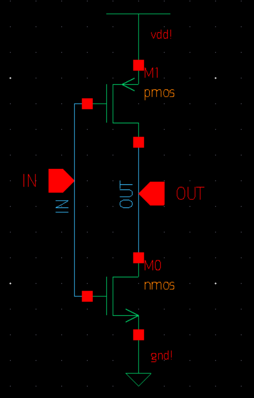
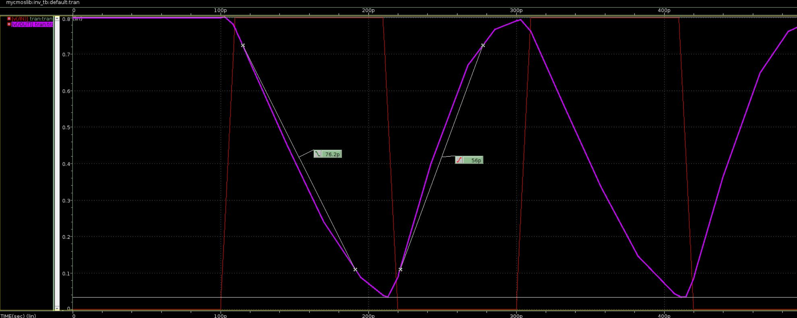

# 16. Assignment 5 — 인버터 구동강도와 사이징

## 이 과제를 왜 했는가

CMOS inverter의 rise와 fall을 비슷하게 만들려면 PMOS와 NMOS의 유효 구동력이 균형을 이뤄야 한다. 이 과제는 unit transistor로 만든 inverter의 output rise/fall time을 직접 측정하고, 어느 소자가 더 약한지 판단해 다음 layout 과제의 fin 비율을 정한다.

## 질문의 의도

- output fall은 어느 transistor의 pull-down 능력을 측정하는가?
- output rise는 어느 transistor의 pull-up 능력을 측정하는가?
- 특정 PDK의 unit NMOS/PMOS에 일반적인 mobility 직관을 그대로 적용해도 되는가?
- 측정한 비율을 실제 discrete fin 수로 어떻게 변환하는가?

## 결과 타당성 검수

**판정: 결과와 사이징 결론이 일관된다.**

| 항목 | 보고서 결과 | 해석 |
| --- | --- | --- |
| output rise time | 약 56.0 ps | PMOS pull-up의 충전 능력 |
| output fall time | 약 76.2 ps | NMOS pull-down의 방전 능력 |
| $t_f/t_r$ | 약 1.36 | 이 PDK의 unit NMOS가 unit PMOS보다 약함 |
| 제안 비율 | $N_n:N_p\approx1.36:1$, layout은 2:1 | fin이 정수라 가장 가까운 실용적 보강 |

## 결과를 어떻게 읽어야 하는가





측정 기준은 input edge가 아니라 **output의 10–90% rise와 90–10% fall**이다.

```text
output 0 -> 1: PMOS가 load capacitance를 충전
output 1 -> 0: NMOS가 load capacitance를 방전
```

보고서에서는 fall이 rise보다 약 36% 길었다. 같은 2 fF load를 방전하는 NMOS 경로가 더 느리므로, unit NMOS의 유효 drive가 더 약하다는 뜻이다. 이를 1차 RC 근사로 보면

$$
t_r\approx0.69R_pC_L,
\qquad
t_f\approx0.69R_nC_L
$$

이므로 $R_n/R_p\approx t_f/t_r\approx1.36$이다. NMOS fin 수를 약 1.36배 늘리면 균형에 가까워지고, 정수 fin 제약에서는 $N_n:N_p=2:1$을 시도하는 것이 자연스럽다.

“전자 mobility가 더 크므로 NMOS가 항상 강하다”는 일반론보다 **사용한 PDK의 unit device 정의와 실제 측정**이 우선한다. Unit PMOS와 NMOS의 geometry·모델 parameter가 같다고 가정할 수 없기 때문이다.

## 해석의 한계

2:1은 정확한 최적값이 아니라 첫 sizing 후보이다. fin을 추가하면 drive뿐 아니라 input·diffusion capacitance도 증가하고, layout parasitic까지 생긴다. 최종 균형은 extracted simulation에서 다시 확인해야 한다.

## 반드시 숙지할 Take away

- rise는 PMOS, fall은 NMOS의 구동력을 우선 반영한다.
- sizing 판단은 input 파형이 아니라 동일 load에서의 output transition으로 한다.
- PDK별 unit device가 다르므로 일반적 mobility 직관보다 측정 결과가 우선한다.
- 지연 비율은 sizing의 시작점이며, discrete fin과 parasitic 때문에 후속 검증이 필요하다.

## 근거 자료

- 문제: `Assignment/exercise5/Task5_Schematic_INV.pdf`
- 보고서: `Assignment/exercise5/cmos_ex5_report.pdf`
- 결과 그림: `Assignment/exercise5/results/`

