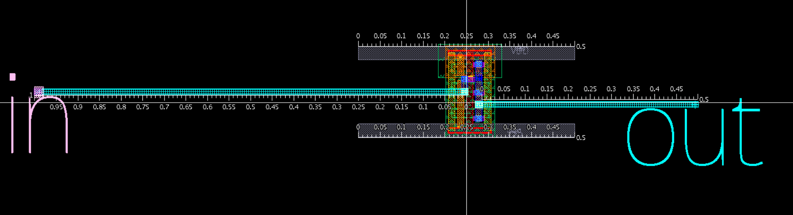
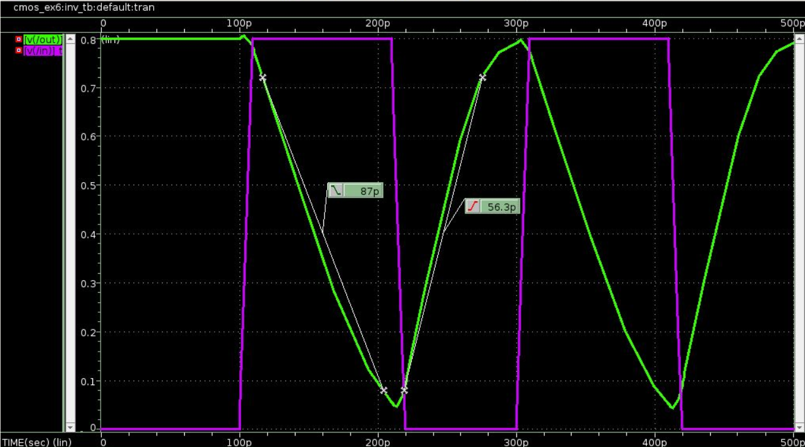
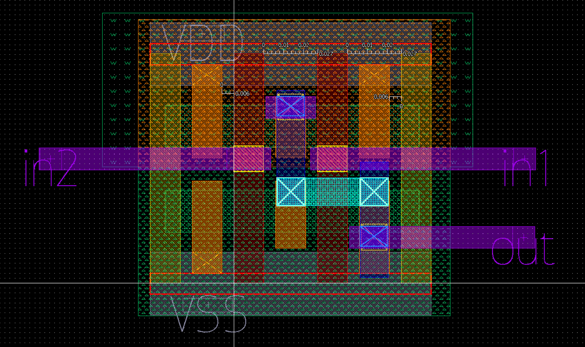

# 17. Assignment 6 — 레이아웃, 기생성분, DRC/LVS

## 이 과제를 왜 했는가

Schematic simulation은 의도한 transistor와 명시적 load만 본다. 실제 layout에는 diffusion, metal, via에서 생기는 parasitic $R$과 $C$가 추가된다. 이 과제는 앞에서 고른 $N_n:N_p=2:1$ inverter와 NAND를 layout으로 구현하고, DRC/LVS 및 parasitic extraction을 통해 **기능적으로 맞는 회로와 물리적으로 빠른 회로는 별개의 검증 대상**임을 확인한다.

## 질문의 의도

- schematic의 transistor 연결을 diffusion·gate·metal geometry로 어떻게 옮기는가?
- DRC와 LVS는 각각 무엇을 보증하며 무엇을 보증하지 않는가?
- C-only와 RC extraction 결과를 비교하면 지연의 주원인을 어떻게 찾을 수 있는가?
- NAND에서 PMOS 병렬, NMOS 직렬 topology를 layout에서 어떻게 유지하는가?

## 결과 타당성 검수

**판정: DRC/LVS와 post-layout 추세가 일관된다. 4.2배 지연 증가는 크지만, 동일 조건에서 C-only가 거의 전부를 설명하므로 추출된 capacitance가 지배한 결과로 볼 수 있다.**

| 모델 | fall time | schematic 대비 | 해석 |
| --- | ---: | ---: | --- |
| Schematic | 20.3 ps | 1.00× | 명시적 2 fF load 중심 |
| StarRC C | 85.3 ps | 4.20× | 추출 capacitance로 65.0 ps 증가 |
| StarRC RC | 87.0 ps | 4.29× | resistance가 추가로 약 1.7 ps 증가 |

Inverter와 NAND 모두 DRC clean, LVS pass로 보고되어 geometry rule과 schematic-layout connectivity는 일치한다.

## 레이아웃 결과 해석



NMOS 두 개를 병렬로 두면 pull-down drive가 커지지만 diffusion·gate·routing capacitance도 증가한다. Pin과 metal을 물리적으로 배치하는 순간 schematic에는 없던 node capacitance와 wire resistance가 생긴다.



C-only에서 이미 지연이 20.3 ps에서 85.3 ps로 증가했고, RC에서는 87.0 ps였다. 따라서 이 layout의 핵심 병목은

$$
\text{wire resistance보다 extracted capacitance}
$$

이다. 이는 무조건 “layout이 틀렸다”는 뜻은 아니지만, 증가량이 크므로 schematic/C/RC 비교에서 supply, load, input edge, 측정 threshold, extraction corner가 같았는지 확인해야 한다. 보고서에서는 조건을 고정했으므로 방향성과 원인 분리는 합리적이다.

## DRC와 LVS의 의미

```text
DRC pass: 공정의 폭·간격·겹침 규칙을 만족
LVS pass: layout에서 추출한 연결과 schematic 연결이 일치
```

둘 다 pass해도 delay, power, noise margin이 목표를 만족한다는 뜻은 아니다. 성능은 parasitic extraction 후 post-layout simulation 또는 timing analysis로 별도 확인해야 한다.

## NAND layout에서 볼 것



NAND는 PMOS 병렬, NMOS 직렬이어야 한다. 직렬 NMOS 사이의 diffusion을 공유하면 area와 일부 parasitic을 줄일 수 있지만, 잘못 공유하면 논리 연결 자체가 달라진다. 그래서 layout topology를 눈으로 확인한 뒤 LVS로 connectivity를 검증한다.

## 반드시 숙지할 Take away

- Layout은 schematic의 그림 버전이 아니라 새로운 $R$·$C$가 생기는 물리 구현이다.
- C-only와 RC 결과의 차이로 capacitance와 resistance 중 지배 원인을 분리할 수 있다.
- DRC는 제조 규칙, LVS는 연결 일치, post-layout simulation은 성능을 검증한다. 서로 대체할 수 없다.
- transistor를 키우면 drive는 강해지지만 parasitic도 커진다. Assignment 5의 sizing 결론은 layout 이후 다시 검증되어야 한다.

## 근거 자료

- 문제: `Assignment/exercise6/Task6_layout_design.pdf`
- 보고서: `Assignment/exercise6/cmos_ex6_report.pdf`
- 결과 그림: `Assignment/exercise6/results/`

